# Module 3: Register the validate payment composite on the Service Bus

## Introduction

In previous section, the validatePayment process composite have been completed. You will now register this process composite on Service Bus.

Service Bus will protect consumers of the validatePayment composite from routine changes such as deployment location and implementation updates. Service Bus will help scale the service to handle higher volume of requests and provide resiliency for the service if it needs to be taken down for routine maintenance.

For next step, You will start by first creating a Business Service to register the composite URI (the composite end-point). You will then add a simple Pipeline and Proxy. Pipelines contain actions performed on the Service Bus, typically reporting, data transformation and validation, before invoking the backend service. Consumers of validatePayment service will call the end-point API via the Proxy rather than connecting directly to the composite end-point, allowing more agility and flexibility in managing change.

## Development Steps

## **STEP 1**:  Create a service bus application and new project **Validate Payment**. 

+ Create a new Service Bus application. There are various ways and shortcuts to do this, and in this case choose File > New > Application... from the menu.
+ From the Categories tree, click on General > Applications
+ Select Service Bus Application with Service Bus Project from the Items field.
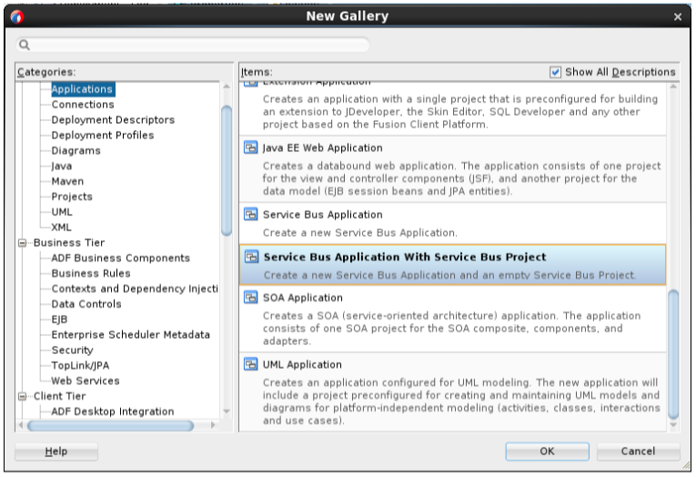
+ Click OK.
+ In the subsequent Create Service Bus Application With Service Bus Project dialog, set the following
fields, leaving the others with their default values:

+ - Application Name: e2e-1201-servicebus
+ - Directory of your choice

+ Click Next.
+ When you create a new application, you are prompted to create a new project. Set the following fields on Step 2 of 2:
+ - Project Name: ValidatePayment
+ - Directory of your choice
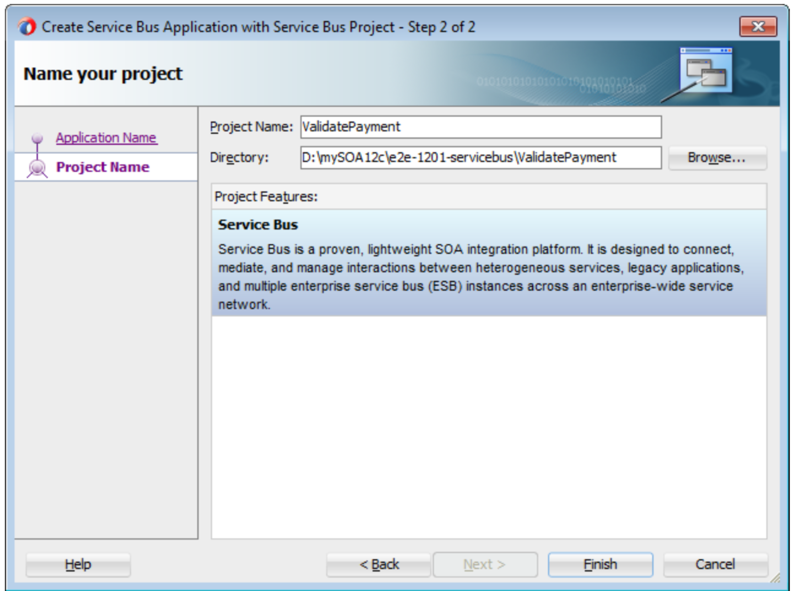

+ Click Finish.
+ Double-click the ValidatePayment icon in the Application Navigator on the left-hand side, the Services Bus Overview editor will open on the right.

+ The Overview Editor below is a new view for Service Bus in SOA Suite 12c, and modeled from the SOA Composite Editor.
  
+ 

+ This view allows you to construct Service Bus projects using a top-down, drag and drop approach. You can create Proxy, Pipeline, and Business Services by dragging icons from the Component Palette on the right, to the lanes of the canvas.
+ On the Component Palette, notice the Resources category contains Pipeline and Split-Join icons. These are the components for a Service Bus application.
+ Other Palette categories, Technology, Adapters and Advanced, contain adapters and transports for building Business Services (External References) and Proxy (Exposed Services).
+ If your Properties window is on the bottom right of the JDeveloper screen, please drag and position it to the bottom center as shown in the above diagram. This will make editing properties of Pipeline actions easier.

[//]: # (click **Create Application**. )
[//]: # (images/2/continue-to-create-application-wizard.png)

[//]: # (Remove Steps 2 and 3)
## **STEP 2**: Create folders and import artifacts, WSDL and XSD resource click **Create App**.

In Service Bus applications, Folders are leveraged to organize artifacts within a Project. For brand new applications, we encourage you to create folders that align with the default folders in your Composite application.

Folders will not be automatically created in Service Bus applications so that backward compatibility of Service Bus projects imported from previous releases is maintained.

For this project, we will keep the structure simple since there are only a few artifacts to manage. As your projects grow in subsequent chapters, you will add folders for categorizing artifacts into Business Service, Proxy and Templates.

+ From the ValidatePayment project icon, select New> From Gallery.
+ 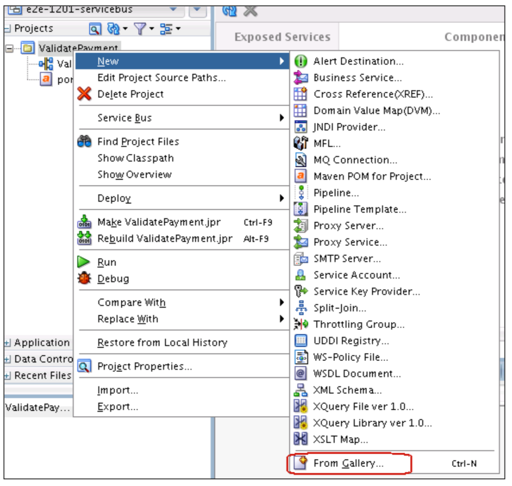
+ Select Folder
+ 
+ Click Ok.
+ When prompted fill in the following properties:
+ - Folder Name: Schemas
+ - Directory: Leave as default
+ 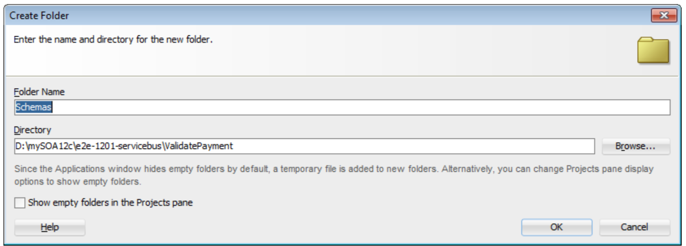
+ Click Ok.
+ Create WSDLs folder in the same way. When complete your Application Navigator should resemble the following:

+ 

+ Select the WSDLs folder that you just created in the left-hand navigation pane. We will now import artifacts to build our services.
+ 
+ There are many ways to share artifacts between Service Bus and Composite applications, e.g. source control, MDS backed by source control, etc. For today’s work, you will import the artifacts from the file system.

+ Select File --> Import ...
+ 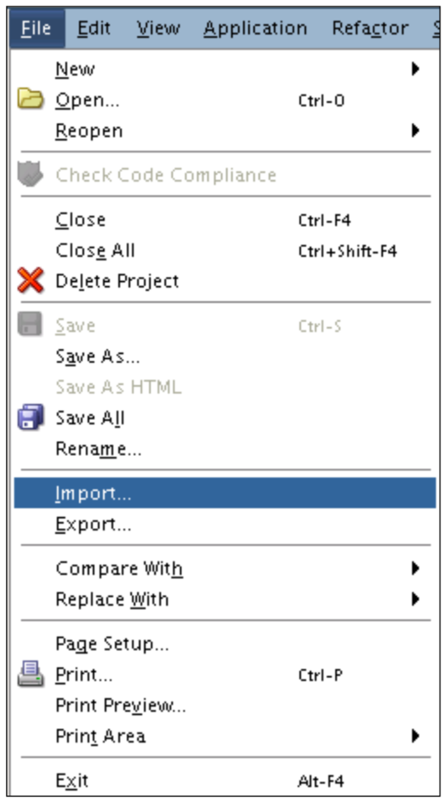

+ From the Import dialog, choose Service Bus Resources.
+ 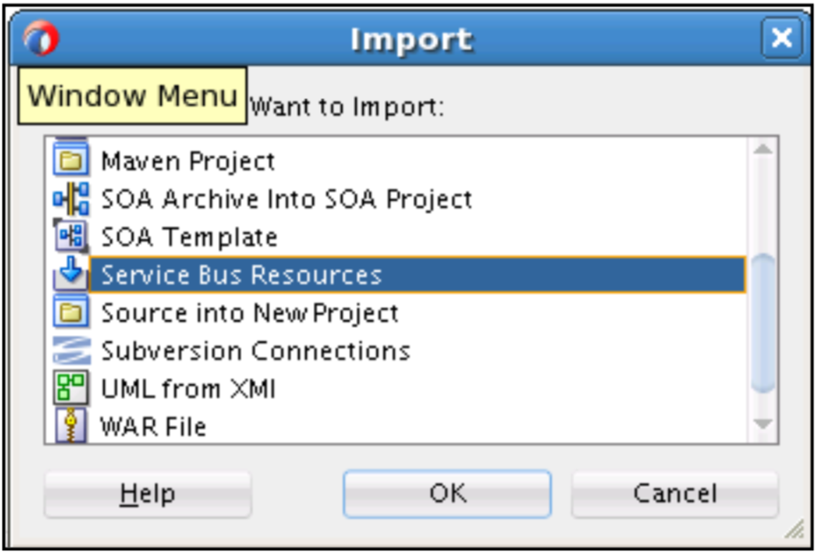
+ Click Ok

+ A wizard takes you through the steps of importing resources into your project. The title bar of the wizard dialog shows the step number.

+ Import Service Bus Resources - Step 1 of 3, select Resources from URL.
+ 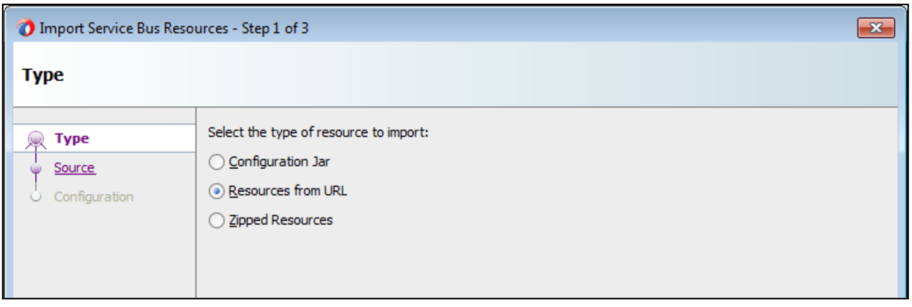
+ Click Next
+ Import Service Bus Resources - Step 2 of 3, next to Source URL, click the browse button
+ 
+ Be sure you selected the WSDLs folder in your project, then from the WSDL chooser, navigate to ~/e2e-1201-orderprocessing/resources/wsdl folder on your disk and select ValidatePayment- concrete.wsdl

+ 
    
+ NOTE: This WSDL assumes that you have unzipped the resources as instructed in prior module (ValidatePayment SOA composite), and the Schemas folder is at the same level as the wsdl folder containing the CanonicalOrder.xsd. You will need this directory structure to successfully import the WSDL.
+ Click Ok.
+ 
+ Click Next
+ Import Service Bus resources - Step 3 of 3, accept the defaults
+ 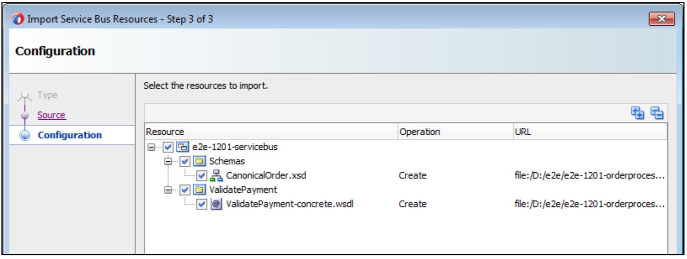

+ Click Finish. Your left-hand navigation tree should resemble the following:

+ 

## **STEP 3**: Configure a business service for the ValidatePayment composite and review properties.

In this section, you will configure a Business Service to represent your validatePayment composite.
There are different ways to create artifacts in Service Bus in JDeveloper:
+ right-click menu from the left-hand Application Navigator (traditional approach)
+ drag and drop icons from the Component Palette on to the overview canvas (new)
+ right click directly on the overview canvas to insert artifacts (new)
  
We will use the drag and drop Component Palette to build our first Service Bus project; however, feel free to experiment with other mechanisms.

+ Drag and drop the http icon from the right Component Palette on to the External References Lane.

+ 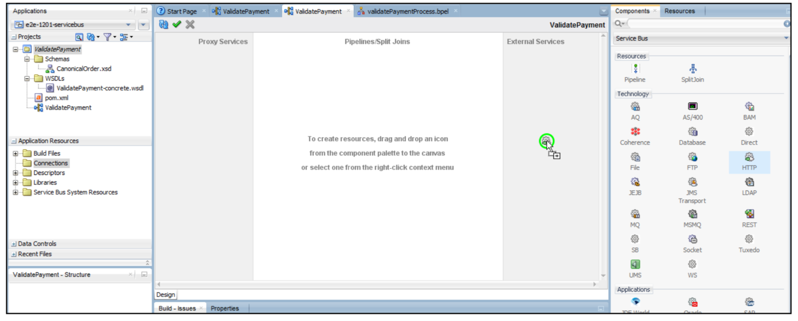

A wizard will walk you through the steps of configuring the Business Service. The title bar of the wizard dialog shows the step number.

+ Create Business Service 1 of 3
+ - Service Name: ValidateBS
+ - Location : Leave as default

+ 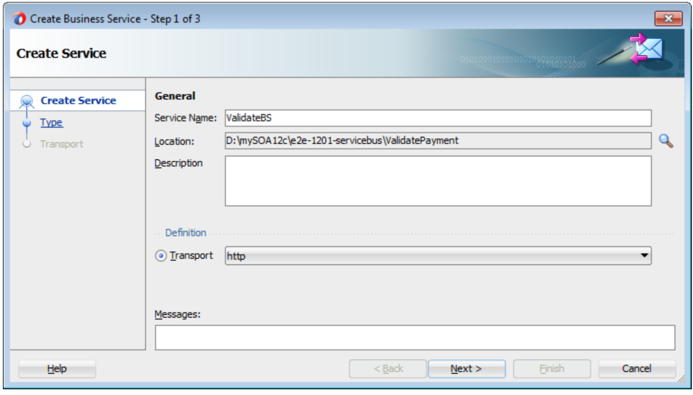

+ Click Next.

+ Create Business Service 2 of 3
+ - Select Service Type: WSDL
+ 
+ Select the Plus icon on the right of the WSDL choice.
+ When the WSDL chooser appears, first, confirm that Application icon on the top is selected and expand Application node Application -> ValidatePayment -> WSDLs.
+ Select ValidatePayment-concrete.wsdl
+ 
+ Click Ok.
+ 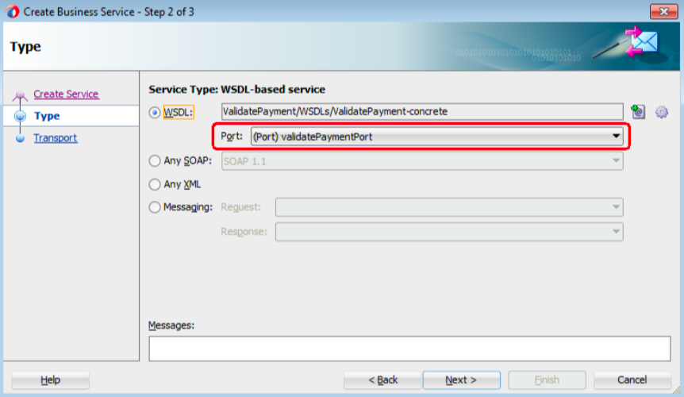 

+ Confirm that ValidationPaymentPort is selected in the Port field when you return back to the wizard.
+ Click Next
+ Create Business Service 3 of 3
+ 
+ Confirm http is selected in the transport field
+ Confirm Endpoint URI* is pointed to the ValidatePayment composite app. It should look similar to:
+  http://localhost:7101/soa- infra/services/default/ValidatePayment/validatepaymentprocess_client_ep

+ Click Finish. The canvas would now resemble like:

+ 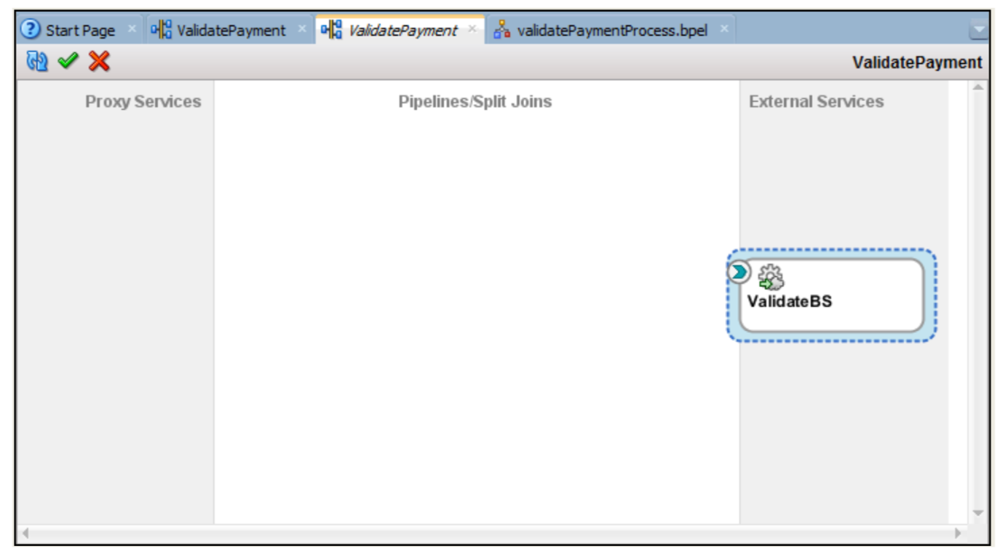

+ \* To find the composite deployment URI, go to the EM console (http://localhost:7101/em) and navigate to your composite.
+ Click the Test icon on the top right of screen. This will bring up a Web Service test page that lists your deployed endpoint.
+ 
+ Should you need to update your endpoint URI, you can do this as you review the Business Service properties below in the Transport tab.

Double-click on your new Business Service in the overview and review the settings for your new business service.
There are settings for General Properties, Performance (Result Caching), Transport details, Policies for Security. 
+ + 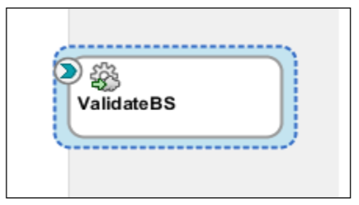

## **STEP 4**: Configure proxy and pipeline and wire to the business service. 

Please review starting page 71 on the tutorial document.

Let's create the Proxy and Pipeline to invoke the ValidateBS Business Service. The Proxy will be the interface to the service from external consumers. The Pipeline contains actions that must be performed before invoking the composite. Typical actions are data transform and validation, reporting with error handling; however, for your first Pipeline we will keep it simple.

+ Locate the Pipeline icon under Resources on the Component palette. Drag and drop the Pipeline icon from the right onto the middle of the canvas, labeled the “Pipelines/Split Joins” lane.
   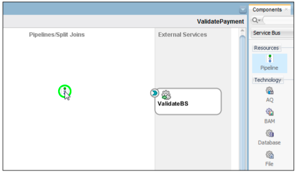

The Pipeline wizard will walk you through the next steps. The title will show you what step you are on.

+ Create Pipeline Service - 1 of 2
+ Service Name: ValidatePP

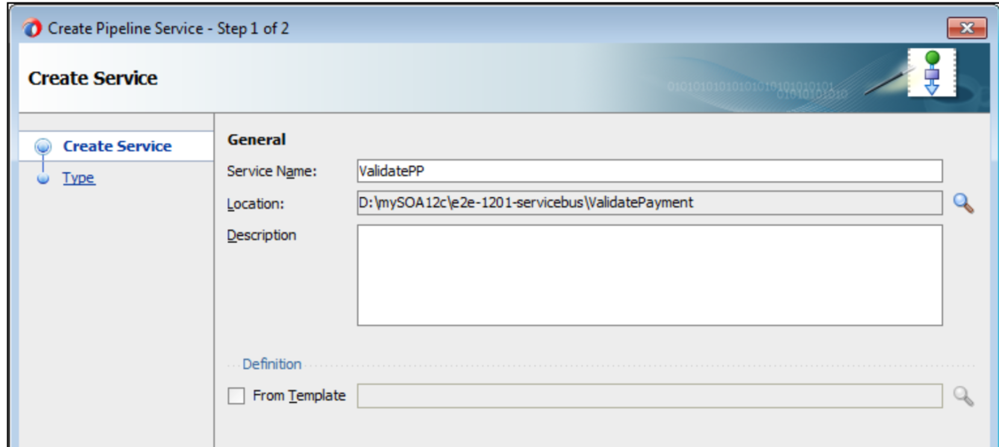

+ Click Next
+ Create Pipeline Service 2 of 2
+ Service Type: Choose WSDL

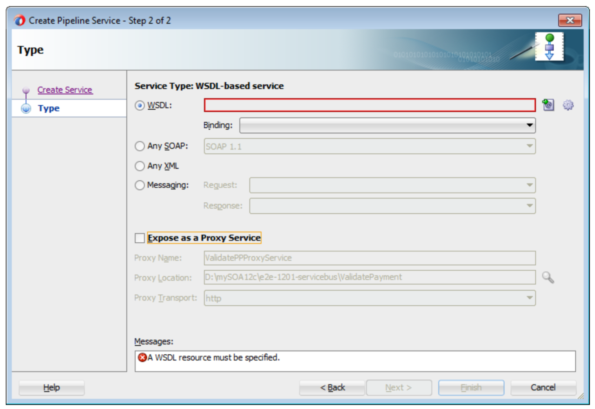

+ Click on the WSDL chooser icon plus sign on the right. NavigatetoApplication->ValidatePayment-> WSDLs directory and then select ValidatePayment-concrete.wsdl.
+ 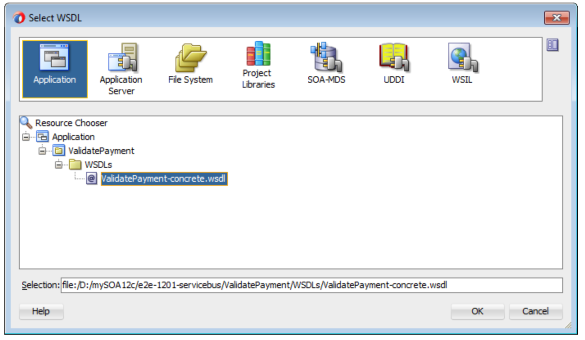
+ Click Ok.
+ Once back on Create Pipeline Service in 2 of 2:
+ - Ensure the Expose as Proxy Service checkbox is selected. This is the default.
+ - Proxy Name: ValidatePS
+ 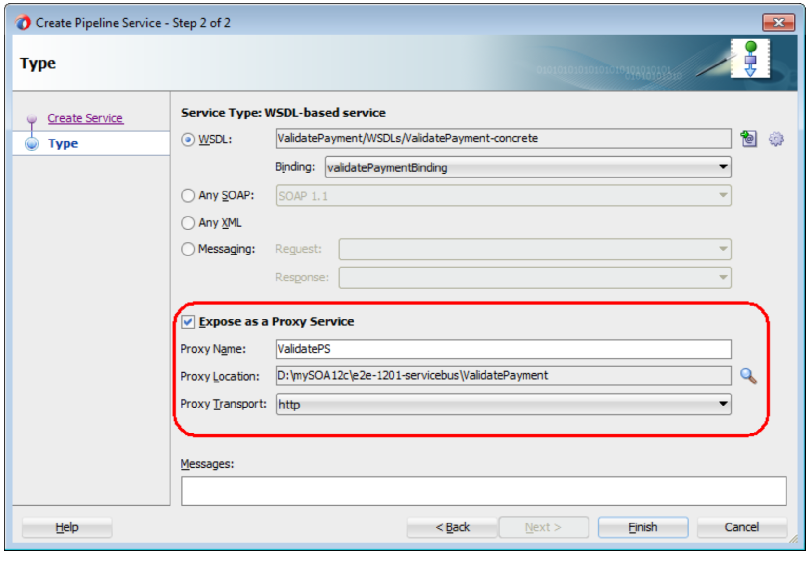
  
+ Click Finish
+ The canvas should now look like the following:
+ 
+  
+ Next, simply wire the Pipeline to invoke the Business Service.
+ Select ValidatePP and drag arrow to ValidateBS.

+ 
+ The Routing action is automatically configured for you in the Pipeline.
+ you could add some actions to the Pipeline to validate, transform the payload or report for auditing. This can be demonstrated in another section of the workshop.

+ Click the Save All icon on top left of your screen.
+ 

## **STEP 5**: Test and Run diagnostic of end-to-end application.

To deploy and test end-to-end, ensire the Integrated Server is running.

+ Bring Overview Editor back into focus. You can do this by double-click your project icon, in the Application Navigator or by selecting the ValidatePayment tab on top center.
+ 

+ This will bring up your overview and refresh the canvas.
+ Right-click on the ValidatePS in the Exposed Services Lane. Select Run.
    

## **STEP 6**:   Test Console

+ The Test Console will activate as one of your windows in JDeveloper on Windows. On Linux, this may start a new browser window outside of JDeveloper. Make this window active by clicking on the title bar.

+ 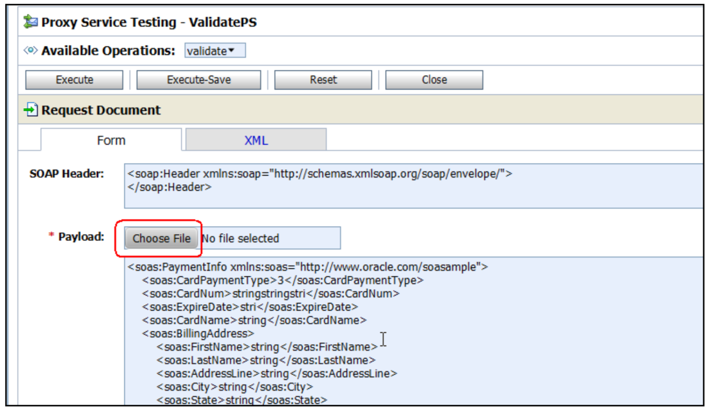

+ By default, a sample payload will be generated for you; however, we will test with a specific file.
+ Click the Choose File button. This may show up as a Browse button on Linux.
+ Navigate to ~/e2e-orderprocessing/sample_input/ and select PaymentInfoSample_Authorized.xml
+ Click Open.
+ On the Test console, Click on Execute button

+ 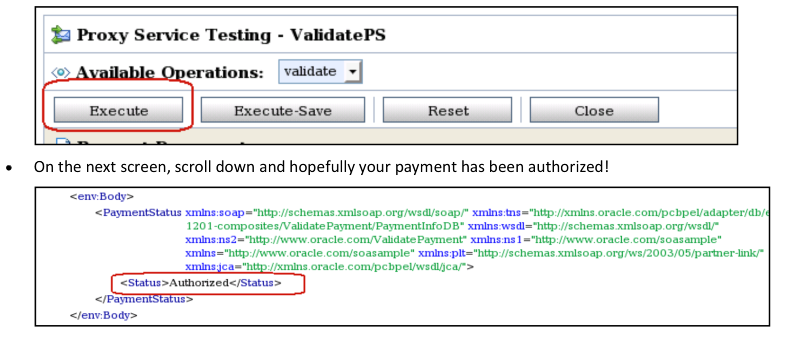

You could also run diagnostic in the Service Application leveraging the Debugger as was done previous module 2.

### More Details: ###
  
Please follow the construction details from <ins>**page 54 to 77**</ins>, in the [SOAsuite 12c tutorial.pdf](https://oradocs-prodapp.cec.ocp.oraclecloud.com/documents/fileview/D62E7C999F2BB9C78C4D8085F6EE42C20DD5FE8D98D7/_SOASuite12c_Tutorial.pdf).

## **Summary**

Congratulations you've completed developing the validate payment service using SOA composite app and register it to Oracle Service Bus.

You may proceed to the next workshop.
<!--[Click here to navigate to the next Module 3](3-process-order-using-composite.md) -->

## Acknowledgements
* **Author** - <Name, Title, SOA Product Development>
* **Adapted for Live Lab by** -  <Daniel Tarudji, Solution Engineering> -- optional
* **Last Updated By/Date** - <Daniel Tarudji, Group, Month Year>
* **Workshop (or Lab) Expiry Date** - <Month Year> -- optional

## See an issue?
Please submit feedback using this [form](https://apexapps.oracle.com/pls/apex/f?p=133:1:::::P1_FEEDBACK:1). Please include the *workshop name*, *lab* and *step* in your request.  If you don't see the workshop name listed, please enter it manually. If you would like for us to follow up with you, enter your email in the *Feedback Comments* section.