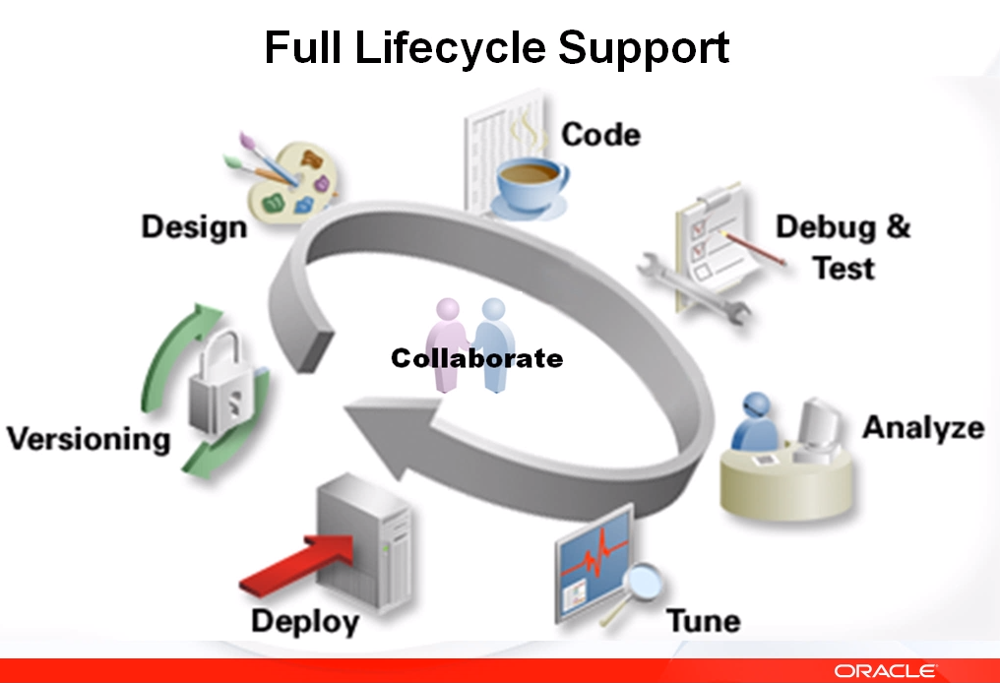
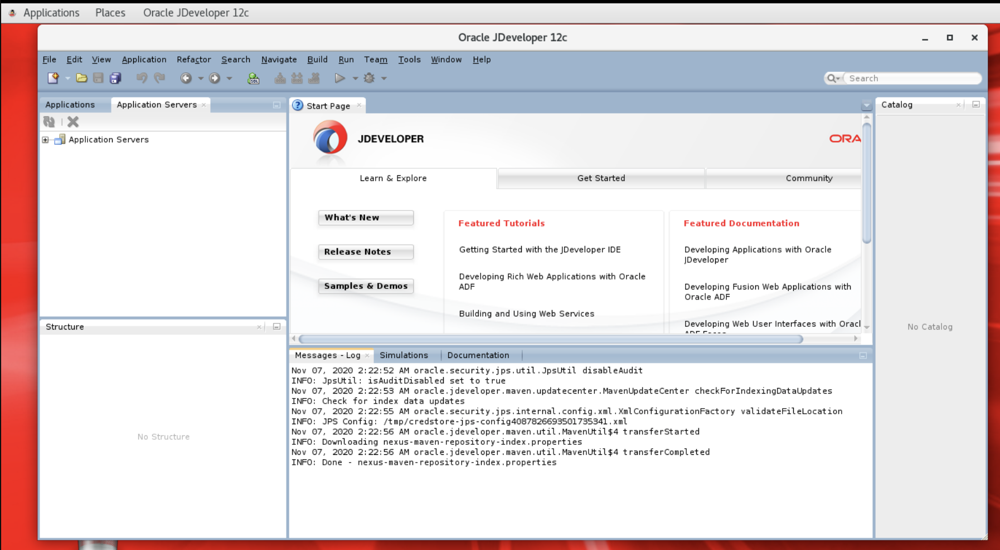
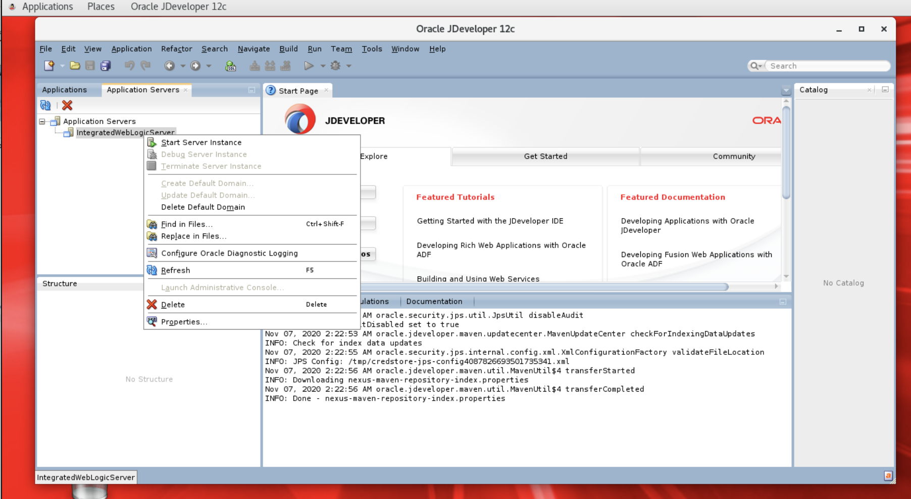
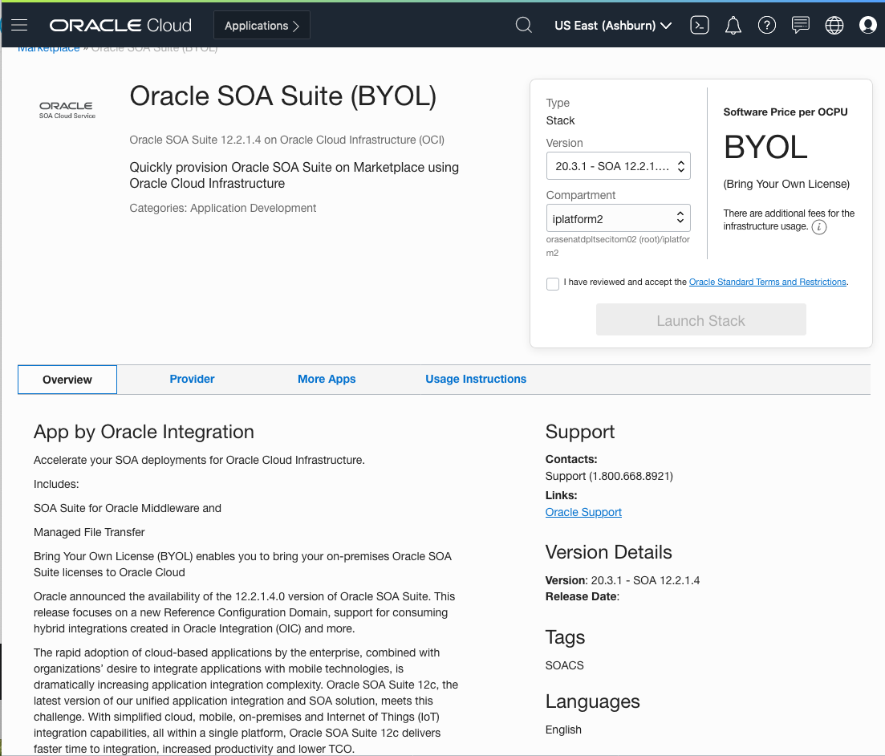

# Oracle SOA Suite

## Introduction

### What is Service Oriented Architecture, SOA?
SOA is a style of an enterprise IT design where services are provided to the other components by application components, through a communication protocol over a network. A SOA service is a discrete unit of functionality that can be accessed remotely and acted upon and updated independently, such as retrieving a credit card statement online. These services are representation of multiple applications that each delivers specific business functions. SOA is also an architectural approach to integration and orchestrating these service. Together, the services perform end to end business flow task. SOA is also intended to be independent of vendors, products and technologies

### About Oracle SOA Suite
SOA suite is a comprehensive, standards-based software suite to build, deploy and manage integration following the concepts of service-oriented architecture(SOA). The components of the suite benefit from consistent tooling, a single deployment and management model, end-to-end security and unified metadata management you can skip this module and go straight to Module 2 by clicking the navigation menu icon, in the upper-left corner of the header.

Oracle SOA Suite provides easy-to-use, reusable, and unified application development tooling and life cycle management support to further reduce development and maintenance costs and complexity. Businesses can improve efficiency and agility through rules-driven, process connectivity and automation with Oracle SOA Suite.

SOA Suite functional architecture

  

Critical business services, such as customer, financial, ordering information, and others that were previously accessible only in packaged application user interfaces can now be rapidly repurposed for digital-enabled channel such as: smart phone and tablets.

Estimated time taken to complete: 15 minutes

## STEP 1: Oracle SOA Development tool, JDeveloper 12c

- SOA development tool, JDeveloper 12c

- Oracle JDeveloper offers complete end-to-end development for Oracle's platform and Oracle's applications. 

  

A preview about Oracle SOA Composite development on JDeveloper 12c

- 

-  an Oracle SOA Suite Quick Start environment has been deployed using the Integrated WebLogic Server's default domain in JDeveloper 12c shown here:
-  

## STEP 2: Access JDeveloper 12c

Double click on the Oracle JDeveloper 12c icon on the Linux desktop. The following will appear on the desktop:

- 

- For the role, choose Studio Developer (All Features).
- - you may want to uncheck the "Always prompt for role selection on startup"
- Next, click OK button. JDeveloper 12c now opens on your desktop

-

- Next start the Weblogic server, embedded in default domain of JDeveloper
- - From the application server tab, right click
- - Start server instance

-

<!--
### Prerequisites

* An Oracle Free Tier, Always Free, Paid or LiveLabs Cloud Account

 **STEP**: SOA Deployment on Oracle Cloud

1. From within your Oracle Cloud environment, you can create an instance of Oracle SOA suite.

    From the Cloud Dashboard, select the navigation menu icon in the upper left-hand corner and then select **Marketplace -> Applications**.

    

2. Click **Search for SOA**.

    

3. Select the **appropriate** option, enter **based on license type or subscription** that you may already have
    * SOA suite BYOL
    * SOA suite with B2B EDI platform
    * SOA suite with OCI as consumption

4. After clicking **SOA suite BYOL**, you will be redirected to the SOA Details page for provisioning new instance. 

    Continue when the status changes from:

    

-->

## **Summary**

More details about JDeveloper can be found on [JDeveloper12c] (https://www.oracle.com/application-development/technologies/jdeveloper.html)

At this point, you're ready to start building amazing enterprise-grade orchestration and integration, rapidly. 

You may proceed to the next lab: **Develop SOA Composite for Validating Payment**.

## Acknowledgements
* **Author** - Daniel Tarudji
* **Contributors** - Tom McGinn, Kamryn Vinson, Rene Fontcha
* **Last Updated By/Date** - Kamryn Vinson, October 2020

## Need Help?
Please submit feedback or ask for help using our [LiveLabs Support Forum](https://community.oracle.com/tech/developers/categories/livelabsdiscussions). Please click the **Log In** button and login using your Oracle Account. Click the **Ask A Question** button to the left to start a *New Discussion* or *Ask a Question*.  Please include your workshop name and lab name.  You can also include screenshots and attach files.  Engage directly with the author of the workshop.

If you do not have an Oracle Account, click [here](https://profile.oracle.com/myprofile/account/create-account.jspx) to create one.