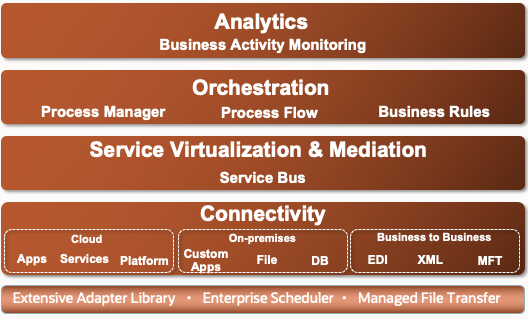
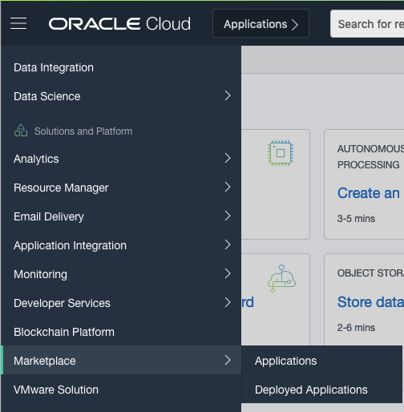

# Introduction to Oracle SOA suite

Oracle SOA suite is is a comprehensive, standards-based software suite to build, deploy and manage integration following the concepts of service-oriented architecture(SOA). The components of the suite benefit from consistent tooling, a single deployment and management model, end-to-end security and unified metadata management you can skip this module and go straight to Module 2 by clicking the navigation menu icon, in the upper-left corner of the header.

## What is SOA - Service Orientated Architecture?
SOA is is a style of software design where services are provided to the other components by application components, through a communication protocol over a network. A SOA service is a discrete unit of functionality that can be accessed remotely and acted upon and updated independently, such as retrieving a credit card statement online. SOA is also intended to be independent of vendors, products and technologies

## Concepts Oracle SOA
Oracle SOA Suite provides easy-to-use, reusable, and unified application development tooling and life cycle management support to further reduce development and maintenance costs and complexity. Businesses can improve efficiency and agility through rules-driven, process connectivity and automation with Oracle SOA Suite.

SOA Suite functional architecture

Critical business services, such as customer, financial, ordering information, and others that were previously accessible only in packaged application user interfaces can now be rapidly repurpose for digital-enabled channel such as: smart phone and tablets.

## How to Run the Labs
You can run exercises in this lab as per instruction provided during live session 

Below are steps on how to sign-up for either an Oracle cloud service o. The always free Oracle Compute on OCI is ideal for learning about the Oracle Cloud Infrastructure. This service can readily be upgraded to a paid service as necessary. 

Detail can be found on https://docs.cloud.oracle.com/en-us/iaas/Content/FreeTier/resourceref.htm 

For conducting these labs you've been granted access to an OCI compute resource.

Click one of the options below to proceed.

### **Option 1**: Oracle SOA on Marketplace

In this part, you are assigned an Oracle OCI resource. Please check your inbox email to find details regarding access to your respective compute resource.

To gain access to free tier compute resource, follow these steps:
1.  Please [click this link to create your free account](https://myservices.us.oraclecloud.com/mycloud/signup?language=en&sourceType). When you complete the registration process you'll receive an account with a $300 credit and several "forever free" services that will enable you to complete the lab for free. You can then use any remaining credit to continue to explore the Oracle Cloud. The forever free services will continue to work after the trial expires.

2.  Soon after requesting your trial you will receive a  **Get Started Now with Oracle Cloud** email.   
    Make note of your **Username**, **Password**, and **Cloud Account Name**.

    

3. Now that you have a service, you will log into your Oracle Cloud account so that you can start working with various services.        
    From any browser go to https://cloud.oracle.com/en_US/sign-in.

    Enter your **Cloud Account Name** in the input field and click the **Next** button.

    

4. Enter your **Username** and **Password** in the input fields and click **Sign In**.

    

5. From within your Oracle Cloud environment, you can create an instance of Oracle SOA suite.

    From the Cloud Dashboard, select the navigation menu icon in the upper left-hand corner and then select **Marketplace -> Applications**.

    

6. Click **Search for SOA**.

    

7. Select the **appropriate** option, enter **based on license type or subscription** that you may already have
  - SOA suite BYOL
  - SOA suite with B2B EDI platform
  - SOA suite with OCI as consumption

8. After clicking **SOA suite BYOL**, you will be redirected to the SOA Details page for provisioning new instance. 

    Continue when the status changes from:

    

    
### **Option 2** Download Oracle SOA from www.oracle.com
Here is the specific link <a href="https://www.oracle.com/cloud/integration/soa-cloud-service/"> SOA Cloud</a>

For cost-related estimation
   go to <a href="https://www.oracle.com/cloud/integration/soa-cloud-service/pricing.html"> SOA Cloud Values</a>

### **Summary**

This completes the lab introduction. At this point, you're ready to start building amazing enterprise-grade integration, rapidly. You may proceed to the lab: **Build SOA composite to validate payment lab** by clicking the navigation menu icon, in the upper-right corner of the header.

## Acknowledgements
* **Author** - <Name, Title, Group>
* **Adapted for Cloud by** -  <Name, Group> -- optional
* **Last Updated By/Date** - <Name, Group, Month Year>
* **Workshop (or Lab) Expiry Date** - <Month Year> -- optional

## See an issue?
Please submit feedback using this [form](https://apexapps.oracle.com/pls/apex/f?p=133:1:::::P1_FEEDBACK:1). Please include the *workshop name*, *lab* and *step* in your request.  If you don't see the workshop name listed, please enter it manually. If you would like for us to follow up with you, enter your email in the *Feedback Comments* section.