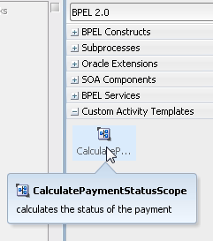
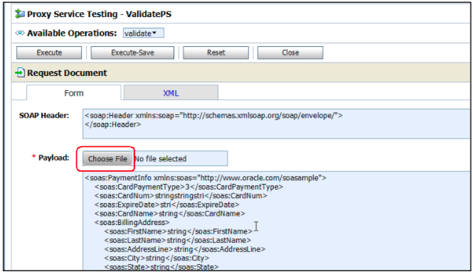

# Module 2: Build Payment validation Composite

In this module, you will build your first Oracle SOA Suite 12c composite to validate a credit card payment.
In this composite, credit card payments will be validated and the payment status will be returned. If the payment is denied, the order will not be processed.

## Introduction ##
Avitek, a fictitious company, has embarked upon a modernization project to align with business goals of improving customer satisfaction. A key area of improvement will be streamlining the order process to provide better visibility tracking orders through credit approvals, fulfillment, shipment and delivery.

One of **the issue in the current application is that credit card payments are often denied for various, sometimes minor reasons, such as expiration date, etc. Since the process to correct these issues varies across Avitek’s order entry systems, on-premise or new adopted Cloud SaaS application there is no consistent follow-up and resolution with customers. Orders may end up lost or delayed in the system leading to customer dissatisfaction**.

The business has indicated a new credit card fraud detection system must be put in place before year’s end to thwart credit card abuses. A consistent fraud mechanism will require the credit validation process to be consolidated across all order entry systems.

### **Part 1**: Build the payment validation process flow

**High-Level Steps:**
 
1.  Create a new composite application e2e-1201-composites and SOA project named ValidatePayment
2.  Use the new SOA Project template to create the ValidatePayment composite.

    

3.  Review the various components of the composite.

    

    
4.  Add a database connection to Java DB (it is an embedded database inside JDeveloper 12c. The embedded weblogic requires to be started prior to establishing connection to the embedded database) 

    

5. Import a custom activity template with an XSLT map to determine the payment status (Authorized or Denied), based on the daily limit and the total amount of order.

    

6.  Add a composite sensor PaymentStatus for the payment status (this is optional step)

    

7.  Deploy and test the project. Optional: Use the debugging tool within JDeveloper to explore.

    

To complete Part 1, please go to Chapter 2, from <ins>**page 11 to 53** in the  SOASuite12c_Tutorial.pdf</ins> document.

The tutorial pdf document can be found on the desktop of your OCI Linux instance.

### **Part 2**: Register the composite on SOA Service Bus

In part 1, you have completed the validatePayment process composite, you will register this process composite on Service Bus.

Service Bus will protect consumers of the validatePayment composite from routine changes such as deployment location and implementation updates. Service Bus will help scale the service to handle higher volume of requests and provide resiliency for the service if it needs to be taken down for routine maintenance.

Please follow the construction details from <ins>**page 54 to 77**, in the SOA suite tutorial</ins>.

**High-Level Steps:**

1.  Create a new Service Bus application and new project **ValidatePayment.**. 

    

[//]: # (click **Create Application**. )
[//]: # (images/2/continue-to-create-application-wizard.png)

[//]: # (Remove Steps 2 and 3)
2. Create folders and import WSDL and XSD resource click **Create App**.

    
    
3. Configure a business service for the ValidatePayment composite and review properties.
    
     

4. Configure proxy and pipeline and wire to the business service, starting page 71 on the tutorial document.

   

5. Test and Debug the end-to-end application.

    

6.   Test Console
   
    

Congratulations you have just completed your first SOA Suite 12c composite! in Part 1 and 2 for developing validate payment using SOA Composite approach.

[Click here to navigate to the next Module 3](3-process-order-using-composite.md)

### **Summary**

In the second part of module 2, 

- You've created the Proxy and Pipeline to invoke the ValidateBS Business Service using the Service Bus.
- A routing action is automatically configured for you in the Pipeline.
- You've also deployed the validate payment service and used test console inside the JDeveloper 12c 

Congratulations you completed your first SOA Suite 12c composite! in Part 1 and 2 for developing validate payment using SOA Composite approach.