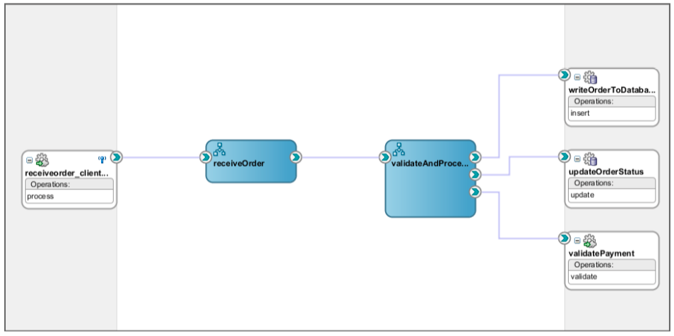

# Module 3: Process Order Using composite

In this module, starting page 78 on the SOA suite tutorial, you will build the basis of the new order processing system for Avitek, referred to as ProcessOrder.
Recall a few of the business requirements for Avitek ‘s new order processing system:
1. Many different types of clients will access it over different protocols and data formats, including mobile devices.
2. With a mobile app launch in progress, next year at the latest, the new order processing system must support access via RESTful API.
3. It must allow existing systems to place orders using xml files and CSV files. These should be processed and fulfilled using the same new order provisioning infrastructure.

To build new order processing composite application, you will use templates. This is a new feature in SOA Suite 12c that can be used in BPEL. As well as Service Bus application. 

You will leverage the validatePayment service you built in Chapter 2.
At the end of this module, your solution will look similar to the following process flow diagram:

## High Level Steps ##

1. In part 1, Open e2e-1201-servicebus application and import Pipeline template resources (new feature!).
2. In part 2
   * Configure ProcessOrder Business Service.
   * Configure Pipeline and Proxy using Pipeline template.
   * Test your application end-to-end.

### **Part 1**: Build process order Composite
You will now create another SOA application that will accept new purchase orders, approve them and forward them to the fulfillment system. You will use a project template 

1. To implement the basic order processing scenario
2. Add a call to the payment validation service built in chapter 2 and 
3. Update the order status in the database based on the outcome of the payment validation
4. The order status update will be converted to a BPEL subprocess to make it easily re-usable. Once completed, your composite will look like this:

    

### Details: ###
To complete part 1, please start <ins>**Chapter 3, page 80 to 116** of the SOAsuite 12c tutorial.pdf </ins>

### **Part 2**: Register process order on Service Bus 
As you have completed and tested the Process Order composite, you will register it on Service Bus to make it available for external consumers. 
1. Service Bus will allow the Process Order composite to be made available over different protocols and data formats without disruption to the core business logic in the composite
2. Service Bus will also validate the Order data and report for auditing. For now, you will just create an HTTP / SOAP Proxy and Pipeline for Process Order. 
3. You can also add a File Proxy and Pipeline to allow orders to be processed from existing systems.

    

### Details: ###
To complete part 2, please review on <ins> **chapter 3, page 117 to 137** </ins> of the SOAsuite tutorial document

### **Summary**
In module 3, you've accomplished:
- Created Service Bus pipeline from an existing template.
- Providing Data validation, Routing and manage exception inside the pipeline
- Provided API for backend service from a service bus. This is exposed using Proxy Service within a Service Bus.
  

This completes Process order composite application. You may proceed to the next lab.

 <!-- [Click here to navigate to Module 4](4-add-new-channel-for-ordering.md) -->
