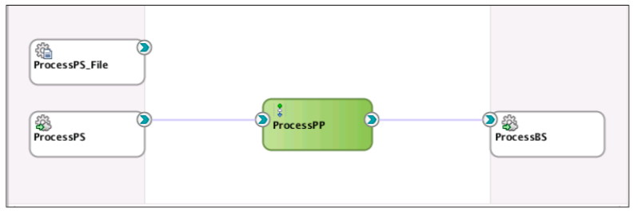
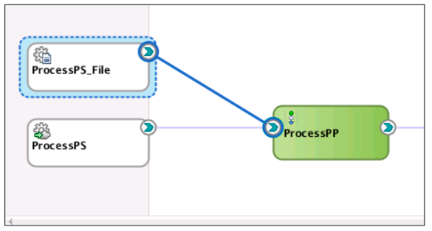
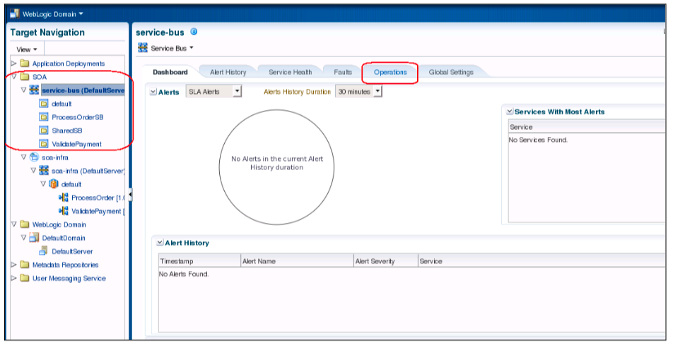
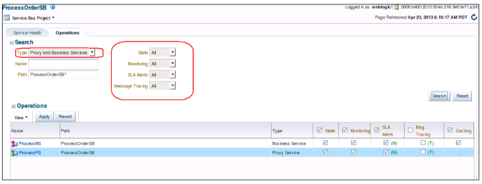
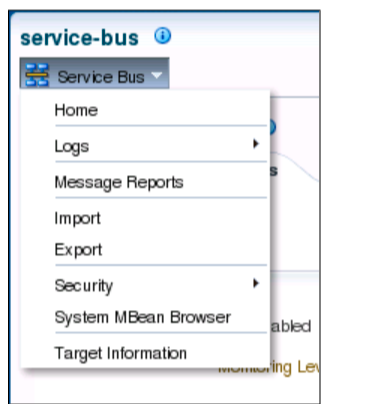
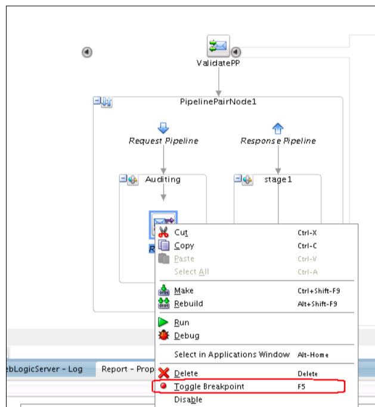

# Module 4: Add new channel for an order system

## Introduction
After you completed previous modules, the core order system is built, you will extend and add a new interface so that existing systems may place orders without impacting an existing application. Service Bus can provide intelligent routing to respective business services, protocol and data enrichment to minimize any disruption to the backend business logic of Process Order.
In this chapter, you will add new File order channel for your ProcessOrder leveraging the work done in previous chapters. You will add new Proxy to handled incoming orders by file and translate common- delimited format with nXSD.

## High level steps ##

## **STEP 1**: Add file adapter proxy and connectivity to pipeline

1. Configure a File Adapter Proxy with nXSD translation.
2. Wire to the existing Process Order Pipeline and Business Service.
3. Test the end to end application.

    
    

### Details: ###
Please start in <ins> **chapter 4 page 139 to 153**, the tutorial document</ins>.

## **STEP 2**: Review Service Bus in Enterprise Manager

Let’s take a look at the Service Bus monitoring in Enterprise Manager 12c. In earlier release, Service Bus packaged its own monitoring console along with the Design Console. The monitoring console has been consolidated with the rest of SOA Suite. Now all of SOA Suite components can be management by administrators from one unified Enterprise Manager Console.

**High level steps**
1. Bring up the Enterprise Manager console and navigate to Service Bus. At the top of the report, click **Actions**, select **Data**, and then select **Compute**.

    

2. Enable monitoring on all services in the Operations tab.

    

3. Review the various monitoring tabs.

    

4. Review Message Reports.

    

### Details: ###
Please start in <ins> **chapter 4 page 154 to 162** in the tutorial document</ins>.

## **STEP 3**: Service Bus debugging tool inside Enterprise Manager

Service Bus root-cause analysis framework has been brought into IDE, JDeveloper. This lab is a simple one and should not take you long.

**High level steps**

1. Navigate to the ValidatePayment Pipeline.
2. Set a breakpoint in the Pipeline
3. Right-click your Pipeline or Proxy from the canvas and select the ‘Debug’ option.
4. Enter test data into the Test Console.

    

### Details: ###
Step by step details in <ins> **chapter 4, page 163 to 166** in the tutorial</ins>

## **STEP 4**: Build the nXSD translation as data enrichment and mapping

**High level steps**

1. Invoke the Native Format Builder from the File Adapter Configuration Wizard. 
2. nXSD, Native XML Schema Definition is in the wizard utilized to convert the native format to XML structure and vice versa.
3. Build comprehensive data enrichment and mapping configuration

### Details: ###
Please start in <ins> **chapter 4, page 167 to 190** in the tutorial document</ins>.

## **Summary**

This completes Module 4. You've successfully 
- Added new File order channel in the ProcessOrder app leveraging the work done in previous chapters. 
- You've also added new Proxy to handle incoming orders by file and translate common- delimited format with nXSD.
- Worked with data/object schema builder

You may proceed to the next lab.
<!-- [Click here to navigate to Module 5](5-pack-and-ship-service-composite.md) -->

## Acknowledgements
* **Author** - <Name, Title, Group>
* **Adapted for Cloud by** -  <Name, Group> -- optional
* **Last Updated By/Date** - <Name, Group, Month Year>
* **Workshop (or Lab) Expiry Date** - <Month Year> -- optional

## See an issue?
Please submit feedback using this [form](https://apexapps.oracle.com/pls/apex/f?p=133:1:::::P1_FEEDBACK:1). Please include the *workshop name*, *lab* and *step* in your request.  If you don't see the workshop name listed, please enter it manually. If you would like for us to follow up with you, enter your email in the *Feedback Comments* section.