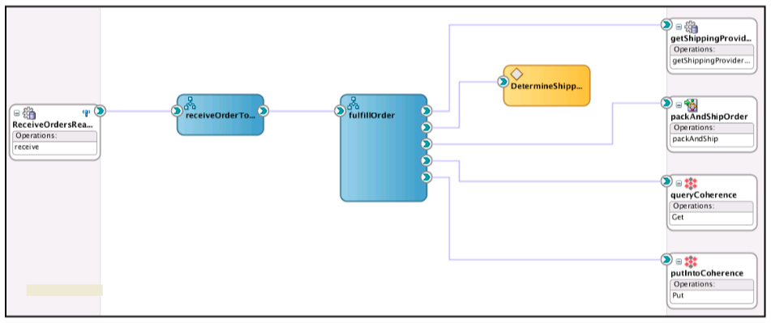

# Module 6: Order Fullfilment

In this module, you will build the second part of the order fulfillment service, the FulfillOrder composite. The composite listens to orders being processed, select a Shipping Provider and then invoke the PackAndShip service that was built in the previous chapter.

The service is triggered when an order is updated as “ReadyForShip” in the database. It then locates the shipping speed in the order message, determines the shipping method based on shipping speed and shipping state, reads the preferred shipping provider from the database or cache, and calls the pack and ship REST service.

## High level steps ##

1. Create a new SOA project called FulfillOrder from a project template.
2. The DB adapter polls the order table for orders that are ready for shipment. (This will be used later for the ESS use case where we activate this adapter only at certain times of the day.).
3. It receives a single order and transforms it into a fulfillment order (using XSLT).
4. A business rule (decision table) is used to decide the shipping method based on shipping speed
and shipping state.
5. Based on the shipping method, the preferred shipping provider is retrieved from the database.
6. The Order is sent to the packing service via SOA REST outbound.
7. The coherence adapter puts the shipping provider into the cache, so that it can be retrieved from the cache instead of the database. Step 7 is optional as it requires Coherence to be installed on the weblogic server.

### Details: ###
Please follow, the details as outlined in **Chapter 6, starting page 254** in the tutorial. 

When it’s completed, your overall fullfillment order project will look similar to composite apps composed of orchestrated business services

    
        
### **Summary**

This completes Order fullfilment lab. You now know how to enhance, how to deploy a project for SOA composites and Service Bus, how to debug and different ways to test within JDeveloper and Enterprise Manager Fusion Middleware Control. 

You may proceed to the next lab.

<!-- [Click here to navigate to Module 7](7-summary-and-next-step.md) -->

### **Learn More - Useful Links** ###
- SOA suite on  <a href="https://cloudmarketplace.oracle.com/marketplace/en_US/listing/70268091"> Marketplace  </a>
- <a href="https://cloudcustomerconnect.oracle.com/"> Community </a>
- <a href="https://www.oracle.com/middleware/technologies/soasuite.html"> Integration</a>

