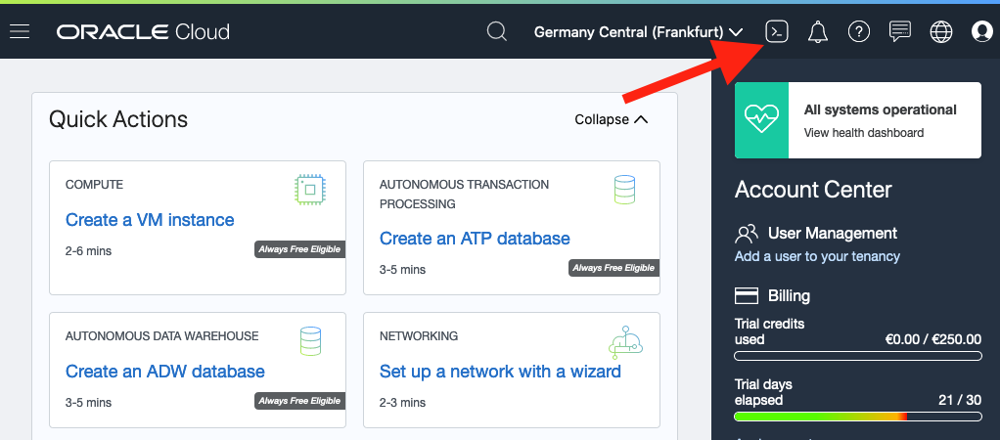

# Setup for Local Development

## Introduction

In this lab you are going to get setup to develop a Micronaut application locally that communicates with an Autonomous Datatabase instance.

Estimated Lab Time: &lt;10&gt; minutes

### Objectives

In this lab you will:

* Create the Necessary Database schema
* Download the Wallet for Autonomous Database access
* Create and configure a Micronaut application

## **STEP 1**: Create DB Schema

1. Click on the Cloud Shell button to start a Cloud Shell intance:

   

2. From Cloud Shell, download the script and run it:

   ```shell script
   wget -O setup.sh https://github.com/recursivecodes/micronaut-data-jdbc-graal-atp/releases/latest/download/setup.sh
   chmod +x setup.sh
   ./setup.sh

   ```

3. Enter the values that you copied from the Terraform output in the previous lab when prompted. The script will produce several snippets of output to be used to build, run and deploy.

## **STEP 2**: Download and Configure Wallet

The Oracle Autonomous Database uses an extra level of security in the form of a wallet containing access keys for your new Database.

TODO: Todd provides steps to download the Wallet through the UI


## **STEP 3**: Create a new Micronaut application 

There are several ways you can get started creating a new Micronaut application. If you have the Micronaut CLI installed you can use the `mn` command to create a new application:

   ```shell script
   mn create-app example-atp --features jdbc-ucp,oracle,data-jdbc
   cd example-atp
   ```

Which will setup an application that uses the Oracle driver, the Oracle Universal Connection Pool and Micronaut Data JDBC. If you do not have the Micronaut CLI installed 
and are running on Linux or OS X you can alternatively `curl` and `unzip`:

   ```shell script
   curl https://launch.micronaut.io/example-atp.zip\?features\=jdbc-ucp,oracle,data-jdbc -o example-atp.zip
   unzip example-atp.zip -d example-atp
   cd example-atp
   ```

If none of these options are viable you can also navigate to https://micronaut.io/launch/ in a browser and click the `Features` button and select the `oracle`, `jdbc-ucp` and `data-jdbc` features then click `Generate` which will produce a zip you can download and unzip.

## **STEP 4**: Configure the Micronaut Application

The final step to configure the Micronaut application to work with Autonomous Database is to open the `src/main/resources/application.yml` file and modify the default datasource connection settings as follows:

   ```yaml
   datasources:
      default:
         url: jdbc:oracle:thin:@mnociatp_high?TNS_ADMIN=/tmp/wallet
         driverClassName: oracle.jdbc.OracleDriver
         username: mnocidemo
         password: ${MICRONAUT_OCI_DEMO_PASSWORD}
         schema-generate: CREATE_DROP
         dialect: ORACLE
   ```

The password is set to resolve an environment variable called `MICRONAUT_OCI_DEMO_PASSWORD`. You should configure this environment variable to the output value `atp_wallet_password` produced by the Terraform script in the previous section. For example:


   ```bash
   export MICRONAUT_OCI_DEMO_PASSWORD=[Your atp_wallet_password]
   ```
