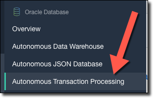
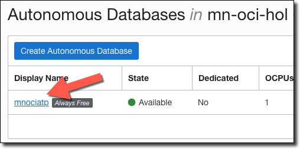
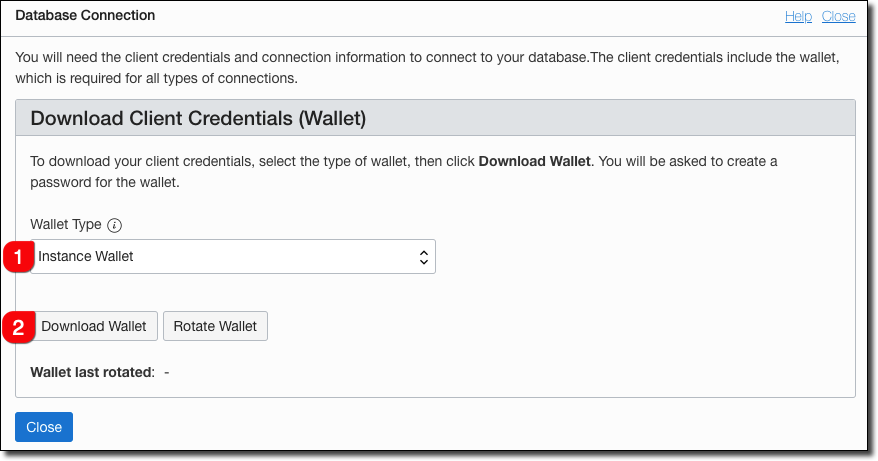

# Setup for Local Development

## Introduction

In this lab you are going to get setup to develop a Micronaut application locally that communicates with an Autonomous Datatabase instance.

Estimated Lab Time: &lt;15&gt; minutes

### Objectives

In this lab you will:

* Create the Necessary Database schema
* Download the Wallet for Autonomous Database access
* Create a new Micronaut application
* Configure the Micronaut application to connect to Autonomous database

## **STEP 1**: Create DB Schema

1. Click on the Cloud Shell button to start a Cloud Shell intance:

   

2. From Cloud Shell, download the script and run it:

```bash
wget -O setup.sh https://github.com/recursivecodes/micronaut-data-jdbc-graal-atp/releases/latest/download/setup.sh
chmod +x setup.sh
./setup.sh

```

3. Enter the values that you copied from the Terraform output in the previous lab when prompted. The script will produce several snippets of output to be used to build, run and deploy.

## **STEP 2**: Download and Configure Wallet Locally

The Oracle Autonomous Database uses an extra level of security in the form of a wallet containing access keys for your new Database.

To connect locally you need download and configure the ATP Wallet locally.

1. In the OCI Console, click on the burger menu and select 'Autonomous Transaction Processing' under 'Oracle Database'.

    

2. Make sure you are in the `mn-oci-hol` compartment:

    

3. Find the newly created instance and click on it. 

    

4. In the instance details, click on 'DB Connection'.

    

5. In the 'Database Connection' dialog, select 'Instance Wallet' and click 'Download Wallet'.

    

6. Enter (and confirm) the `atp_wallet_password` from the Terraform output you obtained in the previous lab and click 'Download'.

    

7. After the wallet zip has been downloaded, unzip it and move it to `/tmp/wallet`. You can do this with a single command in a terminal window:

```bash
 unzip /path/to/Wallet_mnociatp.zip -d /tmp/wallet
 ```

 Once downoaded your wallet directory should contain the following files:

    


## **STEP 3**: Create a new Micronaut application 

There are several ways you can get started creating a new Micronaut application. If you have the Micronaut CLI installed you can use the `mn` command to create a new application:

```bash
mn create-app example-atp --features oracle,data-jdbc
cd example-atp
```

Which will setup an application that uses the Oracle driver, the Oracle Universal Connection Pool and Micronaut Data JDBC. If you do not have the Micronaut CLI installed 
and are running on Linux or OS X you can alternatively `curl` and `unzip`:

```basb
curl https://launch.micronaut.io/example-atp.zip\?features\=oracle,data-jdbc -o example-atp.zip
unzip example-atp.zip -d example-atp
cd example-atp
```

If none of these options are viable you can also navigate to https://micronaut.io/launch/ in a browser and click the `Features` button and select the `oracle` and `data-jdbc` features then click `Generate` which will produce a zip you can download and unzip.

## **STEP 4**: Configure the Micronaut Application

The final step to configure the Micronaut application to work with Autonomous Database is to open the `src/main/resources/application.yml` file and modify the default datasource connection settings as follows:

   ```yaml
datasources:
  default:
    url: jdbc:oracle:thin:@mnociatp_high
    driverClassName: oracle.jdbc.OracleDriver
    username: mnocidemo
    schema-generate: CREATE_DROP
    dialect: ORACLE
   ```

The configure the datasource password you should set an environment variable named `DATASOURCES_DEFAULT_PASSWORD` to the output value `atp_schema_password` produced by the Terraform script in the previous section. 

In addition you should also set an environment variable called `TNS_ADMIN` to the location of your wallet created in Step 2.

For example:

   ```bash
   export TNS_ADMIN=[Your absolute path to wallet]
   export DATASOURCES_DEFAULT_PASSWORD=[Your atp_schema_password]
   ```
