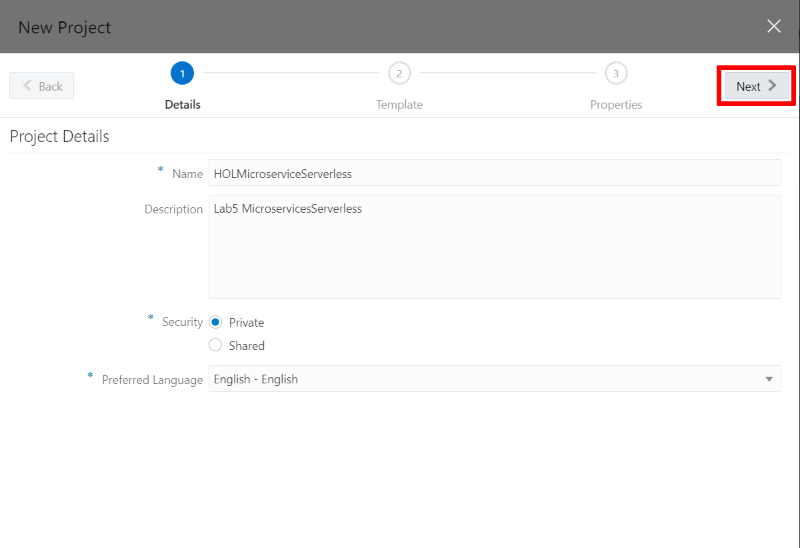

# Importing a Developer Cloud Service Project

## Introduction
Now that we have a Kubernetes Cluster, let’s move on to next step which is importing a DevCS that contains all the microservices that we will have to deploy in this Kubernetes Cluster.

Estimated time: 20 - 30 min

### Objectives

* Learn how to import a DevCS that contains all the microservices

### Lab Prerequisites

This lab assumes you have completed the following labs:
* Lab: Sign up for a Free Trial
* Lab: Provision a DevCS Instance
* Lab: Build Virtual Machines in Developer Cloud Service
* Lab: Create a Kubernetes Cluster
* Lab: Install the Front-end Client

## **Step 1**: Import a Developer Cloud Service Project
1. Go to your DevCS instance and in the organization menu, under the projects tab, click **Create**:

  

2. Enter a name for your project, for security select private, and select your preferred language. Then click **Next**:

  

3. In the template section, select **Import Project** Option:

  

4. For the properties section, we will provide you with the details to connect to a preconfigured DevCS instance from which you can import the project. Most of the information can be copied from [here](https://github.com/oraclespainpresales/GigisPizzaHOL/blob/master/microservices/Credentials/AccessBucket). The private key can be copied from [here](https://github.com/oraclespainpresales/GigisPizzaHOL/blob/master/microservices/Credentials/private.pem).

5. Click on Next:

  

6. In the next section, select the container named: “DevCS\_Clone\_Wedodevops” and the zip file named "Export-wedodev-wedoinfra\_OOW2019HOL\_2019-09-16T03-44-25.690Z-FINAL RELEASE. HOLzip" available with the project export to be imported. Then Click **Finish**:

  

7. The project will start importing:

  

8. The process will continue on a second screen:

  

9. Finally you will have imported the project:

  

10. Select the git menu to review the source code:

  Note: In the remaining labs we will work with all git repositories except db\_management.git and PizzaDeliveryMobileApp.git

  

11. You can check the different jobs by selecting the builds menu option

  

12. And click the **Pipelines** tab to check different Pipelines

  

You can proceed to the [next lab](?lab=lab-6-configure-project-match-kubernet).

## Acknowledgements
* **Authors** -  Iván Postigo, Jesus Guerra, Carlos Olivares - Oracle Spain SE Team
* **Contributors** - Jaden McElvey, Technical Lead - Oracle LiveLabs Intern
* **Last Updated By/Date** - Tom McGinn, April 2020

## **See an issue?**
Please submit feedback using this [form](https://apexapps.oracle.com/pls/apex/f?p=133:1:::::P1_FEEDBACK:1). Please include the *workshop name*, *lab* and *step* in your request.  If you don't see the workshop name listed, please enter it manually. If you would like for us to follow up with you, enter your email in the *Feedback Comments* section. Please include the workshop name and lab in your request.
