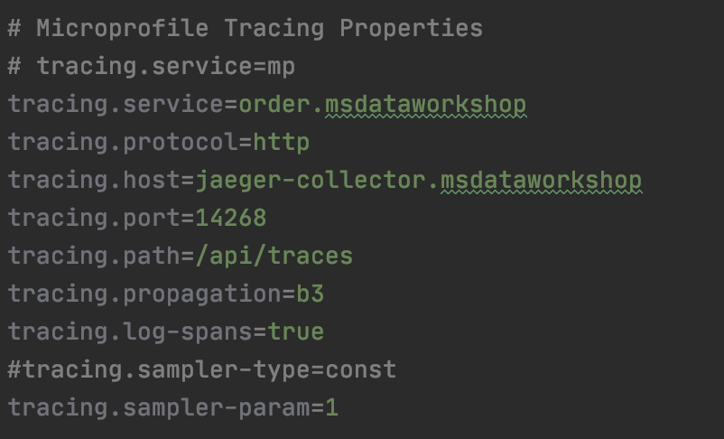
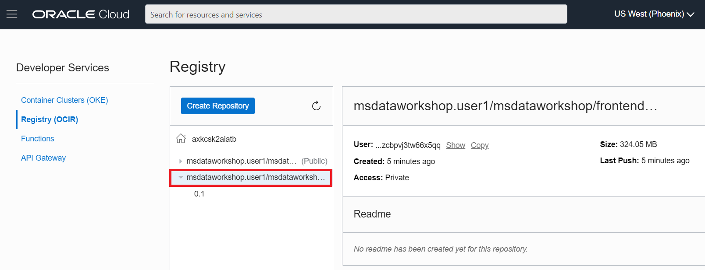
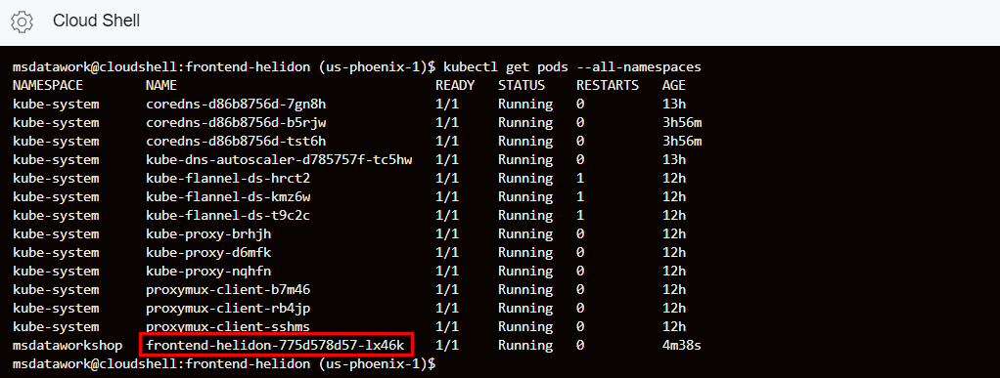
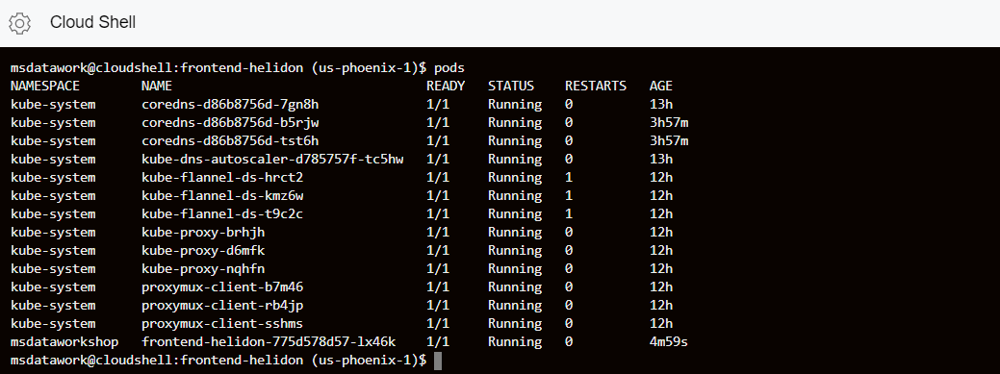
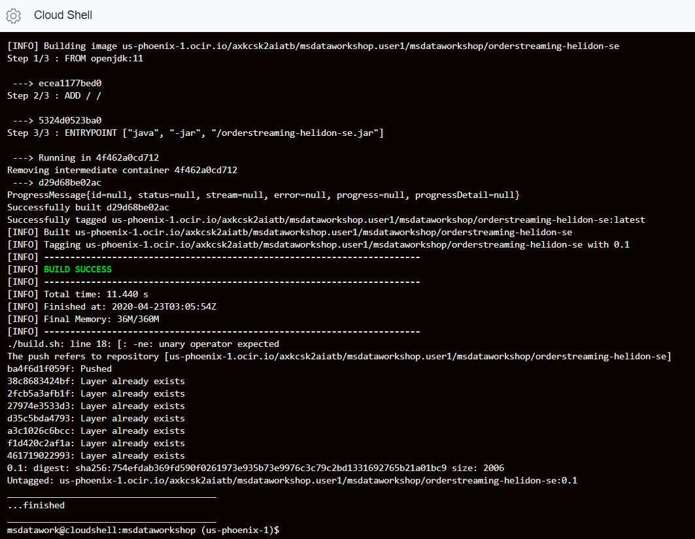
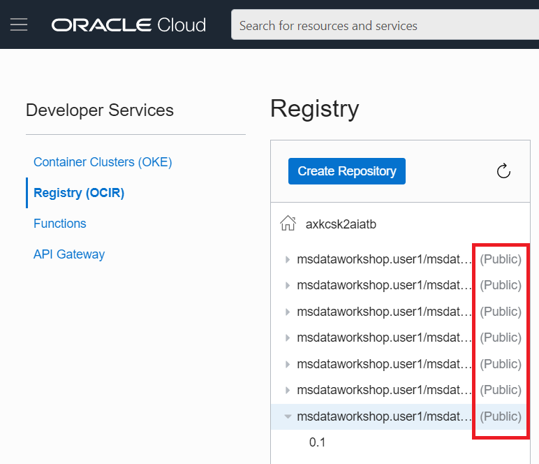

# Build Code from GitHub and Deploy Microservices

## Introduction

This lab will show you how to build images, push them to Oracle Cloud
Infrastructure Registry and deploy the microservices on our Kubernetes cluster.
You will also clone a GitHub repository.

### Objectives

  -   Clone a GitHub repository
  -   Build and push an image to OCI Registry
  -   Deploy and access the front-end microservice

### What Do You Need?

* An Oracle Cloud paid account or free trial. To sign up for a trial account with $300 in credits for 30 days, click [here](http://oracle.com/cloud/free).
* Setup the OKE cluster and the ATP databases

## **STEP 1**: Install GraalVM

    Run install script in root directory ./installGraalVM.sh 
    ```
    <copy>./installGraalVM.sh </copy>
    ```

    Verify install by running ~/graalvm-ce-java11-20.1.0/bin/java -version
    ```
    <copy>~/graalvm-ce-java11-20.1.0/bin/java -version</copy>
    ```

  
  
  Note the graalvm install location for later.

## **STEP 2**: Create the cluster namespace

In order to divide and isolate cluster resources, you will create a cluster
    namespace which will host all related resources to this application, such as
    pods and services.

1. Log in to the Cloud Console and open the Cloud Shell by
    clicking the Cloud Shell icon in the top-right corner of the Console.

  

2. Create the `msdataworkshop` namespace using the following command:

    ```
    <copy>kubectl create ns msdataworkshop</copy>
    ```

  

  You have successfully created the `msdataworkshop` namespace which is used for
  deploying the application code.
  
## **STEP 3**: Install Jaeger

1. Install Jaeger and note the services it installs

    kubectl create -f https://raw.githubusercontent.com/jaegertracing/jaeger-kubernetes/master/all-in-one/jaeger-all-in-one-template.yml -n msdataworkshop

     ```
        <copy>kubectl create -f https://raw.githubusercontent.com/jaegertracing/jaeger-kubernetes/master/all-in-one/jaeger-all-in-one-template.yml -n msdataworkshop</copy>
     ```

   
   
2.  Issue the `services` command and notice the services it installs.  
   
   
   
3.  The jaeger-collector is referenced in $MSDATAWORKSHOP_LOCATION/frontend-helidon/src/main/resources/META-INF/microprofile-config.properties and $MSDATAWORKSHOP_LOCATION/order-helidon/src/main/resources/META-INF/microprofile-config.properties 
   
   
   
   Insure these values match.
   
   The jaeger-query is the load balancer address for visualizing the Jaeger UI 
   
   Note the jaeger-query for later.

## **STEP 3**: Build the Microservices image from the GitHub repo

1. To work with application code, you need to download a GitHub repository using
    the following command. The Cloud Shell already has the `wget` command
    installed:

    ```
    <copy>wget https://objectstorage.us-phoenix-1.oraclecloud.com/p/azx5WY6Rk2zRnQmFf-vo_kKOrg-sg8lmQ0Nd305cpCk/n/stevengreenberginc/b/msdataworkshop/o/master.zip</copy>
    ```

2. Unzip the file you downloaded:

    ```
    <copy>unzip master.zip</copy>
    ```
   
3.  Set the value for MSDATAWORKSHOP_LOCATION and MSDATAWORKSHOPPROPERTIES_LOCATION in the shell

       Open `.bashrc` file .
   
       ```
       <copy>nano ~/.bashrc</copy>
       ```
       
   
     
     
       and insert the following two lines.
       ```
       <copy>export MSDATAWORKSHOP_LOCATION=~/msdataworkshop-master
             export MSDATAWORKSHOPPROPERTIES_LOCATION=~/msdataworkshop.properties</copy>
       ```
   
     
   
     Close nano with the commands `CTRL+X`, `SHIFT+Y`, and `ENTER`.
   
4. Source the edited `.bashrc` file with the following command.
   
       ```
       <copy>source ~/.bashrc</copy>
       ```
   
     

5.  You need to compile, test and package the Helidon front-end
    application code into a `.jar` file using maven. The maven package is already installed in the
    Cloud Shell. Inside Cloud Shell go to the frontend helidon microservice
    folder.

    ```
    <copy>cd msdataworkshop-master/frontend-helidon</copy>
    ```

6.  Run `maven` to build the package using the following command. Since this is
    the first time maven is executed, nothing is cached, thus it will first
    download all the necessary libraries and bundles.

    ```
    <copy>mvn clean install</copy>
    ```

  The build should be completed in 1-2 minutes, and a target folder with the related Java files is created.

  

7. Execute the following command to investigate the target folder.

    ```
    <copy>ls -al target/</copy>
    ```

  

## **STEP 4**: Push image to OCI Registry, deploy and access microservices

After you have successfully compiled the application code, you are ready to push it as a docker image into the OCI Registry. Once the image resides in the OCI registry, it can be used for deploying into the cluster. You are going to log into OCIR through the Cloud Shell using the following command.

1.  You will need the following parameters which you have already noted down in the previous Labs.

    - `REGION-ID` - is the Region identifier
    - `OBJECT-STORAGE-NAMESPACE` - is Object Storage namespace
    - `USERNAME` - is the username used to log in. If your username is federated from Oracle Identity Cloud Service, you need to add the `oracleidentitycloudservice/` prefix to your username, for example `oracleidentitycloudservice/firstname.lastname@something`

    ```
    <copy>docker login REGION-ID.ocir.io -u OBJECT-STORAGE-NAMESPACE/USERNAME<copy>
    ```

    *When prompted for password use the Auth token (msdataworkshoptoken) you generated.*

  

2.  Once successfully logged into OCIR, we can list the existing docker images. Since this is the first time logging into OCIR, no images will be shown.

    ```
    <copy>docker images</copy>
    ```

  


## **STEP 5**: Build the Docker image

1.  You are ready to build a docker image of the front-end helidon application.
    Change directory into frontend helidon microservice folder:

    ```
    <copy>cd $MSDATAWORKSHOP_LOCATION/frontend-helidon</copy>
    ```

  

2.  Run the build script which will build the frontend-helidon application, store it in a docker image and push it to OCIR

    ```
    <copy>./build.sh</copy>
    ```

  

  After a couple of minutes, the image should have been successfully pushed into the repository.

  

3.  Go to the Console, click the hamburger menu in the top-left corner and open
    **Developer Services > Registry (OCIR)**.

  

4. You should see the newly created image in the list. Click the repository with the new image.

  

5.  To simplify the usage of this image and avoid the need to do `docker login` in
    the deployment yaml file or git CI/CD, we will change the image from Private
    to Public, by clicking **Actions > Change to Public**.

  

  

6.  Go back to the Cloud Shell and run the deploy script from the same directory
    as build. This will create a new pod and service for this image in the OKE
    cluster `msdataworkshop` namespace:

    ```
    <copy>./deploy.sh</copy>
    ```

  

7.  Once successfully created, check that the frontend pod is running:

    ```
    <copy>kubectl get pods --all-namespaces</copy>
    ```

  

  Alternatively, you can execute the `pods` shortcut command:

  

8. Check that the load balancer service is running, and note the external IP
    address and port.

    ```
    <copy>kubectl get services --all-namespaces</copy>
    ```

  

  Alternatively, you can execute the `services` shortcut command.

  

9. You are ready to access the frontend page. Open a new browser tab and access
    the external page `http://<external-IP>:8080`:

  

10. Run the remaining build script to build and push the rest of the
    microservices images into the repository

    ```
    <copy>cd $MSDATAWORKSHOP_LOCATION ; ./build.sh</copy>
    ```

  

  In a couple of minutes, you should have successfully built and pushed all the images into the OCIR repository.

  

11.  Go to the Console, click the hamburger menu in the top-left corner and open
    **Developer Services > Registry (OCIR)**.

  

12. Mark all the images as public, as you did previously for the frontend image:

  

You may now proceed to the next lab.

## Acknowledgements
* **Author** - Paul Parkinson, Dev Lead for Data and Transaction Processing, Oracle Microservices Platform, Helidon
* **Adapted for Cloud by** -  Nenad Jovicic, Enterprise Strategist, North America Technology Enterprise Architect Solution Engineering Team
* **Contributors** - Jaden McElvey, Technical Lead - Oracle LiveLabs Intern
* **Last Updated By/Date** - Tom McGinn, June 2020

## See an issue?
Please submit feedback using this [form](https://apexapps.oracle.com/pls/apex/f?p=133:1:::::P1_FEEDBACK:1). Please include the *workshop name*, *lab* and *step* in your request.  If you don't see the workshop name listed, please enter it manually. If you would like for us to follow up with you, enter your email in the *Feedback Comments* section.
