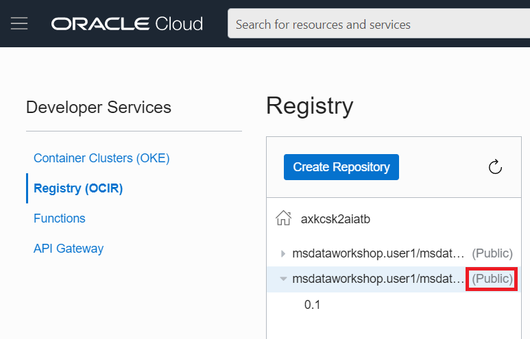

# Build Code from GitHub and Deploy Microservices

## Introduction

This lab will show you how to build images, push them to Oracle Cloud
Infrastructure Registry and deploy the microservices on our Kubernetes cluster.
You will also clone a GitHub repository.

### Objectives

  -   Clone a GitHub repository
  -   Build and push an image to OCI Registry
  -   Deploy and access the front-end microservice

### What Do You Need?

* An Oracle Cloud paid account or free trial. To sign up for a trial account with $300 in credits for 30 days, click [here](http://oracle.com/cloud/free).
* The OKE cluster and the ATP databases that you created in Lab 1

## **STEP 1**: Build Frontend microservice

1.  You need to compile, test and package the Helidon front-end
    application code into a `.jar` file using maven. The maven package is already installed in the
    Cloud Shell. Inside Cloud Shell go to the frontend Helidon microservice
    folder.

    ```
    <copy>cd $MSDATAWORKSHOP_LOCATION/frontend-helidon</copy>
    ```

2.  Run `maven` to build the package using the following command. Since this is
    the first time maven is executed, nothing is cached, thus it will first
    download all the necessary libraries and bundles.

    ```
    <copy>mvn clean install</copy>
    ```

  The build should be completed in 1-2 minutes, and a target folder with the related Java files is created.

  

3. Execute the following command to investigate the target folder.

    ```
    <copy>ls -al target/</copy>
    ```

  


## **STEP 2**: Build and Push the Docker image and access the FrontEnd UI microservice

1.  You are ready to build a docker image of the frontend Helidon application.
    Change directory into frontend-helidon folder:

    ```
    <copy>cd $MSDATAWORKSHOP_LOCATION/frontend-helidon</copy>
    ```

  

2.  Run the build script which will build the frontend-helidon application, store it in a docker image and push it to Oracle Registry

    ```
    <copy>./build.sh</copy>
    ```

  

  After a couple of minutes, the image should have been successfully pushed into the repository.

  

3.  Go to the Console, click the hamburger menu in the top-left corner and open
    **Developer Services > Container Registry**.

  

4. You should see the newly created image in the list. If you don't see it, click the refresh icon in the upper right corner of the Create Repository pane. Click the repository with the new image.

  

5.  To simplify the usage of this image and avoid the need to do `docker login` in
    the deployment yaml file or git CI/CD, we will change the image from Private
    to Public, by clicking **Actions > Change to Public**.

  

  

6.  Go back to the Cloud Shell and run the deploy script from the same directory
    as build. This will create a new pod and service for this image in the OKE
    cluster `msdataworkshop` namespace:

    ```
    <copy>./deploy.sh</copy>
    ```

  

7.  Once successfully created, check that the frontend pod is running:

    ```
    <copy>kubectl get pods --all-namespaces</copy>
    ```

  

  Alternatively, you can execute the `pods` shortcut command:

  

8. Check that the load balancer service is running, and write down the external IP
    address and port.

    ```
    <copy>kubectl get services --all-namespaces</copy>
    ```

  

  Alternatively, you can execute the `services` shortcut command.

  

9. You are ready to access the frontend page. Open a new browser tab and access
    the external page `http://<external-IP>:8080`:

  

10. Run the remaining build script to build and push the rest of the
    microservices images into the repository

    ```
    <copy>cd $MSDATAWORKSHOP_LOCATION ; ./build.sh</copy>
    ```

  

  In a couple of minutes, you should have successfully built and pushed all the images into the OCIR repository.

  

11.  Go to the Console, click the hamburger menu in the top-left corner and open
    **Developer Services > Container Registry**.

  

12. Mark all the images as public (**Actions** > **Change to Public**), just as you did previously for the frontend image:

  

You may now proceed to the next lab.

## Acknowledgements
* **Author** - Paul Parkinson, Dev Lead for Data and Transaction Processing, Oracle Microservices Platform, Helidon
* **Adapted for Cloud by** - Nenad Jovicic, Enterprise Strategist, North America Technology Enterprise Architect Solution Engineering Team
* **Documentation** - Lisa Jamen, User Assistance Developer - Helidon
* **Contributors** - Jaden McElvey, Technical Lead - Oracle LiveLabs Intern
* **Last Updated By/Date** - Tom McGinn, June 2020

## See an issue?
Please submit feedback using this [form](https://apexapps.oracle.com/pls/apex/f?p=133:1:::::P1_FEEDBACK:1). Please include the *workshop name*, *lab* and *step* in your request.  If you don't see the workshop name listed, please enter it manually. If you would like for us to follow up with you, enter your email in the *Feedback Comments* section.

