# Data-centric microservices walkthrough with Helidon MP

## Introduction

This lab will show you how to deploy and run data-centric microservices highlighting use of different data types, data and transaction patterns, and various Helidon MP features.
The lab will then show you metrics, health checks and probes, and tracing that have been enabled via Helidon annotations and configuration.


### Objectives
-   Create and bind OCI Service Broker to existing ATP instance
-   Setup Oracle Advanced Queuing in existing ATP instances

### What Do You Need?

* An Oracle Cloud paid account or free trial. To sign up for a trial account with $300 in credits for 30 days, click [here](http://oracle.com/cloud/free).
* OKE cluster and the ATP databases created
* Microservices code from GitHub built and deployed


## **STEP 1**: Deploy GrubDash store services

1. As you have successfully set up the databases, you can now test the
    “GrubDash” Food Order application. You will interact with several
    different data types, check the event-driven communication, saga, event-sourcing
    and Command Query Responsibility Segregation via order and inventory
    services. Go ahead and deploy the related order, inventory and supplier
    Helidon services. The Food Order application consists of the following
    tables shown in the ER diagram

   

    The Food Order application consists of a mock Mobile App (Frontend Helidon
    microservice) that places and shows orders via REST calls to the order-helidon
    microservice. Managing inventory is done with calls to the
    supplier-helidon microservice.  
    When an order is placed, the order service inserts the order in JSON format and in the same local transaction sends an `orderplaced` message using AQ JMS.
    The inventory service dequeus this message, validates and adjusts inventory, and enqueues a message stating the inventory location for the item ordered or an `inventorydoesnotexist` status if there is insufficient inventory.
    This dequeue, database operation, and enqueue are done within the same local transaction.
    Finally, the order service dequeues the inventory status message for the order and returns the resultant order success or failure to the frontend service. 
      
    This is shown in the below architecture diagram.

   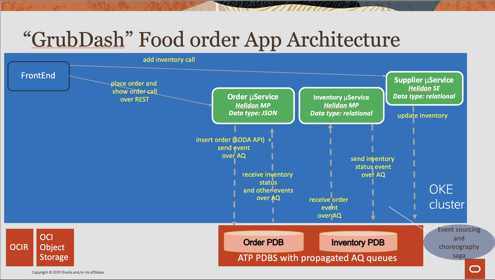

2. Open the Cloud Shell and go to the order folder, using the following command.

    ```
    <copy>cd $MSDATAWORKSHOP_LOCATION/order-helidon</copy>
    ```

   

3. Deploy it.

    ```
    <copy>./deploy.sh</copy>
    ```

   

4. Go ahead and execute the same steps for deploying the inventory
    Helidon service. We can actually speed this process by running all the above
    commands sequentially, using the following command.

    ```
    <copy>cd $MSDATAWORKSHOP_LOCATION/inventory-helidon ; ./deploy.sh</copy>
    ```

   

   Once the image has been deployed in a pod, you should see the following message.

   

5. Use the same method to deploy the supplier Helidon service. Use
    the following command.

    ```
    <copy>cd $MSDATAWORKSHOP_LOCATION/supplier-helidon-se ; ./deploy.sh</copy>
    ```

   

6. You can check that all images have been successfully deployed in pods by executing the following command.

    ```
    <copy>pods</copy>
    ```

   

7. The services are ready, and you can proceed to test the application
    mechanisms. 
    
    
    
## **STEP 2**: Verify order and inventory activity of GrubDash store

1.   Open the frontend microservices home page.

2. Click **Transactional** under **Labs**.

   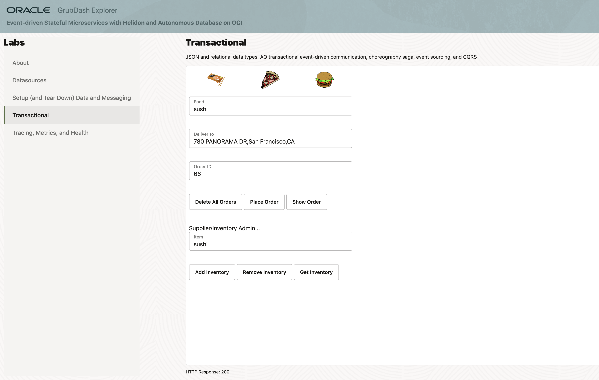

3. Check the inventory of a given item such as sushi, by typing `sushi`
    in the `food` field and clicking **Get Inventory**. You should see the inventory
    count result 0.

   

4. (Optional) If for any reason you see a different count, click **Remove Inventory** to bring back the count to 0.

5. Let’s try to place an order for sushi by clicking **Place Order**.

   

6. To check the status of the order, click **Show Order**. You should see a failed
    order status.

   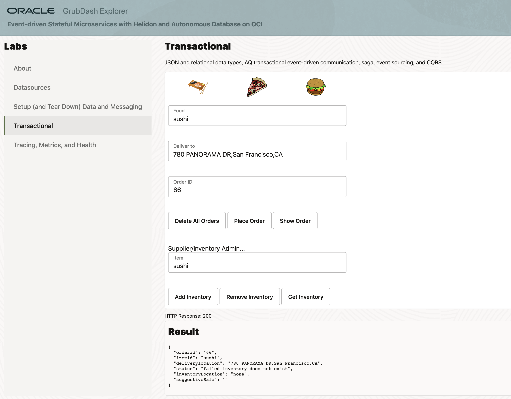

   This is expected, because the inventory count for sushi was 0.

7. Click **Add Inventory** to add the sushi in the inventory. You
    should see the outcome being an incremental increase by 1.

   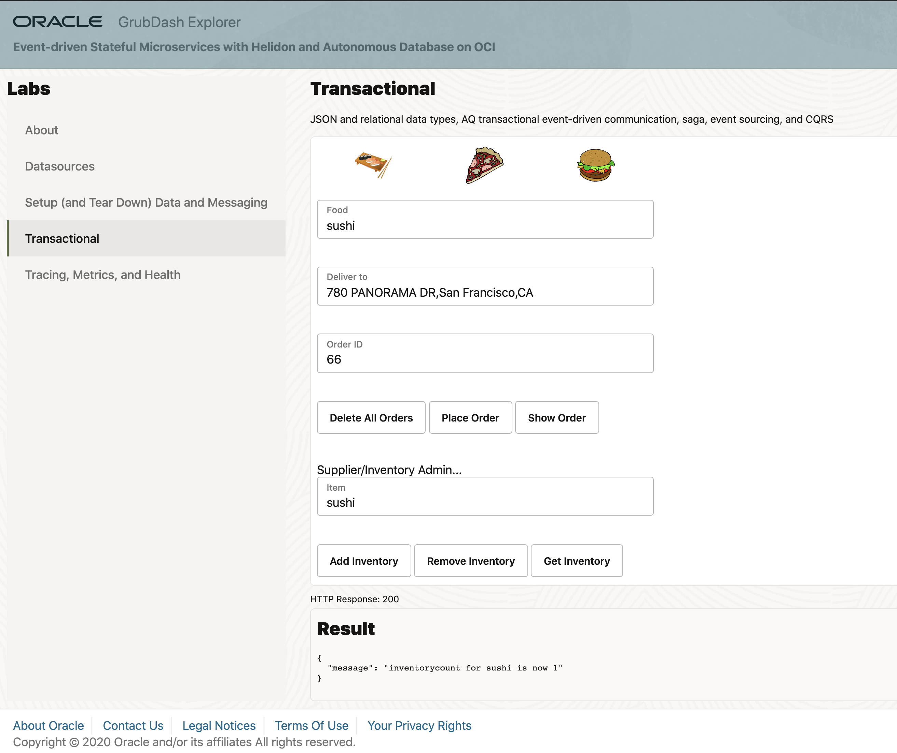

8. Go ahead and place another order by clicking **Place Order**, and then click
    **Show Order** to check the order status.

   

   

   The order should have been successfully placed, which is demonstrated with the order status showing success.


Although this might look as a basic transactional mechanic, but the difference
in the microservices environment is that it’s not using a two-phase XA commit,
and therefore not using distributed locks. In a microservices environment with
potential latency in the network, service failures during the communication
phase or delays in long running activities, an application shouldn’t have
locking across the services. Instead, the pattern that is used is called the
saga pattern, which instead of defining commits and rollbacks, allows each
service to perform its own local transaction and published an event. The other
services listen to that event and perform the next local transaction.

In this architecture, there is a frontend service which mimics some mobile app
requests for placing orders. The frontend service is communicating with the
order service to place an order. The order service is then inserting the order
into the order database, while also sending a message describing that order.
This approach is called the event sourcing pattern, which due to its decoupled
non-locking nature is prominently used in microservices. Event sourcing pattern
entails sending an event message for every work or any data manipulation that
was conducted. In this example, while the order was inserted in the order
database, an event message was also created in the Advanced Queue of the Oracle
database.

Implementing the messaging queue inside the Oracle database provides a unique
capability of making the event sourcing actions (manipulating data and sending
an event message) atomically within the same transaction. The benefit of this
approach is that it provides a guaranteed once delivery, and it doesn’t require
writing additional application logic to handle possible duplicate message
deliveries, as it would be the case with solutions using separate datastores and
event messaging platforms.

In this example, once the order was inserted into the Oracle database, an event
message was also sent to the interested parties, which in this case is the
inventory service. The inventory service receives the message and checks the
inventory database, modifies the inventory if necessary, and sends back a
message if the inventory exists or not. The inventory message is picked up by
the order service which based on the outcome message, sends back to the frontend
a successful or failed order status.

This approach fits the microservices model, because the inventory service
doesn’t have any REST endpoints, and instead it purely uses messaging. The
services do not talk directly to each other, as each service is isolated and
accesses its datastore, while the only communication path is through the
messaging queue.

This architecture is tied with the Command Query Responsibility Segregation
(CQRS) pattern, meaning that the command and query operations use different
methods. In our example the command was to insert an order into the database,
while the query on the order is receiving events from different interested
parties and putting them together (from suggestive sales, inventory, etc).
Instead of actually going to suggestive sales service or inventory service to
get the necessary information, the service is receiving events.

Let’s look at the Java source code to understand how Advanced Queuing and Oracle
database work together.


What is unique to Oracle and Advanced Queuing is that a JDBC connection can be
invoked from AQ JMS session. Therefore we are using this JMS session to send and
receive messages, while the JDBC connection is used to manipulate the datastore.
This mechanism allows for both the JMS session and JDBC connection to exist
within same atomic local transaction.

You have successfully configured the databases with the necessary users, tables
and message propagation across the two ATP instances. You may proceed to the
next lab.


## **STEP 3**: Verify metrics

1. Notice @Timed and @Counted annotations on placeOrder method of $MSDATAWORKSHOP_LOCATION/order-helidon/src/main/java/io/helidon/data/examples/OrderResource.java

   


2. Click **Tracing, Metrics, Health**

   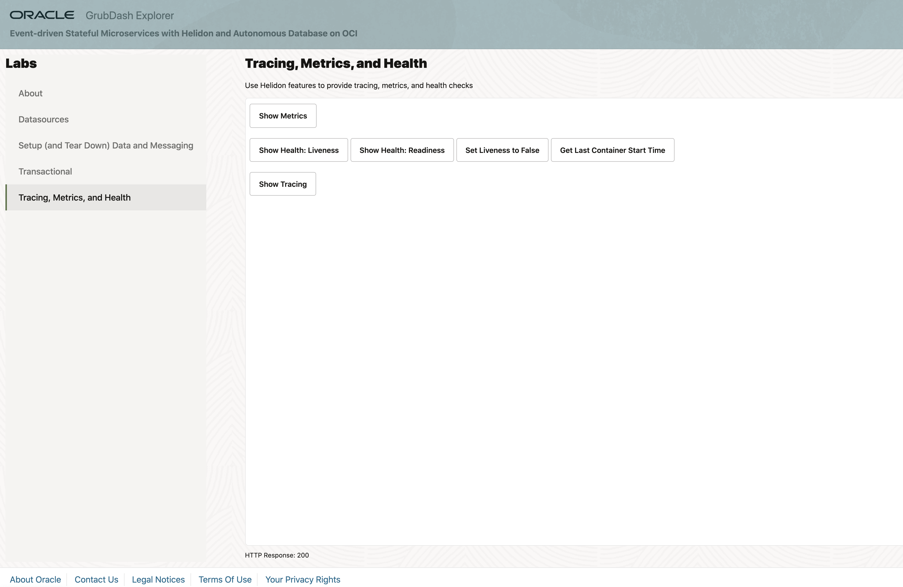
   
2. Click **Metrics** and notice the long string of metrics (including those from placeOrder timed and counted) in prometheus format.

   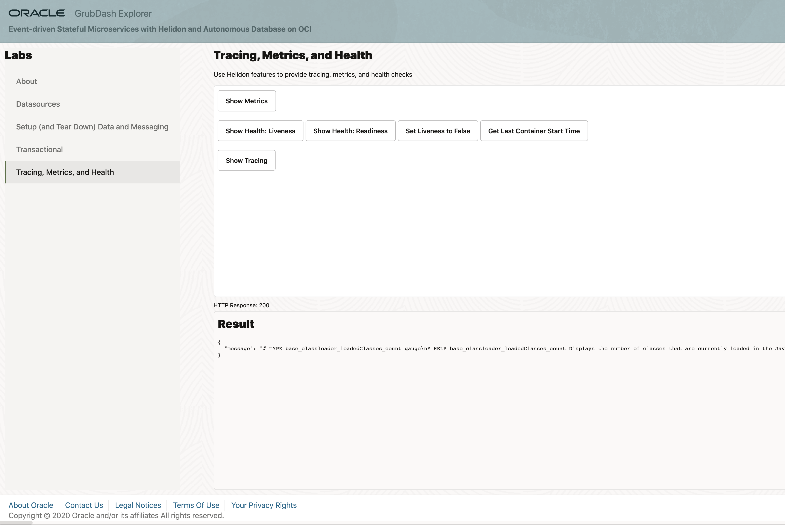


## **STEP 4**: Verify health

1. Oracle Cloud Infrastructure Container Engine for Kubernetes (OKE) provides
       health probes which check a given container for its liveness (checking if
       the pod is up or down) and readiness (checking if the pod is ready to take
       requests or not). In this STEP you will see how the probes pick up the
       health that the Helidon microservice advertises. Click **Tracing, Metrics, Health** and click **Show Health: Liveness**

   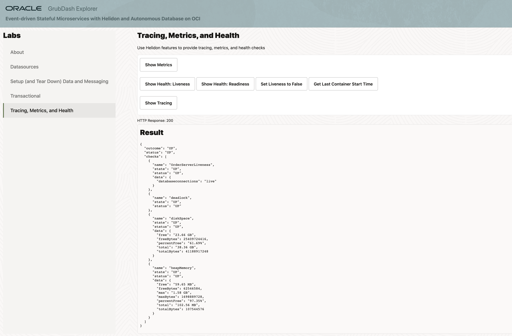
   
2. Notice health check class at `$MSDATAWORKSHOP_LOCATION/order-helidon/src/main/java/io/helidon/data/examples/OrderServiceLivenessHealthCheck.java` and how the liveness method is being calculated.
     
      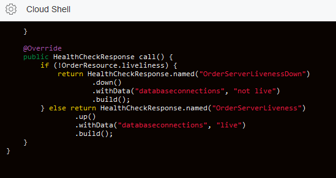
   
3. Notice liveness probe specified in $MSDATAWORKSHOP_LOCATION/order-helidon/order-helidon-deployment.yaml The `livenessProbe` can be set up with different criteria, such as reading from a
                                                                                                           file or an HTTP GET request. In this example the OKE health probe will use HTTP
                                                                                                           GET to check the /health/live and /health/ready addresses every 3 seconds, to
                                                                                                           see the liveness and readiness of the service.

   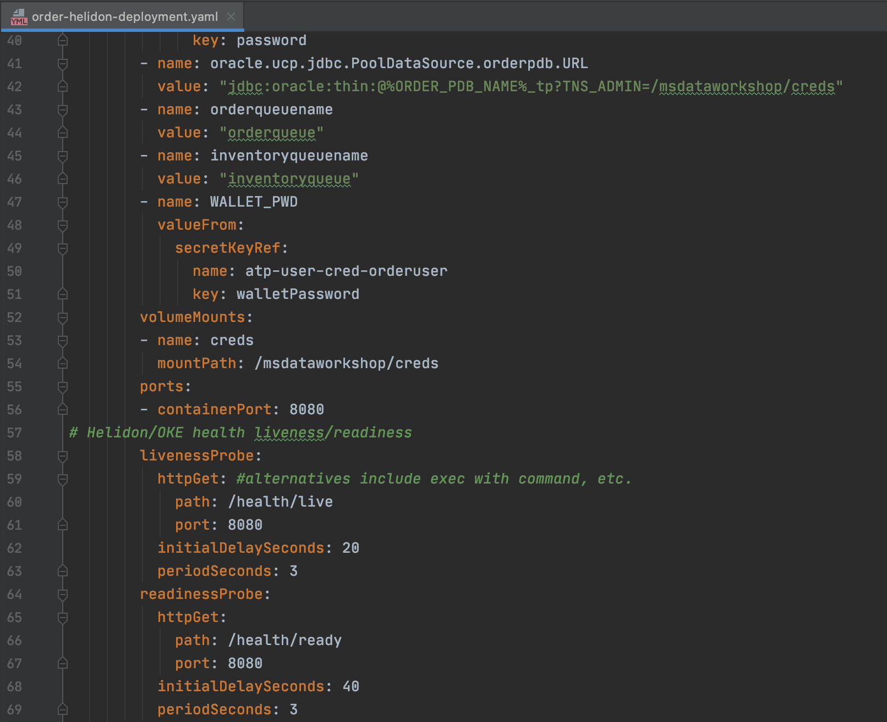

4. In order to observe how OKE will manage the pods, the microservice has been
       created with the possibility to set up the liveliness to “false”. Click **Get Last Container Start Time** and note the time the container started.

   

5. Click **Set Liveness to False** . This will cause the Helidon Health Check to report false for liveness which will result in OKE restarting the pod/microservice

   

6. Click **Get Last Container Start Time**.
   It will take a minute or two for the probe to notice the failed state and conduct the restart and as it does you may see a connection refused exception.

   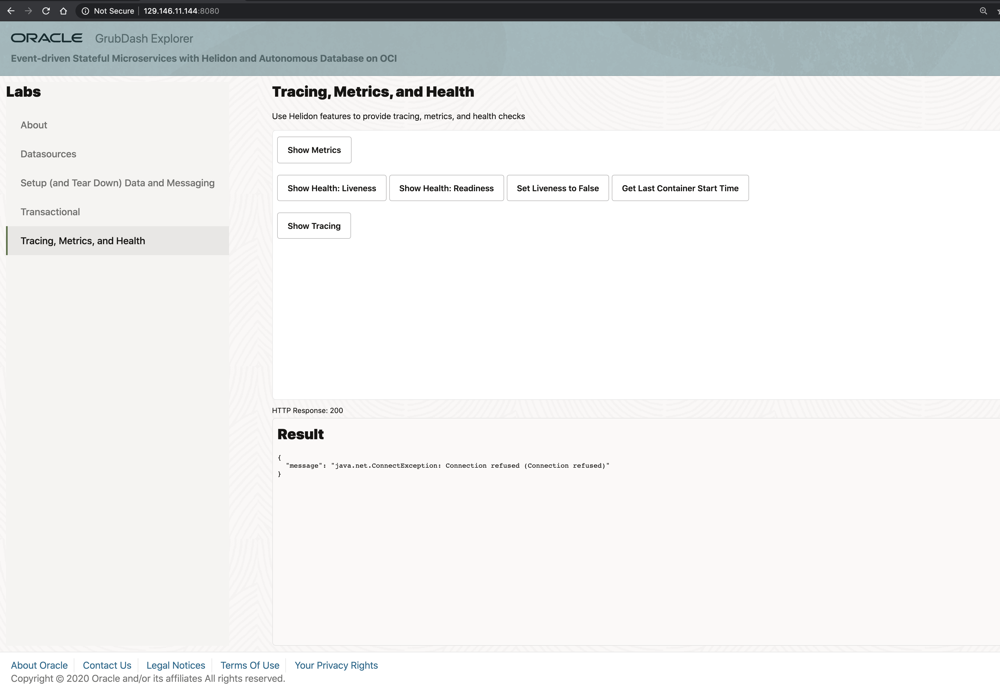

   Eventually you will see the container restart and note the new/later container startup time reflecting that the pod was restarted.
    
   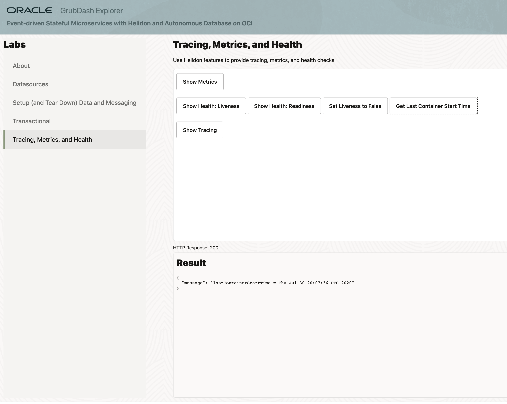


## **STEP 5**: Verify tracing
   
1. Notice @Traced annotations on `placeOrder` method of $MSDATAWORKSHOP_LOCATION/frontend-helidon/src/main/java/io/helidon/data/examples/FrontEndResource.java and `placeOrder` method of $MSDATAWORKSHOP_LOCATION/order-helidon/src/main/java/io/helidon/data/examples/OrderResource.java
   Also notice the additional calls to set tags, baggage, etc. in this `OrderResource.placeOrder` method.

   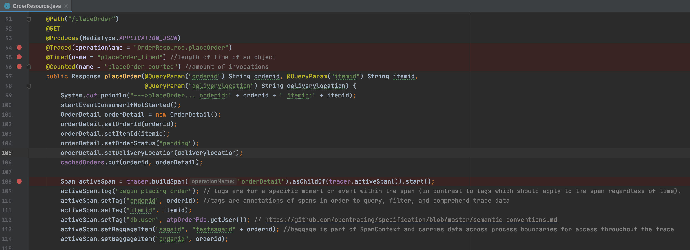

2. Place an order if not already done in Step 1

3. Click **Tracing** to open the Jaeger UI, select `frontend.msdataworkshowp` from the `Service` dropdown menu and click `Find Traces` button.

   
   
   Select a trace with a large number of spans and drill down on the various spans of the trace and associated information. In this case we see placeOrder order, saga, etc. information in logs, tags, and baggage.
   
   
   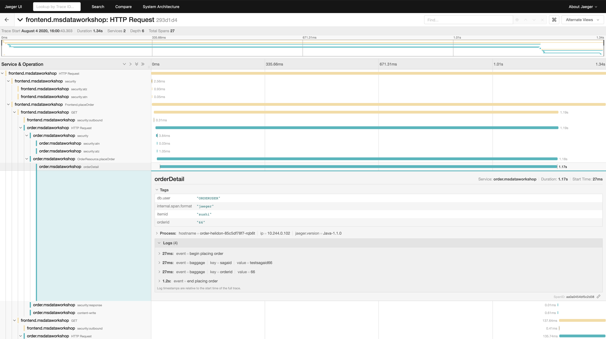
   

## Conclusion

## Acknowledgements
* **Author** - Paul Parkinson, Dev Lead for Data and Transaction Processing, Oracle Microservices Platform, Helidon
* **Adapted for Cloud by** -  Nenad Jovicic, Enterprise Strategist, North America Technology Enterprise Architect Solution Engineering Team
* **Contributors** - Jaden McElvey, Technical Lead - Oracle LiveLabs Intern
* **Last Updated By/Date** - Tom McGinn, June 2020

## See an issue?
Please submit feedback using this [form](https://apexapps.oracle.com/pls/apex/f?p=133:1:::::P1_FEEDBACK:1). Please include the *workshop name*, *lab* and *step* in your request.  If you don't see the workshop name listed, please enter it manually. If you would like for us to follow up with you, enter your email in the *Feedback Comments* section.
