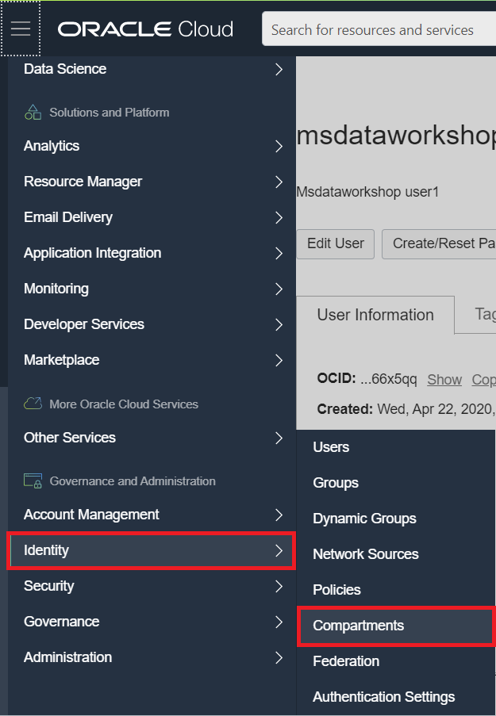
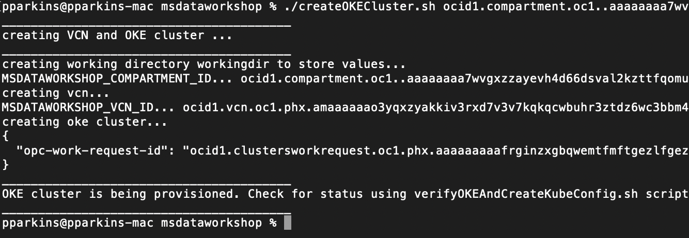
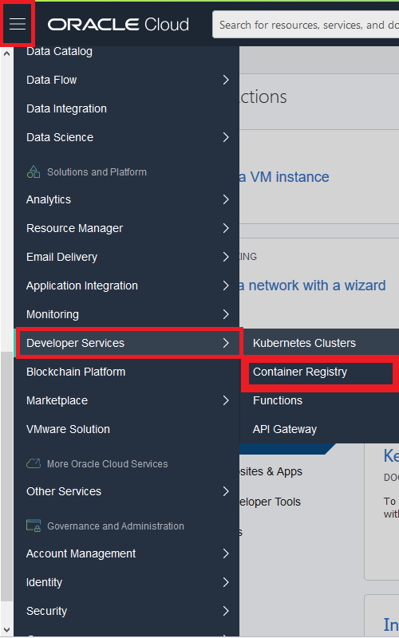
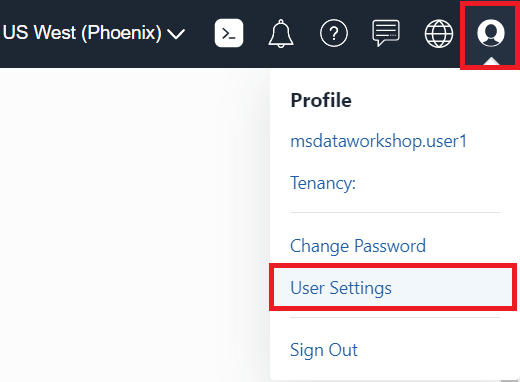
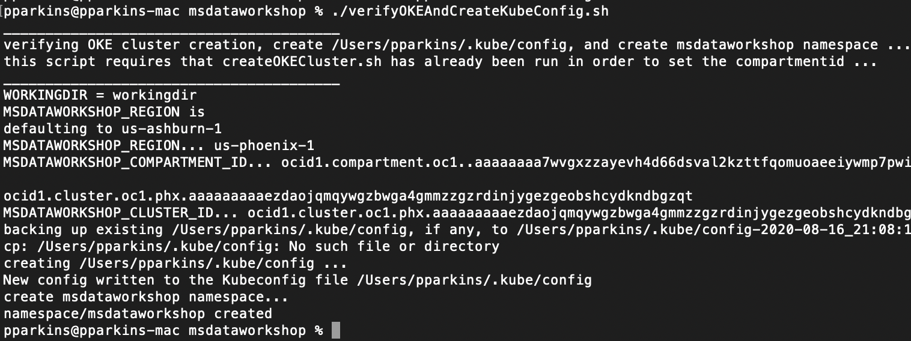

# Setup OCI, OKE, ATP and Cloud shell
## Introduction

This 25-minute lab will show you how to setup the Oracle Cloud Infrastructure Container Engine for Kubernetes for creating and deploying a front-end Helidon application which accesses in the backend the Oracle Autonomous Database.

### Objectives

* Collect important information that you will use throughout this workshop
* Set up the OKE cluster
* Set up the ATP databases

### What Do You Need?

* An Oracle Cloud paid account or free trial. To sign up for a trial account with $300 in credits for 30 days, click [here](http://oracle.com/cloud/free).

 You will not be able to complete this workshop with the 'free always' account. Make sure that you select the free trial account with credits.

## **STEP 1**: Enter Cloud Shell

Cloud Shell is a small virtual machine running a Bash shell which you access through the OCI Console. Cloud Shell comes with a pre-authenticated OCI CLI, set to the Console tenancy home page region, as well as up-to-date tools and utilities.

1.	Click the Cloud Shell icon in the top-right corner of the Console.

  

## **STEP 2**: Download workshop source code
To work with application code, you need to download a GitHub repository using
    the following curl and unzip command. The workshop assumes this is done from your root directory.

  ```
 <copy>cd ~ ; curl -sL https://tinyurl.com/y4wyehcw --output master.zip ; unzip master.zip ; rm master.zip</copy>
  ```

  You should now see **msdataworkshop-master** in your root directory.
  cd into this directory
  
  ```
 <copy>cd ~ ; curl -sL https://tinyurl.com/y4wyehcw --output master.zip ; unzip master.zip ; rm master.zip</copy>
  ```
  

## **STEP 3**: Create an OCI Compartment and an OKE Cluster in that Compartment.

1. Open up the hamburger in the top-left corner of the Console and select **Identity > Compartments**.

  

2. Click **Create Compartment** with the following parameters and click **Create Compartment**:
    - Compartment name: `msdataworkshop`
    - Description: `MS workshop compartment`

  

  

3. Once the compartment is created, click on the name of the compartment and then click on '`copy` to copy the OCID.

  

  

4. Go back into your cloud shell and verify you are in the `~/msdataworkshop-master` directory.

5. Issue the following command providing the compartment ocid you just created and copied as an argument.

  ```
 <copy>./createOKECluster.sh </copy>
  ```
  
  For example `./createOKECluster.sh ocid1.compartment.oc1..aaaaaaaaxbyourcompartmentocidhere`

  
  
  Will will verify cluster creation and create a kube config in order to access it in a later step.
  
## **STEP 4**: Create ATP databases

1. run ./createATPPDBs.sh
   
    ```
    <copy>./createATPPDBs.sh</copy>
     ```
     
   Notice creation of the ORDERDB and INVENTORYDB PDBs.
    
  
  
   OCIDs for the PDBs are stored and will be used later to create kubernetes secrets that microservices will use to access them.


## **STEP 5**: Create an OCI Registry and Auth key and login to it from Cloud Shell
You are now going to create an Oracle Cloud Infrastructure Registry and an Auth key. Oracle Cloud Infrastructure Registry is an Oracle-managed registry that enables you to simplify your development to production workflow by storing, sharing, and managing development artifacts such as Docker images.

1. Open up the hamburger button in the top-left corner of the console and go to **Developer Services > Container Registry**.

  

2. Click **Create Repository** , specify the following details for your new repository, and click **Create Repository**.
    - Repository Name: `<firstname.lastname>/msdataworkshop`
	- Access: `Public`

  Make sure that access is marked as `public`.  

  

  
  
  Go to shell and run `./setObjectStoreNamespace.sh` with this value
  For example `./setObjectStoreNamespace.sh msdataworkshop.user1/msdataworkshop`

3. You will now create the Auth key by going back to the User Settings page. Click the Profile icon in the top-right corner of the Console and select **User Settings**.

  

4. Click on **Auth Tokens** and select **Generate Token**.

  

5. In the description type `msdataworkshoptoken` and click **Generate Token**. 

  
  
  Copy the token value.

  

  Go to shell and run `./dockerlogin.sh` with USERNAME and copied token value.
  `USERNAME` - is the username used to log in. If your username is federated from Oracle Identity Cloud Service, you need to add the `oracleidentitycloudservice/` prefix to your username, for example `oracleidentitycloudservice/firstname.lastname@something`

  For example `./dockerlogin.sh `

    *When prompted for password use the Auth token (msdataworkshoptoken) you generated. (eg }cYourAuthTokenM2AjE )

  

2.  Once successfully logged into Container Registry, we can list the existing docker images. Since this is the first time logging into Registry, no images will be shown.

    ```
    <copy>docker images </copy>
    ```

  


## **STEP 6**: Access OKE from the Cloud Shell

1. run ./verifyOKEAndCreateKubeConfig.sh

 ```
 <copy>./verifyOKEAndCreateKubeConfig.sh</copy>
  ```
  
Notice kube config is create for the cluster created earlier and the `msdataworkshop` namespace is also created.


  
  

You may proceed to the next lab.

## Acknowledgements

* **Author** - Paul Parkinson, Dev Lead for Data and Transaction Processing, Oracle Microservices Platform, Helidon
* **Adapted for Cloud by** - Nenad Jovicic, Enterprise Strategist, North America Technology Enterprise Architect Solution Engineering Team
* **Documentation** - Lisa Jamen, User Assistance Developer - Helidon
* **Contributors** - Jaden McElvey, Technical Lead - Oracle LiveLabs Intern
* **Last Updated By/Date** - Tom McGinn, June 2020


## See an issue?
Please submit feedback using this [form](https://apexapps.oracle.com/pls/apex/f?p=133:1:::::P1_FEEDBACK:1). Please include the *workshop name*, *lab* and *step* in your request.  If you don't see the workshop name listed, please enter it manually. If you would like for us to follow up with you, enter your email in the *Feedback Comments* section.
