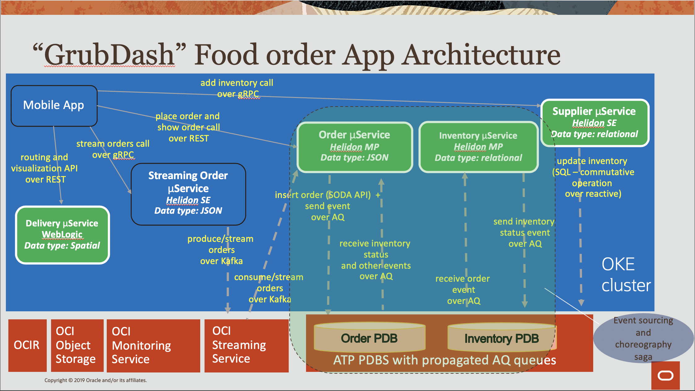

2# Building Microservices with Oracle Converged Database
## Introduction and Overview

There is a rapid increase of data streams being generated by applications, devices, the wide web, processes and enterprises which need to be processed, stored, analyzed securely and at scale. There are many technologies to address these event streams, but the key is to recognize that event-driven action is the end goal of these event streams. You can think of event-driven workflows in ERP, CRM, HCM that have event flows, that were traditionally using JMS messaging. Or they could be streaming news, sensor data, social media posts sent to various set of Apache Kafka subscribers.

Often there are tough architecture choices for setting up the infrastructure, operating it, tuning it, upgrading it, scaling it. In this workshop you will simplify the process by setting up Transactional Event Queues in the Oracle Autonomous Database which brings the best of JMS messaging and Kafka produce/consume together with transactions. This combination of data and and events delivered with notifications is ideal to build scalable microservices with a multi-model, multi-tenant architecture.

This workshop will help you understand the technical capabilities inside and outside the Oracle database to support scalable data & event-driven microservices architecture.

You will create a highly scalable application that relies on Oracle Container Engine for Kubernetes to build, deploy and manage the Helidon and Weblogic front-end microservices that interact through Oracle Cloud Infrastructure Service Broker, JMS and Kafka streaming platform with the back-end datastores deployed as Oracle pluggable databases inside the Oracle Autonomous Transaction Processing.

### Let's Get Started!

Click on [Sign Up For a Free Trial](?lab=sign-up-for-free-trial) to get your Oracle Free Trial. If you already have an Oracle Free Trial or Paid account, you can proceed to [Lab 1: Provision a DevCS Instance](?lab=lab-1-setup-oci,-oke,-atp-cloud-shell).

## Want to Learn More?

* [Multitenant Database – Oracle 19c](https://www.oracle.com/database/technologies/multitenant.html)
* [Oracle Advanced Queuing](https://docs.oracle.com/en/database/oracle/oracle-database/19/adque/aq-introduction.html)
* [Microservices Architecture with the Oracle Database](https://www.oracle.com/technetwork/database/availability/trn5515-microserviceswithoracle-5187372.pdf)
* [https://developer.oracle.com/](https://developer.oracle.com/)

## Acknowledgements
* **Author** - Paul Parkinson, Consulting Member of Technical Staff
* **Adapted for Cloud by** -  Nenad Jovicic, Enterprise Strategist, North America Technology Enterprise Architect Solution Engineering Team
* **Contributors** - Jaden McElvey, Technical Lead - Oracle LiveLabs Intern
* **Last Updated By/Date** - Tom McGinn, June 2020

## See an issue?
Please submit feedback using this [form](https://apexapps.oracle.com/pls/apex/f?p=133:1:::::P1_FEEDBACK:1). Please include the *workshop name*, *lab* and *step* in your request.  If you don't see the workshop name listed, please enter it manually. If you would like for us to follow up with you, enter your email in the *Feedback Comments* section. Please include the workshop name and lab in your request.
