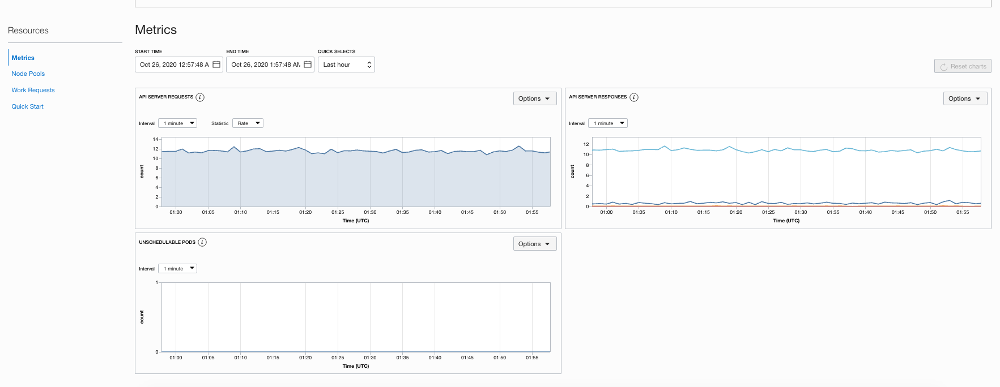

# Monitoring the deployment

## Introduction

Observability helps to understand and explain the state of your systems using a combination of logs, metrics and traces. It helps bringing better visibility into systems.

Estimated Lab Time: 10 minutes

### Objectives

In this lab, you will:

* Check OKE Cluster, Node Pool and Worker Nodes Metrics with OCI Monitoring Console
* Use Grafana Dashboards

### Prerequisites

* Completed the **Deploy the MuShop App** lab and have the app running

## **STEP 1**: Review OKE Metrics

1. *OKE Cluster Metrics:* Navigate to **Developer Services -> Kubernetes Clusters -> <Your_Cluster_Name>**

Under **Resources -> Metrics** observe the following metrics

* Unschedulable pods, which can be used to trigger node pool scale operations when there are insufficient resources on which to schedule pods.
* API Server requests per second, which is helpful to understand any underlying performance issues seen in the Kubernetes API server.

These metrics can also be viewed from OCI Monitoring console under “oci_oke” namespace. Additionally, alarms can be created using industry standard statistics, trigger operators, and time intervals.



1. *OKE Node Pool Metrics:* Navigate to **Developer Services -> Kubernetes Clusters -> <Your_Cluster_Name> -> Node Pools -> <Your_Node_Pool_Name>**

Observe the following node pool metrics:

* Node State (If your worker nodes are in Active state as indicated by OCI Compute Service)
* Node condition (If your worker node are in Ready state as indicated by OKE API server)


1. *OKE Worker Node Metrics:* Navigate to **Developer Services -> Kubernetes Clusters -> <Your_Cluster_Name> -> Node Pools -> <Your_Node_Pool_Name> -> Nodes -> <Your_Node_Name>**

Observe the following node metrics:

* Activity level from CPU. Expressed as a percentage of total time (busy and idle) versus idle time. A typical alarm threshold is 90 percent.
* Space currently in use. Measured by pages. Expressed as a percentage of used pages versus unused pages. A typical alarm threshold is 85 percent.
* Activity level from I/O reads and writes. Expressed as reads/writes per second.
* Read/Write throughput. Expressed as bytes read/Write per second.
* Network receipt/transmit throughput. Expressed as bytes received/transmit per second.


## **STEP 2**: Grafana Monitoring

Good news! You already installed Prometheus/Grafana as part of the umbrella chart during setup. Now let's revisit the charts and connect to some Grafana dashboards!

1. List helm releases to check if the **mushop-utils**(Setup) chart is installed

    ````shell
    <copy>
    helm list --all-namespaces
    </copy>
    ````

    Sample response:

    ````shell
    NAME                    NAMESPACE               REVISION        UPDATED                                 STATUS          CHART                           APP VERSION
    mushop                  mushop                  1               2020-01-31 21:14:48.511917 -0600 CST    deployed        mushop-0.1.0                    1.0
    mushop-utils            mushop-utilities        1               2020-01-31 20:32:05.864769 -0600 CST    deployed        mushop-setup-0.0.1              1.0
    ````

1. Get the Grafana outputs from the **mushop-utils** (setup chart) installation

    ````shell
    <copy>
    helm status mushop-utils --namespace mushop-utilities
    </copy>
    ````

1. Find the EXTERNAL-IP assigned to the ingress controller.

    ````shell
    <copy>
    kubectl get svc mushop-utils-ingress-nginx-controller --namespace mushop-utilities
    </copy>
    ````

1. Get the auto-generated Grafana **admin** password

    ````shell
    <copy>
    kubectl get secret -n mushop-utilities mushop-utils-grafana \
    -o jsonpath="{.data.admin-password}" | base64 --decode ; echo
    </copy>
    ````

1. Open to the Grafana dashboard using your browser connecting to http://< EXTERNAL-IP >/grafana

1. Connect to the dashboard with **admin**/**< password >**

    

1. On the Grafana main screen, click on Home to select a Dashboard

    

1. Select the `Kubernetes Cluster (Prometheus)` Dashboard

    *Note:* MuShop pre-loads dashboards as part of the mushop-utils chart

    

1. Visualize and try the options

    

1. You can try other dashboards by clicking on the Dashboard name and selecting the desired dashboard

*Note:* You can install other dashboards from the [community](https://grafana.com/grafana/dashboards?dataSource=prometheus) or create your own

You may now [proceed to the next lab](#next).

## Acknowledgements

* **Author** - Adao Junior
* **Contributors** - Adao Junior
* **Last Updated By/Date** - Adao Junior, October 2020

## Need Help?

Please submit feedback or ask for help using our [LiveLabs Support Forum](https://community.oracle.com/tech/developers/categories/livelabsdiscussions). Please click the **Log In** button and login using your Oracle Account. Click the **Ask A Question** button to the left to start a *New Discussion* or *Ask a Question*.  Please include your workshop name and lab name.  You can also include screenshots and attach files.  Engage directly with the author of the workshop.

If you do not have an Oracle Account, click [here](https://profile.oracle.com/myprofile/account/create-account.jspx) to create one.
