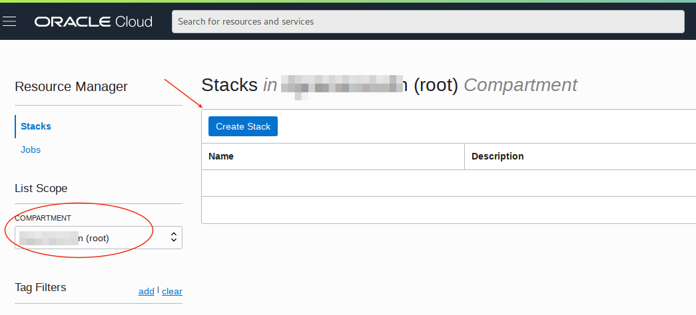
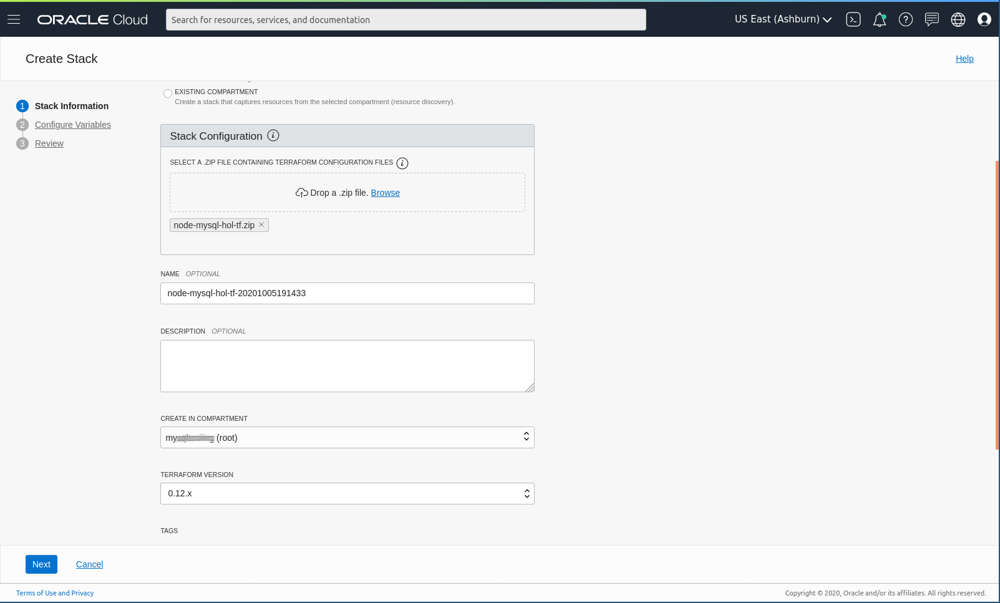
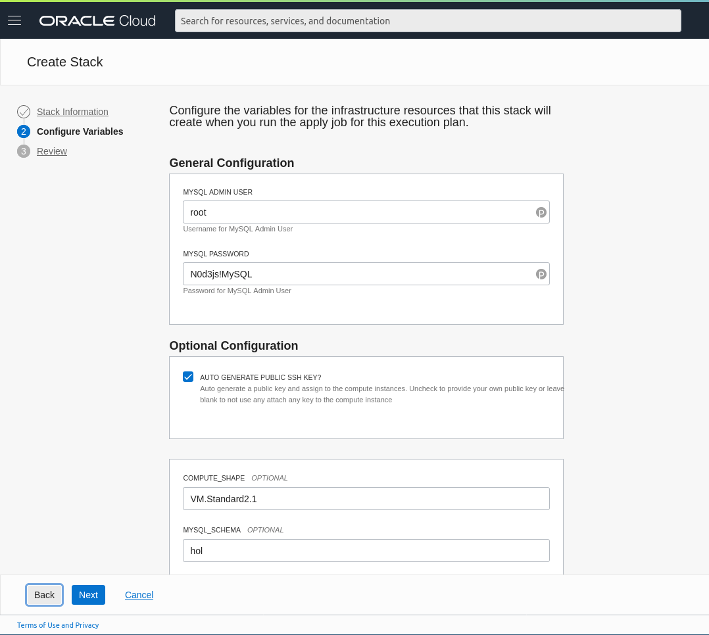
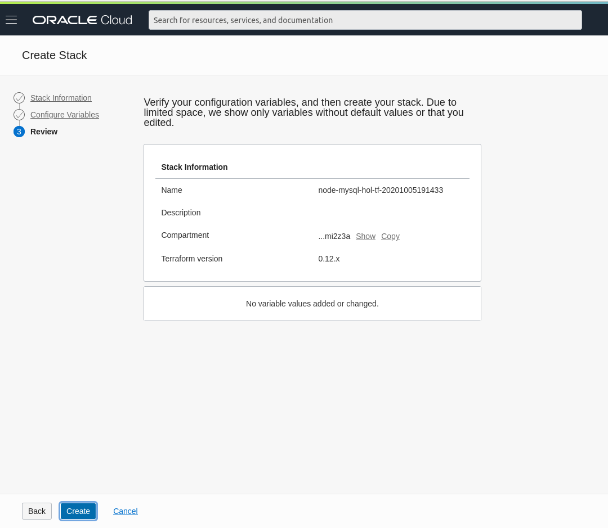
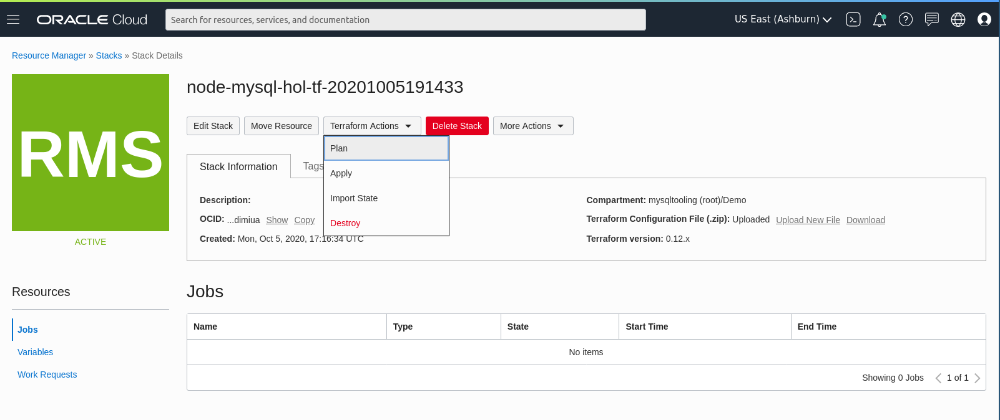
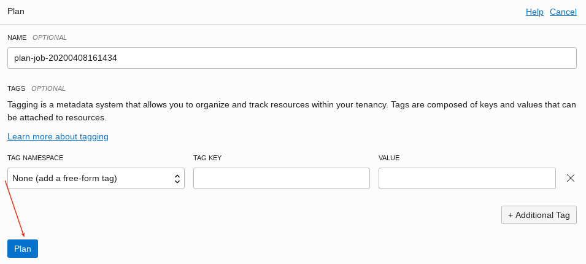
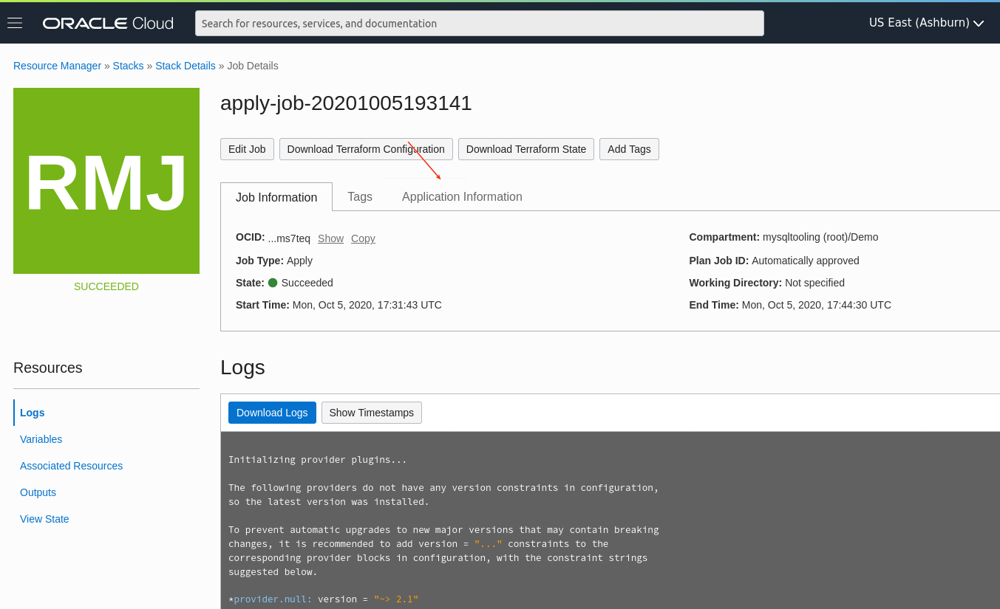
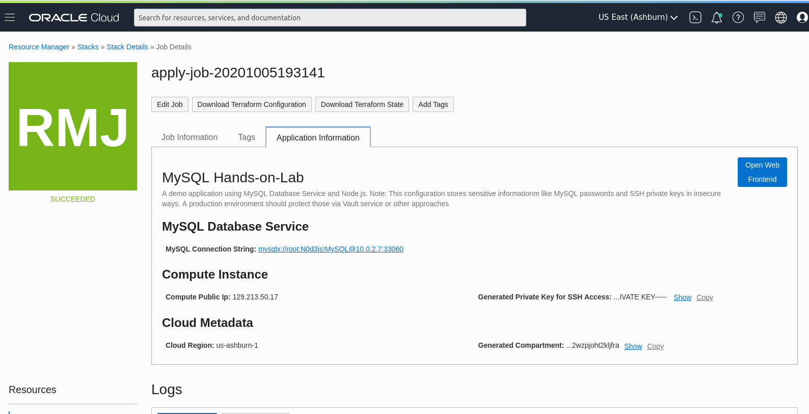

# Setup Cloud Environment

## Before You Begin
### Objectives
- Log into OCI tenancy.
- Setup your IAAS environment and create common components.
- Create a MySQL Database Service Instance

### Introduction

In Lab 1 (as Derek) you will initiate the Oracle cloud environment that you will use to create and deploy your microservices applications. This environment will be contained within a cloud Compartment, and communication within the Compartment will be via a Virtual Cloud Network (VCN). The Compartment and VCN will isolate and secure the overall environment. 

To deploy these services, you will be using Terraform, a tool for building, changing, and versioning infrastructure safely and efficiently. It is an important tool for anyone looking to standardize IaaS (Infrastructure as a Service) within their organization.

*We recommend that you create a notes page to write down all of the credentials you will need.*

## **Step 1:** Prepare your terraform script for execution

Terraform provides a reusable process for creating infrastructure.  In some cases, like this one, you don't have to know anything about how the process works. You can deploy different pre-designed infrastructure designs for many different purposes, which frees up users to focus on their projects.  This will create your cloud resources (VCN, Compute Image, Autonomous Transaction Processing Instance, among other things).

1.  We provide a downloadcontaining the Terraform configuration and sample code. You can download it from

TODO URL

2. Log into the Oracle Cloud and on the OCI console, click on the hamburger menu upper left and scroll down to **Solutions and Platform**. Hover over **Resource Manager** and click on **Stacks**.

   

3. Make sure the **Compartment** on the left side says root. If not, then change it to root. Then, click **Create Stack**.

  

4. Click on **Browse** and find the zipped **node-mysql-hol-tf.zip** file. Then, you can give your **Stack** a name (or accept default). You can also give a description if you'd like, but it is not necessary. Then click **Next**.

  

5. You can configure different variables on this screen. A password for the MySQL user is suggested. You can chage it according to your wishes, as long as you fulfill the requiremenst. **For this Hands-on-Lab the password will not be stored securly. Don't use a password you use elsewhere**.  Select Next.

  

8. Click **create**.  Note the screen will freeze for a few seconds before returning..be patient.

  

  

## **Step 2:** Create OCI Resources in Resource Manager

1. Now inside of the resource manager, hover over **Terraform Actions** and click on **Plan**.

  

2. You can give the plan a name, or keep the default. Then click on **Plan** to begin.

  

3. Wait for the plan to succeed.

  

4. Return to `Stacks` upper left, select your stack, and select **Terraform Actions** and click on **Apply**.

  

  

5. You can give the apply a name, or keep the default. You can leave the other settings the same. Then click on **Apply**.  **This will take about 15 minutes. Please be patient.**

  

  

6.  The job will take several minutes.  When it is complete scroll to the top and click **Application Information**. That screen will contain data you are going to need in next steps.

  

  

Copy the information from the different fields, so you have it available fot the next steps.

Please proceed to the next lab.

## Acknowledgements

- **Authors/Contributors** - Johannes Schlüter
- **Last Updated By/Date** - Johannes Schlüter, October 2020
- **Workshop Expiration Date** - October, 2021

## See an issue?
Please submit feedback using this [form](https://apexapps.oracle.com/pls/apex/f?p=133:1:::::P1_FEEDBACK:1). Please include the *workshop name*, *lab* and *step* in your request.  If you don't see the workshop name listed, please enter it manually. If you would like us to follow up with you, enter your email in the *Feedback Comments* section. 

