# Automatic Indexing

## Introduction
The automatic indexing feature automates index management tasks based on changes in the application workload. This feature improves database performance by managing indexes automatically in an Oracle database.

Traditionally, DBAs have been responsible to monitoring performance and deciding when and where to add, change or remove indexes in a tactical and often ad-hoc manner. This ad-hoc approach to index maintenance is prone to error because it is almost impossible to quantify the effect any change – both positive and negative. This may lead to a database that has many more indexes than necessary, where indexes have been gradually added over time and there is a reluctance to remove any of them for fear of negative consequences. This will lead to an increase the system resources required to maintain indexes when data is modified and processed. In addition, over-indexed environments often suffer from less stable SQL execution plans as the sheer number of indexes make the  optimizer's choice of index access path more and more finely balanced.

Automatic indexing addresses these issues. It is not a simple advisor, but instead it is an expert system that implements indexes based on what a performance engineer skilled in index tuning would do. The Oracle Database analyzes the application workload and identifies the queries that will benefit from additional indexes. In other words, it identifies candidate indexes and validates them before implementation, and the entire process is fully automatic.
Here is a summary of the workflow:
  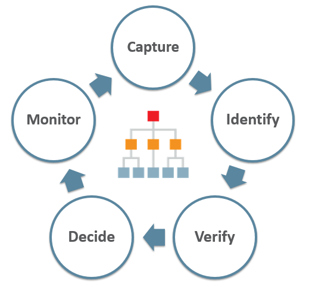

### Objectives

-   Learn how to enable Automatic Indexing in the Oracle Database
-   Learn how Automatic Indexing manages indexes in the Oracle Database
-   Learn how to validate Automatic Index operations

### Lab Prerequisites
This Lab can ONLY be run on Exadata environments; attempting to enable Automatic Indexing on non-Exadata systems will result in an error.

This lab assumes you have completed the following labs:
* Lab: Login to Oracle Cloud
* Lab: Generate SSH Key
* Lab: Setup

### Lab Preview

Watch the video below to get an explanation of enabling the Automatic Indexing feature.

  

## Step 1: Verify sample data and drop indexes
Index structures are an essential feature to database performance. Indexes are critical for OLTP applications, which use large data sets and run millions of SQL statements a day. Indexes are also critical for data warehousing applications, which typically query a relatively small amount of data from very large tables. If you do not update the indexes whenever there are changes in the application workload, the existing indexes can cause the database performance to deteriorate considerably.

Automatic indexing improves database performance by managing indexes automatically and dynamically  based on changes in the application workload. To test this feature, we will start by listing and dropping existing indexes in our sample schema. This way we can experience, in a very simple hands-on exercise, how this feature works in Oracle 19c Database.

This Lab will use the Sales History (SH) sample schema. Use SQLPlus to connect to the PDB01 Pluggable database as SYS

```
<copy>
    sudo su - oracle
    . oraenv [ORCL]
	  sqlplus sys/Ora_DB4U@localhost:1521/orclpdb
</copy>
```
List all existing indexes in the SH schema

```
<copy>
    set linesize 120
    column table_name format a30
    column  index_name format a30
    column  index_type format a25
    column  last_analyzed format a25
    select table_name,index_name,index_type,last_analyzed from dba_indexes where table_owner = 'SH';
</copy>
```
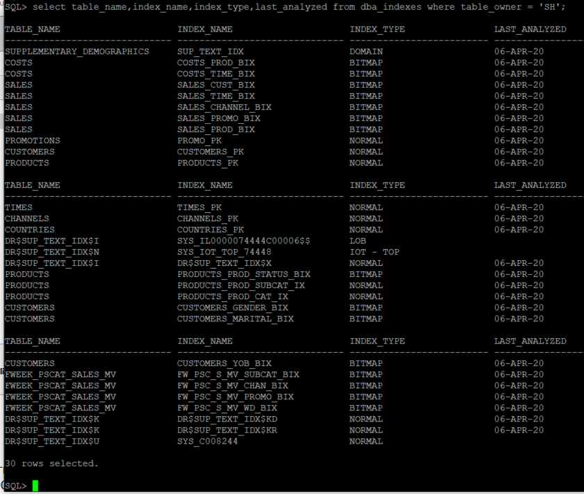

For the purpose of this exercise we will drop all existing secondary indexes. DO NOT DO THIS ON ANY PRODUCTION SYSTEM

```
<copy>
	drop index  SH.COSTS_PROD_BIX;
    drop index  SH.COSTS_TIME_BIX;
    drop index  SH.SALES_PROD_BIX;
    drop index  SH.SALES_CUST_BIX;
    drop index  SH.SALES_TIME_BIX;
    drop index  SH.SALES_CHANNEL_BIX;
    drop index  SH.SALES_PROMO_BIX;
    drop index  SH.PRODUCTS_PROD_SUBCAT_IX;
    drop index  SH.PRODUCTS_PROD_CAT_IX;
    drop index  SH.PRODUCTS_PROD_STATUS_BIX;
    drop index  SH.CUSTOMERS_GENDER_BIX;
    drop index  SH.CUSTOMERS_MARITAL_BIX;
    drop index  SH.CUSTOMERS_YOB_BIX;
    drop index  SH.FW_PSC_S_MV_SUBCAT_BIX;
    drop index  SH.FW_PSC_S_MV_CHAN_BIX;
    drop index  SH.FW_PSC_S_MV_PROMO_BIX;
    drop index  SH.FW_PSC_S_MV_WD_BIX;
</copy>
```
Gather SH schema statistics

```
  <copy>
    exec dbms_stats.gather_schema_stats(ownname => 'SH', estimate_percent => DBMS_STATS.AUTO_SAMPLE_SIZE, method_opt => 'FOR ALL COLUMNS SIZE  AUTO', degree => 4);
  </copy>
```

## Step 2: Logging In and Examining Schema

1.  All scripts for this lab are stored in the labs/new-features-for-developers/automaticindexing folder and are run as the oracle user.  Let's navigate there now.  We recommend you type the commands to get a feel for working with In-Memory. But we will also allow you to copy the commands via the COPY button.

```
    <copy>
    sudo su - oracle
    cd ~/labs/new-features-for-developers/automaticindexing
    ls
    </copy>
```

2. Automatic Indexing is integrated into Oracle Database 19c and higher.  Automatic indexing requires little to no manual intervention, but a package called DBMS_AUTO_INDEX package is provided for changing a small number of defaults.
Create a new tablespace and make this the default for Automatic Indexing (Note that this is not necessary - it is just to illustrate use)

```
     <copy>
    . oraenv
    ORCL
    sqlplus SYS/Ora_DB4U/localhost:1521/orclpdb as sysdba

    CREATE TABLESPACE TBS_AUTO_IDX
    DATAFILE '/u01/app/oracle/oradata/DEVCDB/PDB01/tbs_auto_idx01.dbf'
    SIZE 200M REUSE
    AUTOEXTEND ON
    NEXT 50M MAXSIZE 10G;

	   exec DBMS_AUTO_INDEX.CONFIGURE('AUTO_INDEX_DEFAULT_TABLESPACE','TBS_AUTO_IDX');
     </copy>
```

    Note that AUTOMATIC INDEXING can only be enabled on EXADATA systems. Attempting to enable Automatic Indexing on non-EXADATA machines will result in ORA-40216


3.  Enter the commands to enable Automatic Indexing

```
    <copy>
    exec DBMS_AUTO_INDEX.CONFIGURE('AUTO_INDEX_MODE','IMPLEMENT');
    </copy>

```

There are three possible values for AUTO_INDEX_MODE configuration setting: OFF (default), IMPLEMENT, and REPORT ONLY.
   - OFF disables automatic indexing in a database, so that no new auto indexes are created, and the existing auto indexes are disabled.
   - IMPLEMENT enables automatic indexing in a database and creates any new auto indexes as visible indexes, so that they can be used in SQL statements.
   - REPORT ONLY enables automatic indexing in a database, but creates any new auto indexes as invisible indexes, so that they cannot be used in SQL statements.

## Step 3:Add Schemas

The Oracle environment is already set up so sqlplus can be invoked directly from the shell environment. Since the lab is being run in a pdb called ORCLPDB you must supply this alias when connecting to the SH account.

1.  Login to the pdb as the SH user.  

```
    <copy>
    sqlplus sh/Ora_DB4U@localhost:1521/orclpdb

    set linesize 120
    column parameter_name format a35
    column parameter_value format a30
    column last_modified format a30
    column modified_by format a20
    </copy>
```

2.  View configuration details

```
    <copy>
    --QUERY
    select * from DBA_AUTO_INDEX_CONFIG;
    </copy>
```


When automatic indexing is enabled in a database, all the schemas in the database can use auto indexes by default.	 

3.  Enable Automatic Indexing for a specific schema

It is possible to specify which schemas are subject to auto indexing. The following statement add the HR schema to the exclusion list, so that the HR schema cannot use auto indexes.

```
    <copy>
    exec DBMS_AUTO_INDEX.CONFIGURE('AUTO_INDEX_SCHEMA', 'HR', FALSE);
    </copy>
```


The following statement removes all of the schemas from the exclusion list. All schemas in the database can use auto indexes.

```
    <copy>
    exec DBMS_AUTO_INDEX.CONFIGURE('AUTO_INDEX_SCHEMA', NULL, TRUE);
    </copy>
```

 Enable Automatic Indexxing for the SH and OE schemas. The following statement restricts Automatci Indexing to these named schemas:

 ```
    <copy>
    exec DBMS_AUTO_INDEX.CONFIGURE('AUTO_INDEX_SCHEMA', 'OE', TRUE);
    exec DBMS_AUTO_INDEX.CONFIGURE('AUTO_INDEX_SCHEMA', 'SH', TRUE);
    </copy>
```

Query DBA_AUTO_INDEX_CONFIG again to confirm:

```
    <copy>
    --QUERY

    select * from DBA_AUTO_INDEX_CONFIG;
    </copy>
```


4.  Generate a report on Automatic Indexing operations

   You can generate reports related to automatic indexing operations in an Oracle database using the REPORT_ACTIVITY and REPORT_LAST_ACTIVITY functions of the DBMS_AUTO_INDEX package.

```
    <copy>
    set linesize 120 trims on pagesize 1000 long 100000
    column REPORT format a120

    select DBMS_AUTO_INDEX.REPORT_ACTIVITY(sysdate-30,NULL,'text','all','all') REPORT from DUAL;
    </copy>
```


This sample report will show Automatci Indexes activity for the last 30 days. If Automatci Indexing were OFF during this time, there may be minimal or no iformation.	 

## Step 4: Run a workload

Automatic indexing can work with data for OLTP applications, which use large data sets and run millions of SQL statements a day, as well as with data for data warehousing applications.
In this Lab, we don’t have ay application running on our database, so we will generate a synthetic workload manually.

1. Create a DUMMY table

```
    <copy>
    sqlplus sh/Ora_DB4U@localhost:1521/orclpdb

	  drop table temp_ai purge;   
    create table temp_ai(c number, d varchar2(1000));
    </copy>
```

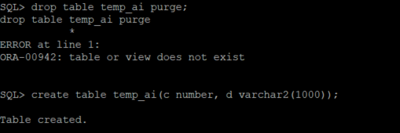

2.  Insert data in to your newly created tables

```
    <copy>
    begin
      for i in 1..20000 loop
        insert into temp_ai values(-i,'aaaaaaaaaaaaaaaaaaaaaaaaaaaaaaaaaaaaaaaaaaaaaaaaaaaaaaaaaaaaaaaaaaaaaaaaaaaaaaaaaaaaaaaaaaaaaaaaaaaaaaaaaaaaaaaaaaaaaaaaaaaaaaaaaaaaaaaaaaaaaaaaaaaaaaaaaaaaaaaaaaaaaaaaaaaaaaaaaaaaaaaaaaaaaaaaaaaaaaaaaaaaaaaaaaaaaaaaaaaaaaaaaaaaaaaaaaaaaaaaaaaaaaaaaaaaaaaaaaaaaaaaaaaaaaaaaaaaaaaaaaaaaaaaaaaaaaaaaaaaaaaaaaaaaaaaaaaaaaaaaaaaaaaaaaaaaaaaaaaaaaaaaaaaaaaaaaaaaaaaaaaaaaaaaaaaaaaaaaaaaaaaaaaaaaaaaaaaaaaaaaaaaaaaaaaaaaaaaaaaaaaaaaaaaaaaaaaaaaaaaaaaaaaaaaaaaaaaaaaaaaaaaaaaaaaaaaaaaaaaaaaaaaaaaaaaaaaaaaaaaaaaaaaaaaaaaaaaaaa');
      end loop;
      commit;
    end;
    /
    </copy>
```


3. Copy the CUSTOMERS table using CTAS

```
    <copy>
    drop table customers_ai purge;
	  create table customers_ai as select * from sh.customers;
    </copy>
```


Now you have some tables you can modify, and at the same time some OLTP workload was generated on our database. You can check how automatic indexing feature reacts to this type of workload, but before doing that it is recommended to gather statistics.

```
    <copy>
    execute dbms_stats.gather_schema_stats(ownname => 'SH', estimate_percent=> DBMS_STATS.AUTO_SAMPLE_SIZE, method_opt => 'FOR ALL COLUMNS SIZE  AUTO', degree => 4);
    </copy>
```


## Step 5: View Advisor Tasks

DBA_ADVISOR_TASKS displays information about all tasks in the database. The view contains one row for each task. Each task has a name that is unique to the owner. We are interested in the STATUS of the task named SYS_AUTO_INDEX_TASK. This STATUS can be:
- INITIAL - Initial state of the task; no recommendations are present.
- EXECUTING - Task is currently running.
- INTERRUPTED - Task analysis was interrupted by the user. Recommendation data, if present, can be viewed and reported at this time.
- COMPLETED - Task successfully completed the analysis operation. Recommendation data can be viewed and reported.
- ERROR - An error occurred during the analysis operation. Recommendations, if present, can be viewed and reported at this time.

View the advisory

```
    <copy>
	  set lines 100
	  column task_name format a32
    column description format a28
    column advisor_name format a28
    column execution_start format a18
    column execution_end format a18
    column status format a12

	  select task_name,description,advisor_name,execution_start,status
    from dba_advisor_tasks;
    </copy>
```


Filter the query to focus on SYS_AUTO_INDEX_TASK. This task is run by default every 15 minutes.

```
    <copy>
    select to_char(execution_start, 'DD-MM-YY HH24:MI:SS') execution_start,
      to_char(execution_end, 'DD-MM-YY HH24:MI:SS') execution_end,
      status
    from dba_advisor_executions where task_name='SYS_AUTO_INDEX_TASK';
    </copy>
```

## Step 6 Generate Workload

Automatic indexing improves database performance by managing indexes automatically and dynamically in an Oracle database based on changes in the application workload. This is why we need more workload on our Pluggable Database ORCLPDB, to simulate changes in the application workload.

1. The following sample code will operate against the data in the SH schema. Execute these blocks of code from SQLPlus (or SQLCI or SQLDeveloper if you have these installed)

```
    <copy>
    sqlplus sh/Ora_DB4U@localhost:1521/order

	set serveroutput on
	set timing on
    </copy>
```

A query executed multiple times in a FOR LOOP (stored as file /home/oracle/labs/new-features-for-developers/automaticindexing/ai_query1.sql)

```
    <copy>
    begin
    for i in 1..20 loop
      FOR sales_data IN (
      SELECT ch.channel_class, c.cust_city, t.calendar_quarter_desc, SUM(s.amount_sold) sales_amount
      FROM sh.sales s, sh.times t, sh.customers c, sh.channels ch
      WHERE s.time_id = t.time_id AND s.cust_id = c.cust_id AND s.channel_id = ch.channel_id
      AND c.cust_state_province = 'CA' AND ch.channel_desc in ('Internet','Catalog')
      AND t.calendar_quarter_desc IN ('1999-01','1999-02')
      GROUP BY ch.channel_class, c.cust_city, t.calendar_quarter_desc)
      LOOP  
        DBMS_OUTPUT.PUT_LINE('Sales data: ' || sales_data.channel_class || ' ' || sales_data.cust_city || ' '  || sales_data.calendar_quarter_desc || ' ' || sales_data.sales_amount);
      END LOOP;
    end loop;
    end;
    /
     </copy>
```

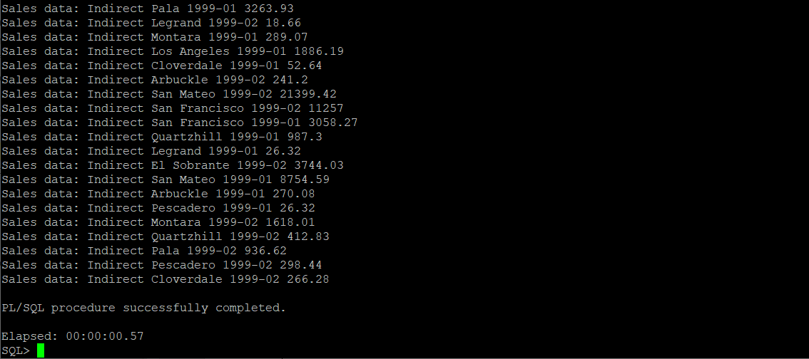 	 

2. Similar query selecting from different quarters (file /home/oracle/labs/new-features-for-developers/automaticindexing/ai_query2.sql):

```
    <copy>
    begin
    for i in 1..20 loop
      FOR sales_data IN (
      SELECT ch.channel_class, c.cust_city, t.calendar_quarter_desc, SUM(s.amount_sold) sales_amount
      FROM sh.sales s, sh.times t, sh.customers c, sh.channels ch
      WHERE s.time_id = t.time_id AND s.cust_id = c.cust_id AND s.channel_id = ch.channel_id
      AND c.cust_state_province = 'CA' AND ch.channel_desc in ('Internet','Catalog')
      AND t.calendar_quarter_desc IN ('1999-03','1999-04')
      GROUP BY ch.channel_class, c.cust_city, t.calendar_quarter_desc)
      LOOP  
        DBMS_OUTPUT.PUT_LINE('Sales data: ' || sales_data.channel_class || ' ' || sales_data.cust_city || ' '  || sales_data.calendar_quarter_desc || ' ' || sales_data.sales_amount);
      END LOOP;
    end loop;
    end;
    /
     </copy>
```

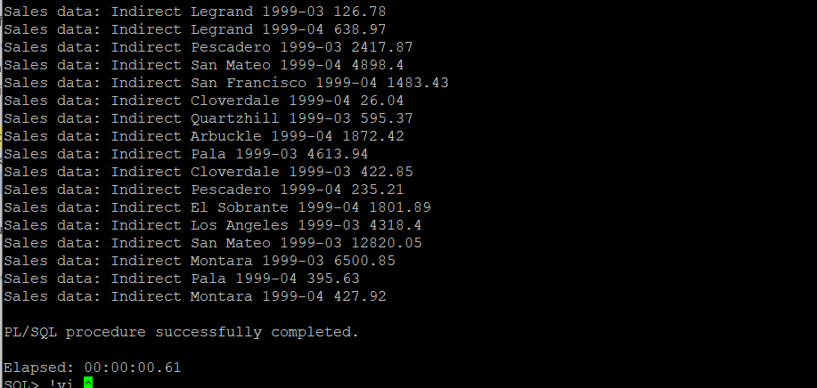

3. Run the code blocks repeatedly from within SQLPlus (file /home/oracle/labs/new-features-for-developers/automaticindexing/ai_query3.sql)

```
    <copy>
    begin
      for i in 1..20 loop
        FOR sales_data IN (
        SELECT c.country_id, c.cust_city, c.cust_last_name
        FROM sh.customers c
        WHERE c.country_id in (52790, 52798)
        ORDER BY c.country_id, c.cust_city, c.cust_last_name)
        LOOP  
          DBMS_OUTPUT.PUT_LINE('Sales data: ' || sales_data.country_id || ' ' || sales_data.cust_city || ' '  || sales_data.cust_last_name);
        END LOOP;
      end loop;
    end;
    /
     </copy>
```

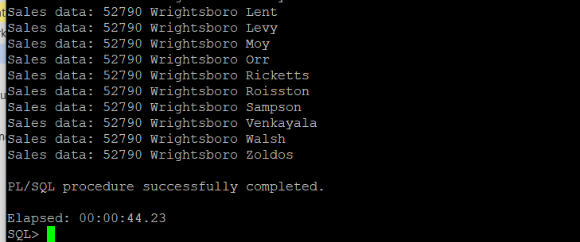

4. You can also run queries against the new tables we created earlier. (file /home/oracle/labs/new-features-for-developers/automaticindexing/ai_query4.sql)

```
    <copy>
    begin
      for i in 1..20 loop
        FOR sales_data IN (
        select /* func_indx */ count(*) howmany from temp_ai where abs(c)=5)
        LOOP  
          DBMS_OUTPUT.PUT_LINE('Sales data: ' || sales_data.howmany);
        END LOOP;
      end loop;
    end;
    /
     </copy>
```

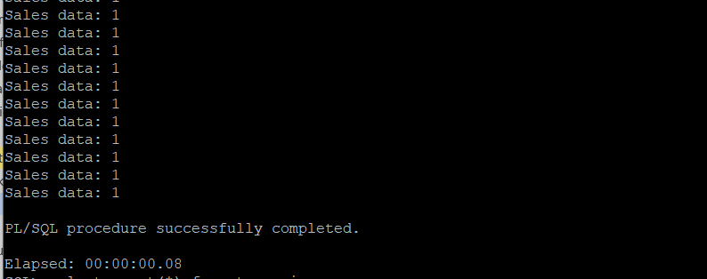

5. These tables will be also used to identify candidate indexes, and we gathered optimizer statistics after their creation. (file /home/oracle/labs/new-features-for-developers/automaticindexing/ai_query5.sql)

```
    <copy>
    begin
      for i in 1..20 loop
        FOR sales_data IN (
          SELECT * FROM customers_ai WHERE cust_state_province = 'CA')
          LOOP  
          DBMS_OUTPUT.PUT_LINE('Sales data: ' || sales_data.CUST_FIRST_NAME || ' ' || sales_data.CUST_LAST_NAME || ' '  || sales_data.CUST_EMAIL);
          END LOOP;
        end loop;
    end;
    /
     </copy>
```

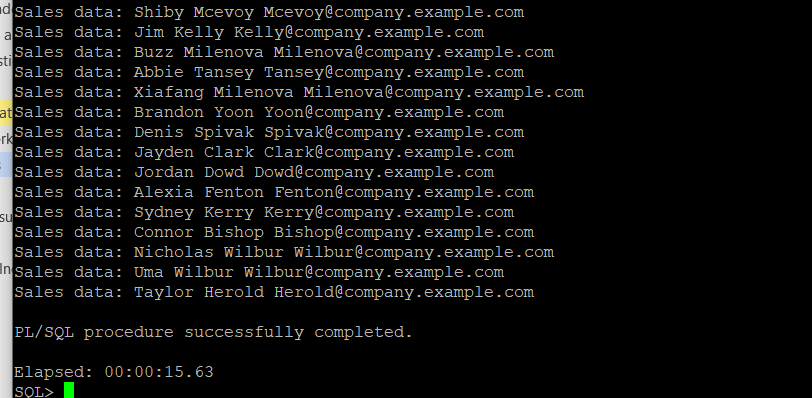

6. Automatic indexing is also capable of handling advanced business intelligence queries.

Here is an example of an advanced analytical SQL statement. This query returns the percent change in market share for a grouping of SH top 20% of products for the current three-month period versus same period one year ago for accounts that grew by more than 20 percent in revenue.
(available in file  /home/oracle/labs/new-features-for-developers/automaticindexing/ai_change_market_share.sql)

```
<copy>
WITH prod_list AS ( SELECT prod_id prod_subset, cume_dist_prod
  FROM ( SELECT s.prod_id, SUM(amount_sold),CUME_DIST() OVER (ORDER BY SUM(amount_sold)) cume_dist_prod
  FROM sales s, customers c, channels ch,  products p, times t
  WHERE s.prod_id = p.prod_id AND p.prod_total_id = 1 AND
    s.channel_id = ch.channel_id AND ch.channel_total_id = 1 AND
    s.cust_id = c.cust_id AND
    s.promo_id = 999 AND
    s.time_id  = t.time_id AND t.calendar_quarter_id = 1776 AND
    c.cust_city_id IN
  (SELECT cust_city_id FROM
  (SELECT cust_city_id, ((new_cust_sales - old_cust_sales) / old_cust_sales ) pct_change, old_cust_sales
   FROM
  (SELECT cust_city_id, new_cust_sales, old_cust_sales
    FROM
  ( SELECT cust_city_id,
    SUM(CASE WHEN t.calendar_quarter_id = 1776
    THEN amount_sold  ELSE  0  END ) new_cust_sales,
    SUM(CASE WHEN t.calendar_quarter_id = 1772
    THEN amount_sold ELSE 0 END) old_cust_sales
    FROM sales s, customers c, channels ch, products p, times t
    WHERE s.prod_id = p.prod_id AND p.prod_total_id = 1 AND
        s.channel_id = ch.channel_id AND ch.channel_total_id = 1 AND
        s.cust_id = c.cust_id AND c.country_id = 52790 AND
        s.promo_id = 999 AND
        s.time_id  = t.time_id AND
       (t.calendar_quarter_id = 1776 OR t.calendar_quarter_id =1772)
    GROUP BY cust_city_id) cust_sales_wzeroes
    WHERE old_cust_sales > 0)  cust_sales_woutzeroes)
    WHERE old_cust_sales > 0 AND  pct_change >= 0.20)
    GROUP BY s.prod_id )  prod_sales                    
    WHERE cume_dist_prod > 0.8 ) SELECT  prod_id, ( (new_subset_sales/new_tot_sales) - (old_subset_sales/old_tot_sales) ) *100  share_changes
    FROM ( SELECT  prod_id,
       SUM(CASE WHEN t.calendar_quarter_id = 1776
       THEN amount_sold  ELSE  0  END )  new_subset_sales,
       (SELECT SUM(amount_sold) FROM sales s, times t, channels ch,
            customers c, countries co, products p
        WHERE s.time_id  = t.time_id AND t.calendar_quarter_id = 1776 AND
          s.channel_id = ch.channel_id AND ch.channel_total_id = 1 AND
          s.cust_id = c.cust_id AND
          c.country_id = co.country_id AND co.country_total_id = 52806 AND
          s.prod_id = p.prod_id AND p.prod_total_id = 1 AND
          s.promo_id = 999
        )   new_tot_sales,
     SUM(CASE WHEN t.calendar_quarter_id = 1772
    THEN amount_sold  ELSE  0  END)  old_subset_sales,
      (SELECT SUM(amount_sold) FROM sales s, times t, channels ch,
          customers c, countries co, products p
       WHERE s.time_id  = t.time_id AND t.calendar_quarter_id = 1772 AND
         s.channel_id = ch.channel_id AND ch.channel_total_id = 1 AND
         s.cust_id = c.cust_id AND
         c.country_id = co.country_id AND co.country_total_id = 52806 AND
         s.prod_id = p.prod_id AND p.prod_total_id = 1 AND
         s.promo_id = 999
      )   old_tot_sales
 FROM sales s, customers c, countries co, channels ch, times t
 WHERE s.channel_id = ch.channel_id AND ch.channel_total_id = 1 AND
       s.cust_id = c.cust_id AND
       c.country_id = co.country_id AND co.country_total_id = 52806 AND
       s.promo_id = 999 AND
       s.time_id  = t.time_id AND
      (t.calendar_quarter_id = 1776 OR t.calendar_quarter_id = 1772)
         AND s.prod_id IN
     (SELECT prod_subset FROM prod_list)
     GROUP BY prod_id);
</copy>
```

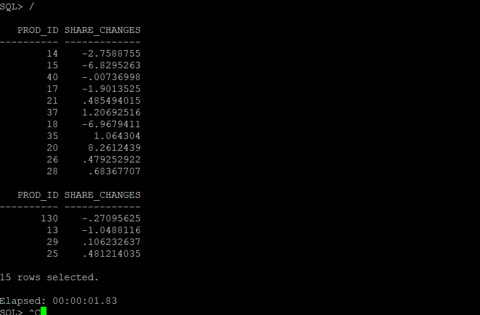

7. Calculate a sales projection

You can build a query that projects sales for 2002 based on the sales of 2000 and 2001. Firtsly, finds the most percentage changes in sales from 2000 to 2001 and then adds that to the sales of 2002. You can build a subclause that finds the monthly sales per product by country for the years 2000, 2001, and 2002, and then a second subclause finds a list of distinct times at the month level.

First create a reference table of currency conversion factors (file /home/oracle/labs/new-features-for-developers/automaticindexing/ai_cr_curr_conv.sql):

```
    <copy>
    CREATE TABLE currency (
    country         VARCHAR2(20),
    year            NUMBER,
    month           NUMBER,
    to_us           NUMBER);
    </copy>
```


Populate the table with conversion factors for each month for each country (file /home/oracle/labs/new-features-for-developers/automaticindexing/ai_ins_curr_conv.sql):

```
    <copy>
    INSERT INTO currency
    (SELECT distinct
     SUBSTR(country_name,1,20), calendar_year, calendar_month_number, 1
     FROM countries
     CROSS JOIN times t
     WHERE calendar_year IN (2000,2001,2002)
    );
    </copy>
```

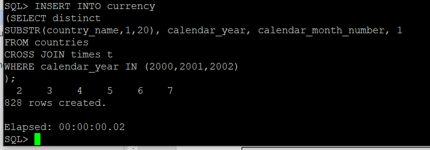

For this example we will only set the conversion factor for "Canada"

```
    <copy>
    UPDATE currency set to_us=.74 WHERE country='Canada';
    </copy>
```

Build the sales projection query (file /home/oracle/labs/new-features-for-developers/automaticindexing/ai_sales_proj.sql):

```
    <copy>
    WITH  prod_sales_mo AS ( SELECT country_name c, prod_id p, calendar_year  y,
    calendar_month_number  m, SUM(amount_sold) s
    FROM sales s, customers c, times t, countries cn, promotions p, channels ch
    WHERE  s.promo_id = p.promo_id AND p.promo_total_id = 1 AND
       s.channel_id = ch.channel_id AND ch.channel_total_id = 1 AND
       s.cust_id=c.cust_id  AND
       c.country_id=cn.country_id AND country_name='Canada' AND
       s.time_id=t.time_id  AND t.calendar_year IN  (2000, 2001,2002)
    GROUP BY cn.country_name, prod_id, calendar_year, calendar_month_number
    ), time_summary AS( SELECT DISTINCT calendar_year cal_y, calendar_month_number cal_m
    FROM times
    WHERE  calendar_year IN  (2000, 2001, 2002) )
    SELECT c, p, y, m, s,  nr FROM (
    SELECT c, p, y, m, s,  nr
    FROM prod_sales_mo s
    PARTITION BY (s.c, s.p)
    RIGHT OUTER JOIN time_summary ts ON (s.m = ts.cal_m AND s.y = ts.cal_y )
    MODEL REFERENCE curr_conversion ON
      (SELECT country, year, month, to_us
      FROM currency)
      DIMENSION BY (country, year y,month m) MEASURES (to_us)
      PARTITION BY (s.c c)
      DIMENSION BY (s.p p, ts.cal_y y, ts.cal_m m)
      MEASURES (s.s s, CAST(NULL AS NUMBER) nr, s.c cc )
      RULES ( nr[ANY, ANY, ANY]
       = CASE WHEN s[CV(), CV(), CV()] IS NOT NULL
       THEN s[CV(), CV(), CV()]
       ELSE ROUND(AVG(s)[CV(), CV(), m BETWEEN 1 AND 12],2)
       END, nr[ANY, 2002, ANY] = ROUND(
		 ((nr[CV(),2001,CV()] - nr[CV(),2000, CV()])/ nr[CV(),2000, CV()]) * nr[CV(),2001, CV()]
           + nr[CV(),2001, CV()],2),nr[ANY,y != 2002,ANY]
         = ROUND(nr[CV(),CV(),CV()]
           * curr_conversion.to_us[ cc[CV(),CV(),CV()], CV(y), CV(m)], 2) )
    ORDER BY c, p, y, m)
    WHERE y = '2002'
    ORDER BY c, p, y, m;
    </copy>
```

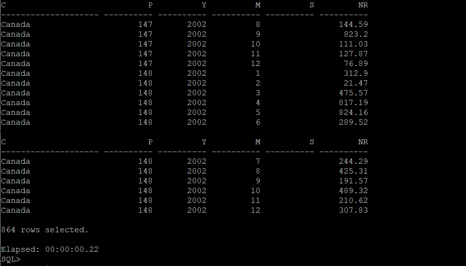

Commit all results

```
    <copy>
    commit;
    </copy>
```

## Step 7: Automatic Indexing Results

In this section you will look at how Automatic Indexing has worked to improve the performance of your queries.

1. Connect to ORCLPDB as SYS

```
    <copy>
    sqlplus sys/Ora_DB4U@localhost:1521/orclpdb as sysdba
    </copy>
```

2. Query DBA_ADVISOR_EXECUTIONS for information on Automatic Indexing task executions

```
    <copy>
    select to_char(execution_start, 'DD-MM-YY HH24:MI:SS') execution_start,
    to_char(execution_end, 'DD-MM-YY HH24:MI:SS') execution_end, status
    from dba_advisor_executions where task_name='SYS_AUTO_INDEX_TASK';
    </copy>
```

Note: Wait and make sure another automatic indexing task was executed since the last time we queried this view, by comparing the starting time of the last entry with the starting time we saved in the previous section.

3. Validate Automatic Indexing

Automatic indexing process runs in the background periodically at a predefined time interval, default is 15 minutes. It analyzes application workload, and accordingly creates new indexes and drops the existing underperforming indexes to improve database performance. It also rebuilds the indexes that are marked unusable due to table partitioning maintenance operations, such as ALTER TABLE MOVE.

Count all VALID and VISIBLE indexes in the SH schema, that are auto indexes (AUTO = ‘YES’).

```
    <copy>
    select count(*)
    from dba_indexes
    where auto = 'YES'
      and visibility = 'VISIBLE'
      and status = 'VALID'
      and table_owner = 'SH';
    </copy>
```

If everything was executed accurately following this guide, there are new auto indexes in our SH schema.
Note: If there are no valid visible new indexes, please run the workload again (Step 6) as SH user, and then re-run the query above (of DBA_INDEXES) as SYSDBA.

4. List all of the indexes, including any newly created AUTO indexes

```
  <copy>
  set linesize 120
  column table_name format a30
  column  index_name format a30
  column  index_type format a25
  column  last_analyzed format a25

  select table_name,index_name,index_type,last_analyzed
	from dba_indexes where table_owner = 'SH';
  </copy>
```

Identify the auto indexes for the list. Observe the tables on which these indexes have been Ireated, and their types.

5. Generate Automatic Indexing Report

Automatic Indexing provides PL/SQL APIs for configuring automatic indexing in a database and generating reports related to automatic indexing operations.

Run the activity report:

```
    <copy>
    set linesize 120 trims on pagesize 1000 long 100000
    column REPORT format a120

    select DBMS_AUTO_INDEX.REPORT_ACTIVITY(sysdate-30, NULL, 'text', 'all', 'all') REPORT from DUAL;
    </copy>
```

Sample output of the activity report:


| REPORT                                                                       |
|----------------------------------------------------------------------------- |
| GENERAL INFORMATION                                                          |
| ---------------------------------------------------------------------------- |
| Activity start 	      : 20-MAR-2020 15:01:30                                 |
| Activity end		      : 19-APR-2020 15:01:30                                 |
| Executions completed	      : 115                                            |
| Executions interrupted       : 0                                             |
| Executions with fatal error  : 2                                             |
| ---------------------------------------------------------------------------- |
|                                                                              |

| SUMMARY (AUTO INDEXES)                                                       |
| ---------------------------------------------------------------------------- |
| Index candidates			       : 18                                            |
| Indexes created (visible / invisible): 9 (5 / 4)                             |
| Space used (visible / invisible): 85 MB (6.49 MB / 78.51 MB)                 |
| Indexes dropped: 0                                                           |
| SQL statements verified: 34                                                  |
| SQL statements improved (improvement factor): 4 (2.7x)                       |
| SQL plan baselines created: 0                                                |
| Overall improvement factor: 1.8x                                             |

| SUMMARY (MANUAL INDEXES)                                                     |
| ---------------------------------------------------------------------------- |
| Unused indexes    : 0                                                        |
| Space used	   : 0 B                                                         |
| Unusable indexes  : 0                                                        |

| INDEX DETAILS                                                                |
| ---------------------------------------------------------------------------- |
| 1. The following indexes were created:                                       |
| *: invisible                                                                 |


| Owner   | Table        | Index                  | Key                        | Type   | Properties|
| --------| -------------| ---------------------- | ---------------------------| -------| --------- |
| AUTOIDX | CUSTOMERS_AI | * SYS_AI_cj7tna2ack2r6 | CUST_STATE_PROVINCE        | B-TREE | NONE      |
| SH      | CUSTOMERS    | SYS_AI_8urpdk6h1ujkh   | COUNTRY_ID                 | B-TREE | NONE      |
| SH      | CUSTOMERS    | SYS_AI_92r3r69avtpnj   | CUST_STATE_PROVINCE        | B-TREE | NONE      |
| SH      | CUSTOMERS    | SYS_AI_fz1fyu74a1f87   | CUST_CITY_ID               | B-TREE | NONE      |
| SH      | SALES        | * SYS_AI_5bcpzx4s8ts9j | CUST_ID                    | B-TREE | LOCAL     |
| SH      | SALES        | * SYS_AI_fkvdkj56j2q0a | TIME_ID,CHANNEL_ID,CUST_ID | B-TREE | LOCAL     |
| SH      | TIMES        | SYS_AI_7gxc48px5b52h   | CALENDAR_QUARTER_ID        | B-TREE | NONE      |
| SH      | TIMES        | * SYS_AI_829bv4n435ysa | TIME_ID,CALENDAR_QUARTER_DESC | B-TREE | NONE   |
| SH      | TIMES        | SYS_AI_c45r9rthxz31w   | CALENDAR_QUARTER_DESC      | B-TREE | NONE      |

| VERIFICATION DETAILS   |
| ---------------------- |
| Report continues       |


In this example report, automatic indexing identified 18 candidates, and created 9 indexes, 5 visible and 4 invisible.

Auto index candidates are identified based on the usage of table columns in SQL statements.

The auto index candidates are created as invisible auto indexes, that is, these auto indexes cannot be used in SQL statements.
The invisible auto indexes are validated against SQL statements. If the performance of SQL statements is improved by using these indexes, then the indexes are configured as visible indexes, so that they can be used in SQL statements.

If the performance of SQL statements is not improved by using these indexes, then the indexes are configured as unusable indexes and the SQL statements are blacklisted. The unusable indexes are later deleted by the automatic indexing process. The blacklisted SQL statements are not allowed to use auto indexes in future.

The auto indexes that are not used for a long period are dropped. No indexes were dropped in this example report.

Please review also the information in the Original Plan vs. Auto Index Plan comparison section. This comparison is performed using different metrics such as: Elapsed Time (s), CPU Time (s), or Optimizer Cost.

## Conclusion

In this Lab you had an opportunity to examine the Automatic Indexing capabilities of Oracle Database 19c.

## Acknowledgements

- **Author** - Jean-Francois Verrier
- **Last Updated By/Date** - Troy Anthony, April 2020

See an issue?  Please open up a request [here](https://github.com/oracle/learning-library/issues).   Please include the workshop name and lab in your request. 
