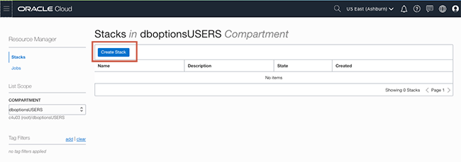
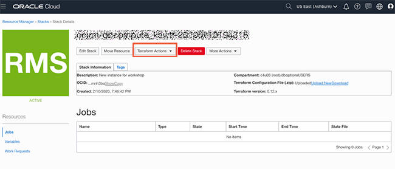
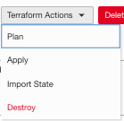
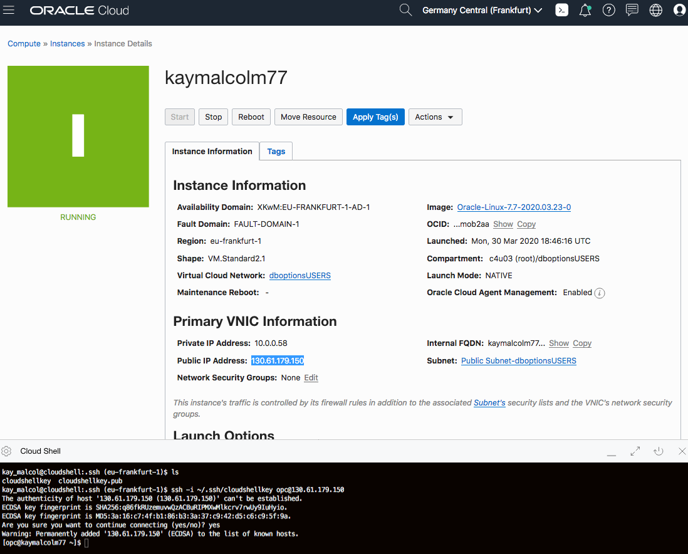

# Setup - SSWorkshop #

## Introduction
This lab will show you how to setup your environment using Oracle Resource Manager.  

## Step 1: Login and Create Stack using Resource Manager

To learn more about OCI Resource Manager, take a look at the video below.

[](youtube:udJdVCz5HYs)

You will be using Terraform to create your database environment.

1.  Click on the link below to download the zip file you need to build your enviornment.  
    - [db19c-terraform.zip](https://objectstorage.us-ashburn-1.oraclecloud.com/p/poImQ8CxHXLJ_ejOQ0GbO9kZyL6gwR1BV6WRS1Snz8M/n/c4u03/b/labfiles/o/db19c-terraform.zip) - Packaged terraform instance creation script

2.  Save in your downloads folder.

3.  Open up the hamburger menu in the left hand corner.  Choose **Resource Manager > Stacks**.   Choose the compartment from your email, click the  **Create Stack** button

    

    

    

    

6.  Click the **Browse** button and select the zip file (db19c-terraform.zip) that you downloaded. Click **Select**.

    


    Enter the following information and accept all the defaults

    - **Name**:  Enter your firstname and lastname and the day you were born (DO NOT ENTER ANY SPECIAL CHARACTERS HERE, including periods, underscores, exclamation etc, it will mess up the configuration and you will get an error during the apply process)

    - **Description**:  Same as above

    - **Compartment**:  Select Compartment from Email 2

7.  Click **Next**.

    

    Enter the following information. Some information may already be pre-populated.  Do not change the pre-populated info.  You will be updating Public Subnet, Display Name, AD (Availbility Domain) and SSH Key.

    **Public Subnet ID**:  Enter the subnet ID based on your region.   The subnets are provided in Email 2

    **Display Name:** Enter your firstname and lastname and the day you were born (do not enter any special characters here, including periods, it may mess up the configuration)

    **AD**: Enter 1, 2, or 3 based on your last name.  (A-J -> 1, K - M -> 2, N-Z -> 3)

    **SSH Public Key**:  Paste the public key you created in the earlier step (it should be one line)

8. Click **Next**.

    

9.  Your stack has now been created!  Now to create your environment.  *Note: If you get an error about an invalid DNS label, go back to your Display Name, please do not enter ANY special characters or spaces.  It will fail.*

    


## Step 2: Terraform Plan (OPTIONAL)
When using Resource Manager to deploy an environment, execute a terraform **plan** and **apply**.  Let's do that now.

1.  [OPTIONAL]Click **Terraform Actions** -> **Plan** to validate your configuration.  This takes about a minute, please be patient.

    

    

    


## Step 3: Terraform Apply
When using Resource Manager to deploy an environment, execute a terraform **plan** and **apply**.  Let's do that now.

1.  At the top of your page, click on **Stack Details**.  Click the button, **Terraform Actions** -> **Apply**.  This will create your instance and install Oracle 19c.
    

    

2.  Once this job succeeds, your environment is created!  Time to login to your instance to finish the configuration.


## Step 4: Connect to your instance

Choose the environment where you created your ssh-key in the previous lab (Generate SSH Key)

*NOTE:  You cannot connect while on VPN or in the Oracle office on clear-corporate (choose clear-internet).  Also, the ssh-daemon is disable for the first 5 minutes or so while the instance is processing.  If you are unable to connect and sure you have a valid key, wait a few minutes and try again.*

### Oracle Cloud Shell

1. To re-start the Oracle Cloud shell, go to your Cloud console and click the cloud shell icon to the right of the region.  *Note: Make sure you are in the region you were assigned*

    

2.  Go to **Compute** -> **Instance** and select the instance you created (make sure you choose the correct compartment)
3.  On the instance homepage, find the Public IP addresss for your instance.
4.  Enter the command below to login to your instance.    
    ````
    ssh -i ~/.ssh/<sshkeyname> opc@<Your Compute Instance Public IP Address>
    ````
5.  When prompted, answer **yes** to continue connecting.
6.  Continue to Step 5.

### MAC or Windows CYGWIN Emulator
1.  Go to **Compute** -> **Instance** and select the instance you created (make sure you choose the correct compartment)
2.  On the instance homepage, find the Public IP addresss for your instance.

3.  Open up a terminal (MAC) or cygwin emulator as the opc user.  Enter yes when prompted.

    ````
    ssh -i ~/.ssh/optionskey opc@<Your Compute Instance Public IP Address>
    ````
    

    

4.  After successfully logging in, proceed to Step 5.

### Windows using Putty

1.  Open up putty and create a new connection.

    ````
    ssh -i ~/.ssh/optionskey opc@<Your Compute Instance Public IP Address>
    ````
    

2.  Enter a name for the session and click **Save**.

    

3. Click **Connection** > **Data** in the left navigation pane and set the Auto-login username to root.

4. Click **Connection** > **SSH** > **Auth** in the left navigation pane and configure the SSH private key to use by clicking Browse under Private key file for authentication.

5. Navigate to the location where you saved your SSH private key file, select the file, and click Open.  NOTE:  You cannot connect while on VPN or in the Oracle office on clear-corporate (choose clear-internet).

    

6. The file path for the SSH private key file now displays in the Private key file for authentication field.

7. Click Session in the left navigation pane, then click Save in the Load, save or delete a stored session Step.

8. Click Open to begin your session with the instance.


## Step 5: Download the Setup Scripts

1.  Copy the following commands into your terminal.  These commands download the files needed to run the lab.

    Note: If you are running in windows using putty, ensure your Session Timeout is set to greater than 0

    ````
    <copy>
    cd /home/opc/
    wget https://objectstorage.us-ashburn-1.oraclecloud.com/p/CQFai9l6Lt2m9g6X3mYnfTJTWrv2Qh62-kPcw2GyRZw/n/c4u03/b/labfiles/o/multiscripts.zip
    unzip multiscripts.zip; chmod +x *.sh
    /home/opc/setupenv.sh
    </copy>
    ````

## Step 6: Run the DB19c Setup Scripts

1.  Copy the following commands into your terminal to configure DB19c on your image.  This script takes approximately 30 minutes to run.  It runs in the background so you should be able to exit out while it's running.  

    Note: If you are running in windows using putty, ensure your Session Timeout is set to greater than 0

    ````
    nohup /home/opc/setupdb.sh &> setupdb.out&
    ````
2.  To check the status of the script above run the command below.  This script takes about 30 minutes to complete.  You can also use the unix **jobs** command to see if the script is still running.

    ````
    tail -f /home/opc/setupdb.out
    ````

## Step 7: Install Sample Data

In this step you will install a selection of the Oracle Database Sample Schemas as covered by the following license agreement:
Oracle Database Sample Schemas

Copyright (c) 2019 Oracle

Permission is hereby granted, free of charge, to any person obtaining a copy of this software and associated documentation files (the "Software"), to deal in the Software without restriction, including without limitation the rights to use, copy, modify, merge, publish, distribute, sublicense, and/or sell copies of the Software, and to permit persons to whom the Software is furnished to do so, subject to the following conditions:

The above copyright notice and this permission notice shall be included in all copies or substantial portions of the Software.

THE SOFTWARE IS PROVIDED "AS IS", WITHOUT WARRANTY OF ANY KIND, EXPRESS OR IMPLIED, INCLUDING BUT NOT LIMITED TO THE WARRANTIES OF MERCHANTABILITY, FITNESS FOR A PARTICULAR PURPOSE AND NONINFRINGEMENT. IN NO EVENT SHALL THE AUTHORS OR COPYRIGHT HOLDERS BE LIABLE FOR ANY CLAIM, DAMAGES OR OTHER LIABILITY, WHETHER IN AN ACTION OF CONTRACT, TORT OR OTHERWISE, ARISING FROM, OUT OF OR IN CONNECTION WITH THE SOFTWARE OR THE USE OR OTHER DEALINGS IN THE SOFTWARE.

By completing the instruction below the sample schemas **SH**, **OE**, and **HR** will be installed. These schemas are used in Oracle documentation to show SQL language concepts and other database features. The schemas themselves are documented in Oracle Database Sample Schemas [Oracle Database Sample Schemas](https://www.oracle.com/pls/topic/lookup?ctx=dblatest&id=COMSC).

1.  Copy the following commands into your terminal.  These commands download the files needed to run the lab.

    Note: If you are running in windows using putty, ensure your Session Timeout is set to greater than 0

    ````
    <copy>
    cd /home/opc/
    wget https://objectstorage.us-ashburn-1.oraclecloud.com/p/tl07kg4dEnCkRwB6_F1on0rkfXOuKPSOzGbX8YF_JUU/n/c4u03/b/labfiles/o/nfscripts.zip
    unzip nfscripts.zip; chmod +x *.sh
    /home/opc/setupNF.sh
    </copy>
    ````
2. Install the Sample Schemas

    ````
    <copy>
    sudo su - oracle
    . /home/oracle/setupNF_DB.sh
    </copy>
    ````
Congratulations!  Now you have the environment to run the New Features for Developers labs.   

## Acknowledgements

- **Author** - Kay Malcolm, Director, DB Product Management
- **Last Updated By/Date** - Troy Anthony, April 2020

See an issue?  Please open up a request [here](https://github.com/oracle/learning-library/issues).   Please include the workshop name and lab in your request. 
