# Lab 2: Build and Test Python REST Service

## Before You Begin
### Objectives
- Setup Python application 
- Check the web service

### Introduction

In Lab 2 you also continue to play the role of Derek, but now you get to the fun part, building out Python apps.  You have been asked to enhance the customer experience by providing customer access to modify their profiles and enable customers to maintain their own profiles.  You will use Oracle's cx_Oracle Python interface to enable connectivity to the Autonomous Transaction Processing Database, and use the open source technologies Flask micro web framework, Bokeh interactive visualization library, and ReactJS  to support web site development.

## **Step 1:** Retrieve your ATP Wallet

1. Open a browser on your Developer Cloud Image, log into your cloud console (cloud.oracle.com), and login.

  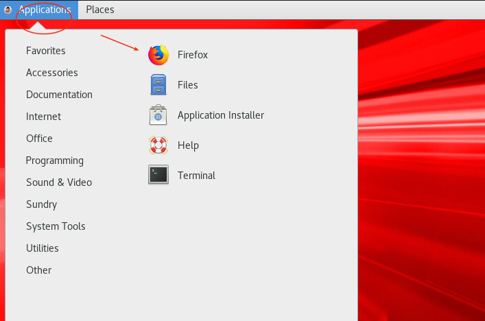

  

2. Navigate to your ATP instance.

  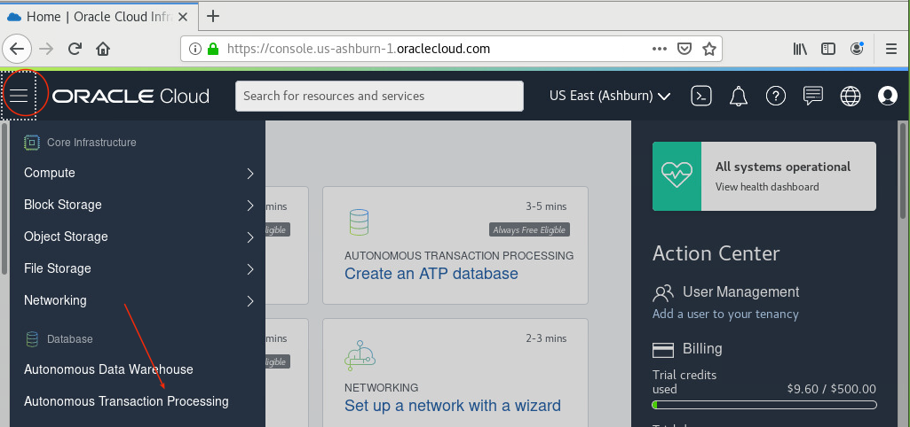

3. Select your `AlphaOffice` instance.  Be sure you are in your `python4dev` compartment.

  

4. Select `DB Connection` and then select `Download Wallet`.

  

  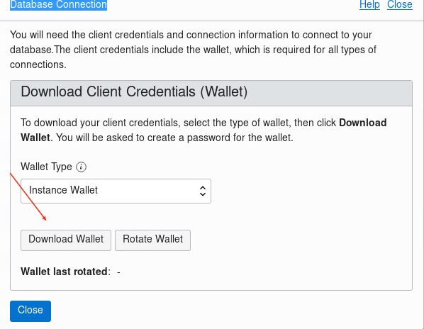

  

  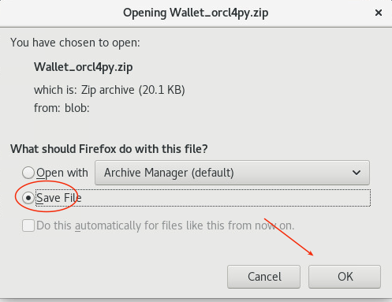

5. Go to the image desktop and open a terminal window, 

  

6. Enter the following to copy lab-resources to the opc home directory and then unzip and move the wallet to the Oracle instant client directory.
  ```
  <copy>cp -r /tmp/lab-resources .
  cd Downloads
  unzip /home/opc/Downloads/Wallet_orcl4py.zip
  sudo chown oracle /home/opc/Downloads/*
  sudo chgrp oinstall /home/opc/Downloads/*
  sudo cp /home/opc/Downloads/* /lib/oracle/18.5/client64/lib/network/admin
  </copy>
  ```

## **Step 2:** Configure project in Visual Studio Code

1. First we add the Visual Studio Code in the favorites so it can be easily accessible. Click on **Applications** and then click on **Activity Overview**

  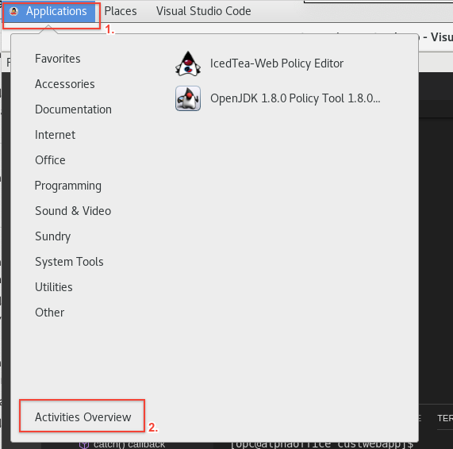

2. In the search bar type **VsCode** and you should see **VsCode - OSS** in results. **Note: VsCode - OSS same as Visual Studio Code**

  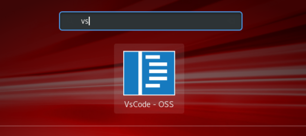

3. **Right Click** on VsCode - OSS icon and then click on **Favorites**. 

  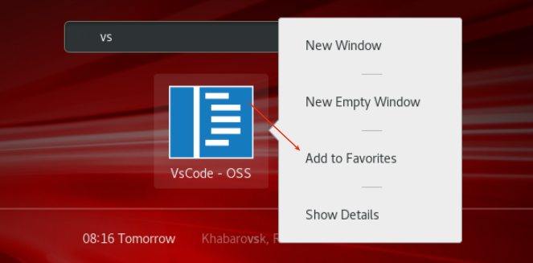

4. Now that VsCode is added to favorites. Open the terminal,click on **Applications**, select **Favorites** and then click on **VsCode - OSS**.

  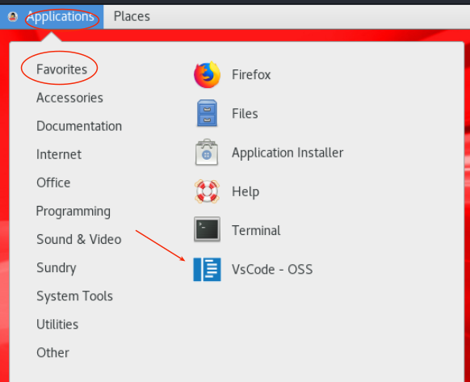

5. Click on **File** and then click on **Open Folder** 

  

6.  In the Dialog box go to the unzipped **lab-resources** folder, look inside of it, click on **pythonWebService**, and then click on **OK**.

  

7. You will the see the files on the left panes.

  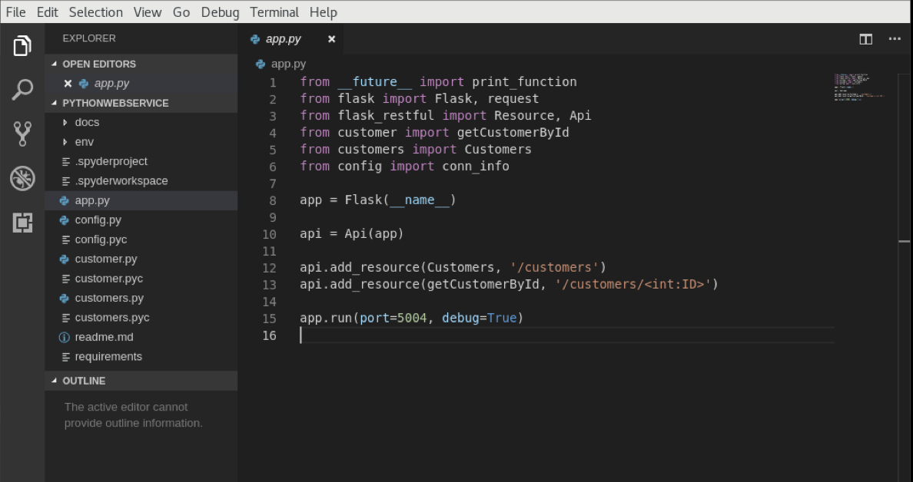

8. Open the inbuilt Visual Studio Code terminal by clicking on **View** and then click on **Terminal**. You can also open by keyboard shortcut **[Ctrl + `]**.

  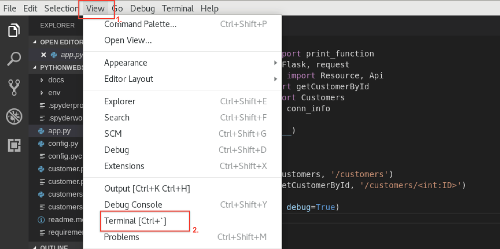

9. First we need to intall pip in the image. Type/Copy the following command in the terminal. 
  ```
  <copy>sudo curl https://bootstrap.pypa.io/get-pip.py -o get-pip.py<copy/>
  ```

  

10. Next type the following command: 
  ```
  <copy>sudo python get-pip.py</copy>
  ```

  

11. In the terminal enter command.  This will create virtual enviornment to install and run the packages, so that we don't install packages globally.
  ```
  <copy>sudo pip install virtualenv</copy>
  ```

  

12. Next enter command to create entry point.
  ```
  <copy>virtualenv env</copy>
  ```

  

13. To run the virtual enviornment type the following. If successfull you will see (env) before the path that means you are now in virtual env.
  ```
  <copy>source env/bin/activate</copy>
  ```

  

14. We have all the required packages in requirements file. To install it run the command:
  ```
  <copy>pip install -r requirements.txt</copy>
  ```

  

## **Step 3:** Run python web service

1. Leave the terminal open. Click on **config.py** file from the left pane and change the password in the file with your Autonomous Transaction Processing Database password.

  

2. We are using **flask** library to create the web service and **cx-Oracle** to connect the Autonomous Transaction Processing Database to our application. The data then fetched from database it parsed and converted to JSON format to display.
3. If you closed the terminal, open it again and make sure to be in virtual env. Run the command `$ python app.py`. Now we have our web service running. Leave the terminal as it is.

  

4. To confirm everything works fine, open firefox and go to URL [http://127.0.0.1:5001/customers/1](http://127.0.0.1:5001/customers/1).
    
  

## **Step 4:** Run frontend application

1. Open **customwebapp** in Visual Studio Code by opening the project in a new window: click on **File** and then click on **New Window**. The frontend application is created using ReactJS.

  

2. Click on **File** and then click on **Open Folder** 

  

3. In the Dialog box go to the unzipped **lab-resources** folder, look inside of it, click on **customwebapp**, and then click on **OK**.

4. Open the inbuilt Visual Studio Code terminal by clicking on **View** and then click on **Terminal**. You can also open by keyboard shortcut **[Ctrl + `]**.

  

5. Run this command to install the required packages to run the project.
  ```
  <copy>npm install</copy>
  ```

  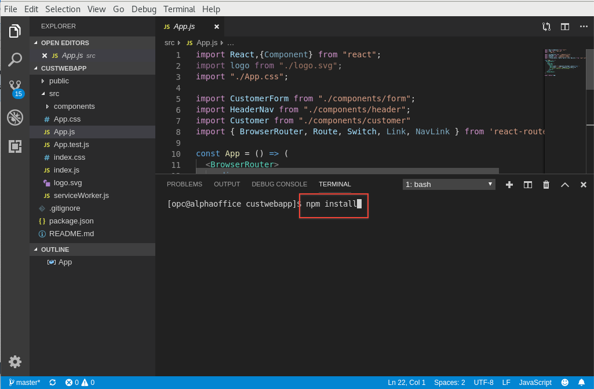

6. Run this command to start the application.
```
<copy>npm start</copy>
``` 


## **Step 5:** Create and view customer info

1. Open the browser and go to localhost:3000 to see the website.Put the customer ID in the search bar. Here for example we entered 1 and then click on **search**.

  

2. Scroll down and there is edit button next to **Country** row, click on it to edit.

  
  
3. In the form enter the name of country you want it to change to. Click on **Save Changes**. This will save changes in the Autonomuos Transaction Processing Database using the web API we created.

  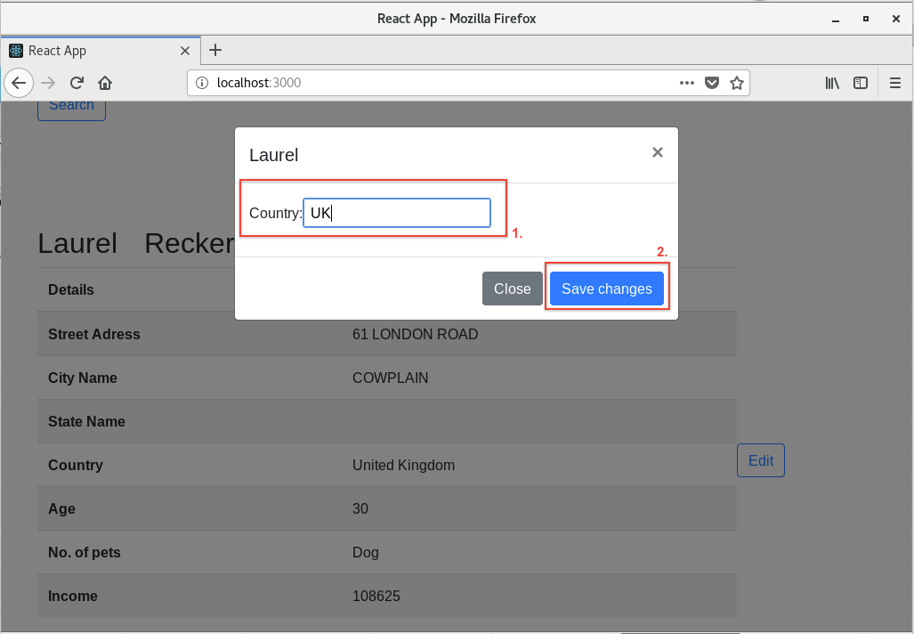
   
4. Changes are displayed.
    
  

5. Click on **Create customer** tab on top, and fill the form.

  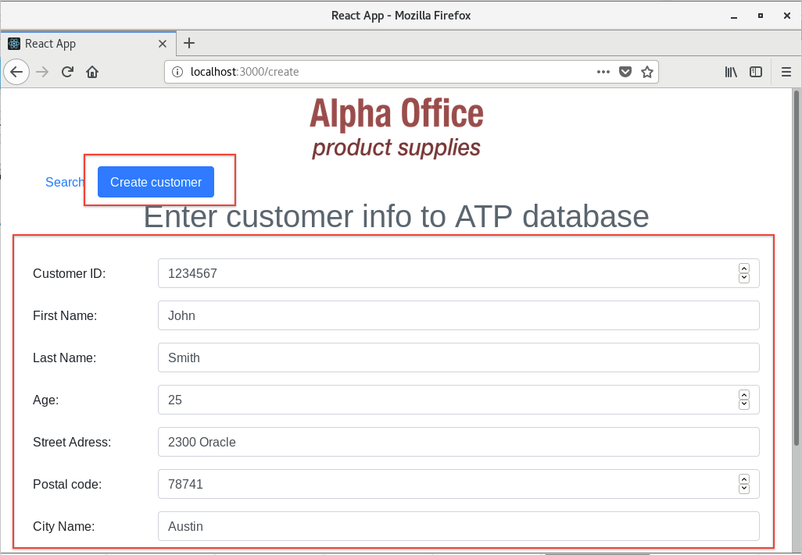
  
6. Click on **Submit**.

  

7. If everything is filled correctly success message is displayed at top.
    
  


Please proceed to the next lab.

## Acknowledgements

- **Authors/Contributors** - Derrick Cameron
- **Last Updated By/Date** - Kay Malcolm, April 2020
- **Workshop Expiration Date** - April 31, 2021

## See an issue?
Please submit feedback using this [form](https://apexapps.oracle.com/pls/apex/f?p=133:1:::::P1_FEEDBACK:1). Please include the *workshop name*, *lab* and *step* in your request.  If you don't see the workshop name listed, please enter it manually. If you would like for us to follow up with you, enter your email in the *Feedback Comments* section.    Please include the workshop name and lab in your request. 
