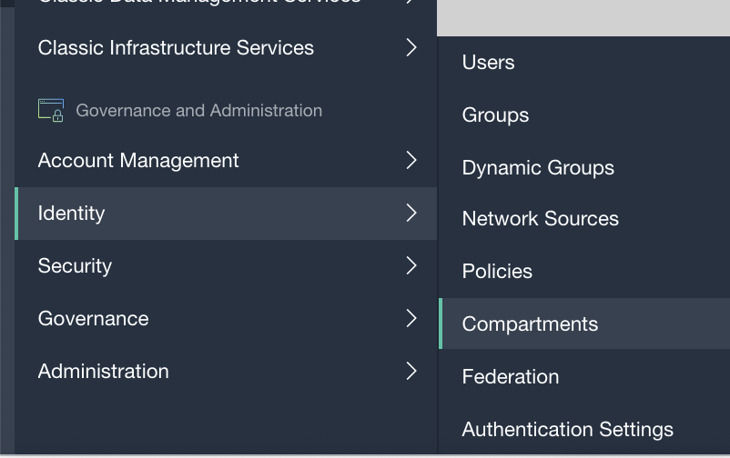
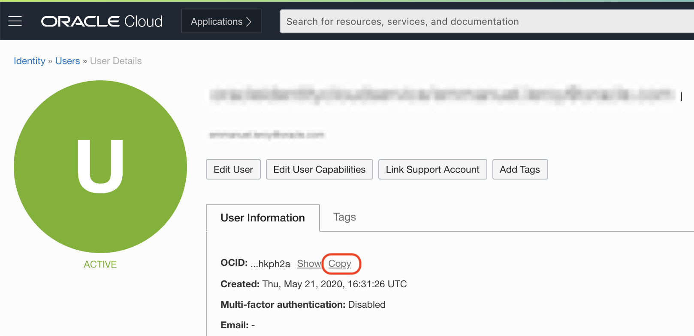
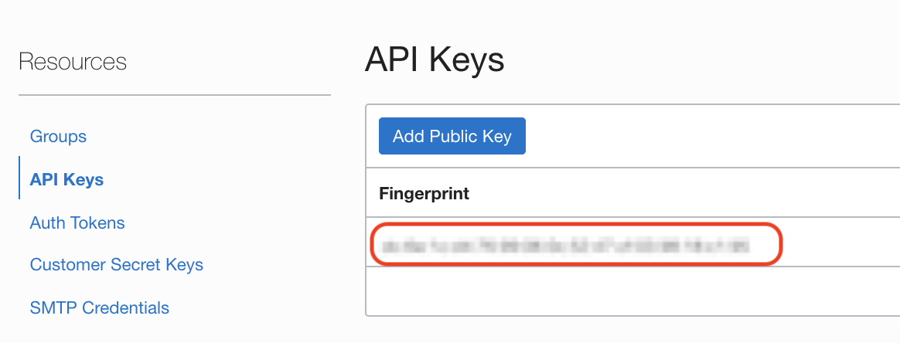

# Deploy Tomcat on OCI

## About This lab

In this lab, we will deploy a Tomcat Cluster on Oracle Cloud Infrastructure with Terraform, along with an Autonomous Transaction Processing Database.

Estimated Lab Time: 15min

### Objectives

In this lab, you will provision:
* A Tomcat cluster based on Compute VM
* A public load balancer targeting the Tomcat instances
* An Autonomous Database 

### Prerequisites

*For this lab, you need*

* An Oracle Free Tier, Always Free, Paid or LiveLabs Cloud Account
* git installed
* Terraform installed. If you need guidance to setup Terraform, please visit the [prerequistes](https://github.com/oracle-quickstart/oci-prerequisites) document.

## **STEP 1**: Gather required information

1. Get your `tenancy OCID`

    - In the OCI web console, **click** your **User** icon (top right corner), then **Tenancy**

        

    - **Copy** the OCID of the tenancy and paste it in your environment file

        

2. Get your `compartment OCID`

    - In the OCI web console, go to **Identity -> Compartments**

    

    - navigate to the compartment where you want to deploy the infrastructure

    - **Copy** the OCID of the compartment

    

3. Get your `user OCID`

    - In the OCI web console, **click** your **User** icon (top right corner), then **click** your user name 
        
    

    - **Copy** the OCID of your user and paste it in your environment file

    

4. Get the oci public key `fingerprint`

    - In your user settings, under API Keys, you will find the `fingerprint` value. 
    
    Make sure this is the one matching the oci public key you created for terraform.

    

5. With this information, create the appropriate TF_VARS, in a `TF_VARS.sh` file

    ```
    export TF_VAR_tenancy_ocid=ocid1.tenancy....
    export TF_VAR_region=us-ashburn-1
    export TF_VAR_fingerprint=50:d0:7d:f7:0e:05:cd:87:3b:2a:cb:50:b1:17:90:e9
    export TF_VAR_private_key_path=~/.oci/oci_api_key.pem
    ```

6. Source the TF_VARS.sh file

    ```
    source ./TF_VARS.sh
    ```

## **STEP 2:** Get the Terraform code

For this step, you may want to open up a separate shell terminal.

1. You'll find the code on Github.com at [https://github.com/oracle-quickstart/oci-arch-tomcat-autonomous](https://github.com/oracle-quickstart/oci-arch-tomcat-autonomous)

2. You can click **Code** and download as a zip file.

3. Or using git command line, in a local folder of your choice, clone the repository with

    ```bash
    <copy>
    git clone git@github.com:oracle-quickstart/oci-arch-tomcat-autonomous.git
    </copy>
    ```

4. Get into the code folder

    ```bash
    <copy>
    cd oci-arch-tomcat-autonomous
    </copy>
    ```

## **STEP 3:** Create a `terraform.tfvars` config file

In order to run the deployment, you need to define a few settings in a file named `terraform.tfvars`

1. Create a file called `terraform.tfvars` and open it with your prefered editor.

2. Enter the followiong information in the `terraform.tfvars` file:

    ```
    <copy>
    tenancy_ocid="<tenancy_ocid>"
    ssh_public_key="<content of the SSH public key created inside the Docker environment>"
    region="<oci_region>"
    compartment_ocid="<compartment_ocid>"
    atp_db_name = "ATPDB"
    atp_name = "TomcatATP"
    atp_password = "<password 12-30 chars including Upper + Number>"
    numberOfNodes=1
    </copy>
    ```

3. Save the `terraform.tfvars` file

## **STEP 4:** Run the deployment

1. Initialize the project

    ```
    <copy>
    terraform init
    </copy>
    ```

2. Check the plan (optional)

    To determine what will happen, you can run the *plan* operation

    ```
    <copy>
    terraform plan
    </copy>
    ```

3. Apply the plan

   ```bash
    <copy>
    terraform apply
    </copy>
    ```

    You will be prompted to enter `yes` to apply the plan.

    ```
    Do you want to perform these actions?
    Terraform will perform the actions described above.
    Only 'yes' will be accepted to approve.

    Enter a value: yes
    ```

    It will take a few minutes to provision the resources

4. Note the 

You may proceed to the next lab.

## Acknowledgements
 - **Author** - Subash Singh, Emmanuel Leroy, October 2020
 - **Last Updated By/Date** - Emmanuel Leroy, October 2020

## See an issue?
Please submit feedback using this [form](https://apexapps.oracle.com/pls/apex/f?p=133:1:::::P1_FEEDBACK:1). Please include the *workshop name*, *lab* and *step* in your request.  If you don't see the workshop name listed, please enter it manually. If you would like us to follow up with you, enter your email in the *Feedback Comments* section.