# Create a Web Application  

## Introduction

This lab shows you how to use Oracle Visual Builder to create a basic web application and populate it with business objects.

Estimated Lab Time:  15 minutes

### Background

Oracle Visual Builder is a development tool for creating web and mobile applications by dragging and dropping components on a page. These components depend on a _business object_ for their data. A business object is just a resource -- like a purchase order or invoice -- that has fields to hold the data for your application. A business object is similar to database table, as it provides the structure for your data; in fact, business objects are stored in a database. Your web application accesses the business objects through their REST endpoints.

In this tutorial, you'll create the business objects shown here:

Once you have your business objects, you'll use them to build a very simple Human Resources application in which every employee belongs to a department, and every department has a location. Your goal is to allow your users to add employee names and their departments to the database, and to change that data when necessary.

**Note:** Although this tutorial shows you how to build a web application using a business object, you can also build Visual Builder applications based on REST services or on databases like Oracle Database Cloud Service. The basic principles of creating applications are the same, no matter what form your data takes.

## **STEP 1**: Create a Web Application

The first thing we'll do is create the web application itself. Later, we'll construct the business objects we need so we can populate the app with data.

1.  In the web browser, log in to Oracle Visual Builder.
    -   If you don't have any applications, the landing page appears. Click **+ New Application**.

        

    -   If you have one or more current applications, the Visual Applications page shows a list of applications. Click **New**.

        

2.  In the Create Application dialog box, enter:

    -   **Application Name**: `HR Application`
    -   **Description**: `Tutorial application`

    The **Application ID** text field is automatically populated as you type based on the **Application Name**. The **Application Template** field is set to Empty Application.

3.  Click **Finish**.

    The application is created and opens on the Welcome page.

    

    The Welcome page contains a set of tiles in three groups: Connect to Data, Create Apps, and Add Artifacts.

    In the toolbar, the `DEV` and `1.0` tags next to the application name indicate the status (development) and the version.

4.  We want to create a web app, so under **Create Apps**, click **Web Apps**.

    The Navigator opens in the Web Applications pane. On the far left side are tabs for **Mobile Applications**, **Web Applications**, **Service Connections**, **Business Objects**, **Components**, **Processes**, and **Source View**.

5.  Click **+ Web Application** (or click the **+** sign at the top of the pane).

    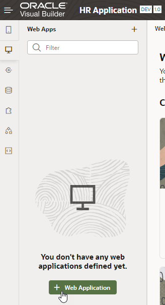

6.  In the Create Web Application dialog box, enter `hrwebapp` in the **Application Name** field under **General Information**. (You can specify uppercase as well as lowercase characters in the application name, but the name  
    is converted to lowercase.) Leave the **Navigation Style** set to the default, **None**, and then click **Create**.

    The application opens on the main-start page. This is the default name assigned to the first page in your application.

7.  Expand the **hrwebapp** node to view the web application structure, and expand the **Flows** and **main** nodes to view the main-start page, which is automatically created for you.  

    

    By default, the page opens in the Page Designer, showing the Components and the Structure tabs. To design your pages, you'll drag components from the Components palette to the canvas. Once you add components, a structural view of your components will show in the Structure view.

    On the far right is the Properties tab, which lets you view or edit a component's properties in the Property Inspector. When the entire page is selected, the Property Inspector shows the Page view, where you choose a preferred page layout. (You can click the Properties tab to hide the Property Inspector.)

## **STEP 2**: Import a Location Business Object from a File

In this step, you'll create the Location business object and then import data for it.

1.  Click the **Business Objects**  tab in the Navigator.
2.  Click the **\+ Business Object** button.
3.  In the New Business Object dialog box, enter `Location` in the **Label** field and click **Create**. `Location` is also filled in automatically as the **Name** value. When you create a business object, specify the singular form of the noun.
4.  Click the **Fields** tab.

    Every business object you create has five default fields: an id, plus fields that provide information on who created and updated the object and when.

    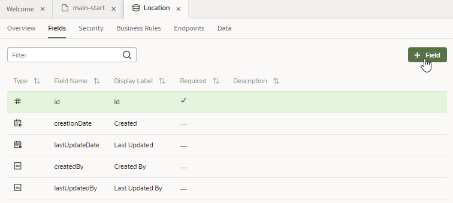

5.  Click **\+ Field** to add a field specific to this business object. This is a very simple business object, so we'll add only one new field.
6.  In the pop-up box, enter:

    -   **Label**: `Name`
    -   **Field Name**: `name` (automatically populated)
    -   **Type**: **String**  (selected by default)

    Click **Create Field**.

    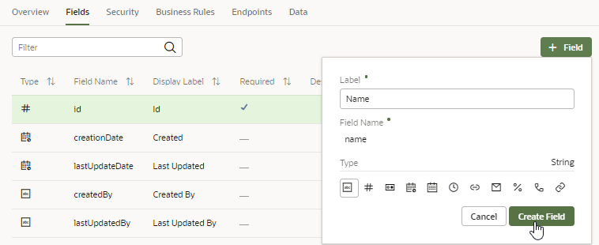

7.  In the Property Inspector, select the **Required** check box under **Constraints**.

    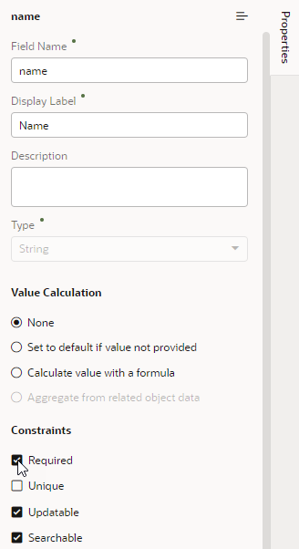

    A check mark is displayed in the **Required** column for the **Name** field.

8.  Click [this link](https://objectstorage.us-ashburn-1.oraclecloud.com/p/wg-SYyBho4igTK7Q7VRCJvDCadxWLueBiG33POhb7zTHQxtVU5JokCrXQGZ0C2fs/n/c4u03/b/solutions-library/o/Location.csv) and save the `Location.csv` file to your file system. The file contains four locations for the application.
9.  In the Navigator's Business Object panel, click **Menu**  and select **Data Manager**.

    

    The Data Manager is what you use to import data from a variety of sources.

10.  Click **Import from File**.

    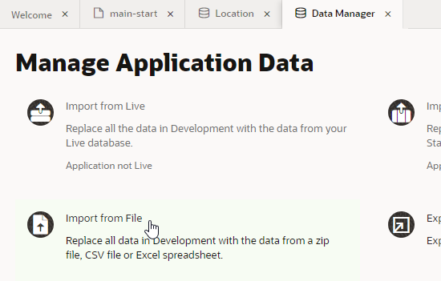

11.  In the Import Data dialog box, click the import box, select `Location.csv`, and click **Import**. When the import succeeds, click **Close**.

    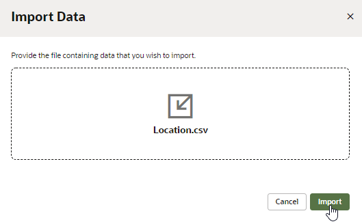

12.  In the Business Objects pane, click **Location**, then click the **Data** tab to view the locations.  

    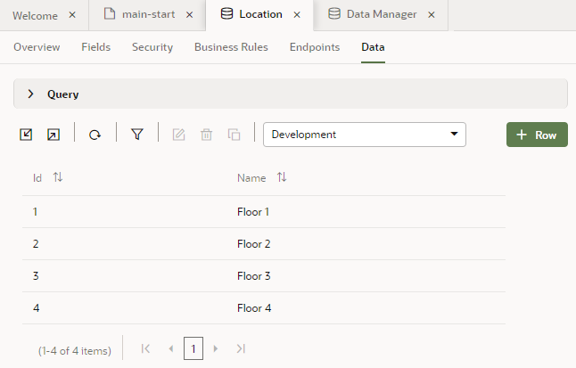

    In the next step, we'll associate these locations with the departments that are located on these floors.

## **STEP 3**: Create a Department Business Object

1.  In the Business Objects pane, click the **+** sign, then select **Business Object**.

    

2.  In the New Business Object dialog box, enter `Department` in the **Label** field and click **Create**. `Department` is also filled in automatically as the **Name** value.
3.  Click the **Fields** tab, then click **\+ Field**.
4.  In the pop-up box, enter:

    -   **Label**: `Name`
    -   **Field Name**: `name` (automatically populated)
    -   **Type**: **String**  (selected by default)

    Click **Create Field**.

5.  In the Property Inspector for the **Name** field, select the **Required** check box under **Constraints**.

    A check mark is displayed in the **Required** column for the **Name** field.

6.  Click **\+ Field** again, then enter or select:

    -   **Label**: `Location`
    -   **Field Name**: `location` (automatically populated)
    -   **Type**: **Reference** 
    -   **Referenced Business Object**: **Location**
    -   **Display Field**: **Name** (automatically populated)

    The default for a **Referenced Business Object** is always the current business object (in this case, Department), so make sure you select **Location** from the drop-down.

    Click **Create Field**.

7.  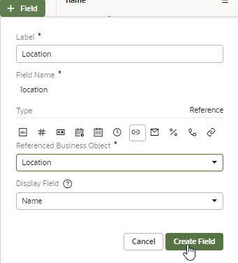

    A Reference field is like a foreign key in a database table: it's a field that refers to the key (the Id field) of another business object to link the two business objects together. When you create a department, you'll specify its Location (one of the floors). The Display Field indicates that the Name field will be displayed, not the Id.

## **STEP 4**: Create an Employee Business Object

In this step, we'll create the last business object we need, the Employee object, which contains the employee's name and identifying data. In this case, the Employee has a Reference field that refers to the Department.

1.  In the Business Objects pane, click the **+** sign, then select **Business Object**.
2.  In the New Business Object dialog box, enter `Employee` in the **Label** field and click **Create**. `Employee` is also filled in automatically as the **Name** value.
3.  Click the **Fields** tab, then click **\+ Field**.
4.  In the pop-up box, enter:

    -   **Label**: `Name`
    -   **Field Name**: `name` (automatically populated)
    -   **Type**: **String**  (selected by default)

    Click **Create Field**.

5.  In the Property Inspector for the Name field, select the **Required** check box under **Constraints**.
6.  Click **\+ Field** again, then enter or select:

    -   **Label**: `Department`
    -   **Field Name**: `department` (automatically populated)
    -   **Type**: **Reference** 
    -   **Referenced Business Object**: **Department**
    -   **Display Field**: **Name** (automatically populated)

    Click **Create Field**.

7.  Click **\+ Field** again, then enter or select:

    -   **Label**: `Hire Date`
    -   **Field Name**: `hireDate` (automatically populated)
    -   **Type**: **Date** 

    Click **Create Field**.

8.  Click **\+ Field** again, then enter or select:

    -   **Label**: `Email`
    -   **Field Name**: `email` (automatically populated)
    -   **Type**: **Email** 

    Click **Create Field**. In the property editor, the Format is set to Email.

9.  Click the **Endpoints** tab and view the Resource APIs and REST endpoints created for the Employee business object. Because Employee refers to Department, you can see endpoints for both objects if you expand the departmentObject node. Expand the **Resource APIs** node to see the URLs for accessing the metadata and data for the business object, then minimize it again.  

    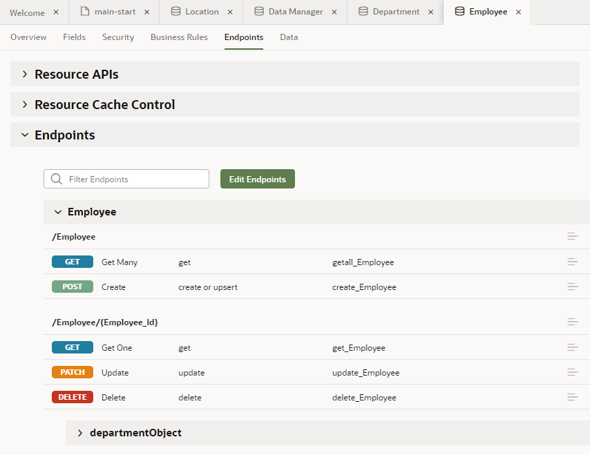

    If you click an endpoint, an endpoint viewer allows you to perform operations on the endpoints. For example, you can test requests and view responses with specified parameter values:

    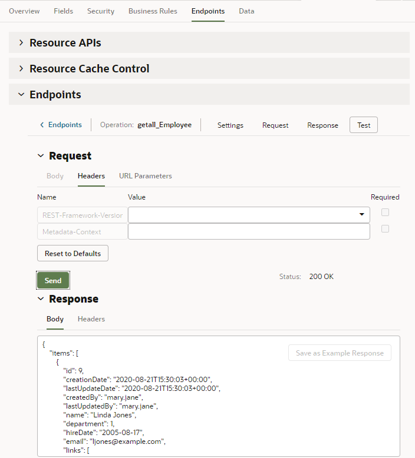

10.  In the Business Objects pane of the Navigator, click the **Diagrams** tab, then click the **\+ Business Object Diagram** button.

    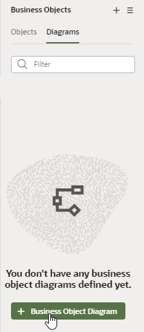

11.  In the Create Business Object Diagram dialog box, enter `HRDiagram` in the **Diagram name** field and click **Create**.
12.  In the Property Inspector, click **Select All** to see the three business objects you created and their relationships.

    

    The diagram looks just like the graphic in the Before You Begin section.

    So far, you've imported data only for the Location object. You'll add data for the Department and Employee business objects in a later tutorial.
