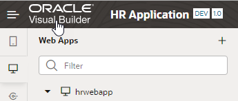
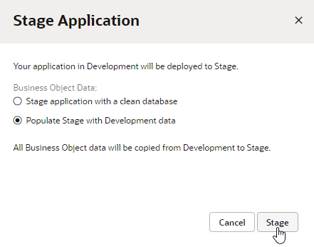
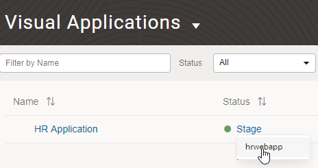
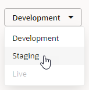
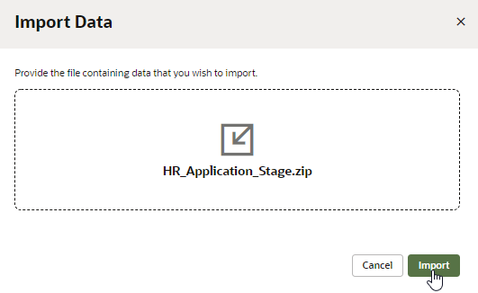
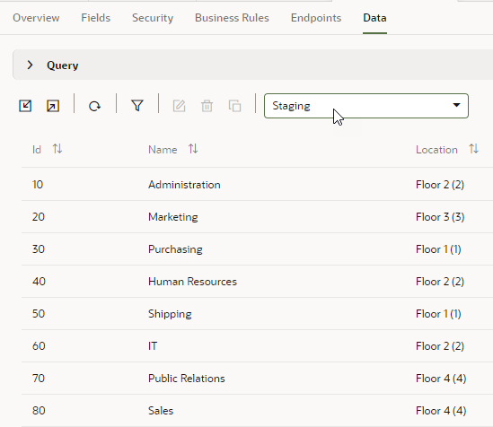
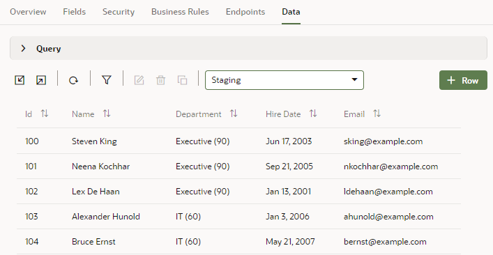
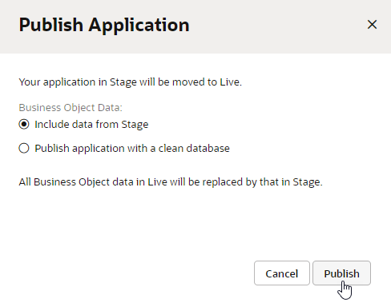
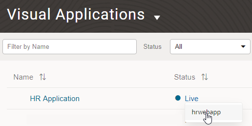

# Stage and Publish an Oracle Visual Builder Web Application

## Introduction

This tutorial shows you how to stage and publish a web application.

Estimated Lab Time:  10 minutes

### Background

Once you have created an Oracle Visual Builder application, you can stage it to allow team members to test it thoroughly. After testing is complete, you can publish the application and make it available to users.

Oracle Visual Builder provides different databases for the development, staging, and live phases of an application. You can use an empty database for the staging or live phase, or you can transfer data from one to another, or you can import specific data for each.

## **STEP 1**: Stage the Application

Stage the application so that other users can test its behavior.

1.  If necessary, log in to Oracle Visual Builder. If you are still in the HR Application, click **ORACLE Visual Builder** to return to the Visual Applications page.

    

2.  On the Visual Applications page, click the **Options**  icon for HR Application and select **Stage**.

    

3.  In the Stage Application dialog box, select the **Populate Stage with Development data** option and click **Stage**.

    

    The application is staged, and the status changes from Development to Stage.

4.  Click **Stage** and select **hrwebapp**, the name of the web application. The staged application opens in a new browser tab. The tables are populated with the data from Development.

    

5.  Make a note of the URL of the staged application. You can share this URL with members of your group so that they can test it.

    When you have finished using the application, close the browser tab to return to the Visual Applications page.

## **STEP 2**: Import Data Into the Application (Optional)

You can import data for the Department and Employee business objects from a zip file. You can skip directly to the publishing step if you wish.

1.  Click [this link](https://objectstorage.us-ashburn-1.oraclecloud.com/p/9qg3_BmDXmLGMwpnyTZmZRA4lA91PEwdNxXWdmcHam67wD5Gny6ypqAhbU2Ra5ly/n/c4u03/b/solutions-library/o/HR_Application_Stage.zip) and save the `HR_Application_Stage.zip` file. The zip file contains CSV files of the Department and Employee business objects of the HR Application schema, with more records and data.
2.  On the Visual Applications page, click **HR Application** in the Name column to open it.
3.  Click the **Business Objects**  tab, then click **Menu**  and select **Data Manager**.

    

4.  From the drop-down list in the upper right corner, select **Staging** to import the data into the staging database.  

    

5.  Click **Import from File**.
6.  In the Import Data dialog box, click the import box, select `HR_Application_Stage.zip`, and click **Import**. When the import succeeds, click **Close**.

    

7.  In the Business Objects pane, click **Department**.
8.  Click the **Data** tab if necessary, then select **Staging** from the drop-down list to view the new departments.

    

9.  Click **Employee**, then click the **Data** tab and select **Staging** to view the new employees.

    

## **STEP 3**: Publish the Application

After you have successfully tested the staged application, you can publish it and make the application live. The live application is visible to users with proper credentials.

1.  Click the **Menu**  icon in the header and select **Publish**. (If you skipped the previous section, you can click the **Options**  icon for HR Application and select **Publish**.)
2.  In the Publish Application dialog box, select the **Include data from Stage** option and click **Publish**.  

    

    The application is now live. Notice the status change in the header next to the application name.

3.  Click **ORACLE Visual Builder** to return to the Visual Applications page.
4.  Click **Live** and select **hrwebapp**. The application opens in a new browser tab.

    

    The schema and the data from the staging database are copied to the live database.

5.  Make a note of the URL of the application. You can share this URL with public users.

    When you've finished using the application, close the browser tab.

6.  If you want to, click the user menu in the top-right corner and select **Sign Out** from the menu. After you've published an application, you will no longer be able to make changes to it. Instead, create a new version of it and edit that.

## Acknowledgements
**Author** - Sheryl Manoharan

**Last Updated** - December 2020

## Need Help?
Please submit feedback or ask for help using our [LiveLabs Support Forum](https://community.oracle.com/tech/developers/categories/livelabsdiscussions). Please click the **Log In** button and login using your Oracle Account. Click the **Ask A Question** button to the left to start a *New Discussion* or *Ask a Question*.  Please include your workshop name and lab name.  You can also include screenshots and attach files.  Engage directly with the author of the workshop.

If you do not have an Oracle Account, click [here](https://profile.oracle.com/myprofile/account/create-account.jspx) to create one.
