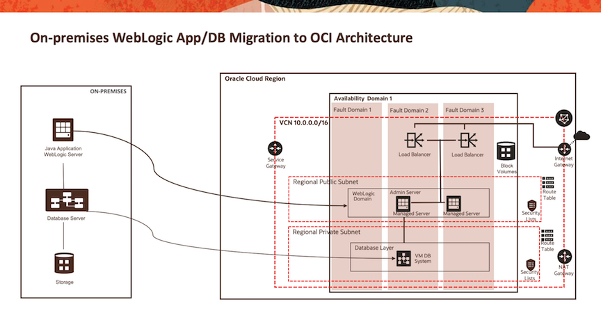
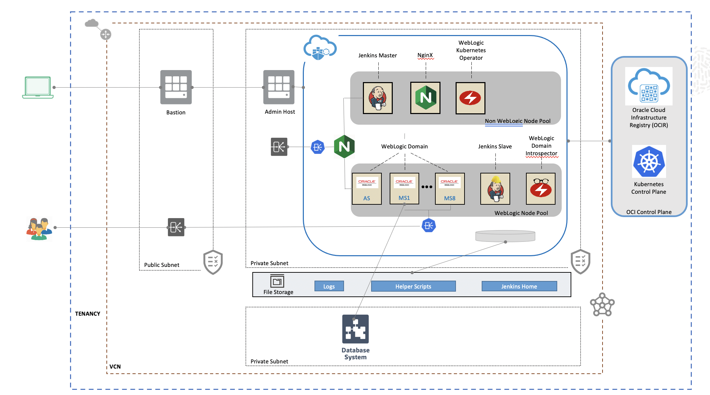

# Introduction

## About Workshop

This lab will walk you through the process of migrating an existing 'on-premises' WebLogic domain to WebLogic for <if type="oci">Oracle Cloud Infrastructure (OCI)</if><if type="oke">Oracle Kubernetes Engine (OKE)</if>. The WebLogic domain we'll migrate contains a couple Java applications and a datasource connecting to a database that will be migrated along the WebLogic domain.

Attached below is a sample architecture of the final solution:
<if type="oci">

</if>
<if type="oke">

</if>

Estimated Lab Time: 80 to 120 minutes depending on the path chosen.

### Objectives

*Perform the end-to-end migration of a local WebLogic domain to <if type="oci">Oracle Cloud Infrastructure (OCI)</if><if type="oke">Oracle Kubernetes Engine (OKE)</if>, provisioning WebLogic on <if type="oci">OCI</if><if type="oke">OKE</if> with the Marketplace.*

In this lab, you will:
- Provision a demo environment to use as the 'on-premises' environment to be migrated
- Prepare the OCI tenancy to provision WebLogic Server from the Marketplace
- Provision a new empty WebLogic domain on <if type="oci">OCI</if><if type="oke">OKE</if> with the Marketplace
- Provision the Application Database on OCI
- Migrate the Application Database from the 'on-premises' environment to the OCI DBaaS
- Migrate the WebLogic domain using Weblogic Deploy Tooling (WDT)
- Optionally learn to scale the provisioned domain
- Tear down the workshop

### Prerequisites

*In order to run this workshop you need:*

* A Mac OS X, Windows or Linux machine
* A private/public SSH key-pair
* Firefox browser
* A OCI account with a Compartment setup

If you are not an administrator on your tenancy, you must insure that the following policies have been set for you:

```
<copy>
Allow group MyGroup to manage dynamic-groups in tenancy
Allow group MyGroup to manage policies in tenancy
Allow group MyGroup to manage volume-family in tenancy
Allow group MyGroup to manage instance-family in tenancy

Allow group MyGroup to inspect tenancies in tenancy
Allow group MyGroup to use secret-family in tenancy
Allow group MyGroup to use tag-namespaces in tenancy

Allow group MyGroup to manage all-resources in compartment MyCompartment
</copy>
```

You may proceed to the next lab.

## Acknowledgements

 - **Author** - Emmanuel Leroy, May 2020
 - **Last Updated By/Date** - Emmanuel Leroy, October 2020

## Need Help?
Please submit feedback or ask for help using our [LiveLabs Support Forum](https://community.oracle.com/tech/developers/categories/livelabsdiscussions). Please click the **Log In** button and login using your Oracle Account. Click the **Ask A Question** button to the left to start a *New Discussion* or *Ask a Question*.  Please include your workshop name and lab name.  You can also include screenshots and attach files.  Engage directly with the author of the workshop.

If you do not have an Oracle Account, click [here](https://profile.oracle.com/myprofile/account/create-account.jspx) to create one.
