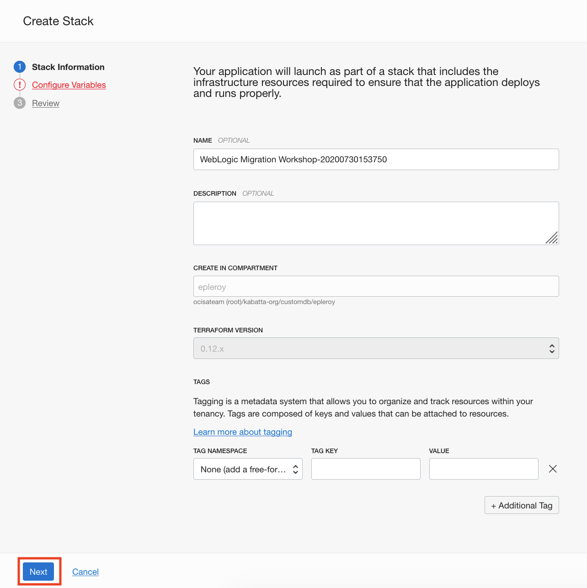
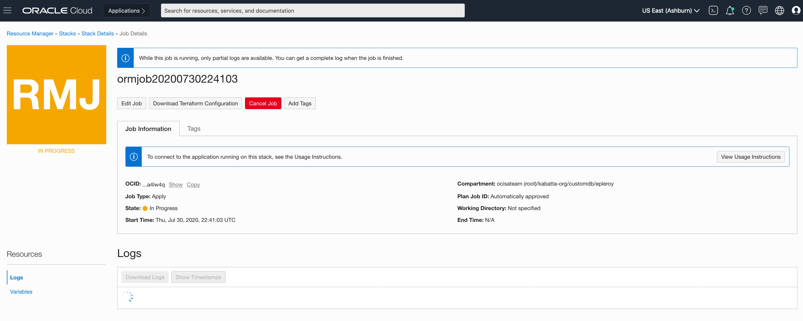
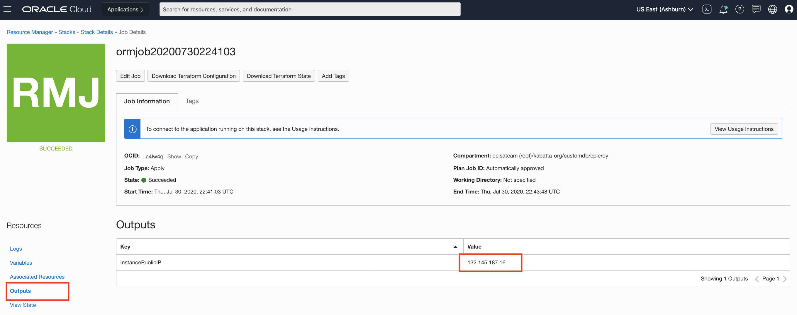
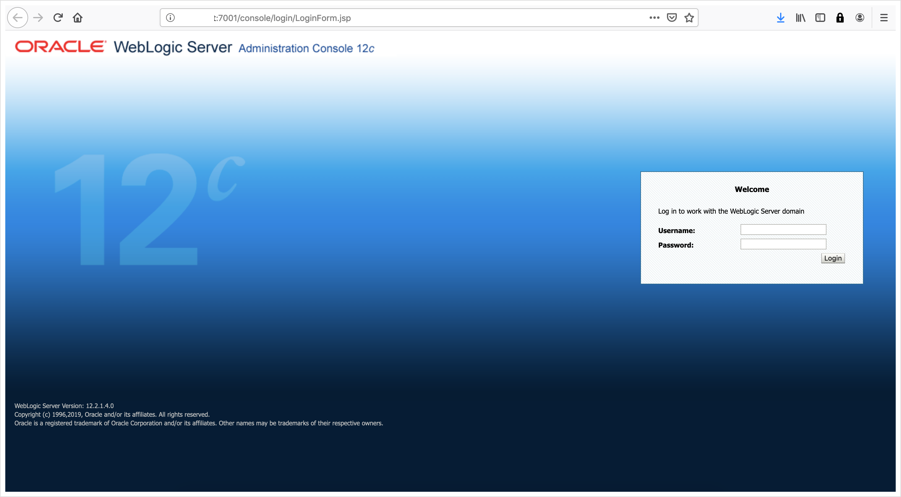
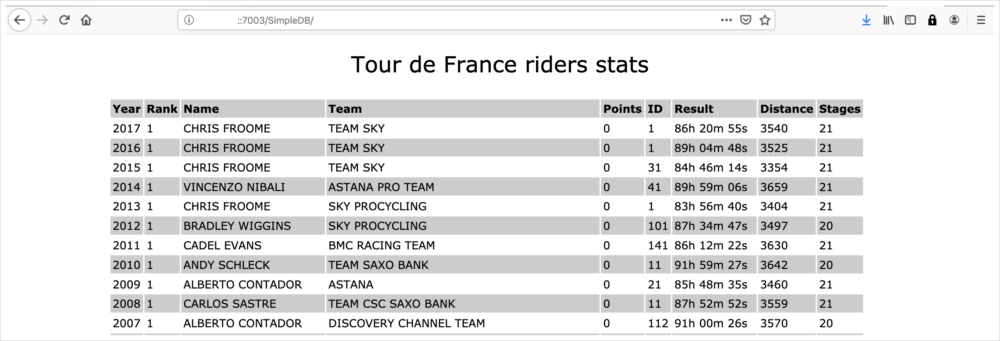

# Setup using OCI Marketplace Stack

## Introduction 

This lab walks you through setting up anenvironment to simulate an established on-premises environment, using a Compute instance on OCI deployed through the marketplace. 

*Note: This is an alternative to Lab 2b: Setup local (on-premises) environment using Docker. You only need to setup your 'on-premises' environment using one or the other.*

At the end of this lab, you will have a simulated 'on-premises' environment running with an Oracle 12c Database and WebLogic Server 12c with a domain containing 2 applications and a datasource.

Estimated Lab Time:  10 minutes

### Requirements

- Free Tier, Paid or LiveLabs Oracle Cloud Account

## **Step 1:** Launch the Workshop Marketplace stack

1. Navigate to [Workshop Environment Marketplace Stack](https://cloudmarketplace.oracle.com/marketplace/listing/82173888)

2. Click **Get App**
  

3. Sign in to your Oracle Cloud Infrastructure Account

  

4. Choose a compartment

  

5. Accept the Terms and Conditions and click **Launch**

  

6. Click **Next**

  

7. Paste your **SSH public key**.  To connect to the WebLogic servers via SSH, you need to provide a public key the server will use to identify your computer.

  

   To output the public key information, use the following command from your local machine:
    ```
    <copy>
    cat ~/.ssh/id_rsa.pub
    </copy>
    ```
   Copy the output of the command (the whole multi-line output) and paste it in the form field for SSH key in the form

   the output will look something like this:

    ```
    bash
    ssh-rsa AAAAB3NzaC1yc2EAAAADAQABAAABAQDlkF23qLyfimJ9Vp4D9psp7bDOB8JvtY/pfYzFxIA2E4v6or+XhvMW5RDhX9Ba54zQNNDLvwUhStdXKkiMXJtEQJarFn45pGy/lyUQKFJolAdHBrXJsg5XWn4DxCFeQUQe1szVfmwDLAktAS14r5g76h3CcA8Kk/cNVqevxVChyejuuOdtAMoriIC8uKV+535qPs/GMiu0zR9aW4w1VodL5eHnXjqdgp8Fr21dVUVQ6of+s/ws0zlQUwghrNguDUqlggzG2mpLBHExypxCrJYmsb05uYjjqVlC3YCatj4nJTIHKLCFiYVY/b8AFkqwXV9EYlja5bjTmunM847dcR8H oracle@ad753161734c
    ```
   **Note:** Do not use the example above as the key: it is a different public key which is useless without the corresponding private key, and you will not be able to access your resources on OCI)

8. Click **Next** and then **Create**

  

9. It will take about 1 to 2 minutes to create the stack. When the job finishes, you can find the Public IP address of the instance at the bottom of the logs, or in the **Output** area

  

## **Step 2:**  Check the local environment is up and running

It will take another 4 to 5 minutes for all the services to come online.

1. Open up a browser and navigate to http://PUBLIC-IP:7001/console
2. Log in using the following credentials: 
   - WebLogic admin user: `weblogic` 
   - Password: `welcome1`

3. Before proceeding, make sure the local environment has been deployed properly and is running. 

    

4. The **SimpleDB** application should be running at http://PUBLIC-IP:7003/SimpleDB/.  Navigate there now.
5. It shows statistics of riders of the Tour de France stored in the database, and looks like this:

  

## **Step 3:** Log in to the 'on-premises' environment

Most of the work will be done from the simulated on-premises environment deployed in the compute instance on OCI.

1. Open up a terminal window and log into the instance, use:

    ```
    ssh opc@<public-ip>
    ```

*Note: Replace the `<public-ip>` with the IP provided in the output of the provisioning job.*

## **Step 4:** Create a SSH key

We'll need a SSH key pair to communicate with the WebLogic servers and the database on OCI. The public key will need to be provided when provisioning those resources. 

We'll create a SSH key pair in the default folder

1. Once on the compute instance on OCI, switch to the oracle user:

  ```
  <copy>
  sudo su - oracle
  </copy>
  ```

2. Create the SSH keypair

  ```
  <copy>
  ssh-keygen
  </copy>
  ```
3. Hit `Enter` (default) for all the prompts

4. You will find two files `id_rsa` and `id_rsa.pub` inside the folder `~/.ssh/` or `/home/oracle/.ssh/`

   `id_rsa` is the private key, which should never be shared, and will be required to connect to any OCI resource provisioned with the corresponding public key `id_rsa.pub`

   Note this key will be the default SSH key from the instance used for the on-premises environment.

*Note:* This is only to be done once. If you run it again, a new key will overwrite the previous one and you will lose access to any resource provisioned with that key.

You may now *skip Lab 2 Option B and proceed to Lab 3.*

## Acknowledgements

 - **Author** - Emmanuel Leroy, May 2020
 - **Last Updated By/Date** - Kay Malcolm, August 2020


## See an issue?
Please submit feedback using this [form](https://apexapps.oracle.com/pls/apex/f?p=133:1:::::P1_FEEDBACK:1). Please include the *workshop name*, *lab* and *step* in your request.  If you don't see the workshop name listed, please enter it manually. If you would like for us to follow up with you, enter your email in the *Feedback Comments* section.