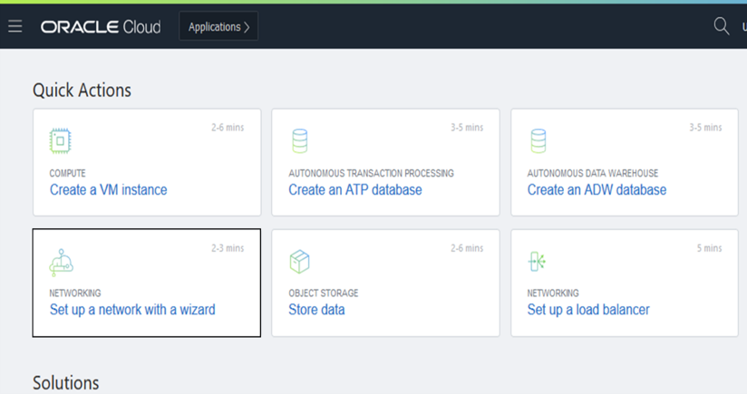
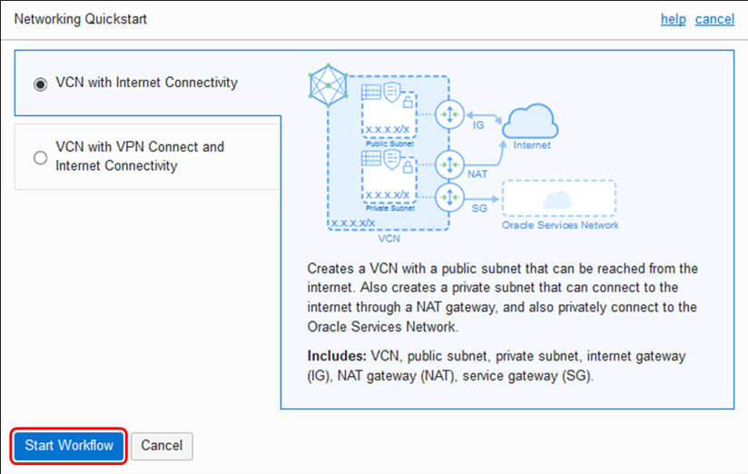
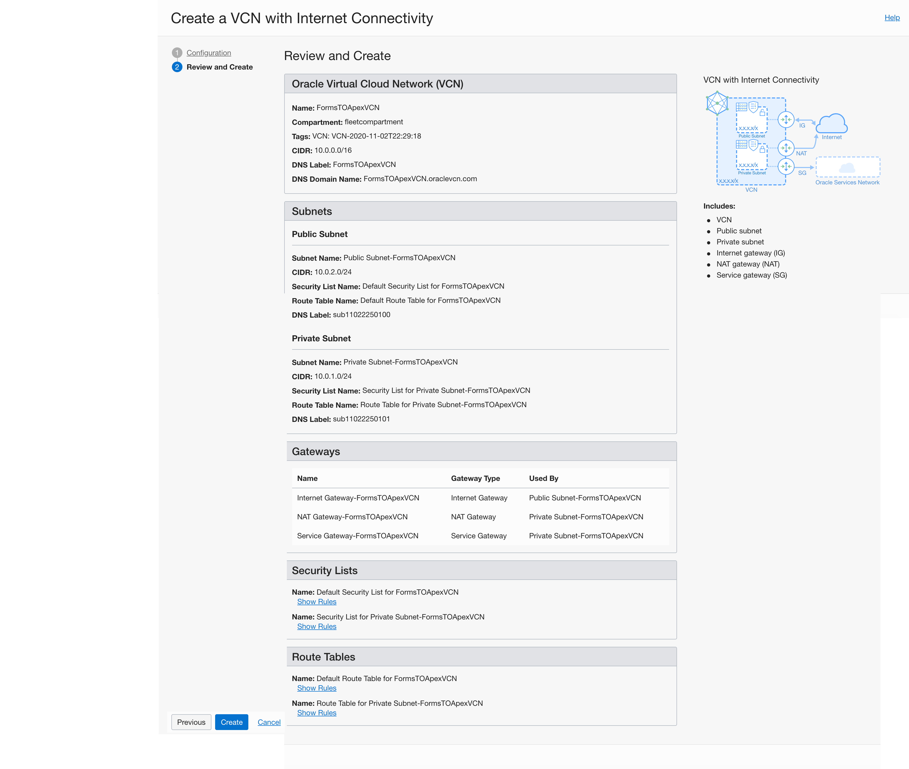

# Virtual Cloud Network

**Note:** *Some of the UIs might look a little different than the screen shots included in the instructions, but you can still use the instructions to complete the hands-on labs.*

## Introduction

Oracle Cloud Infrastructure Compute lets you create multiple Virtual Cloud Networks (VCNs). These VCNs will contain the security lists, compute instances, load balancers and many other types of network assets.

Be sure to review [Overview of Networking](https://docs.cloud.oracle.com/iaas/Content/Network/Concepts/overview.htm) to gain a full understanding of the network components and their relationships.

Estimated Time: 5 minutes

### Objectives

* Setup VCN with wizard

### Prerequisites

To sign in to the Console, you need the following:

- Tenant, User name and Password
- URL for the Console: [https://console.us-ashburn-1.oraclecloud.com/](https://console.us-ashburn-1.oraclecloud.com/)
- Oracle Cloud Infrastructure supports the latest versions of Google Chrome, Firefox and Internet Explorer 11. ***It does not support the Edge browser***.

## **STEP 1**: Create Your VCN

To create a VCN on Oracle Cloud Infrastructure:

1. On the Oracle Cloud Infrastructure Console Home page, under the Quick Actions header, click on Set up a network with a wizard.

    

2. Select **VCN with Internet Connectivity**, and then click **Start Workflow**.

    

3. Complete the following fields:

    |                  **Field**              |    **Value**  |
    |----------------------------------------|:------------:|
    |VCN NAME |FormsTOApexVCN|
    |COMPARTMENT |  Choose your compartment
    |VCN CIDR BLOCK|10.0.0.0/16|
    |PUBLIC SUNBET CIDR BLOCK|10.0.2.0/24|
    |PRIVATE SUNBET CIDR BLOCK|10.0.1.0/24|

    |USE DNS HOSTNAMES IN THIS VCN| Checked|

    Your screen should look similar to the following:
    

4. Press the **Next** button at the bottom of the screen.

5. Review your settings to be sure they are correct.
    

6. Press the **Create** button to create the VCN. I will take a moment to create the VCN and a progress screen will keep you apprised of the workflow.

    

7. Once you see that the creation is complete (see previous screenshot), click on the **View Virtual Cloud Network** button.

You may now *proceed to the next lab*.

## Summary

This VCN will contain all of the other assets that you will create during this set of labs. In real-world situations, you would crete multiple VCNs based on their need for access (which ports to open) and who can access them.

## **Acknowledgements**

 - **Author** -  Vanitha Subramanyam, Senior Solution Architect
 - **Contributors** - Abhinav Jain, Staff Cloud Engineer, Sakthikumar Periyasamy Senior Cloud Engineer, Nayan Karumuri Staff Cloud Engineer
 - **Last Updated By/Date** - Vanitha Subramanyam, Senior Solution Architect, December 2020

## Need Help?
 Please submit feedback or ask for help using our [LiveLabs Support Forum](https://community.oracle.com/tech/developers/categories/forms-to-apex-migration-workshops). Please click the **Log In** button and login using your Oracle Account. Click the **Ask A Question** button to the left to start a *New Discussion* or *Ask a Question*.  Please include your workshop name and lab name.  You can also include screenshots and attach files.  Engage directly with the author of the workshop.

 If you do not have an Oracle Account, click [here](https://profile.oracle.com/myprofile/account/create-account.jspx) to create one.
