#  Autonomous Transaction Processing.

## Introduction

Oracle Cloud Infrastructure's Autonomous Transaction Processing Cloud Service is a fully managed, preconfigured database environment. You do not need to configure or manage any hardware, or install any software. After provisioning, you can scale the number of CPU cores or the storage capacity of the database at any time without impacting availability or performance. Autonomous Transaction Processing handles creating the database, as well as the following maintenance tasks:


- Backing up the database
- Patching the database
- Upgrading the database


**Some Key points:**

*We recommend using Chrome or Edge as the broswer. Also set your browser zoom to 80%*

- All screen shots are examples ONLY. Screen shots can be enlarged by Clicking on them

- Login credentials are provided later in the guide (scroll down). Every User MUST keep these credentials handy.

- Do NOT use compartment name and other data from screen shots.Only use  data(including compartment name) provided in the content section of the lab

- Mac OS Users should use ctrl+C / ctrl+V to copy and paste inside the OCI Console

- Login credentials are provided later in the guide (scroll down). Every User MUST keep these credentials handy.

    **Cloud Tenant Name**

    **User Name**

    **Password**

    **Compartment Name (Provided Later)**

    **Note:** OCI UI is being updated thus some screenshots in the instructions might be different than actual UI

### Prerequisites

1. [OCI Training](https://cloud.oracle.com/en_US/iaas/training)

2. [Familiarity with OCI console](https://docs.us-phoenix-1.oraclecloud.com/Content/GSG/Concepts/console.htm)

3. [Overview of Networking](https://docs.us-phoenix-1.oraclecloud.com/Content/Network/Concepts/overview.htm)

4. [Familiarity with Compartment](https://docs.us-phoenix-1.oraclecloud.com/Content/GSG/Concepts/concepts.htm)

5. [Connecting to a compute instance](https://docs.us-phoenix-1.oraclecloud.com/Content/Compute/Tasks/accessinginstance.htm)

## Step 1: Sign in to OCI Console and create VCN

* **Tenant Name:** {{Cloud Tenant}}
* **User Name:** {{User Name}}
* **Password:** {{Password}}
* **Compartment:**{{Compartment}}

**Note:** OCI UI is being updated thus some screenshots in the instructions might be different than actual UI


1. Sign in using your tenant name, user name and password. Use the login option under **Oracle Cloud Infrastructure**
    

2. From the OCI Services menu,Click **Virtual Cloud Networks** under Networking. Select the compartment assigned to you from drop down menu on left part of the screen under Networking and Click **Start VCN Wizard**

    **NOTE:** Ensure the correct Compartment is selected under COMPARTMENT list

3. Click **VCN with Internet Connectivity** and click **Start Workflow**

4. Fill out the dialog box:

      - **VCN NAME**: Provide a name
      - **COMPARTMENT**: Ensure your compartment is selected
      - **VCN CIDR BLOCK**: Provide a CIDR block (10.0.0.0/16)
      - **PUBLIC SUBNET CIDR BLOCK**: Provide a CIDR block (10.0.1.0/24)
      - **PRIVATE SUBNET CIDR BLOCK**: Provide a CIDR block (10.0.2.0/24)
      - Click **Next**

5. Verify all the information and  Click **Create**

6. This will create a VCN with followig components.

    *VCN, Public subnet, Private subnet, Internet gateway (IG), NAT gateway (NAT), Service gateway (SG)*

7. Click **View Virtual Cloud Network** to display your VCN details.
             
## Step 2: Create ssh keys Compute instance and ssh to compute instance

1. Click the Apps icon in the toolbar and select  Git-Bash to open a terminal window.

     

2. Enter command 
    ```
    <copy>
    ssh-keygen
    </copy>
    ```
    **HINT:** You can swap between OCI window, 
    git-bash sessions and any other application (Notepad, etc.) by Clicking the Switch Window icon 

     

3. Press Enter When asked for 'Enter File in which to save the key', 'Created Directory, 'Enter passphrase', and 'Enter Passphrase again.

     

4. You should now have the Public and Private keys:

    /C/Users/ PhotonUser/.ssh/id_rsa (Private Key)

    /C/Users/PhotonUser/.ssh/id_rsa.pub (Public Key)

    **NOTE:** id\_rsa.pub will be used to create 
    Compute instance and id\_rsa to connect via SSH into compute instance.

    **HINT:** Enter command 
    ```
    <copy>
    cd /C/Users/PhotonUser/.ssh (No Spaces) 
    </copy>
    ```
    and then 
    ```
    <copy>
    ls 
    </copy>
    ```
    to verify the two files exist. 

5. In git-bash Enter command  
    ```
    <copy>
    cat /C/Users/PhotonUser/.ssh/id_rsa.pub
    </copy>
    ```
    , highlight the key and copy 

     

6. Click the apps icon, launch notepad and paste the key in Notepad (as backup)

     

7. Switch to the OCI console. From OCI services menu, Click **Instances** under **Compute**.

8. Click **Create Instance**. Fill out the dialog box:

      - **Name your instance**: Enter a name 
      - **Choose an operating system or image source**: For the image, we recommend using the Latest Oracle Linux available.
      - **Availability Domain**: Select availability domain
      - **Instance Type**: Select Virtual Machine 
      - **Instance Shape**: Select VM shape 

      **Under Configure Networking**
      - **Virtual cloud network compartment**: Select your compartment
      - **Virtual cloud network**: Choose the VCN 
      - **Subnet Compartment:** Choose your compartment. 
      - **Subnet:** Choose the Public Subnet under **Public Subnets** 
      - **Use network security groups to control traffic** : Leave un-checked
      - **Assign a public IP address**: Check this option

     

      - **Boot Volume:** Leave the default
      - **Add SSH Keys:** Choose 'Paste SSH Keys' and paste the Public Key saved earlier.

9. Click **Create**.

    **NOTE:** If 'Service limit' error is displayed choose a different shape from VM.Standard2.1, VM.Standard.E2.1, VM.Standard1.1, VM.Standard.B1.1  OR choose a different AD

     

10. Wait for Instance to be in **Running** state. In git-bash Enter Command:
    
    ```
    <copy>
    cd /C/Users/PhotonUser/.ssh
    </copy>
    ```
11. Enter **ls** and verify id\_rsa file exists.

12. Enter command 
    ```
    <copy>
    bash
    ssh -i id_rsa opc@<PUBLIC_IP_OF_COMPUTE> -L 3000:localhost:3000
    </copy>
    ```
    **NOTE:** User name is opc.

    **HINT:** If 'Permission denied error' is seen, ensure you are using '-i' in the ssh command

13. Enter 'Yes' when prompted for security message

     
 
14. Verify opc@<COMPUTE_INSTANCE_NAME> appears on the prompt.

15. In the compute instance Update yum, Enter Command, 
    ```
    <copy>
    sudo yum makecache fast
    </copy>
    ```

16. Install Java and its dependencies, Enter Command, 
    ```
    <copy>
    sudo yum install java-1.8.0-openjdk-headless.x86_64
    </copy>
    ```

17. Verify Java Installation and version, Enter Command,
    ```
    <copy>
    java -version
    </copy>
    ```

     

18. Next we will install Swing bench, Enter command:(No Spaces)

    ```
    <copy>
    curl http://www.dominicgiles.com/swingbench/swingbench261082.zip -o swingbench.zip
    </copy>
    ```

19. Enter command,
    ```
    <copy>
    ls 
    </copy>
    ```
    and verify swinbench.zip file exists. Unzip the file, Enter command,
    ```
    <copy>
    unzip swingbench.zip
    </copy>
    ```
     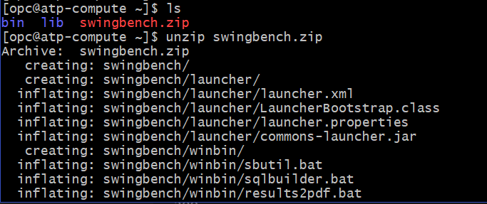

## Step 3: Create ATP instance in OCI and Configure Swing Bench on Compute instance to generate load traffic

*In this section we will create a ATP instance in OCI. We will initially create this instance with only 1 OCPU and scale it after generating load test from the compute instance created earlier*


1. Switch to OCI console, from services menu Click **Autonomous Transaction Processing** under Databse.Click **Create Autonomous Database**. Fill out the dialog box:

    COMPARTMENT: Choose your compartment
    - DISPLAY NAME: Provide a name
    - DATABASE NAME: Provide a name
    - Choose a Workload type: Transaction Processing
    - Choose a Deployment type: Shared Infrastructure

    Under **Configure the database**

    - Always Free: Leave Default
    - Choose database version: Leave Default
    - OCPU count: 1
    - Auto Sclaing: Make sure flag is Un-checked

    Under **Create administrator credentials**

    - Username: Provide a username 
    - Password: Provide a password (For example : Oracle098#### **Do not use &,!, in the password due to script limitation that we will execute later.**)
    - Confirm Password: Confirm the password provided

    Under **Choose network access**

    - Allow secure accces from anywhere: Make sure this option is checked
    - Confifure access conrol rules: Leave default (unchecked)

    Under **Choose a license type**.
    
    - License Included: Check this opttion

2. Click **Create Autonomous Database**. Wait for State to change to Available (few minutes).

3. Once Database is in running state, Click its Name. In Database details window Click **DB Connection**. We will use this screen 

    **NOTE:** If pop up blocker appears then Click 'Allow'

4. In the pop up window under **Wallet Type** choose **Intance Wallet**. Click **Download Wallet**. Provide a password (you can use the same password as the one used to create the instance , Oracle098####). 

    **HINT:** You can use the same password that was used to create the instance or choose a new password. Note down the password

5. Save the file and Note down the directory name where the file was saved. We will need to upload this zip file on to public Compute instance.

6. In Git bash window change to directory where zip file was saved, Enter command,
   
    ```
    <copy>
    bash 
    cd <Directory_Name> (cd ~/Downloads)
    </copy>
    ```
7. Upload the zip file to compute instance, Enter command
   
    ```
    <copy>
    bash
    sftp  -i /C/Users/PhotonUser/.ssh/id_rsa opc@<PUBLIC_IP_OF_COMPUTE>
    </copy>
    ```

8. At sftp prompt Enter command,

    ```
    <copy>
    bash
    put <ZIP_FILE_NAME> 
    </copy>
    ```
    **NOTE:** Usually the file name starts with 'Wallet'. Verify the file transfer completed.

     

9.  Switch to ssh session to the public compute instance. Enter command,
   
    ``` 
    <copy>
    cd ~/swingbench/bin
    </copy>
    ```

10. Enter command:
   
    ```
    <copy>
    which java
    </copy>
    ```

11. Verify java path is displayed, if no java path is displayed then install java, Enter command:
    
    ```
    <copy>
    sudo yum install java
    </copy>
    ```
    Answer 'Y' when prompted

12. Enter below commands, replacing the value in < >. 
(This will install a schema to run our transactions against)

    ```
    <copy>
    bash
    ./oewizard -cf ~/<CREDENTIAL_ZIP_FILE> -cs <DB_NAME>_medium  -ts DATA -dbap <DB_PASSWORD> -dba admin -u soe -p <DB_PASSWORD> -async_off -scale 0.1 -hashpart -create -cl -v
    </copy>
    ```

    **For Example:**
    ./oewizard -cf ~/Wallet\_ATPDB3.zip -cs ATPDB3\_medium -ts DATA -dbap Oracle098#### -dba admin -u soe -p Oracle098#### -async\_off -scale 0.1 -hashpart -create -cl -v

    **NOTE:** In above example, CREDENTIAL\_ZIP\_FILE is 'Wallet\_ATPDB3.zip', DB\_NAME is ATPDB3, DB\_PASSWORD is Oracle098####.

     

13. The script will take around 10-15 minutes to populate the Database. Verify the script complete successfully 

     

14. Validate the schema, Enter command:
    
    ```
    <copy>
    bash
    ./sbutil -soe -cf ~/<CREDENTIAL_ZIP_FILE> -cs <DB_NAME>_medium -u soe -p <DB_PASSWORD> -tables
    </copy>
    ```
     

15. Next we will configure the load generator file. Enter command:
    
    ```
    <copy>
    cd ~/swingbench/configs
    </copy>
    ```

16. Enter command:
   
    ```
    <copy>
    vi SOE_Server_Side_V2.xml
    </copy>
    ```
    (You can also use nano as the editor)

     

17. Search for string **LogonGroupCount** and change the existing number to **4**. On the next line with string **LogonDelay** change the number to **300**. Finally on line with string **WaitTillAllLogon** change the flag to **false** (case sensitive). Save and quite out of the editor. See below example

     

18. Now we will generate some load. Enter command:
    
    ```
    <copy>
    cd ~/swingbench/bin 
    </copy>
    ```
    Then Enter command:
    ```
    <copy>
    bash
    ./charbench -c ../configs/SOE_Server_Side_V2.xml -cf ~/<CREDENTIAL_ZIP_FILE>  -cs <DB_NAME>_medium -u soe -p <DB_PASSWORD> -v users,tpm,tps,vresp -intermin 0 -intermax 0 -min 0 -max 0 -uc 128 -di SQ,WQ,WA -rt 0:30.30
    </copy>
    ```

19. After a few seconds the number in 4th column (TPS)indicating Transactions Per Seconds will stabalize in 2xx range. Remember the current ATP DB instance has only 1 OCPU. 

     

*We have Autonomous Transaction Processing DB instance configured and are testing Transaction per second data using a compute instance.Next we will dynamically scale the OCPU count via OCI console and observe the Transaction Per Second number. We will also see that Dynamic CPU scaling has no impact on the operation of Autonomous Transaction Processing Instance.*

## Step 4: Dynamically Scale CPU on ATP instance and verify results

In this section we will utilize the dynamic CPU scaling featue of Autonomous Transaction Processing instance and verify Transaction Per second number.

1. Switch to OCI Console, From OCI Services Menu Click **Autonomous Transaction Processing** under Database.

2. Click the name of Autonomous Transaction Processing instance created earlier

3. Click **Scale Up/Down**, in the pop up windowchange CPU CORE COUNT to **2** and Click **Update**. Also observe the Automatic backup that are being performed. Instance will be in 'Scaling in Progress' state for some time.

     

4. Switch to ssh session to the compute instance. Ensure the script is still running and Transaction per second data is being diaplyed. As the instance becomes Available the Transactions Per Second number will be higher.

     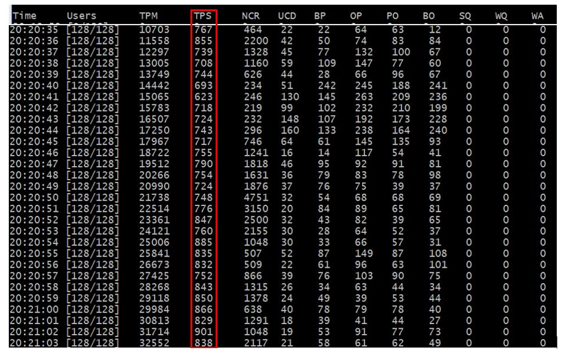

5. You can Scale the number of CPU UP or Down dynamically and obser TPS number change accordingly.

6. Switch to OCI screen and from your ATP instance details page Click **Service Console**. From Service Console you can observe Performance data under **Overview** and **Activity** tabs.
     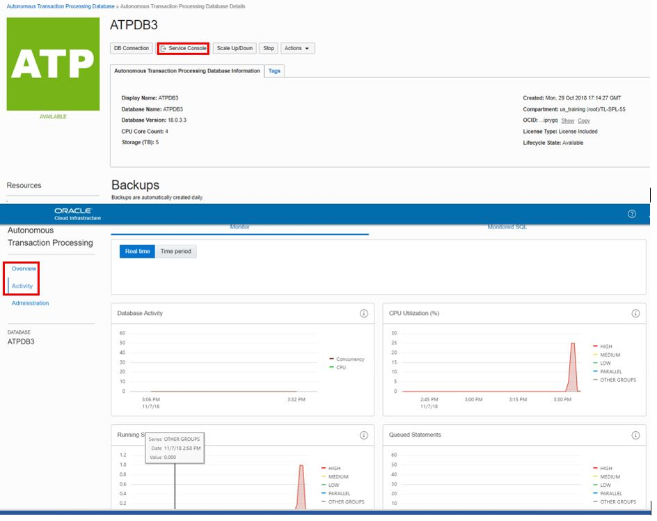

*We have now demonstrated the Dynamic Scaling of CPU for an ATP instance. We also successfully generated load traffic and observed CPU usage and other indicators for the ATP instance.*

## Step 5: Create auth token for the user to connect to ATP instance

In this section we will generate auth token for the user of this lab. An Auth token is an Oracle-generated token that you can use to authenticate with third-party APIs and Autonomous Database instance.

1. In OCI console Click the user icon (top right)  then **User settings**. Under Resrouces Click **Auth Token**, then **Generate Token**. In pop up window provide a description then Click **Generate Token**.

     
     

2.  Click **Copy** and save the token in Notepad.**Do not close the window without saving the token as it can not be retrieved later**

     

3. Note down your user name

    **Next we will connect to this ATP instane using SQL developer.**

    **Screen shots for SQL developer are from 18.1.0 version**

4. Launch SQL devleoper using Apps icon and Click **+** to create a new connection

     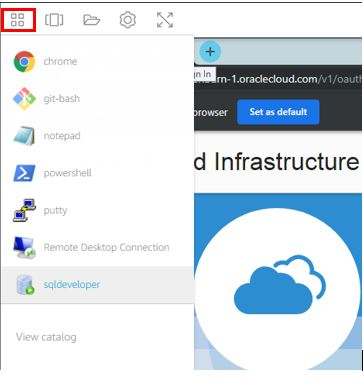
     

5. Fill out the diaog box:

      - Connection Name: Provide a name
      - Username: admin
      - Password: Password used at ATP instance creation
      - Save Password: Check the flag
      - Connection Type: Cloud PDB
      - Configuration file: File that was dowloaded from ATP service console (Client credenitla zip file)
      - Keystore password: Password you provided when downloading the client credentials file 

      **NOTE:** If using SQL devleoper 18.2.0 or higher this field is not available and not required


      - Service: <ATP_Instance_name>_medium 
      - Click **Save**
      - Click **Connect** and verify Successful connection

     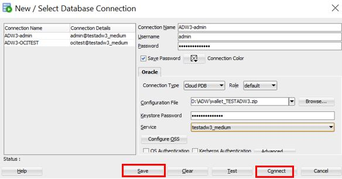

6. Create a new user called ocitest and grant the DWROLE to ocitest user. . Also grant this user table space quota to upload the data later on. Enter commands:
   
    ```
    <copy>
    create user ocitest identified by P#ssw0rd12##;
    </copy>
    ```

    ```
    <copy>
    Grant dwrole to ocitest;
    </copy>
    ```

    ```
    <copy>
    Grant UNLIMITED TABLESPACE TO ocitest;
    </copy>
    ```

7. Verify the user was created

     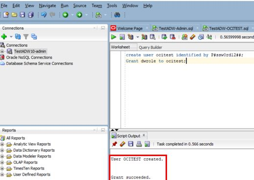

8. Create another connection in SQL Developer (same steps as abovea), use following values:


    - Connection Name: Provide a name
    - Username: OCITEST
    - Password:  P#ssw0rd12## 
    - Save Password: Check the flag
    - Connection Type: Cloud PDB
    - Configuration file: File that was dowloaded from ATP service console (Client credenitla zip file)
    - Keystore password: Password you provided when downloading the client credentials file 

    **NOTE:** If using SQL devleoper 18.2.0 or higher this field is not available and not required.

    - Service: YOUR\_ATP\_INSTANCE\_NAME\_medium 
    - Click **Save**
    - Click **Connect** and verify Successful connection

     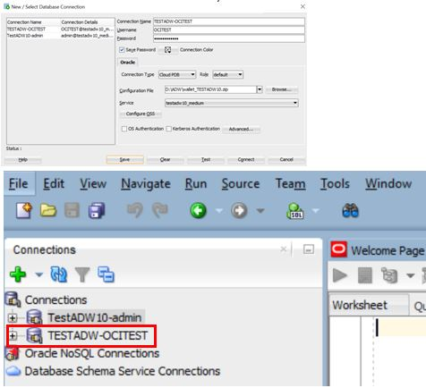

9. We will now download a text file from OCI Object storage. This file has commands that will be used to upload data into ATP and retreive it. Open a new browser tab and copy/paste or Enter URL;

    https://objectstorage.us-ashburn-1.oraclecloud.com/n/us_training/b/Lab-images/o/ADW-File.txt

    *NOTE: No spaces in URL*

10. Using OCITEST user store your Object Storage credenitals. From the ADW-File.txt content copy and paste the commands under  
/**** Set Definitions ****/ section. The commands will look like below:

    **NOTE:** user name shoud be your user name and password should be the Auth Token generated earlier.


    Begin     

    DBMS\_CLOUD.create\_credential (
        
    credential\_name => 'OCI\_CRED\_NAME',

    username => '<YOUR\_USER\_NAME>',

    password => '<AUTH\_TOKEN>'

    ) ;

    end;

11. Verify **PL/SQL Procedure successfully completed** message is displayed.

     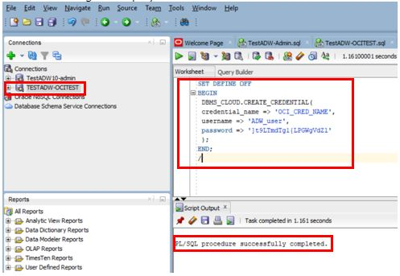

12. Create a new table (We will load data from file in Object Storage to this table). From the ADW-File.txt content copy and paste the commands undrer /**** Create Table ****/ section. The commands will look like below

    CREATE TABLE CHANNELS (

    NAME VARCHAR2(20) NOT NULL ,

    gender VARCHAR2(20) NOT NULL ,

    NAME_total NUMBER NOT NULL );


13. Verify **Table CHANNELS created** message

     

14. Load data from file in Object Storage to newly created table.

    **NOTE:** A data file with 1000s of records exists in OCI Object storage and we will use this file records to populate ATP From the ADW-File.txt content copy and paste the commands undrer  /**** DBMS ****/ section. The commands will look like below

    begin

    dbms\_cloud.copy\_data(

    table\_name =>'CHANNELS',

    credential\_name =>'OCI\_CRED\_NAME',

    file\_uri\_list =>'https://swiftobjectstorage.us-ashburn-1.oraclecloud.com/v1/us_training/Lab-images/century\_names\_new.txt',
    format => json\_object('delimiter' value ',', 'trimspaces' value 'lrtrim')

    );

    end;

15. Verify **PL/SQL Procedure successfully completed** message

     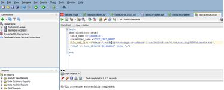

16. We will now query the table and veirfy the data Enter command:
    ```
    <copy>
    select * from channels;
    </copy>
    ```

     

*We have successfully deployed a ATP instance,populated a table using a file stored in Object storage and successfully run a query against the table.*

## Step 6: Create a Machine Learning User and access data from ATP instance

In this section we will create a Machine Learning User and access data that was uploaded. We will also explore other options avaialble in ATP.

1. Switch to OCI console. From your ATP instance details page Click **Service Console**. This will open a new tab. In the new tab Click **Administration** and then **Manage Oracle ML Users**.

     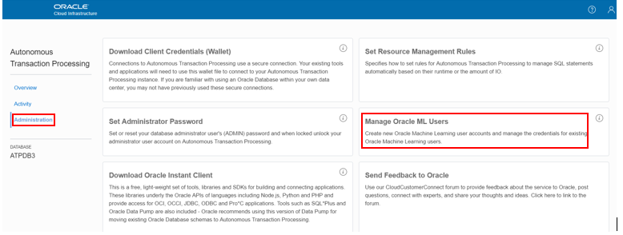

2. This will open a new tab (Machine Learning User Administration). Click Create and in the new window fill out the dialog box. Ensure to un-check 'Generate Password ... ' flag so that you can provide your own password. Click **create** to create a new user 

     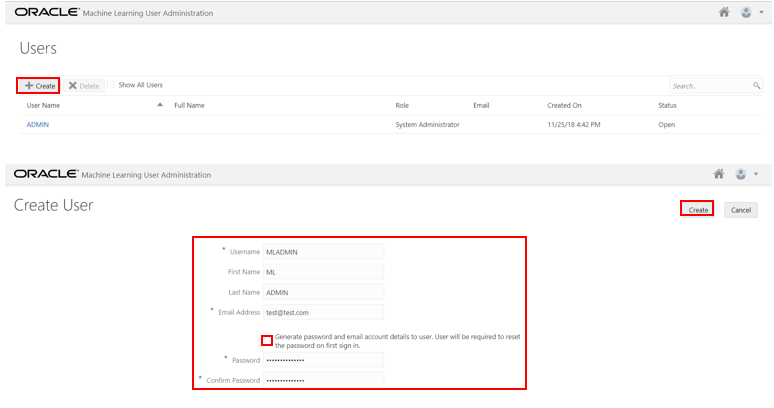

3. Verify the user is created, Click the home button. This will open a new tab, the login fileds should be filled out (if not then fill them out) and login as newly created Machine Lerning user.

     
     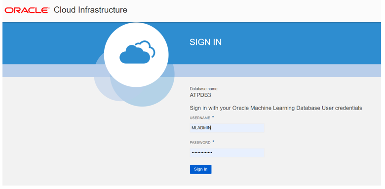

4. Verify new project space is created and all the options (Run SQl statement, Run SQL script etc) are available.

     

5. Now we need to assign priviliges to this new user so it can access the data uploaded by the user we created earlier. Switch to SQL developer window and  from admin tab,Enter command:

    ```
    <copy>
    bash
    grant read any table to <USER_NAME>;
    </copy>
    ```

    **Note :** USER_NAME is the user you created earlier in this section. (We are granting read any table permissions though for specific deployment the admin should authorize appropriate access  level), For example : **grant read any table to MLADMIN**

     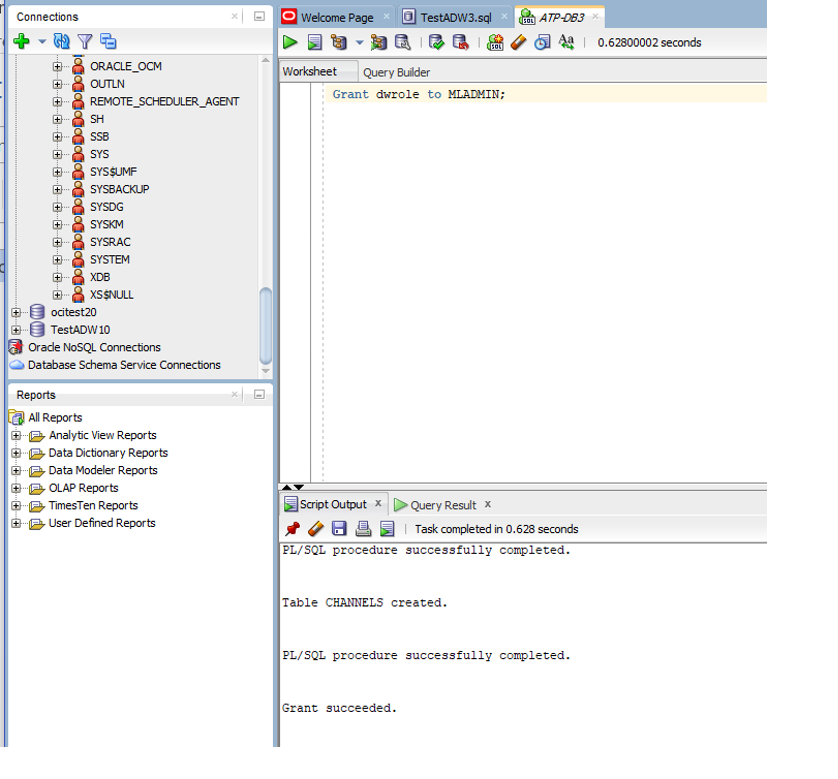

6. Switch back to Machine learning User console window. Click **Run SQL Statements**

     

7. In the SQL statement section, Enter statement:

    ```
    <copy>
    bash
    %sql
    select * from <USER_NAME>.channels;
    </copy>
    ```
    Click the run icon (right end of sql statement) Verify all the data is uploaded

    **Note:** The USER_NAME will be the user that uploaded the data. In this lab we had used ocitest as the user that uploaded the data. Hence the statement for this
    user will be , **select * from ocitest.channels;** 

     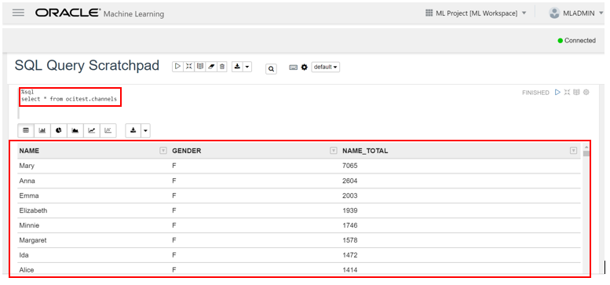

8. Now you can look at this data in different charts form available options

     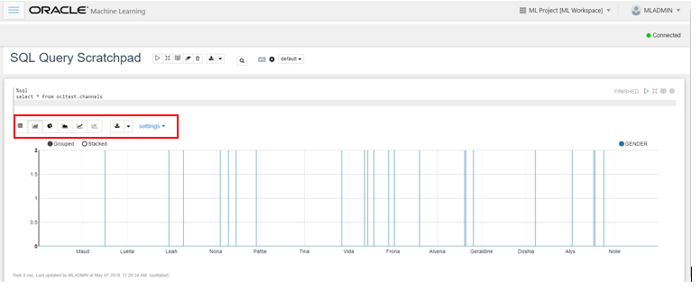

    **This is just an example of simple data that we uploaded but as you can see very complex data can be uploaded,accessed and analyzed using this feature.**

9. There are some example data sets that can be accessed by Clicking Home under Servies menu from Machine Learning user tab

     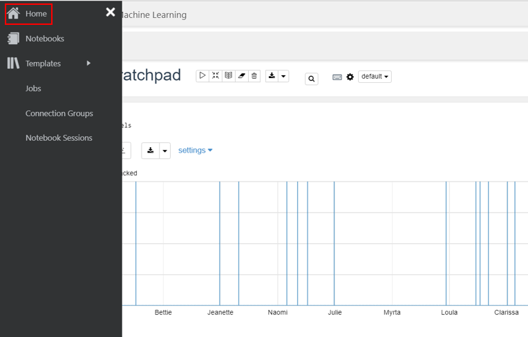

10. Click **Examples** and then any of the available data set

     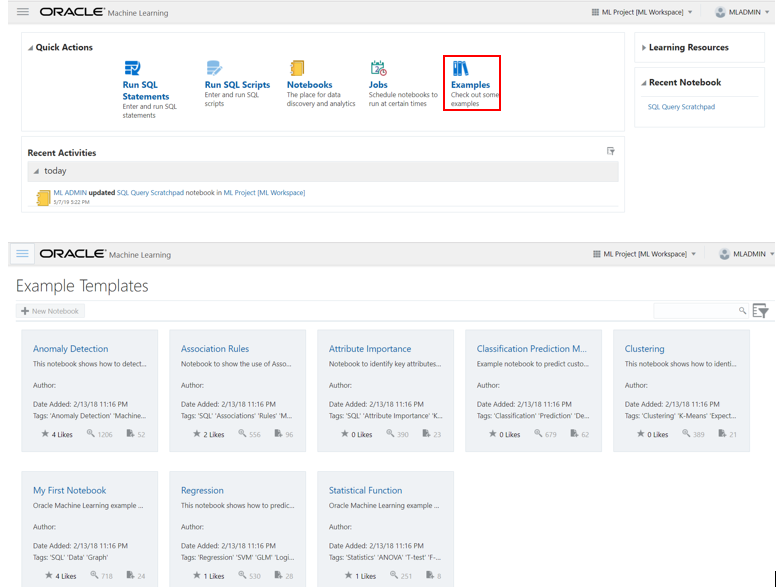

*Next we will delete the resources we created which will complete this lab.*

## Step 7: Delete the resources
*NOTE: As a practice user will need to figure out any errors encountered during deletion of resources.*

1. Switch to  OCI console window

2. From your ATP details page, Hover over the action icon  and Click **Terminate**. In the confimration windoe provide the ATP instance name and Click **Terminate Database**

     

3. From OCI services menu Click **Instances** under Compute

4. Locate first compute instance, Click Action icon and then **Terminate** 

     


5. Make sure Permanently delete the attached Boot Volume is checked, Click Terminate Instance. Wait for instance to fully Terminate

     

6. From OCI services menu Click **Virtual Cloud Networks** under Networking, list of all VCNs will 
appear.

7. Locate your VCN , Click Action icon and then **Terminate**. Click **Delete All** in the Confirmation window. Click **Close** once VCN is deleted

     


## Acknowledgements
*Congratulations! You have successfully completed the lab.*

- **Author** - Flavio Pereira, Larry Beausoleil
- **Adapted by** -  Yaisah Granillo, Cloud Solution Engineer
- **Last Updated By/Date** - Yaisah Granillo, June 2020

## See an issue?
Please submit feedback using this [form](https://apexapps.oracle.com/pls/apex/f?p=133:1:::::P1_FEEDBACK:1). Please include the *workshop name*, *lab* and *step* in your request.  If you don't see the workshop name listed, please enter it manually. If you would like for us to follow up with you, enter your email in the *Feedback Comments* section. 