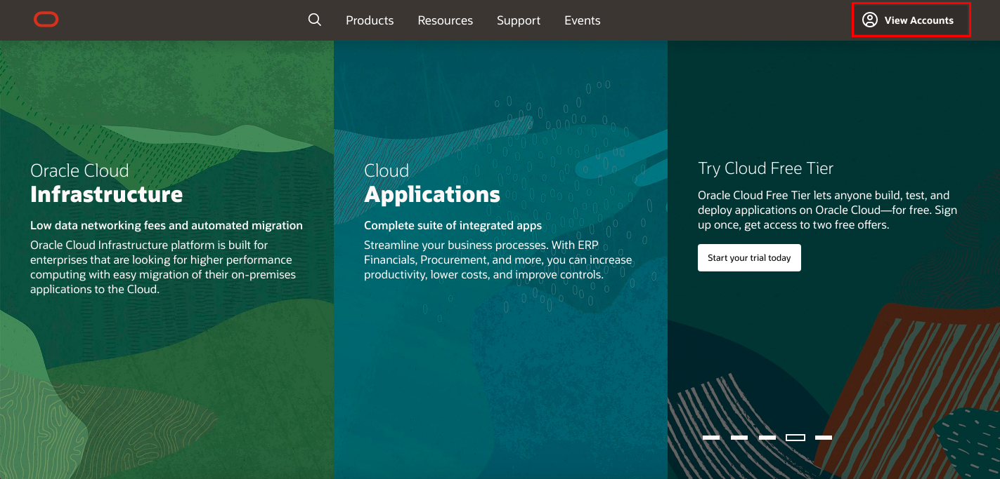
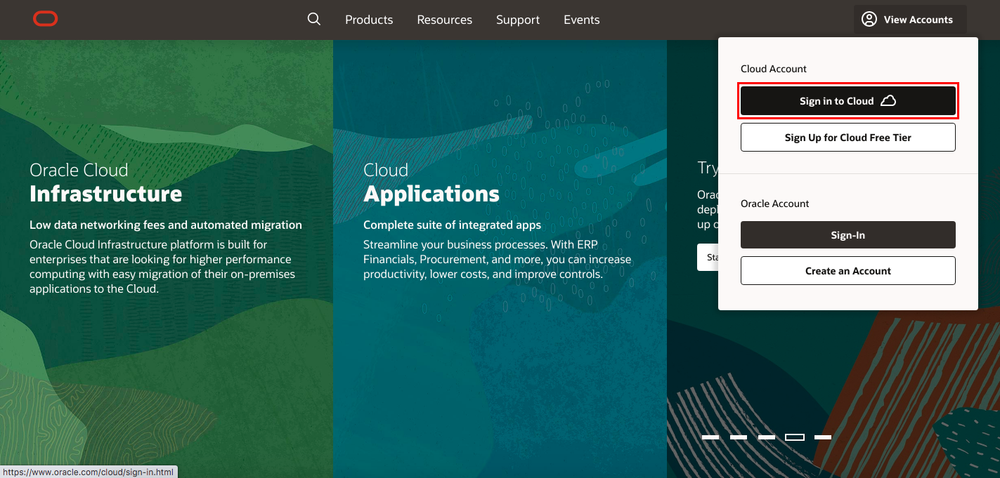
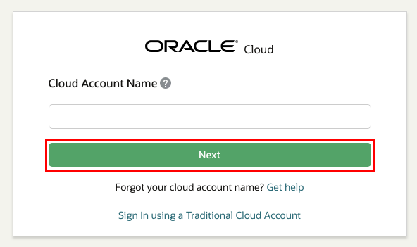
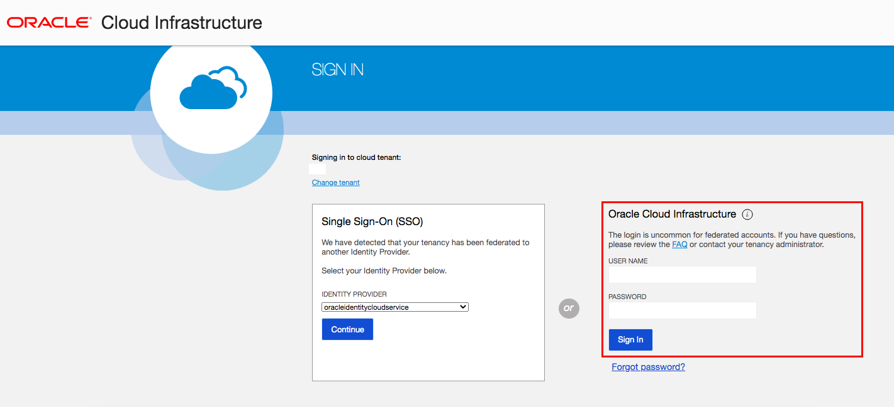
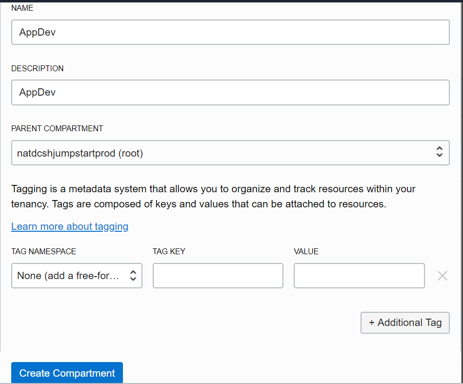
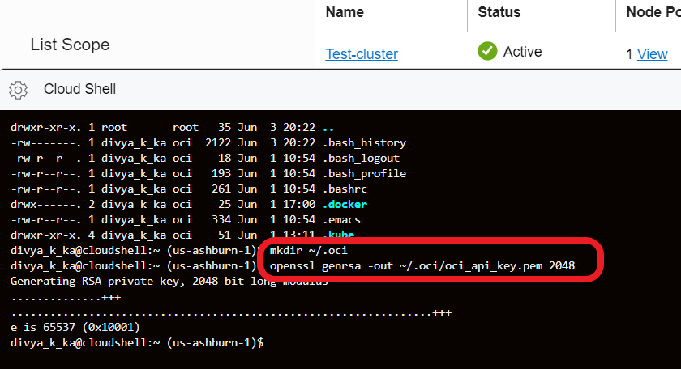
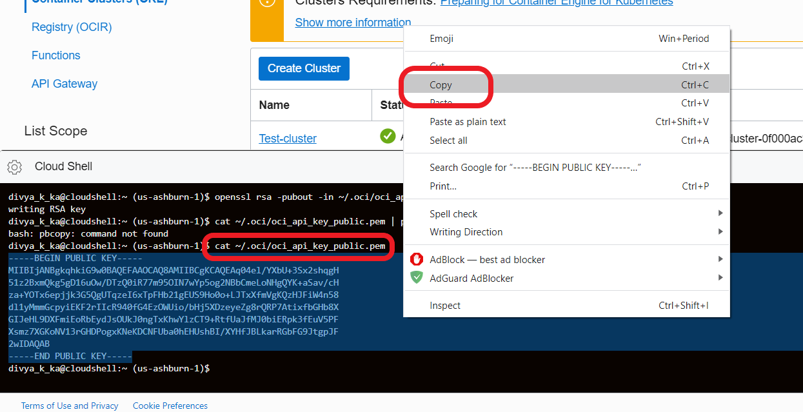
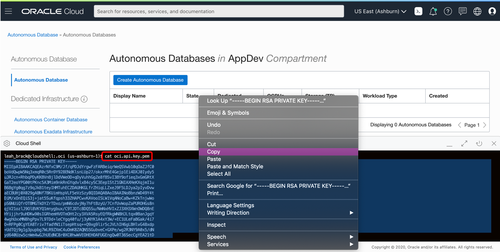
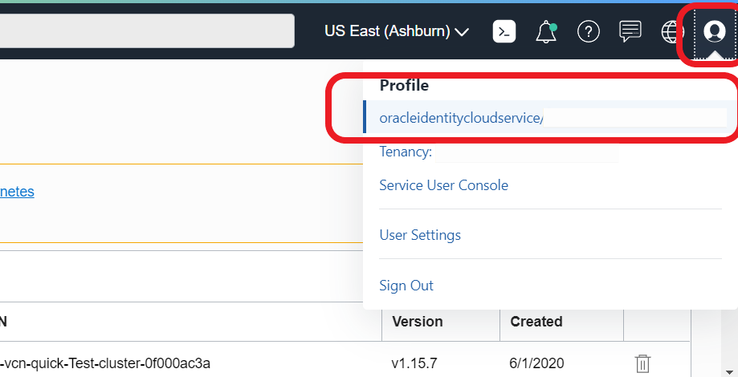

# Setup Cloud Environment

## Introduction

You will take on the persona of an Operations Engineer. You will initiate the Oracle cloud environment that will be used to create and deploy your microservices applications. This environment will be contained within a cloud Compartment, and communication within the Compartment will be via a Virtual Cloud Network (VCN). The Compartment and VCN will isolate and secure the overall environment. You will deploy two Oracle Cloud Services for this environment. An Oracle Cloud Developer Image will be used to develop and deploy your microservices code. The microservices will access data within an Autonomous Transaction Processing (ATP) Cloud Service.

To deploy these services, you will use Terraform, a tool for building, changing, and versioning infrastructure safely and efficiently. It is an important tool for anyone looking to standardize IaaS (Infrastructure as a Service) within their organization.

Estimated time: 20 minutes

### Objectives
- Log into OCI Tenancy.
- Setup Oracle Cloud Infrastructure (OCI) components.  

***We recommend that you create a notes page to write down all of the credentials you will need.***

### Prerequisites
- Your Oracle Cloud Trial Account
- You have already applied for and received your Oracle Cloud Free Tier Account.

*In addition to the workshop*, feel free to watch the walkthrough companion video by clicking on the following image:
[](youtube:wIoLDX7iWXo)


## **STEP 1:** Log into OCI Tenancy

   Log in to your OCI dashboard and retrieve information required to create resources.

1. From any browser go to oracle.com to access the Oracle Cloud.

    [https://www.oracle.com/](https://www.oracle.com/)

  

2. Click the icon in the upper right corner.  Click on **Sign in to Cloud**.   

     

3. Enter your **Cloud Account Name** in the input field and click the **Next** button.  *NOTE: this is NOT your email. This is the name of your tenancy noted in the email you received during signup. Do NOT click the Sign-In button, this will take you to Single Sign-On, not the Oracle Cloud.*

     

4. Enter your username (this may be your email address) and password and click on **Sign In**.  

     

5. Once you log in you will see a page similar to the one below. Click on "Infrastructure Dashboard."

  


## **STEP 2:** Basic OCI Infrastructure Setup

   1. Open the navigation menu. Under Governance and Administration, go to **Identity** and click **Compartments**. From this screen, you will see a list of compartments, click **Create Compartment**.

   

   

2. Enter the following:
      - Name: Enter **"AppDev".**
      - Description: Enter a description (required), for example: "AppDev compartment for the getting started tutorial". Avoid                   entering confidential information.
      - Parent Compartment: Select the compartment you want this compartment to reside in. Defaults to the root compartment (or                 tenancy).
      - Click **Create Compartment**.
      - Your compartment is displayed in the list.

  


To access Cloud Shell:

3. Click the Cloud Shell icon in the Console header. Note that the OCI CLI running in the Cloud Shell will execute commands against         the region selected in the Console's Region selection menu when the Cloud Shell was started.

  

  

4. Execute below commands in cloudshell. We are going generate a public and private key pair.

    ```
    <copy>
    mkdir ~/.oci
    openssl genrsa -out ~/.oci/oci.api.key.pem 2048
    chmod go-rwx ~/.oci/oci.api.key.pem
    openssl rsa -pubout -in ~/.oci/oci.api.key.pem -out ~/.oci/oci.api.key.public.pem
    cat ~/.oci/oci.api.key.public.pem
    </copy>
    ```

  Below are steps for reference

  

  

5. Make sure to **copy the generated public key** and paste in a notepad, we will need it for the next step.

  

6. We will also need to copy the generated **private key** and paste it into a notepad, we will use it later on. Enter in the following command:

    ```
    <copy>
    cat ~/.oci/oci.api.key.pem
    </copy>
    ```
7. Make sure to include ----BEGIN RSA PRIVATE KEY---- and ----END RSA PRIVATE KEY----

  

8. Now, we need to generate a **fingerprint**. Click on the user profile icon in the top right and click your username.

  

9. Now, scroll down to **API Keys** section and click **Add Public Key** to paste the **oci.api.key.public.pem** that you copied

  

  

10. Make sure to copy the **fingerprint** and paste in a notepad, we will use it later in this lab.

*You are ready to proceed to the next lab...*

## Acknowledgements

- **Author** - Satyajeet Joshi
- **Last Updated By/Date** - Kamryn Vinson, October 2020


## Need Help?
Please submit feedback or ask for help using our [LiveLabs Support Forum](https://community.oracle.com/tech/developers/categories/livelabsdiscussions). Please click the **Log In** button and login using your Oracle Account. Click the **Ask A Question** button to the left to start a *New Discussion* or *Ask a Question*.  Please include your workshop name and lab name.  You can also include screenshots and attach files.  Engage directly with the author of the workshop.

If you do not have an Oracle Account, click [here](https://profile.oracle.com/myprofile/account/create-account.jspx) to create one.   Please include the workshop name   and lab in your request.
