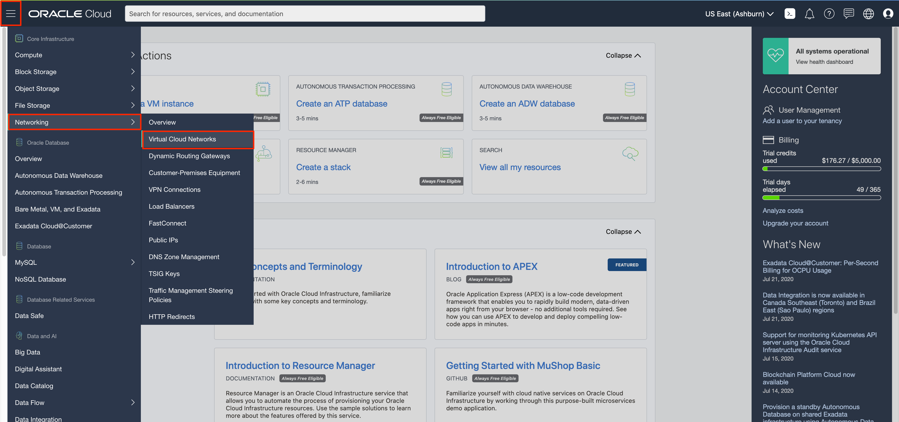
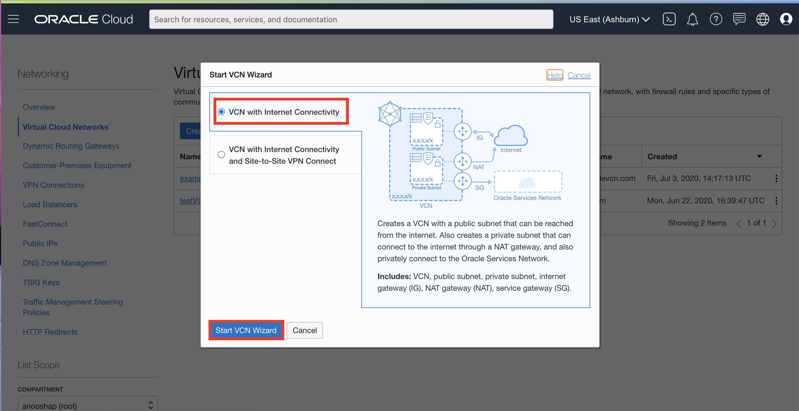
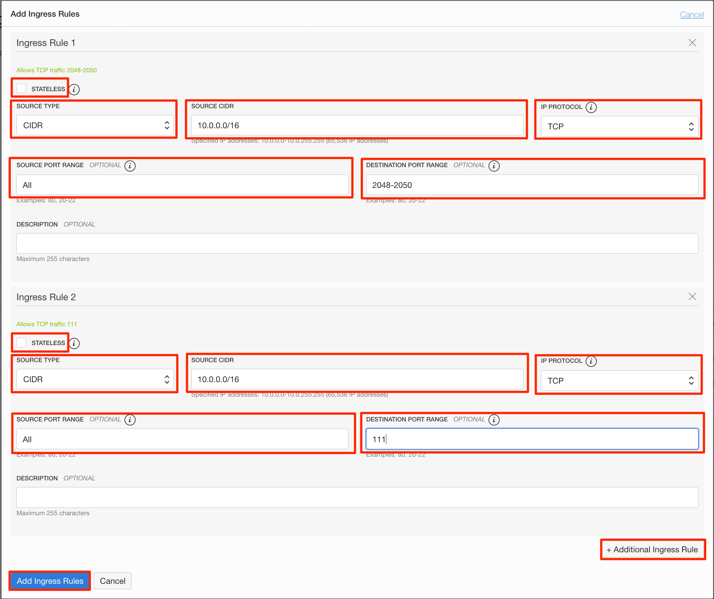
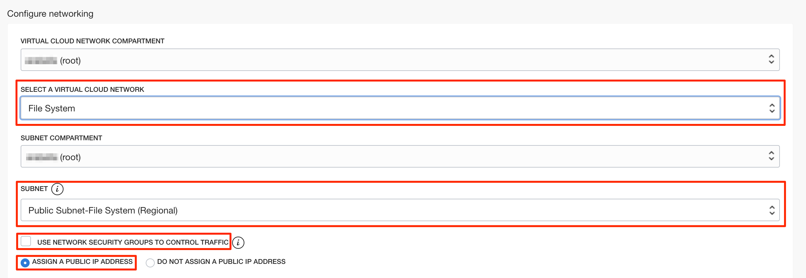
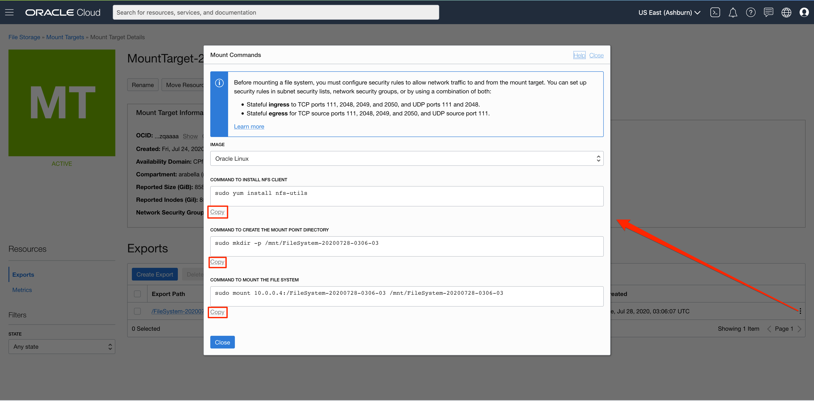
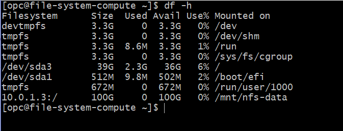
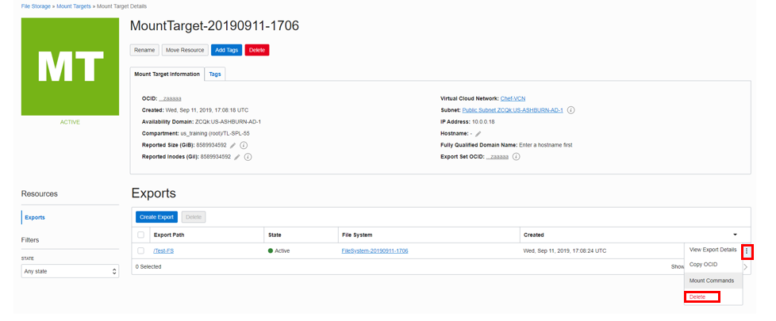

# File System Storage Service

## **Introduction**

Welcome to the Cloud Storage (File System Storage) self-paced lab from Oracle!

Oracle Cloud Infrastructure File Storage Service provides a durable, scalable, distributed, enterprise-grade network file system. You can connect to a File Storage Service file system from any bare metal, virtual machine, or container instance in your Virtual Cloud Network (VCN). You can also access a file system from outside the VCN using Oracle Cloud Infrastructure FastConnect and Internet Protocol security (IPSec) virtual private network (VPN).
		
### Objectives	
- Create and mount File Storage System to a compute instance
- Verify availability of the File Storage system

### Some Key points

*We recommend using Chrome or Edge as the browser. Also set your browser zoom to 80% if you are splitting your screen into two browsers.*

- All screenshots are examples ONLY.

- Do NOT use compartment name and other data from screenshots. Only use data (including compartment name) provided in the *content* section of the lab.

- MacOS Users can use command+C / command+V or right-click on the content and select Copy / Paste to copy and paste inside the OCI Console.

- Login credentials are provided later in the guide (scroll down). Every User MUST keep these credentials handy.


    **Cloud Tenant Name**

    **User Name**

    **Password**

    **Compartment Name (Provided Later)**

*Note: OCI UI is being updated, thus some screenshots in the instructions may be different from the actual UI*

### Prerequisites

1. [OCI Training](https://cloud.oracle.com/en_US/iaas/training)

2. [Familiarizing with OCI console](https://docs.us-phoenix-1.oraclecloud.com/Content/GSG/Concepts/console.htm)

3. [Overview of Networking](https://docs.us-phoenix-1.oraclecloud.com/Content/Network/Concepts/overview.htm)

4. [Familiarizing with Compartment](https://docs.us-phoenix-1.oraclecloud.com/Content/GSG/Concepts/concepts.htm)

5. [Connecting to a compute instance](https://docs.us-phoenix-1.oraclecloud.com/Content/Compute/Tasks/accessinginstance.htm)

6. Completed **Lab 1: Generate SSH Keys** on the Contents menu on the right

*Note: OCI UI is being updated, thus some screenshots in the instructions may be different from the actual UI*


## **Step 1**: Sign in to OCI Console and Create VCN

* **Tenant Name:** {{Cloud Tenant Name}}
* **User Name:** {{User Name}}
* **Password:** {{Password}}
* **Compartment:**{{Compartment}}


1. Sign in using your cloud tenant name, user name, and password. Use the login option under **Oracle Cloud Infrastructure**.
    

2. In your OCI Console (homepage), click navigation menu on the top-left corner. From OCI Services menu, under **Networking**, click **Virtual Cloud Networks**.
    

    Select the compartment assigned to you from drop-down menu on left, and click **Start VCN Wizard**

    
    *NOTE: Ensure the correct Compartment is selected under COMPARTMENT list*

3. Click **VCN with Internet Connectivity** and click **Start VCN Wizard**.
   

4. Fill out the dialog box:

      - **VCN NAME**: Provide a name
      - **COMPARTMENT**: Ensure your assigned compartment is selected
      - **VCN CIDR BLOCK**: Provide a CIDR block (10.0.0.0/16)
      - **PUBLIC SUBNET CIDR BLOCK**: Provide a CIDR block (10.0.1.0/24)
      - **PRIVATE SUBNET CIDR BLOCK**: Provide a CIDR block (10.0.2.0/24)
      - Click **Next**

    

5. Verify all the information and click **Create**

6. This will create a VCN with the following components:

    *VCN, Public subnet, Private subnet, Internet gateway (IG), NAT gateway (NAT), Service gateway (SG)*

7. Click **View Virtual Cloud Network** to display your VCN details.
	

8. In your VCN Details page, click **Security Lists** and then **Default Security list for YOUR\_VCN\_NAME**

	

9. In Security List Details page, click **Add Ingress Rules**.
    
    Click **+Additional Ingress Rule** and add below two rules:
    
    *NOTE: You will be adding **TWO** Ingress Rules, so do not click the blue confirm **Add Ingress Rule** button until you finish adding Two Ingress Rules.*

    Rule # 1 for access of NFS and NLM traffic with Destination Port Range of 2048-2050. (Type the values).

    - **Make sure STATELESS Flag in un-checked**
    - **SOURCE TYPE:** CIDR
    - **SOURCE CIDR:** 10.0.0.0/16
    - **IP PROTOCOL:** TCP
    - **SOURCE PORT RANGE:** All
    - **DESTINATION PORT RANGE:** 2048-2050

    Rule #2 for allowing traffic to a Destination Port Range of 111 for the NFS rpcbind utility.

    - **Make sure STATELESS Flag in un-checked**
    - **SOURCE TYPE:** CIDR
    - **SOURCE CIDR:** 10.0.0.0/16
    - **IP PROTOCOL:** TCP
    - **SOURCE PORT RANGE:** All
    - **DESTINATION PORT RANGE:** 111

    

10. Click **Add Ingress Rules**

## **Step 2**: Create File System Storage

In this section, we will create File System Storage.

1. Click navigation button to open OCI Services menu. Under **File Storage**, click **File Systems**
	

2. Click **Create File System**
    

3. Under **Export Information**, click **Edit Details**. 
      - Change **EXPORT PATH** to an easy-to-remember name.
   
   Under **Mount Target Information**, click **Edit Details**. 
      - Click **CREATE NEW MOUNT TARGET**, select the VCN you justed created for **VIRTUAL CLOUD NETWORK**. 
      - Choose **Public Subnet-YOUR\_VCN\_NAME (Regional)** for **SUBNET**.
   
   Click **Create**

     

     

4. OCI console will show your File System details. Under **Exports**, click your mount target name under **Mount Target**. In Mount Target Details page, note down the IP address.

		
	

We now have a File System Storage created. Next we will use your SSH key pair to connect to a compute instance and mount the file system.

## **Step 3**: Create and Connect to Compute Instance

You are assumed to have generated your SSH Keys in the *Cloud Shell*.

1. In your OCI console, click the navigation button. Under **Compute**, click **Instances**.
   	

2. On the left sidebar, select the **Compartment** in which you placed your VCN under **List Scope**. Click **Create Instance**. 
   	
    
    Fill out the dialog box:

     - **NAME**: Enter a name
     - **Compartment**: Select the compartment in which you placed your VCN
     - **Image or operating system**: For the image, we recommend using the latest *Oracle Linux* available. Click **Change Image** to see available images' details.

    

    Click **Show Shape, Network and Storage Options**:
     - **Availability Domain**: Select an availability domain

    Click **Change Shape**:
     - **Instance Type**: Select Virtual Machine
     - **Instance Shape**: Select a VM shape

    	
	

    Under **Configure networking**:
     - **Virtual Cloud Network Compartment**: Select your compartment in whih you created your VCN
     - **Select a Virtual Cloud Network**: Choose the VCN you created in Step 1
     - **Subnet Compartment:** Choose the compartment in whih you created your VCN
     - **Subnet:** Choose the Public Subnet (Public Subnet-Name\_of\_VCN) under **Public Subnets**
     - **Use Network Security Groups to Control Traffic** : Leave un-checked
     - **Assign a public IP address**: Check this option

     

      - **Boot volume:** Leave the default
      - **Add SSH keys:** Choose **Paste SSH Keys** and paste the public key you created and saved in Lab 1.
    

3. Click **Create**

    *Note: If 'Service limit' error is displayed, choose a different shape from VM.Standard2.1, VM.Standard.E2.1, VM.Standard1.1, VM.Standard.B1.1, or choose a different Availability Domain.*

4.  Wait for instance to be in **Running** state. Go to the directory where you created you SSH Keys.
   
   For example, in Cloud Shell, enter command:
    ```	
	<copy>cd .ssh</copy>
	```

5.  Enter **ls** to verify your SSH key file exists

6.  Enter command
    ```
    <copy>bash</copy>
    ```

    ```
    ssh -i <SSH_Key_Name> opc@<PUBLIC_IP_OF_COMPUTE>
    ```

    *Hint: If 'Permission denied error' is seen, ensure you are using '-i' in the ssh command. You MUST type the command, do NOT copy and paste ssh command.*

7.  Enter 'yes' when prompted for security message

     

8.  Verify opc@COMPUTE\_INSTANCE\_NAME appears on the prompt

## **Step 4**: Mount the File System Storage to Compute Instance

Users of Ubuntu and Linux operating systems (we launched a Oracle Linux instance) can use the command line to connect to a file system and write files. Mount targets serve as file system network access points. After your mount target is assigned an IP address, you can use it to mount the file system. You need to install an NFS client and create a mount point. When you mount the file system, the mount point effectively represents the root directory of the File Storage system, allowing you to write files to the file system from the instance.

1. Click the navigation button, under **File Storage**, click **File Systems**. Click your File System. Under **Exports**, click the mount target name under **Mount Target**. Click Action icon on the right, and select **Mount Commands**. Execute the three commands in Mount Commands in your Cloud shell / Terminal. *If you finish this part, you can skip part 2-4 in this Step.*

    
      
2. After you ssh to your compute instance, enter command:

    ```
    <copy>sudo yum install nfs-utils</copy>
    ```
    (This is just to ensure nfs-utils is installed)


3. Enter command:

    ```
    <copy>sudo mkdir -p /mnt/nfs-data</copy>
    ```
    to create a mount point.

4. Mount the file system, enter command:

    ```
    <copy>bash</copy>
    ```

    ```
    <copy>sudo mount 10.x.x.x:/&lt;EXPORT_PATH_NAME> /mnt/nfs-data</copy>
    ```
    **NOTE:** The 10.x.x.x should be replaced with the IP of File System Storage. EXPORT\_PATH\_NAME should be replaced with Export path name used earlier. (Example: If 10.0.0.3 is the IP of File System Storage, and '/' is the EXPORT\_PATH\_NAME, then **sudo mount 10.0.0.3:/ /mnt/nfs-data**).

5. Enter command:

    ```
    <copy>df -h</copy>
    ```
    and
    ```
    <copy>mount | grep /mnt/nfs-data</copy>
    ```
    and verify the mounted File System Storage.

    *Note: You may need to change `nfs-data` to the mount point directory you just created.*

     

     

6. Go to your VCN instance, click **Security Lists** and then **Default Security List for YOUR\_VCN\_NAME**. If you do NOT see any Ingress Rule with *ICMP* as IP Protocal and want to ping the mount point, then you can add an Ingress Rule:

      - Source CIDR: 0.0.0.0/0
      - IP Protocol: ICMP
      - Leave other fields blank

    *Note: If you already had one or multiple ICMP Ingress Rules, you can skip this part.*

7. **Optional Step**. Second compute instance can be created and have the same file system mounted on it, following Step 3 and Step 4.

You have now mounted Enterprise grade File System Storage created in OCI to your compute instance. You can place files in this file system. All other VM instances that have mounted this file system will have access to it.

## **Step 5**: Delete the Resources

In this section, we will delete all the resources we created in this lab.

### Delete File System Storage
1. From OCI Services menu, Click **File Systems**, then click your File System name.

2. Under Exports, click the action icon and select **Delete**, and confirm **Delete**.

     

3. Verify there is no data under **Exports**. It may take some time.

4. Click **File Systems** on the top of the page, click the action icon next to your File System, and click **Delete**.

### Delete Compute Instance

1. From OCI services menu, under **Compute**, click **Instances**

2. Locate your compute instance, click action icon, and then **Terminate**

     

3. Make sure **Permanently delete the attached Boot Volume** is ***checked***, click **Terminate Instance**. Wait for instance to fully terminated

     

### Delete VCN

1. From OCI services menu, under **Networking**, click **Virtual Cloud Networks**. A list of all VCNs will appear.

2. Locate your VCN, click Action icon, and then **Terminate**. Click **Terminate All** in the Confirmation window. Click **Close** once VCN is deleted

     

*Congratulations! You have successfully completed the lab.*

## Acknowledgements

- **Author** - Flavio Pereira, Larry Beausoleil
- **Adapted by** -  Yaisah Granillo, Cloud Solution Engineer
- **Contributors** - Isa Kessinger, QA Intern, LiveLabs QA Team
- **Last Updated By/Date** - Arabella Yao, Product Manager Intern, DB Product Management, July 2020

## See an issue?
Please submit feedback using this [form](https://apexapps.oracle.com/pls/apex/f?p=133:1:::::P1_FEEDBACK:1). Please include the *workshop name*, *lab* and *step* in your request.  If you don't see the workshop name listed, please enter it manually. If you would like for us to follow up with you, enter your email in the *Feedback Comments* section.
