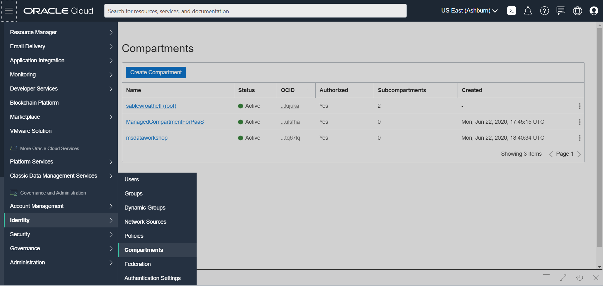
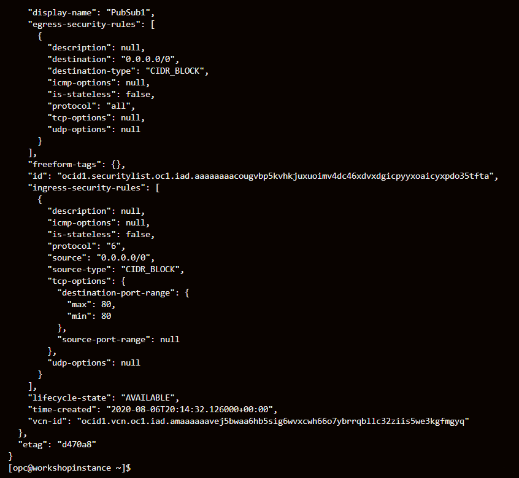

#  Getting started with the OCI Command Line Interface (CLI)

## Introduction

Automation is a critical component when it comes to managing Cloud workloads at scale.  Although the OCI UI is user-friendly, many tasks may be repetitive and could further reduce an administrator's effort if they can be automated. The OCI Command Line Interface (CLI) is a toolkit developed in Python that is capable of performing almost any task that can be executed in the OCI UI.  The toolkit runs on Linux, Mac, and Windows, making it easy to write BASH or PowerShell scripts that perform a series of commands when executed.

In this lab, you will use Oracle Cloud Shell (which has the OCI CLI preinstalled) to create and list resources. Upon completion of this lab you should have a good understanding of how to use the OCI CLI to automate common tasks in OCI.

## **STEP 1**: Use the CLI to create a VCN with one public subnet

1. In the Cloud Shell, enter the following command:

    ```
    <copy>
    oci iam availability-domain list
    </copy>
    ```

    This will list all availability domains in the current region.  Make note of one of the availability domain names.  It should look something like this `nESu:US-ASHBURN-AD-1`.  You will use this in a future step.

    

2. Save the availability domain as a shell variable:

    ```
    <copy>
    AD_NAME="<insert the OCID>"
    </copy>
    ```

3. Return to the OCI Console and navigate to Identity -> Compartments.  Copy the OCID of the assigned compartment.

    

    

4. Save the copied OCID value as `COMPARTMENT_ID`.

    ```
    <copy>
    COMPARTMENT_ID="<compartment OCID value>"
    </copy>
    ```

5. Create a new virtual cloud network with a unique CIDR block.  You will need the OCID of your compartment.

    ```
    <copy>
    oci network vcn create --cidr-block 192.168.0.0/16 -c $COMPARTMENT_ID --display-name CLI-Demo-VCN --dns-label clidemovcn
    </copy>
    ```

    

6. Save the `id:` of the resource after it is created as `VCN_OCID`.

    ```
    <copy>
    VCN_OCID="<vcn id>"
    </copy>
    ```

7. Enter the following command to list VCN's:

    ```
    <copy>
    oci network vcn list --compartment-id $COMPARTMENT_ID
    </copy>
    ```

    

    *Note: It should return the details of the VCN you created.*

8. Create a new security list.

    ```
    <copy>
    oci network security-list create --display-name PubSub1 --compartment-id $COMPARTMENT_ID --vcn-id $VCN_OCID --egress-security-rules  '[{"destination": "0.0.0.0/0", "destination-type": "CIDR_BLOCK", "protocol": "all", "isStateless": false}]' --ingress-security-rules '[{"source": "0.0.0.0/0", "source-type": "CIDR_BLOCK", "protocol": 6, "isStateless": false, "tcp-options": {"destination-port-range": {"max": 80, "min": 80}}}]'
    </copy>
    ```

    

9.  Save the resource `id` as `SECURITY_LIST_OCID`:

    ```
    <copy>
    SECURITY_LIST_OCID="<security list ocid>"
    </copy>
    ```

10. Create a public subnet.

    ```
    <copy>
    oci network subnet create --cidr-block 192.168.10.0/24 -c $COMPARTMENT_ID --vcn-id $VCN_OCID --security-list-ids '["$SECURITY_LIST_OCID"]'
    </copy>
    ```

    

    *Note: You have the option to specify up to 5 security lists and a custom route table.  In this case, we are only assigning one security list and allowing the system to automatically associate the default route table.*

11. Save the ``id:`` of the resources after it is created as `SUBNET_OCID`.

    ```
    <copy>
    SUBNET_OCID="<subnet id>"
    </copy>
    ```

12. Create an Internet Gateway.  You will need the OCID of your VCN and Compartment.

    ```
    <copy>
    oci network internet-gateway create -c $COMPARTMENT_ID --is-enabled true --vcn-id $VCN_OCID --display-name DemoIGW
    </copy>
    ```

    

13. Save the `id:` for this resource after it has been created as `INTERNET_GATEWAY_OCID`:

    ```
    <copy>
    INTERNET_GATEWAY_OCID="<internet gateway id"
    </copy>
    ```

14. Next, we will update the default route table with a route to the internet gateway.  First, you will need to locate the OCID of the default route table.

    ```
    <copy>
    oci network route-table list -c $COMPARTMENT_ID --vcn-id $VCN_OCID
    </copy>
    ```
    


14. Update the route table with a route to the internet gateway. When prompted to continue enter `y`.

    ```
    <copy>
    oci network route-table update --rt-id $ROUTE_TABLE_OCID --route-rules '[{"cidrBlock":"0.0.0.0/0","networkEntityId":"$INTERNET_GATEWAY_OCID"}]'
    </copy>
    ```

    

    *Note: When updating route tables or security lists you cannot insert a single rule.  You must ``update`` with the entire set of rules.  The prompt shown in the screenshot above illustrates this point.*

    *Note: Use QUERY to find Oracle Linux Image ID, then launch a compute instance.*

15. Use the CLI `query` command to retrieve the OCID for the latest Oracle Linux image.  

    ```
    <copy>
    oci compute image list --compartment-id $COMPARTMENT_ID --query 'data[?contains("display-name",`Oracle-Linux`)]|[0:1].["display-name",id]'
    </copy>
    ```

    You may find more information on the Query command [here](https://docs.cloud.oracle.com/iaas/Content/API/SDKDocs/cliusing.htm#ManagingCLIInputandOutput).

16. Save a note of the image ID for future use:

    ```
    <copy>
    IMAGE_ID="<image id>"
    </copy>
    ```

17. Launch a compute instance with the following command.  We previously created a regional subnet because our command did not include a specific availability domain. For compute instances, we must specify an availability domain and subnet.

    You will need the following pieces of information:

    - Availability domain name
    - Subnet OCID
    - Valid compute shape (i.e. VM.Standard.E2.1)
    - Your public SSH key

    ```
    <copy>
    oci compute instance launch --availability-domain $AD_NAME --display-name demo-instance --image-id $IMAGE_ID --subnet-id $SUBNET_OCID --shape VM.Standard.E2.1 --compartment-id $COMPARTMENT_ID --assign-public-ip true --ssh-authorized-keys-file $SSH_KEY_FILE
    </copy>
    ```

    Capture the ``id:`` of the compute instance launch output.

18. Check the status of the instances

    ```
    <copy>
    oci compute instance get --instance-id <the instance OCID> --query 'data."lifecycle-state"'
    </copy>
    ```

19. Rerun the command every 30-60 seconds until the lifecycle-state is ``RUNNING``

## **STEP 2**: Delete the resources

1. Switch to  OCI console window.

2. If your Compute instance is not displayed, From OCI services menu Click **Instances** under **Compute**.

3. Locate first compute instance, Click Action icon and then **Terminate**.

     

4. Make sure Permanently delete the attached Boot Volume is checked, Click Terminate Instance. Wait for instance to fully Terminate.

     

5. From OCI services menu Click **Virtual Cloud Networks** under **Networking**, list of all VCNs will
appear.

6. Locate your VCN , Click Action icon and then **Terminate**. Click **Terminate All** in the Confirmation window. Click **Close** once VCN is deleted.

     

*Congratulations! You have successfully completed the lab.*

## Learn More
* [OCI CLI Reference](https://docs.cloud.oracle.com/iaas/tools/oci-cli/latest/oci_cli_docs/index.html)
* [OCI CLI GitHub repo](https://github.com/oracle/oci-cli)

## Acknowledgements
- **Author** - Flavio Pereira, Larry Beausoleil
- **Adapted by** -  Yaisah Granillo, Cloud Solution Engineer
- **Contributors** - Jaden McElvey, Technical Lead - Oracle LiveLabs Intern
- **Last Updated By/Date** - Tom McGinn, August 2020

## See an issue?
Please submit feedback using this [form](https://apexapps.oracle.com/pls/apex/f?p=133:1:::::P1_FEEDBACK:1). Please include the *workshop name*, *lab* and *step* in your request.  If you don't see the workshop name listed, please enter it manually. If you would like for us to follow up with you, enter your email in the *Feedback Comments* section.
