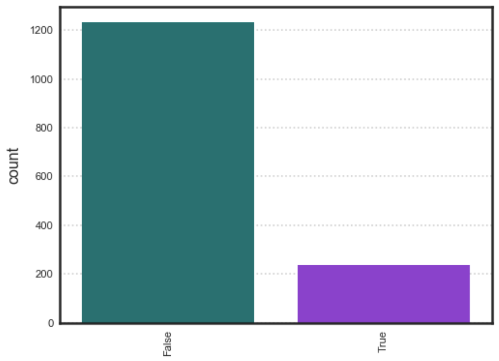
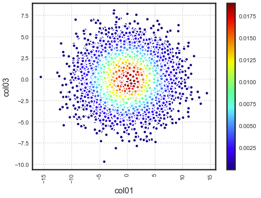
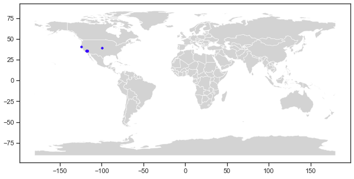

# Accelerated Data Science SDK

## Introduction

The [Oracle Accelerated Data Science (ADS) SDK](https://docs.cloud.oracle.com/iaas/tools/ads-sdk/latest/index.html) is a Python library that is included as part of the Oracle Cloud Infrastructure (OCI) Data Science service. ADS offers a friendly user interface, with objects and methods that cover all the steps involved in the life cycle of machine learning models, from data acquisition to model evaluation and interpretation.

You access ADS when you launch a JupyterLab session from the Data Science service. ADS is pre-configured to access Data Science and other OCI resources, such as the models in the Data Science model catalog or files in OCI Object Storage.

[](youtube:3giYLy3Qm3k)

*Estimated Lab Time*: 15 minutes

### Objectives
In this lab, you:
* Learn about some of the key features of the [Oracle Accelerated Data Science (ADS) SDK](https://docs.cloud.oracle.com/iaas/tools/ads-sdk/latest/index.html).

### Prerequisites

* A foundational understanding of Python 
* A basic understanding machine learning terminology, concepts, model building, and evaluation.

## Main Features

### Connect to Different Data Sources

The Oracle JupyterLab environment is pre-installed with default storage options for reading from and writing to OCI Object Storage. However, you can load your datasets into ADS from almost anywhere including:

* Oracle Cloud Infrastructure Object Storage
* Oracle Autonomous Data Warehouse
* Oracle Database
* Hadoop Distributed File System
* Amazon S3
* Google Cloud Service
* Microsoft Azure
* Blob
* MongoDB
* NoSQL DB instances
* Elastic Search instances
* Your local files

Some of the supported file formats include:

* csv
* tsv
* Parquet
* libsvm
* JSON
* Excel
* SQL
* HDF5
* XML
* Apache server log files
* arff

An example of how to open a dataset:
```
ds = DatasetFactory.open("sample_data.csv", target="Attrition").set_positive_class('Yes')
```

### Exploratory Data Analysis

The ADS data type discovery supports simple data types like categorical, continuous, ordinal to sophisticated data types. For example, geodata, date time, zip codes, and credit card numbers. 

To plot the target’s value distribution:
```
ds.target.show_in_notebook()
```


### Automatic Data Visualization

The ``ADSDataset`` object comes with a comprehensive plotting API. It allows you to explore data visually using automatic plotting or create your own custom plots.

Example of a Gaussian heat map:
```
ds.plot('col01', y='col03').show_in_notebook()
```


Example of plotting latitude and longitude points on a map:
```
earthquake.plot_gis_scatter(lon="longitude", lat="latitude")
```


### Feature Engineering

Leverage ``ADS`` and the [DASK API](https://dask.org/) to transform the content of an ``ADSDataset`` object with custom data transformations.

Example of how to apply auto tranformations:
```
ds_engineered = ds.auto_transform(fix_imbalance=False)
```

### Data Snapshotting for Training Reproducibility

Save and load a copy of any dataset in a binary optimized Parquet format. By snapshotting a dataset, a URL is returned that can be used by anyone with access to the resource to load the data exactly how it was at that point with all transforms materialized.

### Model Training

Example of visualizing a decision tree:
```


The Oracle AutoML engine, that produces ``ADSModel`` models, automates:

* Feature Selection
* Algorithm Selection
* Feature Encoding
* Hyperparameter Tuning

Create your own models using any library. If they resemble ``sklearn`` estimators, you can promote them to ``ADSModel`` objects then use them in evaluations, explanations, and model catalog operations. If they do not support the ``sklearn`` behavior, you can wrap them in a Lambda then use them.

Example of creating a set of AutoML models:
```
train, test = ds.train_test_split()
automl = AutoML(train, provider=ml_engine)
model, baseline = automl.train(model_list=[
    'LogisticRegression',
    'LGBMClassifier',
    'XGBClassifier',
    'RandomForestClassifier'])
```

Example of tuning trial results:
```
automl.visualize_tuning_trial()
```


### Model Evaluations

Model evaluation generates a comprehensive suite of evaluation metrics and suitable visualizations to measure model performance against new data and can rank models over time to ensure optimal behavior in production. Model evaluation goes beyond raw performance to take into account expected baseline behavior. It uses a cost API so that the different impacts of false positives and false negatives can be fully incorporated.

ADS helps data scientists evaluate ``ADSModel`` instances using the ``ADSEvaluator`` object. This object provides a comprehensive API that covers regression, binary, and multinomial classification use cases.

Example of model evaluations:
```
evaluator = ADSEvaluator(test, models=[model, my_model, baseline], training_data=train)
evaluator.show_in_notebook()
```


### Model Interpretation and Explainability

Model explanation makes it easier to understand why machine learning models return the results that they do by identifying the relative importance of features and relationships between features and predictions. Data Science offers the first commercial implementation of model-agnostic explanation. For example, a compliance officer can be certain that a model is not making decisions in violation of GDPR or regulations against discrimination.

For data scientists, it enables them to ensure that any model they build is generating results based on predictors that make sense. Understanding why a model behaves the way it does is critical to users and regulators. Data Science ensures that deployed models are more accurate, robust, and compliant with relevant regulations.

Oracle provides Machine Learning Explainability (MLX), which is a package that explains the internal mechanics of a machine learning system to better understand models. Models are in the ``ADSModel`` format. You use MLX to explain models from different training platforms. You create an ``ADSModel`` from a REST endpoint then use the ADS model explainability to explain a model that’s remote.

### Interaction with the Model Catalog

You can upload the models that you create with ADS into the Data Science model catalog directly from ADS. You can save all your models, with their provenance information, in the catalog and make them accessible for anyone to use. Other users can then load the models and use them as an ``ADSModel`` object. You can also use this feature to help put the models into production with [Oracle Functions](https://docs.cloud.oracle.com/iaas/Content/Functions/Concepts/functionsoverview.htm).

You can *proceed to the next lab*.

## Acknowledgements

* **Author**: [John Peach](https://www.linkedin.com/in/jpeach/), Principal Data Scientist
* **Last Updated By/Date**: 
    * [John Peach](https://www.linkedin.com/in/jpeach/), Principal Data Scientist, September 2020

## See an issue?

Submit feedback using this [form](https://apexapps.oracle.com/pls/apex/f?p=133:1:::::P1_FEEDBACK:1) and include the *workshop name*, *lab* and *step* in your request.  If you don't see the workshop name listed, enter it manually. If you want us to follow up with you, enter your email in the *Feedback Comments* section and include the workshop name and lab in your request.
