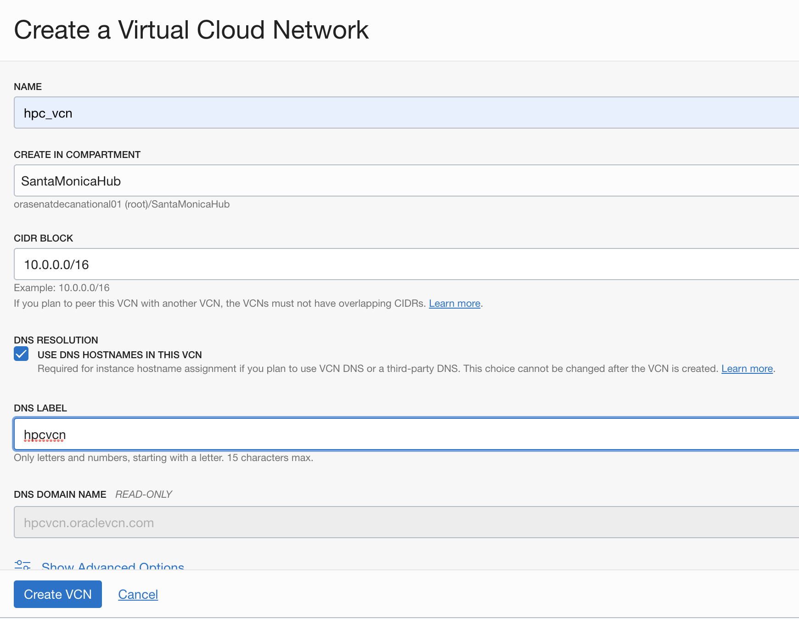
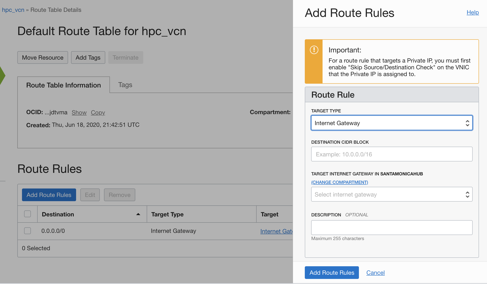
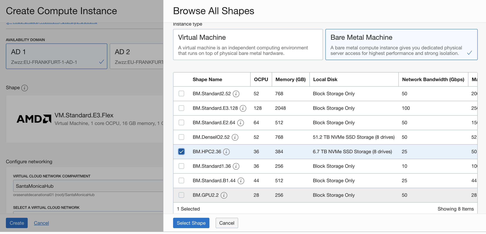
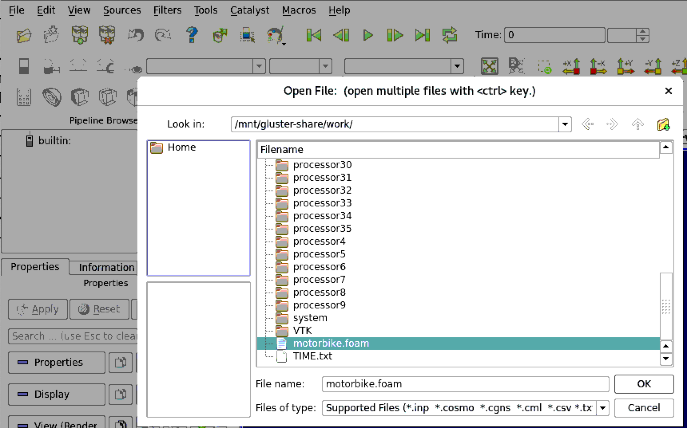

# Run OpenFoam project in standard VM on OCI

## Introduction

This lab is designed to assist in the assessment of the OpenFOAM CFD Software in Oracle Cloud Infrastructure. It automatically downloads and configures OpenFOAM. OpenFOAM is the free, open source CFD software released and developed primarily by OpenCFD Ltd since 2004. It has a large user base across most areas of engineering and science, from both commercial and academic organizations. OpenFOAM has an extensive range of features to solve anything from complex fluid flows involving chemical reactions, turbulence and heat transfer, to acoustics, solid mechanics and electromagnetics.

This lab walks you through install OpenFoam in a basic VM.Standard 2.1 shape, but for an actual deployment a larger shape like BM.HPC2.36 would be appropriate. Some high performance shapes are only available in specific Regions and Availability Domains.

We will create two nodes for this lab, the headnode for the cluster on the public subnet, and a worker compute node in the private subnet. In order to access the worker nodes, we will first create the headnode, then generate a ssh key on the headnode, and use that public key when creating the worker node.

To **log issues**, click [here](https://github.com/oracle/learning-library/issues/new) to go to the github oracle repository issue submission form.

Estimated Lab Time: 60 minutes

### Objectives

As a developer, data Engineer,

  1. Deploy your High Performance Computing instances manually
  2. Create a Cluster Network
  3. Create a Network File System
  4. Set up VNC
  5. Install OpenFoam and Paraview 

### Prerequisites

  1. An Oracle Cloud Infrastructure account with privileges to create an instance VM standard 2.1 or BM.HPC2.36 shape. 

###  Infrastructure terminology
   - Worker node: HPC compute instances providing the processing power to execute the workload of computational simulations or other engineering workload. In this Demo compute shape BM.HPC2.36 nodes are the worker nodes.
   - Head node: Compute instance from where all the computational jobs can be scheduled and submitted to be run on Worker nodes. Many times Head node and Bastion node can be the same machine. For this demo we are provisioning Bastion node.
   - Bastion node: A compute instance with Public IP, acts as entry point to connect to  worker nodes which are generally in Private network. 
   - RoCE network: RDMA over Converged Ethernet (RoCE) is a network protocol that allows remote direct memory access (RDMA) over an Ethernet network.


## **STEP 1**: Provision Oracle Virtual Cloud Network

1. Before creating an instance, we need to configure a Virtual Cloud Network. Select the menu on the top left, then select Networking and Virtual Cloud Networks
  
  
  

2. On the next page, select the following for your VCN:
    - Name
    - Compartment 
    - CIDR Block (Example: 10.0.0.0/16)

3. Scroll to the bottom and click Create VCN

4. Create Subnets
     1. Public Subnet
        - Name: i.e. hpc_public
        - Subnet Type: Regional 
        - CIDR Block: 10.0.0.0/24
        - Route Table: "Default Route table"
        - Subnet Access: Public Subnet
        - Security List: "Default Security List"
     2. Private Subnet
        - Name: hpc_private
        - Subnet Type: Regional 
        - CIDR Block: 10.0.3.0/24
        - Route Table: select Route Table created in previous step
        - Subnet Access: Private Subnet
        - Security List: select security list created in previous step
5. Click **create subnet**
  
  

6. Click on `hpc_vcn` you created and on the **Resources** menu on the left side of the page, select **Internet Gateway**, create Internet Gateway.
    
    

  Note: That will create the internet gateway, and it will need to be associated with a route table. In this case, since the Default Route Table will be used for the public subnet, the internet gateway should be associated with that route table.

1. Add Route Rules to Route Table. On the **Resources** menu on the left side of the page, select **Default Route Table for `hpc_vcn`**, click **Add Route Rules** 
    - Target Type: Internet Gateway
    - Destination CIDR Block: 0.0.0.0/0
    - Target Internet Gateway in compartment: Internet Gateway you created
    



## **STEP 2**: Create Cluster Nodes

We will create two nodes for this lab, the **Headnode** for the cluster on the public subnet, and **a worker compute node** in the private subnet. In order to access the worker nodes, we will first create the headnode, then generate a ssh key on the headnode, and use that public key when creating the worker node.

Note: For this lab we will be utilizing only the basic VM.Standard2.1 shape, but for an actual deployment a larger shape like BM.HPC2.36 would be appropriate. Some high performance shapes are only available in specific Regions and Availability Domains.


1. #### Create Headnode ####

    - Name: i.e. hpc_head
    - Image or operating system:latest version Oracle Linux(default)
    - Availability Domain: domain available for VM.Standard 2.1 shapes
    - Instance Shape: 
        -   VM.Standard 2.1
        -   any other shapes (BM.HPC2.36 preferred if available)
    - Virtual Cloud Network: VCN created before
    - Subnet: public subnet created before
    - SSH key: Attach your public key file

     1. On the top left menu, select Compute and create instance.
    
    
    

     2. SSH into your headnode and generate ssh key specific for cluster to communicate.

            
            $ <copy>ssh -i <ssh_key> opc@<headnode_ip_address></copy>
          
            $ <copy>ssh-keygen</copy>
          
            Note: Do not change the ssh key file location (/home/opc/.ssh/id_rsa) and hit enter when asked about a passphrase (twice).

            Run and Copy the whole string, which will be used in creating the worker node

          
            $ <copy>cat ~/.ssh/id_rsa.pub</copy>

2. **Create Worker Node**
     1. On the top left menu, select Compute and create instance with the following details:
   
          - Name: i.e. hpc_worker1
          - Image or operating system:latest version Oracle Linux(default)
          - Availability Domain: domain available for VM.Standard 2.1 shapes
          - Instance Shape: 
            -   VM.Standard 2.1
            -   any other shapes (BM.HPC2.36 preferred if available)
          - Virtual Cloud Network: VCN created before
          - Subnet: private subnet created before
          - SSH key: public key string copied from one step above.
     2. SSH into worker node. Return to the console logged in to the head node, and take the private IP address and ssh into the worker node from the head node 
    
            
            $ <copy>ssh opc@10.x.x.x</copy>
            


## **STEP 3**: Setup NAT Gateway

** Please note this is for the worker node only ** <br/>

  1. Select worker node and click on **Attached VNICs** in the **resources** menu on the left
  2. Select **Edit VNIC**
  3. Uncheck **Skip Source/ Destination Check** if it is checked and click **Update VNICs**


## **STEP 4**: Mounting a drive
Note: Only if the node shape has a NVMe attached (BM.HPC2.36 has one, not VM.Standard2.1), HPC machines have local NVMe storage but it is not mounted by default. Skip to Step 5 if using VM.Standard2.1

  1. SSH into your headnode and run the below commands

    ```
     $ <copy>lsblk</copy>
    ```
    The drive should be listed with the NAME on the left (Probably nvme0n1, if it is different, change it in the next commands)

 The headnode will have the shared drive with the installation and the model. This will be shared between all the different worker nodes. Each worker node will also mount the drive to be running locally on a NVMe drive. In this example the share directory will be 500 GB but feel free to change that. 

  2. Partition the drive on the worker node (optional)

    ```
     $ <copy>sudo yum -y install gdisk</copy>
    ```
    ```
     $ <copy>sudo gdisk /dev/nvme0n1</copy>
     $ > n    # Create new partition
     $ > 1    # Partition Number
     $ >      # Default start of the partition
     $ > +500G # Size of the shared partition
     $ > 8300  # Type = Linux File System
     $ > n     # Create new partition
     $ > 2     # Partition Number
     $ >       # Default start of the partition
     $ >       # Default end of the partition, to fill the whole drive

     $ > 8300  # Type = Linux File System 

     $ > w      # Write to file
     $ > Y      # Accept Changes
    ```


  3. Format drive on the worker nodes

    ```
    $ <copy>sudo mkfs -t ext4 /dev/nvme0n1</copy>
    ```
  4. Format the partitions on the headnode
    ```
    $ <copy>sudo mkfs -t ext4 /dev/nvme0n1p1</copy>
    $ <copy>sudo mkfs -t ext4 /dev/nvme0n1p2</copy>
    ```   

  5. Create a directory and mount the drive    

  6. Headnode(local and share): select /mnt/share as the mount directory for the 500G partition and /mnt/local for the larger one.

        
        $ <copy>sudo mkdir /mnt/local</copy>
        $ <copy>sudo mount /dev/nvme0n1p1 /mnt/share</copy>
        $ <copy>sudo chmod 777 /mnt/share</copy>
        $ <copy>sudo mount /dev/nvme0n1p2 /mnt/local</copy>
        $ <copy>sudo chmod 777 /mnt/local</copy>
     
      

7. Headnode(share):


        $ <copy>sudo mkdir /mnt/share</copy>
        $ <copy>sudo mount /dev/nvme0n1 /mnt/share</copy>
        $ <copy>sudo chmod 777 /mnt/share</copy>

      
8. Worker nodes: select /mnt/local as the mount directory of the whole drive.


        $ <copy>sudo mkdir /mnt/local</copy>
        $ <copy>sudo mount /dev/nvme0n1 /mnt/local</copy>
        $ <copy>sudo chmod 777 /mnt/local</copy>


## **STEP 5**: Creating a Network File System

1. Create Mount Target. On the top left menu, click **File Storage** and **Mount Target**.

    - New Mount Target Name: Enter a name (example: openfoam_fs)
    - Virtual Cloud Network: Select the VCN created above
    - Subnet: Select the public VCN
   
2. Headnode is in a public subnet, we will keep the firewall up and add an exception through: <br/>
    
    ```
    <copy>sudo firewall-cmd --permanent --zone=public --add-service=nfs</copy>
    <copy>sudo firewall-cmd --reload</copy>
    ```
3. Click on the mount target that was created, then click on the export path, and then click on the mount commands and copy these commands that should look like this: 
    ```
    <copy>sudo yum install nfs-utils</copy>
    <copy>sudo mkdir -p /mnt/share</copy>
    <copy>sudo mount <fss-ip-address>:/<ExportPathName> /mnt/share</copy>
    ```

4. On the worker nodes, since they are in a private subnet with security list restricting access, we can disable the firewall altogether. Then, we can install nfs-utils tools and mount the nfs just like we did above.

    ```
    <copy>sudo systemctl stop firewalld</copy>
    <copy>sudo yum -y install nfs-utils</copy>
    <copy>sudo mkdir  -p /mnt/share</copy>
    <copy>sudo mount <fss-ip-address>:/<ExportPathName> /mnt/share</copy>
    ```

## **STEP 6**: Install OpenFOAM
  1. **Connecting all worker nodes** <br/>
   
    Each worker node needs to be able to talk to all the worker nodes. SSH communication works but most applications have issues if all the hosts are not in the known host file. To disable the known host check for nodes with address in the VCN, you can deactivate with the following commands. You may need to modify it slightly if your have different addresses in your subnets. Put the following code block in a shell script and run the script. 


        <copy>for i in 0 1 2 3
        do
            echo Host 10.0.$i.* | sudo tee -a ~/.ssh/config
            echo "    StrictHostKeyChecking no" | sudo tee -a ~/.ssh/config
        done</copy>

   2. **Create a machinelist** <br/>
   
    OpenFOAM on the headnode does not automatically know which compute nodes are available. You can create a machinefile at `/mnt/share/machinelist.txt with` the private IP address of all the nodes along with the number of CPUs available. The headnode should also be included. The format for the entries is `private-ip-address cpu=number-of-cores`


        <copy>10.0.0.2 cpu=1
        10.0.3.2 cpu=1</copy>


   3. **Headnode**
   
    Install from sources, modify the path to the tarballs in the next commands. This example has the foundation OpenFOAM sources. OpenFOAM from ESI has also been tested. To share the installation between the different compute nodes, install on the network file system.


        <copy>$ sudo yum groupinstall -y 'Development Tools'
        $ sudo yum -y install devtoolset-8 gcc-c++ zlib-devel openmpi openmpi-devel
        $ cd /mnt/share
        $ wget -O - http://dl.openfoam.org/source/7 | tar xvz
        $ wget -O - http://dl.openfoam.org/third-party/7 | tar xvz
        $ mv OpenFOAM-7-version-7 OpenFOAM-7
        $ mv ThirdParty-7-version-7 ThirdParty-7
        $ export PATH=/usr/lib64/openmpi/bin/:/usr/lib64/qt5/bin/:$PATH
        $ echo export PATH=/usr/lib64/openmpi/bin/:\$PATH | sudo tee -a ~/.bashrc
        $ echo export $ LD_LIBRARY_PATH=/usr/lib64/openmpi/lib/:\$LD_LIBRARY_PATH | sudo tee -a ~/.bashrc
        $ echo source /mnt/share/OpenFOAM-7/etc/bashrc | sudo tee -a ~/.bashrc
        $ sudo ln -s /usr/lib64/libboost_thread-mt.so /usr/lib64/libboost_thread.so
        $ source ~/.bashrc
        $ cd /mnt/share/OpenFOAM-7
        $ ./Allwmake -j</copy>


   3. **Worker node** <br/>
   

        $ <copy>sudo yum -y install openmpi openmpi-devel
        $ cd /mnt/share
        $ export PATH=/usr/lib64/openmpi/bin/:/usr/lib64/qt5/bin/:$PATH
        $ echo export PATH=/usr/lib64/openmpi/bin/:\$PATH | $ sudo tee -a ~/.bashrc
        $ echo export $LD_LIBRARY_PATH=/usr/lib64/openmpi/lib/:\$LD_LIBRARY_PATH | sudo tee -a ~/.bashrc
        $ echo source /mnt/share/OpenFOAM-7/etc/bashrc | $ sudo tee -a ~/.bashrc
        $ sudo ln -s /usr/lib64/libboost_thread-mt.so /usr/lib64/libboost_thread.so
        $ source ~/.bashrc</copy>


## **STEP 7**: Run simulation workload and Render the output

1. On Headnode, run the following commands that will be needed to render the output using Paraview package.


        $ <copy>sudo yum install -y mesa-libGLU
        $ cd /mnt/share
        $ curl -d submit="Download" -d version="v4.4" -d type="binary" -d os="Linux" -d downloadFile="ParaView-4.4.0-Qt4-Linux-64bit.tar.gz" $ https://www.paraview.org/paraview-downloads/download.php > file.tar.gz
        $ tar -xf file.tar.gz</copy>


2. On headnonde, run these commands in order to set up the VNC server: <br/>
   
    ```
    $ <copy>sudo yum -y groupinstall 'Server with GUI'
    $ sudo yum -y install tigervnc-server mesa-libGL
    $ sudo mkdir /home/opc/.vnc/
    $ sudo chown opc:opc /home/opc/.vnc
    $ echo "HPC_oci1" | vncpasswd -f > /home/opc/.vnc/passwd
    $ chown opc:opc /home/opc/.vnc/passwd
    $ chmod 600 /home/opc/.vnc/passwd
    $ /usr/bin/vncserver</copy>
    ```


3. Download this zip with the <a href="../scripts/motorbike_RDMA.tgz" target="_blank">scripts</a> in /mnt/share/work in one of worker nodes. Unzip the file using `tar -xf motorbike_RDMA.tgz`

4. Before we execute the workload we need to edit the allrun file in order to match the architecture that we have built. First, we will move the folder from the OpenFOAM installer folder


        $ <copy>model_drive=/mnt/share
        $ sudo mkdir $model_drive/work
        $ sudo chmod 777 $model_drive/work
        $ cp -r $FOAM_TUTORIALS/incompressible/simpleFoam/motorBike $model_drive/work
        $ cd /mnt/share/work/motorBike/system</copy>

5. Edit the file system/decomposeParDict and change this line numberOfSubdomains 6; to numberOfSubdomains 12; or how many processes you will need. Then in the hierarchicalCoeffs block, change the n from n (3 2 1); to n (4 3 1); If you multiply those 3 values, you should get the numberOfSubdomains

  For running with a configuration of 1 VM.Standard2.1 worker node:

    ```
      =========                 |
      \\      /  F ield         | OpenFOAM: The Open Source CFD Toolbox
      \\    /   O peration     | Website:  https://openfoam.org
        \\  /    A nd           | Version:  7
        \\/     M anipulation  |
    \*---------------------------------------------------------------------------*/
    FoamFile
    {
        version     2.0;
        format      ascii;
        class       dictionary;
        object      decomposeParDict;
    }

    // * * * * * * * * * * * * * * * * * * * * * * * * * * * * * * * * * * * * * //

    numberOfSubdomains 2;

    method          hierarchical;
    // method          ptscotch;

    simpleCoeffs
    {
        n               (4 1 1);
        delta           0.001;
    }

    hierarchicalCoeffs
    {
        n               (2 1 1);
        delta           0.001;
        order           xyz;
    }

    manualCoeffs
    {
        dataFile        "cellDecomposition";
    }


    // ************************************************************************* //
    ```

6. Next edit the Allrun file in /mnt/share/work/motorBike to look like this

        <copy>#!/bin/sh
        cd ${0%/*} || exit 1    # Run from this directory
        NP=$1
        install_drive=/mnt/share
        # Source tutorial run functions
        . $WM_PROJECT_DIR/bin/tools/RunFunctions

        # Copy motorbike surface from resources directory
        cp $FOAM_TUTORIALS/resources/geometry/motorBike.obj.gz constant/triSurface/
        cp $install_drive/machinelist.txt hostfile

        runApplication surfaceFeatures

        runApplication blockMesh

        runApplication decomposePar -copyZero
        echo "Running snappyHexMesh"
        mpirun -np $NP -machinefile hostfile snappyHexMesh -parallel -overwrite > log.snappyHexMesh
        ls -d processor* | xargs -I {} rm -rf ./{}/0
        ls -d processor* | xargs -I {} cp -r 0 ./{}/0
        echo "Running patchsummary"
        mpirun -np $NP -machinefile hostfile patchSummary -parallel > log.patchSummary
        echo "Running potentialFoam"
        mpirun -np $NP -machinefile hostfile potentialFoam -parallel > log.potentialFoam
        echo "Running simpleFoam"
        mpirun -np $NP -machinefile hostfile $(getApplication) -parallel > log.simpleFoam

        runApplication reconstructParMesh -constant
        runApplication reconstructPar -latestTime

        foamToVTK
        touch motorbike.foam</copy>


7. Make sure you are in the worker node and execute the workload: 

        $ <copy>ssh worker_node_IP
        $ cd /mnt/share/work/
        $ ./Allrun 2


        $ ./Allrun 2
        $ Cleaning /mnt/share/work case
        $ Mesh Dimensions: (40 16 16)
        $ Cores:36: 6, 6, 1
        $ Running surfaceFeatures on /mnt/share/work
        $ Running blockMesh on /mnt/share/work
        $ Running decomposePar on /mnt/share/work
        $ Running snappyHexMesh
        $ Running patchsummary
        $ Running potentialFoam
        $ Running simpleFoam
        $ Running reconstructParMesh on /mnt/share/work
        $ Running reconstructPar on /mnt/share/work
        219.95</copy>


8. Once the workload completes successfully, configure VNC client on your machine like this. Provide Public IP of Bastion server and VNC port


9. OPTIONALLY, In case you are not allowed to open VNC port 5901 or due to security reason want to make ssh tunnel for this port, use the following command to make ssh tunnel on port 5901 without opening the port in the security list

10. Create tunnel from your laptop/desktop using the following command from terminal window. Here communication for port 5901 will be made on ssh port 22 and the IP address 150.136.41.3 is the public IP address of bastion server.

  
        $ <copy>ssh -L 5901:localhost:5901 -i Dropbox/amar_priv_key -N -f -l opc 150.136.41.3</copy>


11.  Do not close the above ssh tunnel terminal window. Now initiate VNC session and this time instead of IP address use "localhost" on port 5901, even though this port is not opened in the security list of the subnet.


12. Start the Paraview application from within the bastion server

        $ <copy>cd /mnt/gluster-share/ParaView-4.4.0-Qt4-Linux-64bit/bin/
        $ ./paraview</copy>


13. In Paraview application window, File -> Open -> Path "/mnt/gluster-share/work" and select file name motorbike.foam. It will be zero byte file and that should be fine.
  

14. On Left of the window, Under Properties tab, select Mesh Regions to select all the values and then unselect the top values which does not start with motorBike_ prefix. Make sure that all values starting with motorBike_ are selected. Click on the Apply button, some errors will pop up, ignore the error window that pops up to view the rendering of the image in VNC console.
  


15. An image like below will be rendered on the screen. Based on some display settings, the image on the screen might look a bit different. 
  


All Done! This completes the demo for running OpenFoam application on a Standard VM on OCI.

*Congratulations! You have successfully completed the workshop*


These are detailed information about managing High Performance Compute Instance. For a complete command reference,check out OCI documentation [here](https://docs.cloud.oracle.com/en-us/iaas/Content/Compute/Tasks/managingclusternetworks.htm?Highlight=hpc).

## Acknowledgements
* **Author** - High Performance Compute Team
* **Contributors** -  Chris Iwicki, Harrison Dvoor, Gloria Lee, Selene Song, Bre Mendonca
* **Last Updated By/Date** - Harrison Dvoor, October 2020


## Need Help?
Please submit feedback or ask for help using our [LiveLabs Support Forum](https://community.oracle.com/tech/developers/categories/livelabsdiscussions). Please click the **Log In** button and login using your Oracle Account. Click the **Ask A Question** button to the left to start a *New Discussion* or *Ask a Question*.  Please include your workshop name and lab name.  You can also include screenshots and attach files.  Engage directly with the author of the workshop.

If you do not have an Oracle Account, click [here](https://profile.oracle.com/myprofile/account/create-account.jspx) to create one.
