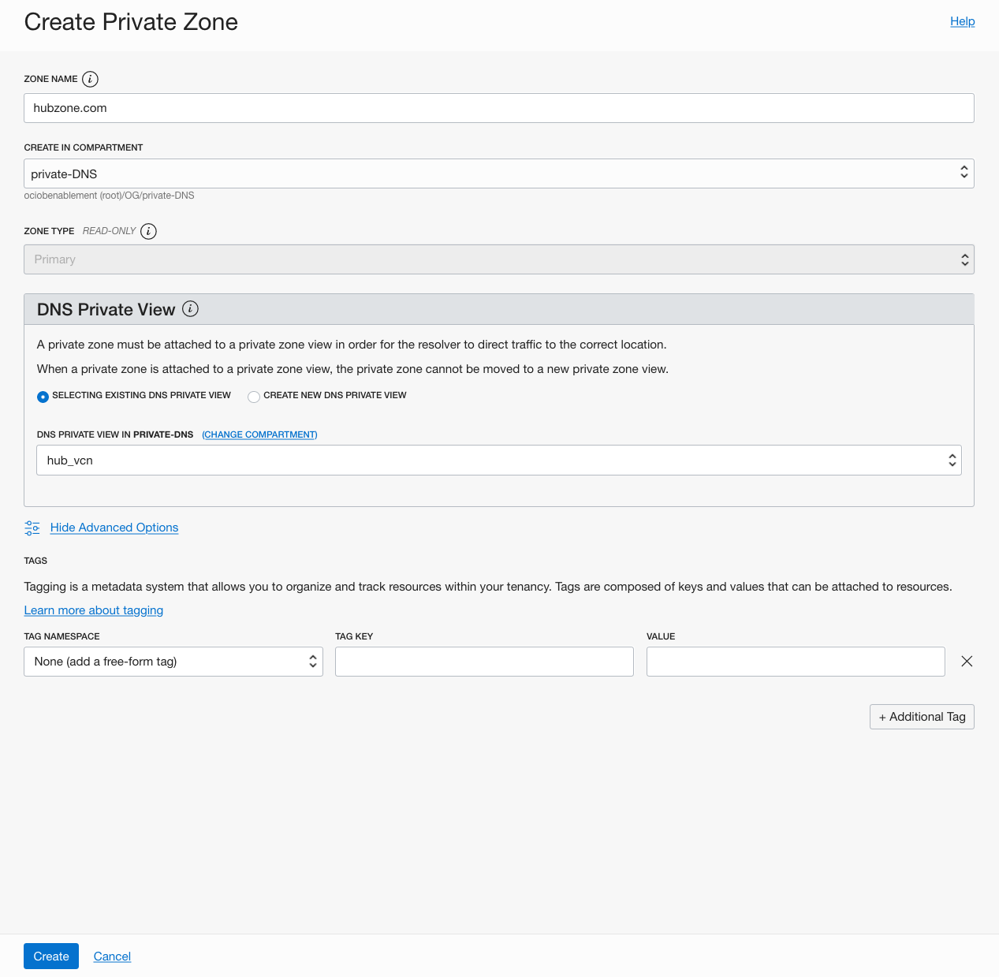
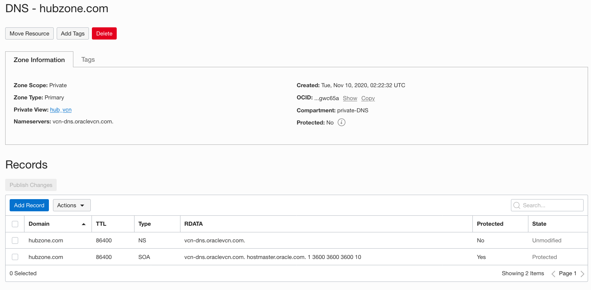
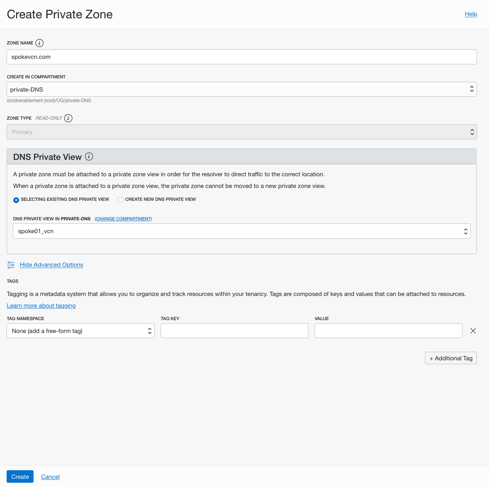
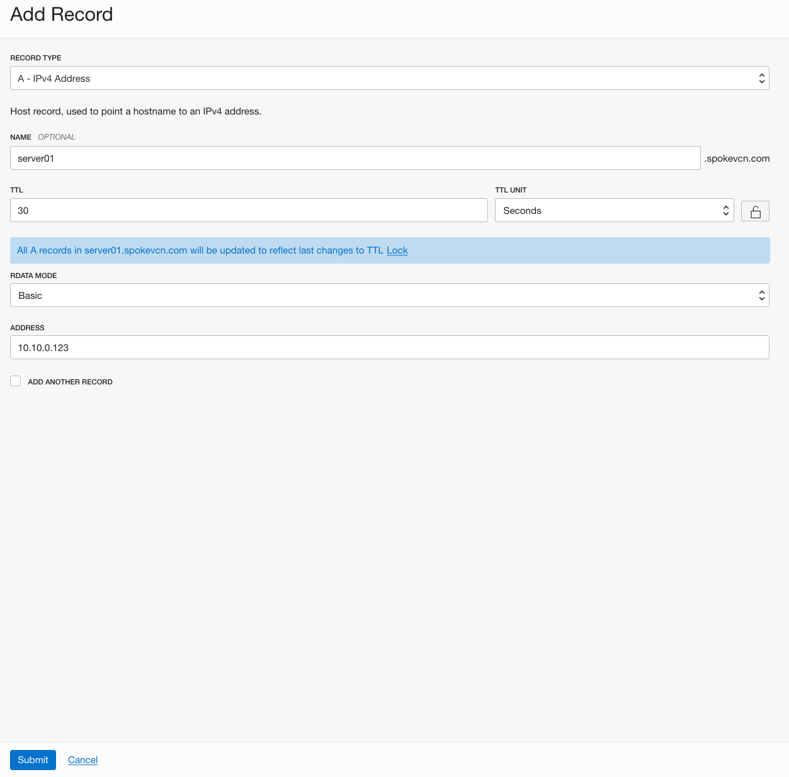
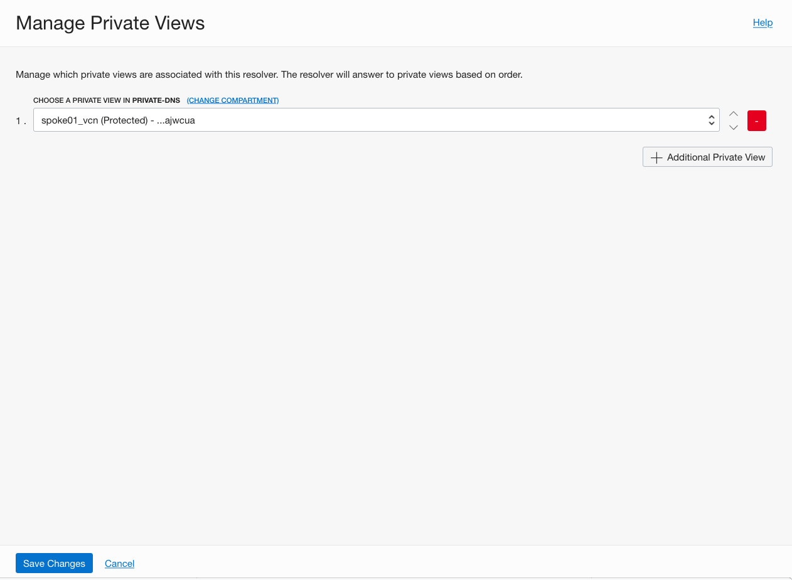

# Configuring Private DNS Zones, Views, and Resolvers

## Introduction

## Oracle Cloud Private DNS

Customers want to specify their own private DNS domain names to manage their private assets in OCI, as well as support DNS resolution between  VCNs and between VCNs and on-premise networks. Private DNS will give them the ability to:
- Create private DNS zones with their desired names and create records for their private resources
- Private DNS resolver for DNS resolution to and from other private networks
- Resolve queries for custom private zones and system generated zones (oraclevcn.com)
- Support for DNS views and conditional forwarding  for split-horizon environments

Customer Benefits
- Private DNS Names allows customers to use and manage their own domain names, zones, and records for private DNS
- Private DNS Resolver provide DNS resolution within a VCN, between VCNs and Between VCNs and a customer’s on-premise network
- Simplifies the management of customer’s private assets in OCI
- Common user experience for managing global and private zones – common Console and API

## **Step 1:** Sign in to OCI Console
You will need the following information to login to your account:

- Tenant Name: {{Cloud Tenant}}
- User Name: {{User Name}}
- Password: {{Password}}

This lab assumes you are a tenancy administrator. If you are not, request to the tenancy administrator to provide you the proper permission to manage DNS services, create and manage VCNs, create and manage instances. 

## **Step 2:** Create a compartment (optional)

1. From the OCI services menu, click **Compartments** under **Identity**
2. Click on the **Create Compartment** button
3. Fill the compartment name, description and choose the parent compartment.
4. Click on **Create Compartment**

## **Step 3:** Use resource manager to create VCNs and test VM

If you are not the adminstrator, you have to request the admin to give you permissions to manage Resource Manager Stacks by creating the following IAM policies in a compartment of your choice with the following statements:

For Resource Manager:

    Allow group <group_name> to manage orm-stacks in compartment <compartment_name>
    Allow group <group_name> to manage orm-jobs in compartment <compartment_name>

For DNS Management:

    Allow group <group_name> to manage dns in tenancy <TenancyName>

1. Click 

2. Acept the Terms of use, chane the compartment to you want to use, and change the name (optional)
3. Enter the required information for the stack, and click **Next**
4. Review the Stack and click **Create**
5. Click **Plan** under **Terraform Actions**.
6. Click **Plan** in the Plan window
7. Upon Completion (RMJ big button will turn green), click  **Stack Details** and then click **Apply** under **Terraform Actions**.
8. Click **Apply** in the Apply window

## **Step 4:** Create hubzone.com Custom Private Zone
1. From the OCI services menu, click **DNS Management** under **Networking**
2. Under DNS Management, click on **Zones**, and then **Private Zones**
You should see the private zones that are created automatically for your subnets.
3. Click on **Create Zone** and create zone **hubzone.com**. Select **Selecting existing DNS Private View** and name it **hub_vcn**

## **Step 5:** View automatically generated records
1. After the zone is created, select **Records** to view the automatically generated NS and SOA records

## **Step 6:** Create A record in hubvcn.com 
1. Click on **Add Record** button.
2. Select Record Type **A - IPv4 Address**
3. Set Name to **server01**
4. Set TTL to **30 seconds**. If the lock icon is engaged, click on it to disengage and enable the field
5. Set Address to **10.0.0.2**
6. Click **Submit**

7. Click on **Publish Changes** and then **Publish Changes** again in the new window.

## **Step 7:** Create spokezone.com Custom Private Zone on the hub VCN
1. From the OCI services menu, click **DNS Management** under **Networking**
2. Under DNS Management, click on **Zones** and then **Private Zones**
You are able to see the private zones that are created automatically for your subnets.
3. Click on **Create Zone** and create zone **spokezone.com**. Select **Selecting existing DNS Private View** and name it **spoke_vcn**

## **Step 8:** Create A record in spokevcn.com
1. Click on **Add Record** button.
2. Select Record Type **A - IPv4 Address**
3. Set Name to **server01**
4. Set TTL to **60**
5. Set Address to **10.10.0.123**
6. Click **Submit**

7. Click on **Publish Changes** and then **Publish Changes** again in the new window.

## **Step 9:** SSH into the compute instance testVM
1. From cloud shell, ssh to the testVM

`ssh  -f my_key opc@<testVM public IP>`

2. Lookup server01.hubzone.com

`[opc@primaryvnic ~]$ host server01.hubzone.com`

`server01.hubzone.com has address 10.0.0.2`

3. Looukp the system generated zone entry

`[opc@primaryvnic ~]$ host -t NS hubzone.com`

`hubzone.com name server vcn-dns.oraclevcn.com.`

`[opc@primaryvnic ~]$ host -t SOA hubzone.com`

`hubzone.com has SOA record vcn-dns.oraclevcn.com. hostmaster.oracle.com. 2 3600 3600 3600 10`

3. Lookup server01.spokezone.com

`[opc@primaryvnic ~]$ host server01.spokevcn.com`

`Host server01.spokevcn.com not found: 3(NXDOMAIN)`

The zone is not associated with any of the VCN's view leave cloud shell connect to the instace. we'll be back on it shortly.

## **Step 9**: Associate the Private view to a VCN
1. From the OCI services menu, click **Virtual Cloud Networks** under **Networking**
2. Click on **hub_vcn** from the VCNs' list
3. Locate the **DNS Resolver** and click on **hub_vcn**
4. Click on **Manage Private Views**
5. Select **spoke_vcn** under Choose a Private View in private-DNS

6. Reboot the instance (just to make things faster) and then lookup server01.spokezone.com again

`[opc@primaryvnic ~]$ host server01.spokevcn.com`

`server01.hubzone.com has address 10.0.0.2`

Now the hub_vcn resolver has access to the spoke_vcn private view and can resolve names from the zones within it.
