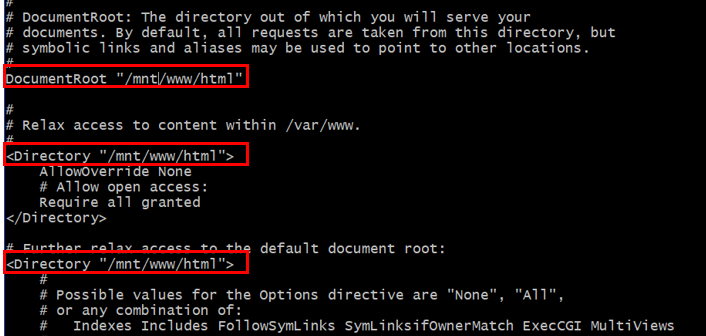
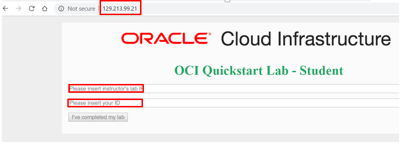
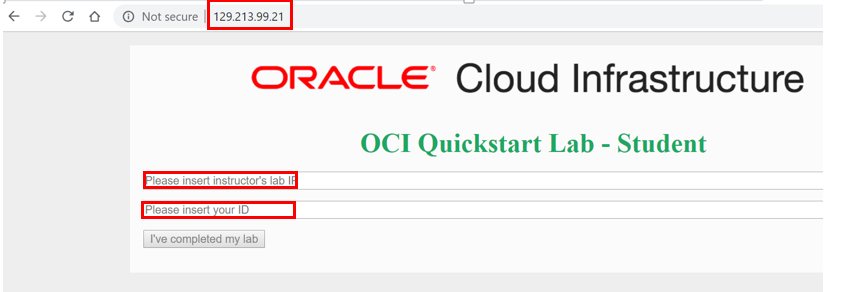
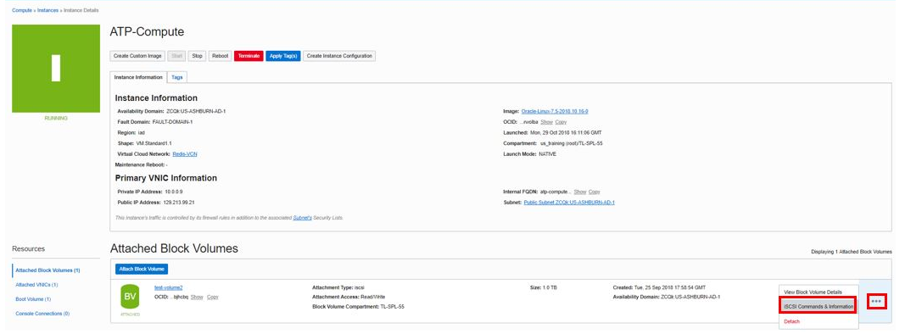
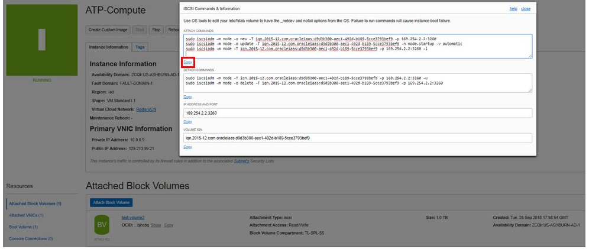
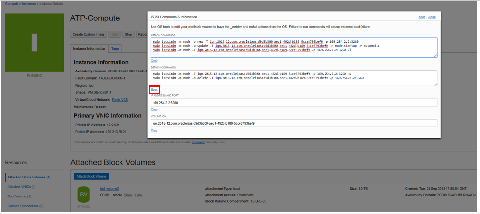
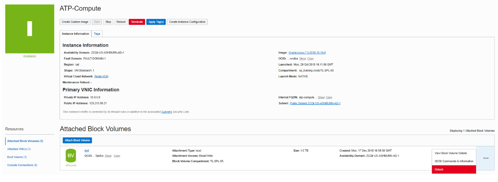

# Moving Block Volumes

## Introduction

In this lab we will create a compute instance, install httpd server on it, attach block volume to it, and install an app on the Block Volume. We will then create a second compute instance using the boot volume of the first compute instance and move the Block Volume to the second compute instance (with the app installed).

### Objectives
- Demonstrate launching VCN
- Compute Instance
- Use Boot volume of compute instance
- Move additional storage with applications/tools installed between compute instances.

## **Step 1:** Create VCN

1. From the OCI Services menu, click **Virtual Cloud Network**. Select the compartment assigned to you from drop down menu on left part of the screen under Networking  


2. Click **Start VCN Wizard**.

   **NOTE:** Ensure the correct Compartment is selected under COMPARTMENT list.
   

3. Click **VCN with Internet Connectivity** and click **Start VCN Wizard**.


4. Fill out the dialog box:

      - **VCN NAME**: Provide a name
      - **COMPARTMENT**: Ensure your compartment is selected
      - **VCN CIDR BLOCK**: Provide a CIDR block (10.0.0.0/16)
      - **PUBLIC SUBNET CIDR BLOCK**: Provide a CIDR block (10.0.1.0/24)
      - **PRIVATE SUBNET CIDR BLOCK**: Provide a CIDR block (10.0.2.0/24)
      - Click **Next**


5. Verify all the information and  Click **Create**.


6. This will create a VCN with following components.

    *VCN, Public subnet, Private subnet, Internet gateway (IG), NAT gateway (NAT), Service gateway (SG)*

7. Click **View Virtual Cloud Network** to display your VCN details.


8. We will open port 80 on this VCN to provide http access to app on the compute instance(to be installed later on. Scroll down and Click **Security List** under **Resources** and then **Default Security list for`<YOUR_VCN_NAME>`**

9. Click **Add Ingress Rule**

10. Add the following rule under **Ingress Rules**:

      - **Make sure STATELESS is un-checked**
      - **SOURCE TYPE:** CIDR
      - **SOURCE CIDR:** 0.0.0.0/0
      - **IP PROTOCOL:** TCP
      - **SOURCE PORT RANGE:** ALL
      - **DESTINATION PORT RANGE:** 80

    Then, Click **Add Ingress Rules** at the bottom.
     
## **Step 2:** Compute instance.
1. Switch to the OCI console. From OCI services menu, Click **Instances** under **Compute**.
      
2. On the left sidebar, select the **Compartment** in which you placed your VCN under **List Scope**. The, Click **Create Instance**.
      
3. Enter a **Name** for your Instance and the **Compartment** in which you placed your VCN. The select **Show Shape, Network, and Storage Options**. Leave **Image or Operating System** and **Availability Domain** as the default values.
      
4. Scroll down to **Shape** and click **Change Shape**. Select **Virtual Machine** and **VM.Standar2.1**. Click **Select Shape**
      
      
5. Scroll Down to **Configure Networking** and select the following.
      - **Virtual Cloud Network Compartment**: Choose the compartment in whih you created your VCN
      - **Virtual Cloud Network**: The VCN you created in Step 1
      - **Subnet Compartment**: Choose the compartment in whih you created your VCN
      - **Subnet**: Public Subnet (Which should be named Public Subnet-NameofVCN)
      - **Use network security groups to control traffic**: Un-checked.
      - **Assign a public IP address**: Checked
      - **Boot Volume:**: Leave default

      
6. Choose 'Paste SSH Keys' under **Add SSH Keys:** and paste the Public Key saved from Lab 2 and click **Create**.
      

   **NOTE:** If 'Service limit' error is displayed choose a different shape from VM.Standard2.1, VM.Standard.E2.1, VM.Standard1.1, VM.Standard.B1.1 OR choose a different AD.

7. Wait for Instance to be in **Running** state.


8. Launch the Cloud Shell if it is not running. When running, enter the command below:

      ```
      <copy>
      cd .ssh
      </copy>
      ```

9. Enter **ls** and verify id\_rsa file exists.
      ```
      <copy>
      ls
      </copy>
      ```

10. Enter the following command replacing SSH-KEY-NAME with the name of your ssh key and replacing PUBLIC-IP-OF-COMPUTE1 with the IP address of the first compute instance you created.
  *Note: Your SSH-KEY-NAME name should NOT end in .pub*

      ```
      <copy>
      bash
      ssh -i SSH-KEY-NAME opc@PUBLIC-IP-OF-COMPUTE-1
      </copy>
      ```

      Ex: ssh -i quickstartkey opc@193.122.146.136

      *Note: If a "Permission denied error" is seen, ensure you are using '-i' in the ssh command. Also make sure that you correctly copied the name of your ssh key and the public IP of your compute instance.*

11. Enter 'Yes' when asked 'Are you sure you want to continue connecting (yes/no)?'.

12. Verify opc@`<COMPUTE_INSTANCE_NAME>` appears on the prompt.

  Ex: [opc@quickstart_instance ~]

## **Step 3:** Compute and attach block volume to compute instance.

1. From OCI services menu Click **Block Volumes** under **Block Storage**, then Click **Create Block Volume**.


2. Fill out the dialog box:

    - **Name:** Enter a name for the block volume. (e.g. "block_vm)
    - **Create in Compartment:** Select the same compartment as your VCN and Instance.
    - **Availability Domain:** Select the first available domain (must be same as Compute).
    - **Volume and Size Performance:** Select default.
    - **Compartment for Backup Policy:** Leave as default setting.
    - **Backup Policy:** Leave empty.
    - **Encryption:** Select "Encrypt Using Oracle-Managed Keys"

    Then, Click **Create Block Volume**.


3. Wait for volume to become available. Wait for Block Volume state to change from 'Provisioning' to 'Available'.


4. Attach Block volume to your compute instance. From OCI services menu Click **Instance** under Compute.


5. Click the Compute instance name compute created earlier to see instance details page. Scroll down and Select the **Attach Block Volumes** section under the **Resources** section on the left side of the page. Click **Attach Block Volume**


6. Fill out the dialog box:

    - **Volume Attachment Type:** Choose Paravirtualized
    - **Block Volume In:** Click the drop down and choose the block volume created earlier
    - **Device Path:** Select a device path

    **NOTE:** Selecting the device path /dev/oracleoci/oraclevdb would result in the same device path as the screenshots in  the rest of the lab.
    

    *NOTE: We can also use ISCSI mode. For more information please refer to the Appendix section at the end of the lab.*

7. Click **Attach**.

8. Verify Block volume is attached on compute instance details page (Refresh the screen if needed).
    

## **Step 4:** Install httpd on compute instance and an app on block volume.


1. Switch to ssh session to compute install. Install httpd server, Enter Command:

      ```
      <copy>
      sudo yum -y install httpd
      </copy>
      ```

      
      
      


2. Configure Compute instance firewall, Enter commands:

      ```
      <copy>
      sudo firewall-cmd --permanent --add-port=80/tcp
      </copy>
      ```
      (Open port 80 on the firewall to allow http and https traffic).

      *NOTE: Despite the line wrapping, the --add-port flag has no spaces.*
      ```
      <copy>
      sudo firewall-cmd --reload
      </copy>
      ```
      (Reload the firewall to activate the rules).

      
      *NOTE: The above screenshot shows parts 2-5*

3. Start httpd, Enter command:

      ```
      <copy>
      sudo systemctl start httpd
      </copy>
      ```

4. Enter command lsblk to verify the Block volume storage is initialized.

      ```
      <copy>
      lsblk
      </copy>
      ```

     

      **HINT:** The name of the block volume storage will start with 'sd'. In this case it is sdb, but could change for your specific attachment (i.e sdc, sda). In the above example this volume is called sdb, shown by its 50GB volume (the size of the compute instance created in Step 2).

5. To format the block volume, Enter Command:


      ```
      <copy>
      bash            
      sudo fdisk /dev/VOLUME_NAME -l
      </copy>
      ```
      *NOTE: VOLUME_NAME should be replaced by the string starting with 'sd' that you identified as the block volume storage in part 4.*

      **For example: sudo fdisk /dev/sdb -l**   
      Wait for formatting to complete

6. Create a file system on the block volume, Enter Command:    

      ```
      <copy>
      bash
      sudo mkfs.ext4 -L datapartition /dev/VOLUME_NAME
      </copy>
      ```  
      *NOTE: VOLUME_NAME should be replaced by the string starting with 'sd' that you identified as the block volume storage in part 4.*

      This will create the file system on the entire disk. Enter **y** when prompted with **Proceed anyway (y/n)?**. (For this lab we will not be creating additional partitions.)


      
      *NOTE: The above screenshot shows parts 6 & 7.*

7. Create a directory where the disk will be mounted,Enter commands:

      ```
      <copy>
      sudo mkdir -p /mnt/www/html   
      </copy>         
      ```

8. Mount the disk to the newly created directory. Enter command:

      ```
      <copy>
      sudo mount  /dev/VOLUME_NAME  /mnt/www/html
      </copy>
      ```
      *NOTE: VOLUME_NAME should be replaced by the string starting with 'sd' that you identified as the block volume storage in part 4.*

      

      *NOTE: The above screenshot shows parts 8 & 9.*

9. Verify /dev/`<VOLUME_NAME>` volume is now mounted to /mnt/www/html directory, Enter command:

      ```
      <copy>
      lsblk
      </copy>
      ```
      (in this case the volume is called sdc)

     

10. Next we will download an app and install it. Enter command:

      ```
      <copy>
      cd /home/opc
      </copy>
      ```
      
      *NOTE: The above screenshot shows parts 10 & 11.*

11. Enter Command:

      ```
      <copy>
      wget https://github.com/snafuz/oci-quickstart-lab/archive/master.zip
      </copy>
      ```
12. Enter Command:

      ```
      <copy>
      unzip master.zip
      </copy>
      ```
      
      *NOTE: The above screenshot shows parts 12-14.*

13. Enter Command:

      ```
      <copy>
      sudo cp -R oci-quickstart-lab-master/static/* /mnt/www/html/
      </copy>
      ```

14. Modify httpd.conf file, Enter Command:
      ```
      <copy>
      sudo nano  /etc/httpd/conf/httpd.conf
      </copy>
      ```

15. Search for string /var/www and replace it with /mnt/www/html. This will be done in 3 locations

      ```
      <copy>
      /mnt/www/html
      </copy>
      ```

      


16. To Save and Exit, Control+X. When asked 'Save modified buffer?', type y for yes. Then press enter to preserve the name of the file.

17. Enter command:

      ```
      <copy>
      sudo chcon -R --type=httpd_sys_rw_content_t /mnt
      </copy>
      ```
      
      *NOTE: The above screenshot shows parts 17-19.*

18. Restart httpd server, Enter command:

      ```
      <copy>
      sudo systemctl restart httpd
      </copy>
      ```

19. Launch a web browser and Enter compute Instance's public IP:

      ```
      <copy>
      bash
      </copy>
      ```

20. Open a new tab and enter **http://PUBLIC-IP** where PUBLIC-IP is the IP address of the compute instance from STEP 2 and a screen like below should appear.

     

We have initialized httpd.conf file. Next we will create a second compute instance using the boot volume of the first compute instance and attach Block Volume to it

## **Step 5:**(OPTIONAL): Detach the block volume and launch second compute instance using boot volume and attach Block Volume

In this section we will detach the block volume, Stop the compute instance, use its boot volume to launch a second compute instance and delete the second compute instance.

1. In ssh session to the compute instance unmount the directory from block volume, Enter command:

      ```
      <copy>
      bash
      sudo umount /dev/VOLUME_NAME
      </copy>
      ```

      

2. In OCI console window, Click your compute instance name and in **Attached Block Volume** section  Click the action icon and **Click Detach**. Then, verify the detachment by pressing **Continue Detachment** and **OK** in the Confirm Window.

      

      

3. Stop your compute instance by Clicking **Stop** in compute instance details page. Then, click **Stop Instance** in the Confirm window.
      

4. Once the instance is in Stopped state, Click **Boot Volume**, Click action icon and Click **Detach**. Click **Detatch Boot Volume** in Confirm window.
      

5. Once the Boot volume is detached, Click **Terminate** to Terminate the instance. Then, click **Terminate Instance** in the Confirm window.
      

6. Click the action icon, Click **View Boot Volume Details**.

      

7. In the Boot Volume Details window Click **Create Instance:**
      

8. Repeat the settings detailed in **STEP 2** to create an instance.

9. Wait for the instance to be in Running state. Then, use the instructions from **STEP 3** to attach the block volume.

  *NOTE: Ensure to use Paravirtualized mode and wait for the block volume to change from 'Attaching' to 'Attached'.*

10. To compute instance and mount the block volume as before, Enter Command:
  *NOTE: <VOLUME_NAME> should be replaced by the string starting with 'sd' that you identified as the block volume storage in the previous step. *
      ```
      <copy>
      bash
      sudo mount  /dev/DEVICE_PATH  /mnt/www/html
      </copy>
      ```
      
*NOTE: This screenshot shows steps 10 & 11.*


11. To restart httpd, Enter command

      ```
      <copy>
      sudo systemctl restart httpd
      </copy>
      ```

12. Launch a web browser and Enter compute Instance's public IP, **`http://<COMPUTE_INSTANCE_PUBLIC_IP>`**

13. Screen like below should appear, Enter the required information.

     

We have now successfully launched a compute instance using another instance's boot volume and re-attached a block volume that was attached to another instance. The block volume preserved all the data on it during this process. Moreover the compute instance launched using the boot volume had httpd server and fire wall configuration already present.

## **Step 6:** Delete the resources

1. Switch to  OCI console window.

2. If your Compute instance is not displayed, From OCI services menu Click **Instances** under **Compute**.

3. Locate first compute instance, Click Action icon and then **Terminate**.

     

4. Make sure Permanently delete the attached Boot Volume is checked, Click Terminate Instance. Wait for instance to fully Terminate.

     

5. Repeat the step to delete second compute instance.

6. From OCI services menu Click **Block Volumes** under Block Storage.
      

7. Find the storage block volume you created.

   **HINT:** If multiple storage block volumes are listed, scroll down to find the one you created.   

8. Click the Action icon and select **Terminate**.
      
      

9. Click OK in the confirmation window.

10. From OCI services menu Click **Virtual Cloud Networks** under Networking, list of all VCNs will
appear.
      

11. Locate your VCN , Click Action icon and then **Terminate**. Click **Delete All** in the Confirmation window. Click **Close** once VCN is deleted.

      


***Congratulations! You have successfully completed the lab.***

## Appendices

### Appendix A: ISCSI Method to Attach Block Volume to Compute Instance

1. Click Action icon for the Block Volume, then **ISCSI Commands & Information**.

   *NOTE: The iSCSI Commands and Information dialog box displays specific identifying information about your volume and the iSCSI commands you'll need. The commands are ready to use with the appropriate information included. You can copy and paste the commands into your instance once you login.*

     

2. Click **Copy** in **ATTACH COMMANDS** section.

     

3. Click **Close** to close the window.

4. In OCI Console Window, Click the Apps icon and Click Notepad.

   **HINT:** You can swap between the OCI window and any other application (Notepad etc.) by Clicking the Switch Window icon

5. Paste the ISCSI commands in Notepad using your mouse/touch pad or Ctrl v.

**To attach ssh to the compute instance and paste the ISCSI commands copied earlier**

### Appendix B: ISCSI Method to Detach block volume

1. Click Action icon for the Block Volume, then **ISCSI Commands & Information**.

2. Click **Copy** in **DETACH COMMANDS** section.

     

3. Paste the detach command in the ssh session to the compute instance.

4. In OCI console window, Click your compute instance name and in **Attached Block Volumes** section Click the action icon and Click **Detach**.

     

*Congratulations! You have successfully completed the lab.*


## Learn More
1. [OCI Training](https://cloud.oracle.com/en_US/iaas/training)
2. [Familiarity with OCI console](https://docs.us-phoenix-1.oraclecloud.com/Content/GSG/Concepts/console.htm)
3. [Overview of Networking](https://docs.us-phoenix-1.oraclecloud.com/Content/Network/Concepts/overview.htm)
4. [Familiarity with Compartment](https://docs.us-phoenix-1.oraclecloud.com/Content/GSG/Concepts/concepts.htm)
5. [Connecting to a compute instance](https://docs.us-phoenix-1.oraclecloud.com/Content/Compute/Tasks/accessinginstance.htm)

## Acknowledgements

- **Author** - Flavio Pereira, Larry Beausoleil
- **Adapted by** -  Yaisah Granillo, Cloud Solution Engineer
- **Last Updated By/Date** - Tom McGinn, August 2020
- **Contributors** - Marilyn Isabella Kessinger, QA Intern, Arabella Yao, Product Manager Intern, DB Product Management

## See an issue?
Please submit feedback using this [form](https://apexapps.oracle.com/pls/apex/f?p=133:1:::::P1_FEEDBACK:1). Please include the *workshop name*, *lab* and *step* in your request.  If you don't see the workshop name listed, please enter it manually. If you would like for us to follow up with you, enter your email in the *Feedback Comments* section.
