# Securing a Third-Party app with Oracle Identity Cloud Service


## STEP 1: Register the Sample Web Application with Oracle Identity Cloud Service 

***IMPORTANT: As stated in the Lab Page due to privilege constraints, the steps below have been completed for you. You will be provided with the **client id** and **client secret** at the end of this section.***

The sample web application needs a Client ID and Secret to establish communication with Oracle Identity Cloud Service. You also need to configure API permissions that must be granted to the sample web application. This section explains how to register the sample web application with Oracle Identity Cloud Service.

1. In the Identity Cloud Service console, expand the Navigation Drawer Navigation Drawer, click Applications.

2. In the Applications page, click Add

    

3. In the Add Application chooser dialog, click Confidential Application.

4. Populate the Details pane as follows, and then click Next. 
   
    **SDK Web Application**
    * **Name**: SDK Web Application
    * **Description**: IDCS SDK Web Application

5. In the Client pane, select Configure this application as a client now, and then populate the fields of this pane, as follows:
   * **Allowed Grant Types**: Select Client Credentials and Authorization Code.
   * **Allow non-HTTPS URLs**: Select this check box. The sample application works in **non-HTTPS** mode.
   * **Redirect URL**: `http://localhost:3000/callback`   
   * **Post Logout Redirect URL**: `http://localhost:3000`
6. In the Client pane, scroll down, click the Add button below **Grant the client access to Identity Cloud Service Admin APIs**.
    
7. In the Add App Role dialog window, select Authenticator Client and Me in the list, and then click Add.

    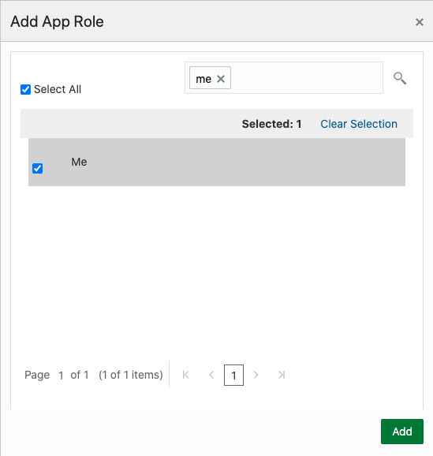

    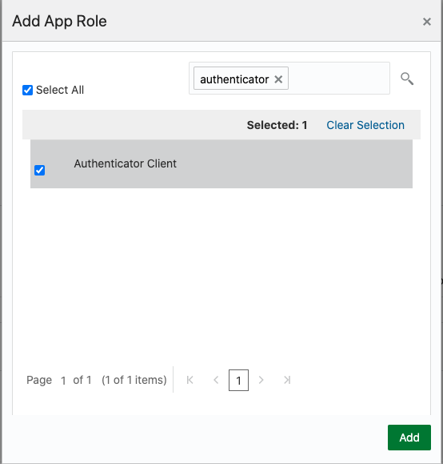

    

8. Click Next in the Client pane and in the following panes until you reach the last pane. Then click Finish.
   
   

9.  In the Application Added dialog box, make a note of the `Client ID` and `Client Secret` values (because your web application needs these values to integrate with Oracle Identity Cloud Service), and then click Close.
    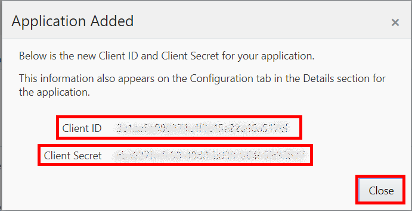

10. To activate the application, click Activate.
    

11. In the Activate Application dialog box, click Activate Application and confirm its activation.
The success message The SDK Web Application application has been activated appears.
    
    


12.  In the Identity Cloud Service console, click the user name at the top-right of the screen, and click Sign Out


## STEP 2: Update the Sample Web Application

*Important: The sample web application isn't meant to be published to production and isn't concerned about the language’s specific best practices, such as data handling, patterns, security, and so on. The sole purpose of the sample web application is to address the recommended approach to integrate Oracle Identity Cloud Service and a custom application using the SDK.*


In this section, you will update the sample application code to integrate the web applications with Oracle Identity Cloud Service's by leveraging the SDK for Node.js programming language.

1. Download the sample web application from [HERE](./nodejs/nodejs.zip) and uncompress the file in your download location using the **unzip** command

    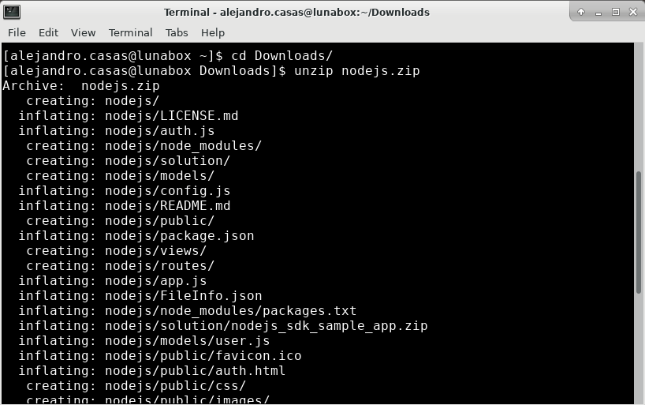


2. Edit the `nodejs\auth.js`.The file Should be located at the directory where you have downloaded the sample code. First you must capture the `ClientTenant` data from your main Identity Console URL as shown in the below screen.

    

    Below you can find the tenants information

    ```
        OSPATRAINING1: https://idcs-8c7a0db6cebe440284c099d028407e26.identity.oraclecloud.com
    ```
    ```
        OSPATRAINING2: https://idcs-25bdb22c1940441691a889621eb0113a.identity.oraclecloud.com
    ```

3. Update the following lines with the information captured during the IDCS app enrollment and the `ClientTenant` data gathered in the previous step.   The `AudienceServiceUrl` is the entire string that contains your `ClientTenant + .identity.oraclecloud.com` 

The data withing the `auth.js` file should looks similar to the below example.

---


```
 var ids = {
        oracle: {
            "ClientId": "fadecc01c1bd49c0b26fd61111111111",
            "ClientSecret": "c47c024a-4d65-4d92-a1cb-xxxxxxxxxxx",
	        "ClientTenant": "idcs-8c7a0db6cebe440284c099xxxxxxxxxx",
            "IDCSHost": "https://%tenant%.identity.oraclecloud.com",
            "AudienceServiceUrl" : "https://idcs-8c7a0db6cebe440284c099xxxxxxxxxx.identity.oraclecloud.com",
            "TokenIssuer": "https://identity.oraclecloud.com/",
            "scope": "urn:opc:idm:t.user.me openid",
            "logoutSufix": "/oauth2/v1/userlogout",
            "redirectURL": "http://localhost:3000/callback",
            "LogLevel":"warn",
            "ConsoleLog":"True"
        }
    };

    module.exports = ids;

```
---

*Note: It is important to update the fields above accordingly before continuing to the next sections.*

## STEP 3: Provisioning the App

In order to allow your user to consume the app, you must first provisioning the object to your account. 

1. Go to the IDCS App console by copy and pasting the following link into your Luna Browser. Use the URL based on the tenant that you are running the lab.

---
OSPATRAINING1
```
https://idcs-<your_tenant_id>.identity.oraclecloud.com/ui/v1/myconsole
```
---

2. On **My Apps** console, select **Add**

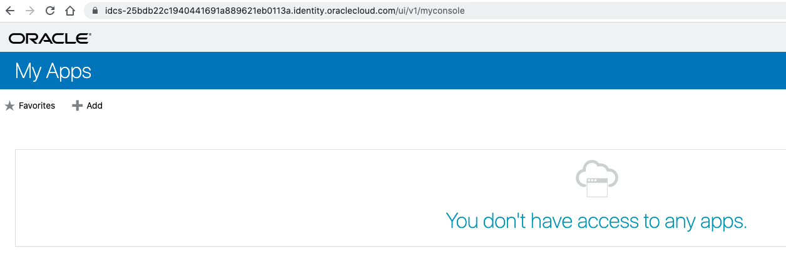

3. Select the **Applications** tab and Click the **+** option at the end of the **SDK Web Application** app


4. Provide an access justification and click **Ok**


5. You will receive an email with the app provisioning confirmation. Now you are able to test your custom app.

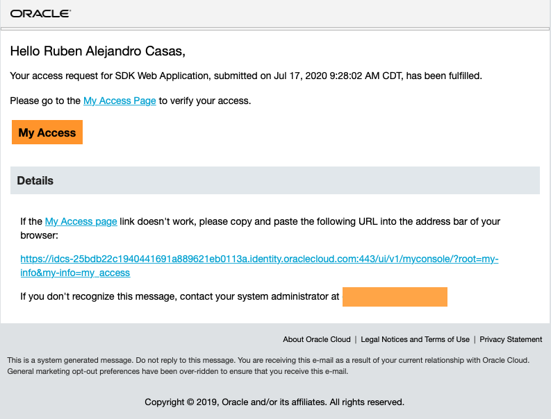

## STEP 4: Run the Sample Web Application

In this section of the tutorial, you will prepare, run, and test the sample web application.

1. Open a command prompt, navigate to the **nodejs** folder, and enter `npm install` to install all of the necessary modules, which are specified in the **package.json** file. Once the command is completed, you will see the following message: `npm WARN nodejs-sdk-oracle-idcs@1.0.0 No repository field`.

    

    *Note: If the previous command fails to install the packages, run the following command `npm install --global windows-build-tools`, and then run `npm install`*


    *Note: If you receive the message `found 1 High severity vulnerability` during installation process, run the following command to fix the package:*

    ```
    npm audit fix --force
    ```

    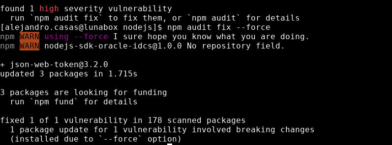

2. Copy the IDCS SDK package to the node modules directory by running this command in your download location `cp nodejs-18.4.6-1.2.3.zip nodejs/node_modules`

    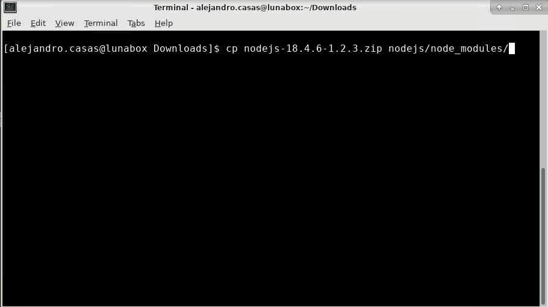

3. Go to `~\nodejs\node_modules` folder and then extract the Oracle Identity Cloud Service **SDK** file using the `unzip` command.  
   
    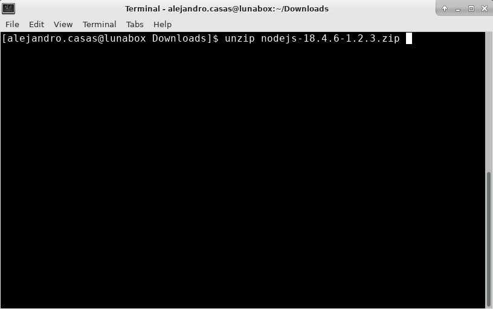

4. The source code structure of the sample web application must be similar to the one below.

    ```
    ~/nodejs/
        models/
        node_modules/
            ...
            passport-idcs/
                ...
        public/
        routes/
        view/
        app.js
        ...

    ```

    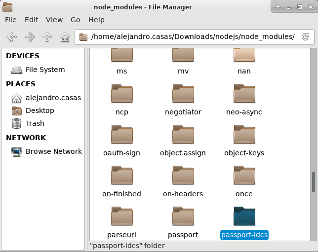

    Here you can find a sample directory structure

    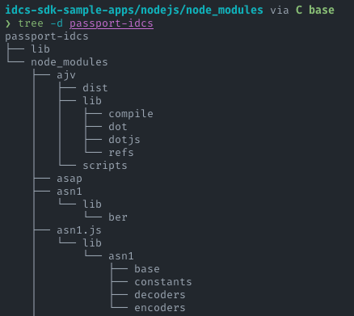


    ***Note: Make sure to run the `npm install` command before extracting the Oracle Identity Cloud Service **Node.js SDK** package into the sample web application source code's `node_modules` folder.***


5. In the command prompt, run the `npm start` command to start the application.
The `Server started on port 3000` message appears in the command prompt window.

    

*Note: If another service is using port 3000, you must remove the process listening on that port by runnin the `kill` command.*

```
kill $(lsof -t -i:8080)
```

6. Make sure that you don't have any browser running, open a new window and access the `http://localhost:3000` URL. Click **Log in**. 

    

7. In the Login page, click the Oracle red icon.

    

8. In the Oracle Identity Cloud Service Log In page, sign in using your Luna Lab credentials.

    

9. After you sign in to Oracle Identity Cloud Service successfully, the browser is redirected to the **Home**. The name of the logged-in user appears at the in the main page.

10. In the left menu, click **My Profile**.

    

11.  Verify that information associated with your profile appears in the center of the page.

    

    *Note: The information provided is sent to us on a JavaScript Object Notation (JSON) format. JSON is an open standard file format, and data interchange format, that uses human-readable text to store and transmit data objects.*

12. Click **Log Out** on the left-hand side of the screen. The sample application finalizes the user session and redirects the browser to Oracle Identity Cloud Service's logout URL as defined in the IDCS application configuration.
    
13. After Oracle Identity Cloud Service logs the user off, it redirects the user browser to the sample application index page. This behavior happens because the sample application adds two parameters `post_logout_redirect_uri` and `id_token_hint` to the Oracle Identity Cloud Service logout URL, as per below:

    


The `post_logout_redirect_uri` parameter value must match the Post Logout Redirect URL parameter value you set during Register the Sample Web Application with Oracle Identity Cloud Service


## STEP 5: Testing Single Sign-On capabilities

Let's test Oracle Identity Cloud Service Single Sign-On capabilities. 

1. First, close your browser or start a new window on incognito mode.

2. Open Firefox.

    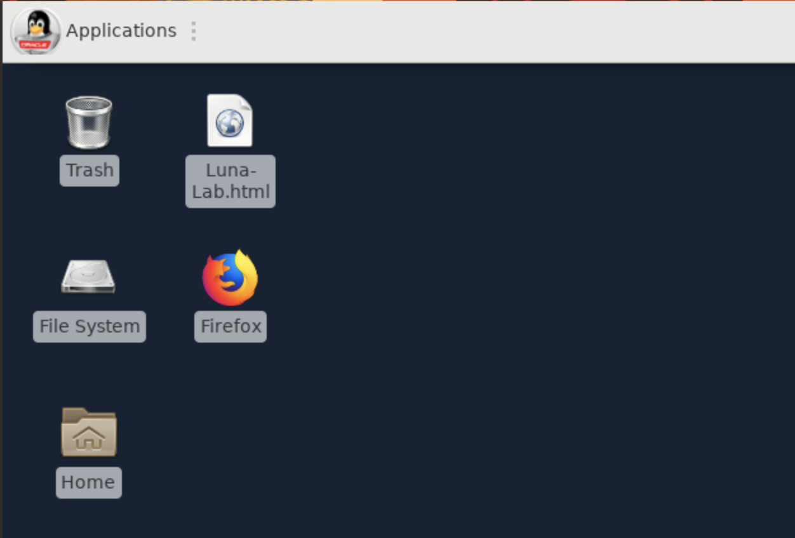

3. Copy your credentials and open the OCI Console by clicking the button above.

    
    

4. Use your crendentials to login to OCI console. 

    

5. Once in the OCI console, open a new tab on the same browser window.
   
   

6. In the new tab, with the Node.js application running, type `http://localhost:3000` and click **Log in**. 

    

7. In the Login page, click the Oracle red icon.

    


8. Because you have already signed in to OCI, the browser will redirect you to the **Home** page without asking for your credentials. The name of the logged-in user appears at the in the main page.


9. In the left menu, click **My Profile**.

    

10.  Verify that information associated with your profile appears in the center of the page. You will see that the information listed there is associated with your user id.
    
   
    

11. Click **Log Out** on the left-hand side of the screen. The sample application finalizes the user session and redirects the browser to Oracle Identity Cloud Service's logout URL as defined in the IDCS application configuration.

******

**What you have done**

**Oracle Identity Cloud Service** provides a Software Development Kits (SDK) that can be used to integrate custom web applications.
As part of this lab you have created a new confidential application in **Oracle Identity Cloud Service**, configure a custom **node.js** application and experience the single sign-on capabilities delivered by IDCS.

******