# Oracle Audit Vault and DB Firewall (AVDF)

## Introduction
This workshop introduces the various features and functionality of Oracle Audit Vault and DB Firewall (AVDF). It gives the user an opportunity to learn how to configure those appliances in order to audit, monitor and protect access to sensitive data.

*Estimated Lab Time:* 120 minutes

*Version tested in this lab:* Oracle AVDF 20.1

### Video Preview
Watch a preview of "*Understanding Oracle Audit Vault and Database Firewall 20c (August 2020)*" [](youtube:9xG0GFKbVJk)

### Objectives
- Connect Audit Vault Server to an Oracle DB
- Configure the auditing for this Db and explore the auditing and reporting capacities
- Configure and manage the Firewalling monitoring
- Train the DB Firewall for expected SQL traffic and see the effects on a web App

### Prerequisites
This lab assumes you have:
- A Free Tier, Paid or LiveLabs Oracle Cloud account
- SSH Private Key to access the host via SSH
- You have completed:
    - Lab: Generate SSH Keys
    - Lab: Prepare Setup (Free Tier and Paid Oracle Cloud Accounts Only)
    - Lab: Environment Setup
    - Lab: Initialize Environment
    - Lab: DBSAT (please refer to the *Oracle Database Security Baseline Workshop*)

### Lab Timing (estimated)

| Step No. | Feature | Approx. Time |
|--|------------------------------------------------------------|-------------|
|| **Audit Vault Labs**||
|01| Run the Deploy Agent | <5 minutes|
|02| Register a Pluggable Database as Target | <5 minutes|
|03| Register an Audit Trail | <5 minutes|
|04| Manage Unified Audit Settings | 5 minutes|
|05| Retrieve User Entitlements | <5 minutes|
|06| Access Rights and User Activity on Sensitive Data | <5 minutes|
|07| Auditing Column Data Changes - Before and After Values | 15 minutes|
|08| Create Alert Policies | 10 minutes|
|| **DB Firewall Labs**||
|09| Add the Firewall Monitoring | 10 minutes|
|10| Configure and Verify Glassfish to use the Database Firewall | 10 minutes|
|11| Train the Database Firewall for expected SQL traffic | 20 minutes|
|12| Build and Test the DB Firewall Allow-List Policy | 20 minutes|
|| **AVDF Advanced Labs**||
|13| PostgreSQL Audit Collection | 10 minutes|
|14| Linux Audit Collection | 10 minutes|
|15| LDAP/Active Directory Configuration | <5 minutes|

<!-- DB Firewall in progress!
|06| Audit Vault - Audit Stored Procedures Changes | 5 minutes|
-->
<!-- DB Firewall in progress!
|14| Establish Trusted Users and Application Paths | 5 minutes|
|15| Refine, Publish and Deploy DB Firewall Policy | 5 minutes|
|16| Test the DB Firewall Policy with DBA Exceptions | 5 minutes|
|17| Refine, Publish and Deploy DB Firewall Policy to Monitor Sensitive Data | 5 minutes|
|18| Block SQL Injection | 5 minutes|
-->
<!-- Advanced Labs in progress!
|19| MySQL Audit Collection | 5 minutes|
-->

## **STEP 0**: Audit Vault - Initialize ADVF Web Console

Before starting the labs, you must enable the workshop pre-configured AVDF Web Console

1. Open a SSH session on your **AVS VM as *opc* User**

2. Initialize the ADVF Console Login

      ````
      <copy>sudo /root/bootstrap/fix-apex-login.sh</copy>
      ````

3. Close the session

## **STEP 1**: Audit Vault - Run the Deploy Agent

1. Open a SSH session on your **DBSec-Lab VM as *oracle* User**

      ````
      <copy>sudo su - oracle</copy>
      ````

2. Go to the scripts directory

      ````
      <copy>cd /home/oracle/DBSecLab/workshops/Database_Security_Labs/AVDF/Deploy_Agent</copy>
      ````

3. The first script will unpack the `avcli.jar` utility so we can automate most of the agent, host, and audit trail deployment

      ````
      <copy>./01_deploy_avcli.sh</copy>
      ````

4. Next, we will use the AV Command Line Interface (AVCLI) to register the host, dbsec-lab, with Audit Vault. You will see that the commands being run are stored in the `avcli_register_host.av` file. In this step you will see a activation key. **Record this Activation Key for use later in the lab!**

      ````
      <copy>./02_register_host.sh</copy>
      ````

5. Your output will look similar to this but your `Activation Key` will be different

   

6. Next, we will deploy the Audit Vault Agent. This script will unpack the `agent.jar` file into the `/u01/app/avagent` directory.

      ````
      <copy>./03_deploy_avagent.sh</copy>
      ````

7. Once deployed, we will need to activate the Audit Vault Agent. Remember the activation key we saw above and paste the key when prompted.

      ````
      <copy>./04_activate_avagent.sh</copy>
      ````

8. Your output will look similar to this but your `Activation Key` will be different

   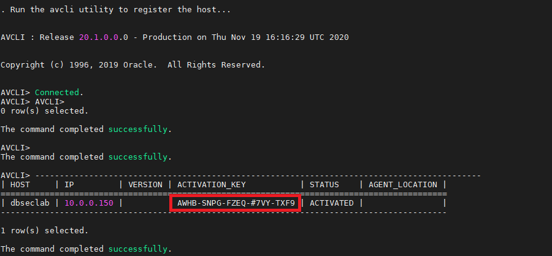

9. As a final step, we will verify that the dbsec-lab host has been properly registered and is activated with Audit Vault

      ````
      <copy>./05_show_host.sh</copy>
      ````

10. Notice the output says `Running` for the Agent Status column

   

## **STEP 2**: Audit Vault - Register a Pluggable Database as Target

1. Go to the scripts directory

      ````
      <copy>cd /home/oracle/DBSecLab/workshops/Database_Security_Labs/AVDF/Register_Database</copy>
      ````

2. You could perform the register from the Audit Vault Web UI but we will use the AVCLI instead

      **Note**:
      - You will need to enter the `AVAUDITUSER` password during this step
      - This user is a database user that was created, and granted the appropriate privileges, to perform database audit collection and clean-up and has `SELECT` access on several dictionary tables (for more information please see the Oracle Audit Vault and Database Firewall documentation)
      - The password for `AVAUDITUSER` is `Oracle123`

      ````
      <copy>./01_register_database.sh</copy>
      ````

3. When complete, your output should look similar to this:

   

## **STEP 3**: Audit Vault - Register an Audit Trail

1. Go to the scripts directory

      ````
      <copy>cd /home/oracle/DBSecLab/workshops/Database_Security_Labs/AVDF/Register_Audit_Trail</copy>
      ````

2. The first script will use the AVCLI to register the Unified Audit Trail for the `pdb1` database

      ````
      <copy>./01_register_audit_trail.sh</copy>
      ````

3. The second script will list the Audit Trails for the `pdb1` pluggable database. You should see one row returned for the Unified Audit Trail and the output from the script should look similar to this:

   

      **Note**: The `Status` column should say `Collecting` or `Idle`.  If it says something else please run the script again and verify it changes state.

4. View audit data collected via the All Activity Report using the web browser
    - Open a Web Browser at the URL `https://<AVS-VM_@IP-Public>`
    - Login to Audit Vault Web Console as `AVAUDITOR` with the password `T06tron.`
    - Click on the **Reports** tab
    - Under the **Activity Reports** section titled **Summary**, click on the **All Activity** name to load the report
    - You should see a report that looks something like this:

   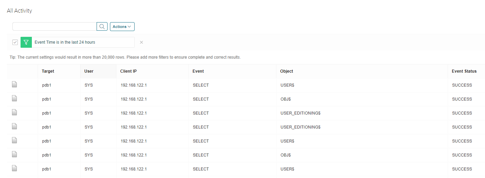

    - You can click on the **Event Status** header and narrow down the report to `Event Status = 'FAILURE'`
    - It might look something like this:

   

      **Note**:
      - This was just a small example to verify that audit data was being collected and is visible in Audit Vault
      - There will be more detailed report generation labs later in the workshop

5. You have completed the lab to register the Unified Audit Trail for `pdb1` with Audit Vault

## **STEP 4**: Audit Vault - Manage Unified Audit Settings

You will retrieve and provision the Unified Audit settings for the `pdb1` pluggable database

1. Open a Web Browser at the URL `https://<AVS-VM_@IP-Public>`

2. Login to Audit Vault Web Console as `AVAUDITOR` with the password `T06tron.`

   

3. Click on the `Targets` tab

4. Click on the Target `pdb1`

5. On the target screen, under `Audit Policy` perform the following:
    - Checkbox `Retrieve Immediately`
    - Change the radio button for `Schedule` to `Enable`    
    - Set the `Schedule` to `Repeat Every` **1 Day**    
    - Press `Save` to save and continue

   

6. Next, view the audit policy reports for `pdb1`
    - Click on the `Policies` tab and you will be placed on the `Audit Policies` page
    - Click on the Target Name `pdb1`
    - On this screen, you will see two tabs, `Unified Auditing` and `Traditional Auditing`. Since this is a modern version of Oracle, 12.1 or higher, we want to use Unified Auditing
    - In the `Core Policies` section, ensure the following are checkmarked
        - Critical Database Activity
        - Database Schema Changes
        - All Admin Activity
        - Center for Internet Security (CIS) Configuration
    - Click `Provision Unified Policy`

   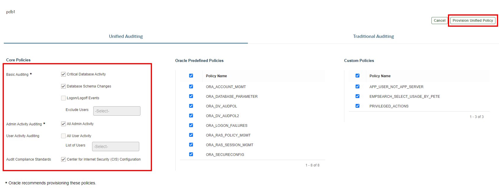

7. Verify the job completed successfully
    - Click on the `Settings` tab
    - Click on the `Jobs` section on the left menu bar
    - You should see at least one `Job Type` that says `Unified Audit Policy`
    - Verify it shows `Complete` and it was provisioned on `pdb1`

   

8. The next thing you can do is check which Unified Audit Policies exist and which Unified Audit Policies are enabled by using `SQL*Plus`
    - Go back to the terminal and go to the scripts directory

      ````
      <copy>cd /home/oracle/DBSecLab/workshops/Database_Security_Labs/AVDF/Manage_Unified_Auditing</copy>
      ````

    - Run the first script to query `all` of the Unified Audit Policies in `pdb1`

      ````
      <copy>./01_query_all_unified_policies.sh</copy>
      ````

    - Run the second script to show the **enabled** Unified Audit policies

      ````
      <copy>./02_query_enabled_unified_policies.sh</copy>
      ````

9. If you want, you can re-do the previous steps and make changes to the Unified Audit Policies. For example, don't enable the `Center for Internet Security (CIS) Configuration` and re-run the two shell scripts to see what changes!

## **STEP 5**: Audit Vault - Retrieve User Entitlements

1. Login to Audit Vault Web Console as `AVAUDITOR` with the password `T06tron.`

   

2. Click on the `Targets` tab

3. Click on the Target Name

4. Under `User Entitlements`
    - Checkbox `Retrieve Immediately`
    - Change the `Schedule` radio button to Enable
    - Set `Repeat Every` to `1 Days`
    - In this section, click [**Save**]

   

5. Click on the `Reports` tab

6. Scroll down and expand the `Entitlement Reports` section

   

7. Click on the `User Accounts` report
    - Under `Target Name`, select `All`
    - For `Label`, select `Latest`
    - Click [**Go**] and you will see a report that looks like this

   

<!---
8. Now that we have seen a simple report, we will create a differential report:

    - Go back to the terminal and go to the scripts directory

      ````
      <copy>cd /home/oracle/DBSecLab/workshops/Database_Security_Labs/AVDF/Retrieve_User_Entitlements</copy>
      ````

    - Run the first script to create a new user `AUDITOR_ALAN`

      ````
      <copy>./01_create_new_user.sh</copy>
      ````

    - Using the browser, navigate back to the `Targets` tab and then to the `User Entitlement Snapshots` on the left-hand menu

   

    - Create a new label called `baseline` based on the snapshot we took during our initial entitlement configuration

   

    - From the `Targets` tab, click on the `Target Name` again and run another User Entitlements job by checkboxing  `Retrieve Immediately` and clicking [**Save**]

   

    **Note**: Make sure you update the `Start At` Day and time to reflect the time you currently have
--->

<!--
**STEP 6**: Audit Vault - Audit Stored Procedures Changes

In this lab you will enable, and test, the Audit Stored Procedure Changes for the pluggable database `pdb1`.

First, using your Linux terminal window, navigate to the following directory.

`cd /home/oracle/DBSecLab/workshops/Database_Security_Labs/AVDF/Audit_Stored_Procedure_Changes`

Execute the script to generate the creation of a PL/SQL function, creating a table, modifying a table, and modifying then deleting the PL/SQL function.

`./01_stored_procedure.sh`

Next, using a web browser, login to Audit Vault as `AVAUDITOR` and the password `T06tron.` with the `dot` included in the password.

   

- Click [**Targets**]

- Click `pdb1`

- Where the section `Stored Procedure Auditing` says `Disabled` change it to `Enabled`

    - Make sure the `Start At` time is approximately at, or ahead, of the current time

    - Change the `Repeat Every` to `1 Days`

    - Press `Save`

   

**Note**: If you receive an error stating the `Start At is less than specified minimium date` look at the `Audit Policy` or the `User Entitlements` sections and update their `Start At` dates to be similar what you set for the `Stored Procedure Auditing` date.

*View Stored Procedure Change Reports*

Now view the reports related to Stored Procedures.

- Click the `Reports` tab

- Scroll down until you get to `Stored Procedure Changes` and expand the section

   

- Click `Created Stored Procedures` and view the results.

This is an example of the kind of data you can collect with Audit Vault and Database Firewall.

You have completed the lab.
-->

## **STEP 6**: Audit Vault - Access Rights and User Activity on Sensitive Data

1. In this lab you will use the results from a Database Security Assessment Tool (DBSAT) collection job to identify the sensitive data with the pluggable database `pdb1`. So, the first step is to complete the Database Security Assessment Tool (DBSAT) lab (For more details, please refer to the `Oracle DB Security Baseline Workshop`).

2. Grant Privilege to Import Sensitive Data. Before we begin the lab, you must use the Linux terminal to connect to Audit Vault and grant the sensitive role to the admin user `AVADMIN`:

    - From your terminal session, open a SSH session onto your Audit Vault Server VM as `support` User with the password `T06tron.`

      ````
      <copy>ssh support@av</copy>
      ````

    - Switch to the `root` user and, again, use the password `T06tron.`

      ````
      <copy>su -</copy>
      ````

    - Now that we are `root` we need to become `oracle` User

      ````
      <copy>su - oracle</copy>
      ````

    - Once we have switched to `oracle`, we have to run the Python script to grant the additional role

      ````
      <copy>python /usr/local/dbfw/bin/av_sensitive_role grant avadmin</copy>
      ````

    - The results should look like this screenshot

   

3. Loading the Sensitive Data from DBSAT. Now that we have the role granted, we can load the data from our DBSAT lab.

    - Go to the scripts directory

      ````
      <copy>cd /home/oracle/DBSecLab/workshops/Database_Security_Labs/AVDF/DBSAT_and_Sensitive_Data</copy>
      ````

    - Copy the DBSAT `csv` file, created during the DBSAT Sensitive Data Discovery lab, to the Glassfish directory for us to download

      ````
      <copy>./01_download_sensitive_data_csv.sh</copy>
      ````

     - You will be given a URL to access the CSV file that was created during the DBSAT Sensitive Data Discovery lab. It will look like this: `http://<DBSECLAB-VM_@IP-Public>:8080/hr_prod_pdb1/dbsat/pdb1_dbsat_discover.csv`

    - Using the web browser, save and download the `pdb1_dbsat_discover.csv` file
        - Login to the Audit Vault as `AVADMIN` using the password `T06tron.`
        - Click the `Targets` tab
        - Click the `pdb1` target name
        - In the right, top, corner of the page click `Sensitive Objects`
        - Choose the `pdb1_dbsat_discover.csv` file you saved to your local system

   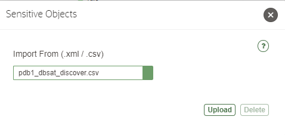

    - If you click `Sensitive Objects` again you will see you have the `csv` file loaded

   

4. View the Sensitive Data

    - Using the web browser, in your `AVAUDITOR` session, click the `Reports` tab
    - On the left side menu, click `Compliance Reports`
    - Click [**Go**] to associate the `pdb1` target with the `Data Private Report (GDPR)` group
    - Checkbox `pdb1` and then click [**Add**]
    - Unfortunately, once you associate the target with the report, Audit Vault takes you to some unknown page
    - Navigate back to the original page by clicking `Reports` then `Compliance Reports`
    - Click `Sensitive Data` and now you can see the Schema, Objects, Object Types, and Column Name and Sensitive Types

   

5. You can also view additional reports about Sensitive Data

   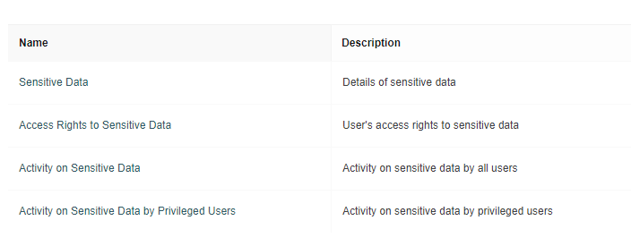

## **STEP 7**: Audit Vault - Auditing Column Data Changes - Before and After Values

**About Oracle Audit Vault Transaction Log Audit Trail Collection**

REDO log files also known as transaction logs are files used by Oracle Database to maintain logs of all the transactions that have occurred in the database. This chapter contains the recommendations for setting initialization parameters to use the TRANSACTION LOG audit trail type to collect audit data from the REDO logs of Oracle Database target.

These log files allow Oracle Database to recover the changes made to the database in case of a failure. For example, if a user updates a salary value in a table that contains employee related data, a REDO record is generated. It contains the value before this change (old value) and the new changed value. REDO records are used to guarantee ACID (Atomicity, Consistency, Isolation, and Durability) properties over crash or hardware failure. In case of a database crash, the system performs redo (re-process) of all the changes on data files that takes the database data back to the state it was when the last REDO record was written.

REDO log records contain Before and After values for every DML (Data Manipulation Language) and DDL (Data Definition Language) operations. Oracle Audit Vault and Database Firewall provides the ability to monitor the changed values from REDO logs using Transaction Log collector.

Transaction Log collector takes advantage of Oracle GoldenGate’s Integrated Extract process to move the REDO log data from database to XML files. The extract process is configured to run against the source database or it is configured to run on a Downstream Mining database (Oracle only). It captures DML and DDL operations performed on the configured objects. The captured operations from transaction logs are transferred to GoldenGate XML trail files. Oracle AVDF's Transaction Log collector, collects transaction log records from generated XML files. These logs are forwarded to the Audit Vault Server to show the before and after values changed in the Data Modification Before-After Values report. The DDL changes are available in the All Activity report. The DML changes are available in the Data Modification Before-After Values report.

**Getting Started**
The first thing we need to do is to set up the database to be ready for Golden Gate

1. Go to the scripts directory

      ````
    <copy>cd /home/oracle/DBSecLab/workshops/Database_Security_Labs/AVDF/Before_and_After_Changes</copy>
      ````

2. We will create the Golden Gate Database Administration user, `C##AVGGADMIN`, in the container database, `cdb1`

      ````
    <copy>./01_create_ggadmin_db_user.sh</copy>
      ````

3. Next, we have to configure the database to have the appropriate `sga_target` and `streams_pool_size` values, enable the `enable_goldengate_replication` initialization parameter and `forcing logging` for redo collection

      ````
    <copy>./02_configure_db_for_gg.sh</copy>
      ````

     **Note**: This will require a reboot and this script will do this for you

4. Finally, verify connectivity to the `cdb1` container database before we continue with the configuration of the GoldenGate Extract

      ````
    <copy>./03_test_dbuser_connectivity.sh</copy>
      ````

**Configuring a GoldenGate Extract**

5. In the VM, the `Oracle GoldenGate for Oracle` software has been already installed and configured, but ensure the Golden Gate Administration Service is up and running

      ````
    <copy>./04_start_gg.sh</copy>
      ````

6. Using a web browser, login to your Database Security VM as `oggadmin` with the password `Oracle123`

    `http://<DBSECLAB-VM_@IP-Public>:50002/`

   

7. In the top left corner, click the `burger menu`

8. Click `Configuration`

9. Click the `+` next to `Credentials`

10. Next, create a new Credential with the following values

    - Credential Domain: `cdb1`
    - Credential Aalias: `cdb1`
    - User ID: `c##avggadmin@(DESCRIPTION=(ADDRESS=(PROTOCOL=tcp)(HOST=10.0.0.150)(PORT=1521))(CONNECT_DATA=(SERVICE_NAME=cdb1)))`
    - Password: `Oracle123`
    - Verify Password: `Oracle123`

   

    - Press `Submit`

11. Under `Action`, press the `Verify` button for the `cdb1` Domain

   

12. If your connection was successful, you should now see a `Checkpoint`, a `Transaction Information` and a `Heartbeat` section

   

13. Now we will navigate back to the GoldenGate Administration Server dashboard and add a GoldenGate `Extract`

    - In the top left corner, click the `burger menu`
    - Click `Overview`
    - In the `Extracts` section, click the `+` symbol to create a new Extract

   

    - Choose `Integrated Extract` and click [**Next**]
    - The `Basic Information` section should look like this screenshot

   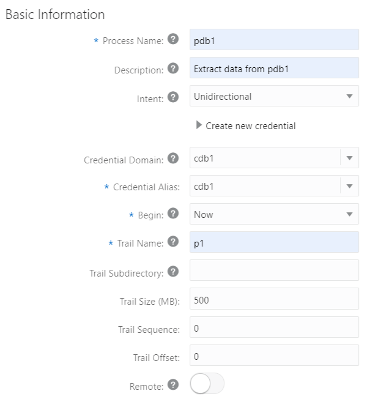

    - The `Registration Information` section should look like this screenshot:

   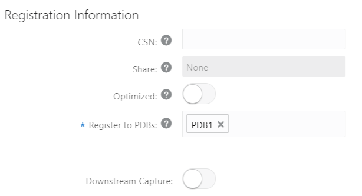

    - Press `Next`

    - Replace the existing `Parameter File` with this

         ````
        <copy>extract pdb1
        useridalias cdb1 domain cdb1
        OUTPUTFORMAT XML _AUDIT_VAULT
        exttrail p1
        SOURCECATALOG pdb1
        DDL INCLUDE ALL
        TABLE employeesearch_prod.*;</copy>
         ````

    - Your `Parameter File` should look like this

   

    - Press `Create and Run`

    - You will be redirected to the dashboard and you should now have one `Extract` in `Other` status

   

    - On the `PDB1` Extract, click [**Action**] and click [**Start**]

    - Confirm you want to `Start` the Extract process

    - Confirm your `Extract` now shows `Running`

   

**Configure a new Audit Trail**

14. Using a web browser, login to the Audit Vault Web Console as `AVADMIN` with the password `T06tron.`

15. Click the `Targets` tab

16. Click the `pdb1` Target

17. Click [**Modify**] to add an attribute to the Target

18. Click the `Audit Collection Attributes` tab

19. Click [**Add**] to tell the collect this database is in the PDT timezone

    - Name: `av.collector.TimeZoneOffset`
    - Value: `-7:00`

   

    - Click [**Save**]

20. In the `Audit Data Collection` section, click [**Add**]

21. For the new Audit Trail, use the following values

    - Audit Trail Type: `TRANSACTION LOG`
    - Trail Location: `/u01/app/oracle/product/ogg/var/lib/data`
    - Agent Host: `dbseclab`
    - Review the inputs for accuracy

   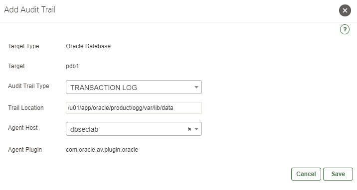

    - Click [**Save**]

22. The new `Audit Trail` might say `Stopped` but if you refresh the page (press `F5`) then it should switch to `Collecting` or `Idle`

   

**Generate Changes and View the Audit Vault Reports**

23. Generate data and object changes

      ````
    <copy>./04_generate_employeesearch_prod_changes.sh</copy>
      ````

24. Using a web browser, login to the Audit Vault Web Console as `AVAUDITOR` with the password `T06tron.`

25. Click the `Reports` tab

26. In the `Data Access & Modification` section, click `Data Modification Before-After Values`

27. You should see an output similar to the following screenshot:

   

**Troubleshooting Issues and Errors**

28. If you are not seeing Before/After value changes in Audit Vault, ensure you:
    - Are logged in as `AVAUDITOR` to view the AV reports
    - You properly executed the scripts in `Before_and_After_Changes` folder to create the `C##GGAVADMIN` user and setup the database
    - Your GoldenGate Microservices are started by running `$DBSEC_ADMIN/start_gg.sh`
    - Golden Gate Extracts are in a state of `Running`. If not, perform the following:
        - Using a web browser login to the GoldenGate Admin server you used above (`http://<DBSECLAB-VM_@IP_PUBLIC>:50002`)
        - From the Console, click [**Action**] for the `PDB1` extract and set it to `Start`

   

## **STEP 8**: Audit Vault - Create Alert Policies

In this lab you will modify the Database Firewall connection for the pluggable database, `pdb1`

1. Login to the Audit Vault Web Console as `AVAUDITOR` with the password `T06tron.`

   

2. Click the `Policies` tab

3. Click the `Alert Policies` tab

4. Click [**Create**]

5. Enter the following information for our new `Alert`

    - Alert Name: `CREATE USER`
    - Type: `Oracle Database`
    - Severity: `Warning`
    - Threshold (times): `1`
    - Duration (min): `0`
    - Group By (Field): `- Select Field - `
    - Description: `Alert on CREATE USER statements`
    - Condition: ` :EVENT_NAME = 'CREATE USER'`
    - Template: `Alert Notification Template`
    - Distribution List: `-- No Distribution List --`
    - To: `null`
    - Cc: `null`

6. Your `Alert` should look like the following screenshot:

   

7. Click [**Save**]

8. Create an Alert Policy: go back to your terminal session and go to the scripts directory

      ````
      <copy>cd /home/oracle/DBSecLab/workshops/Database_Security_Labs/AVDF/Create_Alert_Policies</copy>
      ````

9. Create users within the `pdb1` pluggable database

      ````
      <copy>./01_create_users.sh</copy>
      ````

10. View Alerts: go back to the Audit Vault Web Console as `AVAUDITOR`

11. Click `Alerts`

12. View the Alerts that have occurred related to our user creation SQL commands

   

13. Click on the details of one of the alerts

   

14. Execute the script to drop the users we created in the previous script

      ````
      <copy>./02_drop_users.sh</copy>
      ````

    **Note**: Once you understand how to create an alert, feel free to create another and test it manually.

## **STEP 9**: DB Firewall - Add the Firewall Monitoring

1. Login to the Audit Vault Web Console as `AVADMIN` with the password `T06tron.`

   

2. Click on `Database Firewalls` tab

3. Click on `dbfw` Database Firewall Name

   

4. Click `Network Settings`

   

5. Click on `eth0`

   

6. To add a `Proxy Port`
    - Click [**Add**]
    - Name it `dbfw_proxy`
    - Use the port `15223`
    - Click [**Save**]

   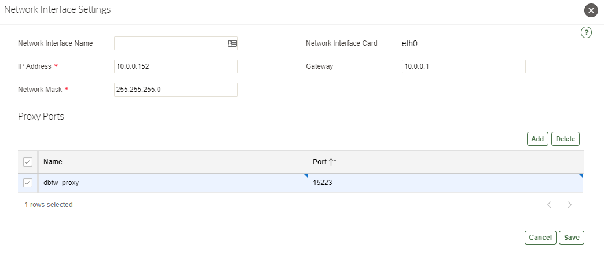

7. Your Database Firewall Network Settings should now look like this:

   

8. Now, you will enable Database Firewall Monitoring for `pdb1` using the Proxy Port we just created

9. Click the `Targets` tab

10. Click `pdb1`

11. In the `Database Firewall Monitoring` section of this page, click [**Add**]

12. Fill out the following details

    - Database Firewall: `dbfw`
    - Mode: `Monitoring / Blocking (Proxy)`
    - Network Interface Card: `eth0`
    - Proxy Ports: `dbfw_proxy (15223)`

13. Click [**Add**]

14. Fill out the fields as following
    - Host Name / IP Address: `10.0.0.150`
    - Port: `1521`
    - Service Name: `pdb1`

   

    **Note**:
    - Ensure you use the IP Address not the hostname because the DBSecLab VMs are using DNS!
    - This is a demonstration environment limitation not an AVDF limitation

15. Click [**Save**]

16. The result should look like this:

   

17. Now, verify connectivity between the database and the DB Firewall: go back to your terminal session and go to the scripts directory

      ````
      <copy>cd /home/oracle/DBSecLab/workshops/Database_Security_Labs/AVDF/Add_Firewall_Monitor</copy>
      ````

18. Verify connectivity **without** the Database Firewall

      ````
      <copy>./01_sqlplus_without_dbfw.sh</copy>
      ````

    **Note**:
    - This will connect directly to the database on the standard listener port
    - You should see that the connection shows an IP Address of `10.0.0.150` which is the IP Address of the DBSec-Lab VM
    - This verifies that you are connecting **directly** to the `pdb1` pluggable database

19. Now, verify connectivity **with** the Database Firewall

      ````
      <copy>./02_sqlplus_with_dbfw.sh</copy>
      ````

    **Note**:
    - This will proxy through the Database Firewall and then to the `pdb1` pluggable database using the Database Firewall Monitoring we just configured
    - You should see that the connection shows an IP Address of `10.0.0.152` which is the Database Firewall IP Address
    - This verifies that you are connecting **through** the Database Firewall

## **STEP 10**: DB Firewall - Configure and Verify Glassfish to use the Database Firewall

In this lab you will modify the Glassfish connection. Instead of connecting directly to the pluggable database, `pdb1`, Glassfish will connect through the Oracle Database Firewall so we can monitor, and block, SQL commands.

1. Go to the scripts directory

      ````
      <copy>cd /home/oracle/DBSecLab/workshops/Database_Security_Labs/AVDF/DB_Firewall_and_Glassfish</copy>
      ````

2. First, use your web browser and navigate to the Glassfish application page

    - You can identify the URL by running this script

      ````
      <copy>./01_start_glassfish.sh</copy>
      ````

    - Take the URL from the output of this and use it in your web browser. We are verifying that the application functions **before** we make any changes to connection string!

3. Click [**Login**]

4. Login to the `My HR Application` as `hradmin` with the password `Oracle123`

   

5. Click `Search Employees`

6. Click [**Search**] to run a search without filters

   

7. In the top right hand corner of the browser, click on `Welcome HR Administrator` and you will be sent to a page with session data

   

8. On the `Session Details` screen, you will see how the application is connected to the database. This information is taken from the `userenv` namespace by executing the `SYS_CONTEXT` function.

   

9. Now, we are going to migrate the Glassfish Application to proxy through the Database Firewall and repeat the above steps. First, run the script to migrate connection string to the Database Firewall.

      ````
      <copy>./02_start_FW_glassfish.sh</copy>
      ````

10. Next, verify the application functions as expected. Login to `My Hr Application` as `hradmin` with the `Oracle123` password

11. Click the `Search Employees` link

12. Click [**Search**]

    **Note**: You should see the same results as you did before connecting through the Database Firewall

13. Click the `Weclome HR Administrator` link to view the `Session Details` page

14. Now, you should see that the `IP Address` row has changed from `10.0.0.150` to `10.0.0.152`, which is the IP Address of the Database Firewall

   

## **STEP 11**: DB Firewall - Train the Database Firewall for expected SQL traffic
In this lab you will use the Glassfish Application to connect through the Oracle Database Firewall so we can monitor, and block, SQL commands

**Set the NTP Server**

1. Login to the Audit Vault Web Console as `AVADMIN` with the password `T06tron.`

   

2. Click the `Database Firewalls` tab

3. Click the `dbfw` Target

4. Under `Configuration`, click `System Services`

5. Select the `NTP` tab

6. Enter the IP of `169.254.169.254` for the first NTP service

7. Click [**Save**]

**Enable Unique Logging**

8. Login to the Audit Vault Web Console as `AVADMIN` with the password `T06tron.`

   

9. Click `Targets`

10. Click `pdb1`

11. Click the `Database Firewall Monitoring` sub-tab

12. Change `Database Firewall Policy` from `Pass all` to `Log unique`

   

13. Click the `green check` to save

   

**Generate Glassfish Application Traffic**

14. On a Web browser, open your Glassfish HR App to verify that the application functions **before** make any changes to connection string

15. Click [**Login**]

16. Login to the `My HR Application` as `hradmin` with the password `Oracle123`

   

17. Click `Search Employees`

18. Click [**Search**] to run a search without filters

   

19. In the `HR ID` field enter `164` and press [**Search**] to narrow the results down to a single employee

   

20. Clear the `HR ID` field and click [**Search**] again to see all rows

21. Enter the following information in the `Search Employee` fields

    - HR ID: `196`
    - Active: `Active`
    - Employee Type: `Full-Time Employee`
    - First Name: `William`
    - Position: `Administrator`
    - Last Name: `Harvey`
    - Department: `Marketing`
    - City: `London`

22. Press [**Search**] and you should return one row

   

23. Click on `Harvey, William` to view the details of this employee

   

**View Database Firewall Activity**

Sometimes DB Firewall activity may take 5 minutes to appear in the Database Firewall Activity Reports

24. In your web browser, log back to the Audit Vault Web Console as `AVAUDITOR` with the password `T06tron.`

25. Click `Reports`

26. Scroll down to `Database Firewall Reports`

27. Click `Database Firewall Monitoring Activity`

28. Your activity should show queries from `EMPLOYEESEARCH_PROD` using a `JDBC Thin Client`

   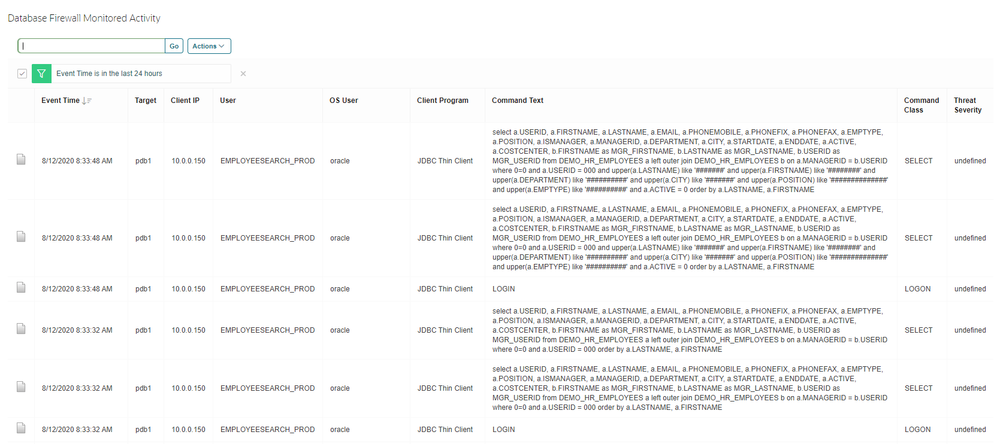

29. Click on the details of a query to see more information and notice the following information:
    - Policy Name: `Log unique`
    - Threat Severity: `undefined`
    - Log Cause: `unseen`
    - Location: `Network`

   

       **Note**:       
       - This information tells us a lot about our Database Firewall policies and why we are capturing this particular query
       - If your reports show a lot of unknown activity you probably have **Native Network Encryption** enabled
       - Please disable it from a terminal session and run the queries again:
            - To check, run the following script: `$DBSEC_LABS/Network_Encryption/Native_Network_Encryption/01_view_sqlnet_ora.sh`
            - If it says `SQLNET.ENCRYPTION_SERVER=REQUESTED` or `SQLNET.ENCRYPTION_SERVER=REQUIRED` then it needs to be disabled
            - To disable, run the following scripts: `$DBSEC_LABS/Network_Encryption/Native_Network_Encryption/disable_native_network_enc.sh`
            - To verify, run the following script: `$DBSEC_LABS/Network_Encryption/Native_Network_Encryption/01_view_sqlnet_ora.sh`
       - It should return no contents now!

30. One of our favorite queries is this SQL statement:

      ````
      <copy>select USERID,FIRSTNAME,LASTNAME from DEMO_HR_USERS where ( USERSTATUS is NULL or upper( USERSTATUS ) = '######' ) and upper(USERID) = '#######' and password = '#########'</copy>
      ````

     **Note**:
     - We like this query because this is the authentication SQL the `My HR App` uses to validate the `hradmin` and `Oracle123` password. Remember, the application is authenticated against a table not the database so queries like this will be captured
     - Notice how the Database Firewall has removed the bind values that would have included the username and password. This is to minimize the collection of sensitive data within Audit Vault and Database Firewall

31. Feel free to continue to explore the captured SQL statements and once you are comfortable, please continue the labs!

## **STEP 12**: DB Firewall - Build and Test the DB Firewall Allow-List Policy

1. Before we build our policy we have to make sure DB Firewall has logged the SQL Statements from the **Train the Database Firewall for expected SQL traffic** Lab as well as SQL statements from our `sqlplus` scripts.

2. Go back to your terminal session and go to the scripts directory

      ````
      <copy>cd /home/oracle/DBSecLab/workshops/Database_Security_Labs/AVDF/DB_Firewall_Allow_List_Policy</copy>
      ````

3. Demonstrate connectivity through the Database Firewall and the ability to query the `EMPLOYEESEARCH_PROD` tables

      ````
      <copy>./01_query_dbfw_log_unique.sh</copy>
      ````

**Create a Database Firewall Policy**

4. Login to the Audit Vault Web Console as `AVAUDITOR` with the password `T06tron.`

   

5. Click the `Policies` tab

6. Click the `Database Firewall Policies` tab

7. Click [**Create**]

8. Create the Database Firewall Policy with the following information

    - Target Type: `Oracle Database`
    - Policy Name: `HR Policy`
    - Description: `This policy will protect the My HR App.`

   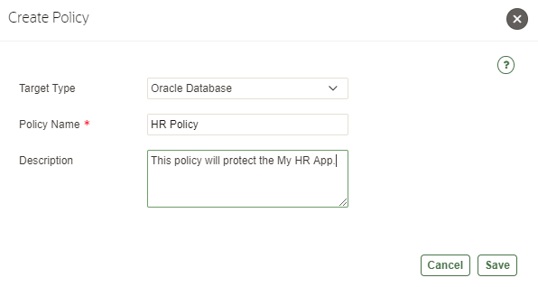

    - Click [**Save**]

9. Click on the `Hr Policy` Policy Name

   

10. Click the `Sets/Profiles` button

   

11. In the `SQL Cluster Sets` subtab, click `Add`

   

12. In the `Add SQL Cluster Set` screen, enter the following

    - Name: `HR SQL Cluster`
    - Description: `Known SQL statements for HR App`
    - Target: `pdb1`
    - Show cluster for: `Last 24 Hours` (or make this `Last Week`)

       

    - Check the `Select all` box next to  the `Cluster ID` Header

    - Make sure you add the SQL Clusters that also allow our `sqlplus` connections to work

        ```
        SELECT DECODE(USER, '#######', XS_SYS_CONTEXT('##########','########'), USER) FROM SYS.DUAL
        BEGIN DBMS_APPLICATION_INFO.SET_MODULE(:0,NULL); END;
        select upper(sys_context ('#######', '############') || '#' || sys_context('#######', '########')) global_name from dual
        BEGIN DBMS_OUTPUT.ENABLE(NULL); END;
        extracted_from_protocol describe employeesearch_prod.demo_hr_employees
        extracted_from_protocol transaction commit
        extracted_from_protocol invalid '#####################################'
        ```

    - They should look like these two screenshots

       

       

        - Click [**Save**]

13. Click [**Back**]

14. In the `SQL Statement` sub-tab, click [**Add**]

15. Complete the `SQL Statement` with the following information

    - Rule Name: `Allows HR SQL`
    - Description: `Allowed SQL statements for HR App`
    - Profile: `Default`
    - Cluster Set(s): `HR SQL Cluster`

    - Action: `Pass`
    - Logging Level: `Don't Log`
    - Threat Severity: `Minimal`

   

    - Click [**Save**]

16. Next, add database users that we trust to connect to the database through the Database Firewall. We will create a `Database User Set` of our Database Administrators.

17. Click `Sets/Profiles`

18. Click `Database User Sets`

19. Click [**Add**] and enter the following information

    - Name: `Privileged Users`
    - Description: `Users We Trust`
    - Your output should look like this screenshot

   

    - Click [**Save**]

20. Your `HR Policy` should look like this from the `Session Context` sub-tab

   

21. Your `HR Policy` should look like this from the `SQL Statement` sub-tab

   

22. Your `HR Policy` should look like this from the `Database Objects` sub-tab

   

23. Your `HR Policy` should look like this from the `Default` sub-tab

       

24. Click [**Save**]

25. Then, contrary to what you would normally do, click [**Cancel**] to get back to the `User-defined Policies` section of the `Database Firewall Policies` sub-menu

**Publish the Database Firewall Policy**

26. If you are not already in the `Policies` tab, click `Policies` on the top menu

27. Click the `Database Firewall Policies` link on the left-hand menu

28. Click the `checkbox` for `HR Policy` and click `Publish`

   

**Implement the Database Firewall Policy**

29. From the Audit Vault Dashboard, as `AVAUDITOR`, perform the following

30. Click the `Targets` tab

31. Click the Target Name `pdb1`

32. Click the `Database Firewall Monitoring` sub-tab

33. Under `Database Firewall Policy`, change the Name to `HR Policy` and click the green `checkmark`

   

**Verify the Database Firewall Policy**

34. Using your web browser, navigate to the Glassfish `My HR Application` (login as `hradmin` with the password `Oracle123`). We will validate that the Glassfish application functions as expected

35. Click `Search Employees`

36. Click [**Search**]

   

37. Add a search criteria and query again

   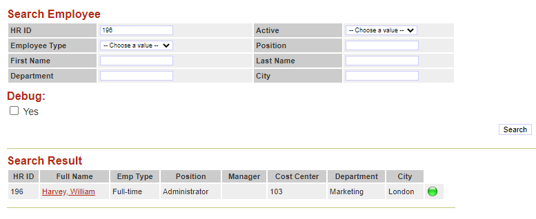

38. Go back to your terminal session and go to the scripts directory

      ````
      <copy>cd /home/oracle/DBSecLab/workshops/Database_Security_Labs/AVDF/DB_Firewall_Allow_List_Policy</copy>
      ````

39. Execute the next script. This is a copy of the first script just with a different name so it creates a different outfile file.

      ````
      <copy>./02_query_dbfw_hr_policy.sh</copy>
      ````

40. The output should show the `desc` command but return `No rows selected` for the SQL query

   

    **Note**:  Remember, this is because the Database Firewall substituted "`select * from dual where 1=2`" for the regular query

## **STEP 13**: (Advanced Labs) PostgreSQL Audit Collection
The objective of this lab is to collect audit log records from PostgreSQL databases (with pgaudit configured) into Oracle Audit Vault and Database Firewall:
- Ensure to that `pgaudit` is installed extension:
    - The PostgreSQL Audit Extension (or pgaudit) provides detailed session and/or object audit logging via the standard logging facility provided by PostgreSQL
    - The audit collection will be incomplete and operational details are missed out from the reports in case this extension is not enabled
- Make sure that the log_destination parameter is set to `csvlog` in `postgresql.conf` file:
    - The AVDF PostgreSQL audit collector will only be able to process CSV files
- Parameter logging_collector needs to be set to `ON`
- The AVDF Agent OS user needs to have read permission on the directory specified on the log_directory parameter and the generated CSV files to be able to read them

1. Go to the scripts directory

      ````
      <copy>cd /home/oracle/DBSecLab/workshops/Database_Security_Labs/AVDF/PostgreSQL_Auditing</copy>
      ````

2. Run the script as `postgres` to setup the pgaudit and load data

      ````
      <copy>sudo -u postgres ./01_init_postgreSQL.sh</copy>
      ````

3. Next, using a web browser, login to Audit Vault Web Console as `AVADMIN` with the password `T06tron.`

   

4. Click the `Targets` tab

5. Click [**Register**] to add a new `Target`

   

6. Use the following information for your new `Target` details

    - Name: `PostgreSQL`
    - Description: `PostgreSQL Database`
    - Type: `PostgreSQL`
    - Target Location: `dbsec-lab`
    - Leave the `username` and `Password` blank because we are going to use a `DIRECTORY` collector

   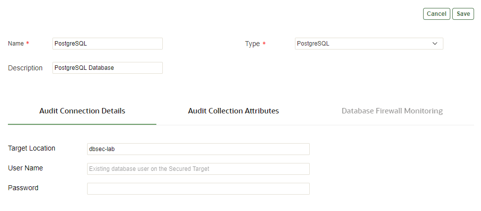

    - Click the `Audit Collection Attributes` sub-tab and add the following information

        - Name: `av.collector.timezoneoffset`  /  Value: `-7:00`
        - Name: `av.collector.securedTargetVersion`  /  Value: `11.0`

   

    - Click [**Save**]

7. Click the ``PostgreSQL`` name

   

8. In the `Audit Data Collection` section, click [**Add**]

   

9. In the `Add Audit Trail` window add the following

    - Audit Trail Type: `DIRECTORY`
    - Trail Location: `/var/log/pgsql`
    - Agent Host: `dbseclab`

   

    - Click [**Save**]

10. Go back to your terminal session and run the audit generation script

      ````
      <copy>./02_pgsql_auditable_commands.sh</copy>
      ````

11. Next, using a web browser, login to Audit Vault Web Console as `AVAUDITOR` with the password `T06tron.`

   

12. Click the `Reports` tab

13. Click the `All Activity` report name

14. You should see audited events from the `PostgreSQL` Target Database:

   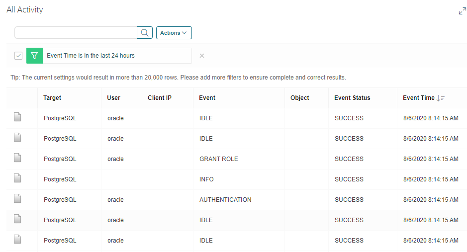

15. Finally, explore the filters and view the details on the audit data. For example, click on the `Event Status` tab and filter the report by `FAILURE`

   

16. You might see failures for multiple `Targets`

   

17. Click on the `paper` icon for first audit row for `DROP ROLE` and view the details. You should see a lot of audit details about this particular audited event

   

18. Continue to explore until you are comfortable!

## **STEP 14**: (Advanced Labs) Linux Audit Collection

Audit Vault can collect and report on the operating system audit data

1. Go to the scripts directory

      ````
      <copy>cd /home/oracle/DBSecLab/workshops/Database_Security_Labs/AVDF/Collect_Linux_Audit_Logs</copy>
      ````

2. Setup the audit collection to write data with the `oinstall` operating system group

      ````
      <copy>./01_setup_linux_auditing.sh</copy>
      ````

3. Next, using a web browser, login to Audit Vault Web Console as `AVADMIN` with the password `T06tron.`

   

4. Click `Targets`

5. Click [**Register**]

6. Click [**Add**] and create a `Target` with the following information:

    - Name: `dbsec-lab`
    - Type: `Linux`
    - Host Name: `dbsec-lab`

   

    - Click [**Save**]

7. On the `dbsc-lab` target, in the `Audit Data Collection` section, click [**Add**] and enter the following information:

    - Audit Trail Type: `DIRECTORY`
    - Trail Location: `/var/log/audit/audit*.log`
    - Agent Host: `dbseclab`

   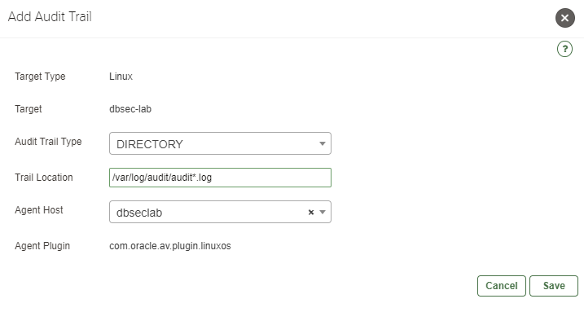

    - Click [**Save**]

8. You may have to refresh the page but your `dbsec-lab` Target should look like this:

   

9. Go back to your terminal session and run the audit generation script

      ````
      <copy>./02_generate_audit_activity.sh</copy>
      ````

10. Next, using a web browser, login to Audit Vault Web Console as `AVAUDITOR` with the password `T06tron.`

   

11. Click the `Reports` tab

12. Click the `All Activity` report name

13. You should see audited events from the `dbsec-lab` Target Database

   

14. Finally, explore the filters and view the details on the audit data. For example, click on the `Event Status` tab and filter the report by `FAILURE`

   

15. You might see failures for multiple `Targets`

   

16. Click on the `paper` icon for first audit row for `DROP ROLE` and view the details. You should see a lot of audit details about this particular audited event

   

17. Continue to explore until you are comfortable!

## **STEP 15**: (Advanced Labs) LDAP/Active Directory Configuration
- You must have an Microsoft Active Directory Server 2016 or higher available in the same VCN as the DBSecLab VMs (DBsec-lab, AV, DBFW, OKV)
- You must have the knowledege to configure the MS AD 2016 server appropriately

1. Using a web browser, login to Audit Vault Web Console as `AVADMIN` with the password `T06tron.`

   

2. Navigate to the Audit vault settings

    - Click the `Settings` tab
    - Click the `LDAP/Active Directory Configuration` sub tab
    - Click [**Add**]

3. Enter the following information for the `LDAP/Active Directory Configuration`

    - Server Name: `msad`
    - Port: `XXX`
    - Host Name / IP Address: `10.0.0.XXX`
    - Domain Name: `XXX`
    - Active Directory Username: `username`
    - Wallet Password for Certificate: `wallet password xxx`
    - Active Directory Password: `password xxx`
    - Re-Type Wallet Password for Certificate: `wallet password xxx`
    - Certificate: `xxx`

4. Click `Test Connection` to verify the connection is successful

5. Click [**Save**]

You may now proceed to the next lab.

## **Appendix**: About the Product
### **Overview**

Oracle Audit Vault and Database Firewall (AVDF) is a complete **Database Activity Monitoring (DAM)** solution that **combines native audit data with network-based SQL traffic capture**.

AVDF includes an enterprise quality **audit data warehouse**, host-based audit data collection agents, powerful reporting and analysis tools, alert framework, audit dashboard, and a multi-stage Database Firewall. The Database Firewall uses a sophisticated **grammar analysis engine** to inspect SQL statements before they reach the database and determines with high accuracy whether to allow, log, alert, substitute, or block the incoming SQL.

AVDF comes with **collectors for Oracle Database, Oracle MySQL, Microsoft SQL Server, PostgreSQL, IBM Db2 (on LUW), SAP Sybase, Oracle Key Vault, Microsoft Active Directory, Linux, Windows, AIX, Solaris, and HPUX**. A **Quick-JSON collector** simplifies ingesting audit data from databases like MongoDB. In addition to the provided collectors, AVDF's extensible framework allows simple configuration-based audit collection from **JDBC**-accessible databases and REST, JSON, or XML sources, making collection from most other systems easy. A full featured Java SDK allows creation of collectors for applications or databases that don't use a standard technology to record their audit trail.

   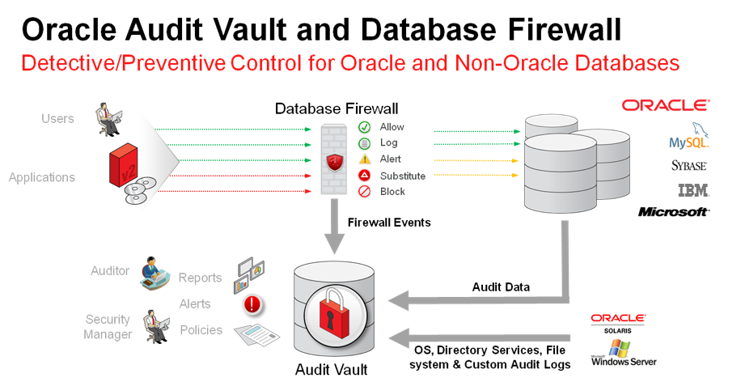

- **Software Appliance**

Oracle Audit Vault and Database Firewall are packaged as a "**Soft Appliance**" and contain everything needed to install the product on bare hardware - or in this case virtual environments.

- **Fine Grained, Customizable Reporting and Alerting**

Dozens of out-of-the-box compliance reports provide easy, schedulable, customized reporting for regulations such as GDPR, PCI, GLBA, HIPAA, IRS 1075, SOX, and UK DPA.
Reports aggregate network events and audit data from the monitored systems. Summary reports, trend charts and anomaly reports can be used to quickly review characteristics of user activity and help identify anomalous events. Report data can be easily filtered, enabling quick analysis of specific systems or events. Security managers can define threshold based alert conditions on activities that may indicate attempts to gain unauthorized access and/or abuse system privileges. Fine-grained authorizations enable security managers to restrict auditors and other users to information from specific sources, allowing a single repository to be deployed for an entire enterprise.

   

- **Deployment Flexibility and Scalability**

Security controls can be customized with in-line monitoring and blocking on some databases and monitoring only on other databases. The multi-stage Database Firewall can be deployed in-line as a database proxy server, or out-of-band in network sniffing mode, or with a host-based agent that relays network activity back to the firewall for analysis and recording. Delivered as a pre-configured software appliance that can be deployed on Linux-compatible hardware of choice, a single Audit Vault Server can consolidate audit data and firewall events from thousands of databases. Both Audit Vault Server and the Database Firewall can be configured in a High Availability mode for fault tolerance.

Oracle Audit Vault and Database Firewall 20c **supports both Cloud and On-Premise databases with one single dashboard**, giving customers insight into the activities on their databases.

## Want to Learn More?
Technical Documentation:
- [Oracle Audit Vault & Database Firewall 20c](https://docs.oracle.com/en/database/oracle/audit-vault-database-firewall/20/index.html)

Video:
- *Auditing PostgreSQL and MongoDB with Oracle Audit Vault and Database Firewall (October 2020)* [](youtube:o0LqJXwS4L0)

## Acknowledgements
- **Author** - Hakim Loumi, Database Security PM
- **Contributors** - Angeline Dhanarani, Gian Sartor, Rene Fontcha
* **Last Updated By/Date** - Rene Fontcha, Master Principal Solutions Architect, NA Technology, October 2020

## Need Help?
Please submit feedback or ask for help using our [LiveLabs Support Forum](https://community.oracle.com/tech/developers/categories/livelabsdiscussions). Please click the **Log In** button and login using your Oracle Account. Click the **Ask A Question** button to the left to start a *New Discussion* or *Ask a Question*.  Please include your workshop name and lab name.  You can also include screenshots and attach files.  Engage directly with the author of the workshop.

If you do not have an Oracle Account, click [here](https://profile.oracle.com/myprofile/account/create-account.jspx) to create one.
