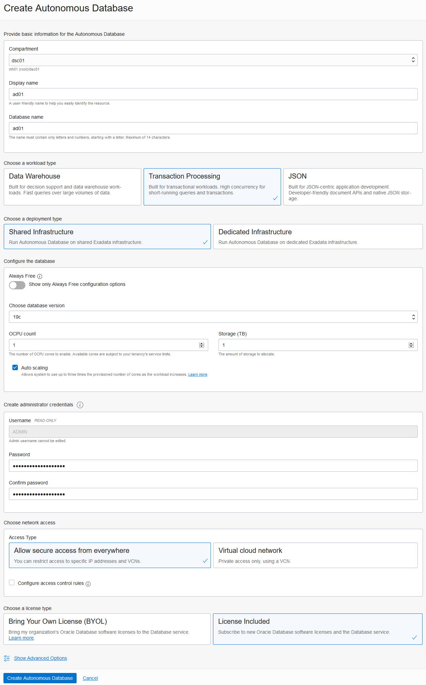
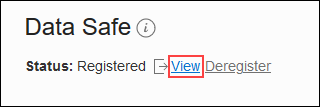
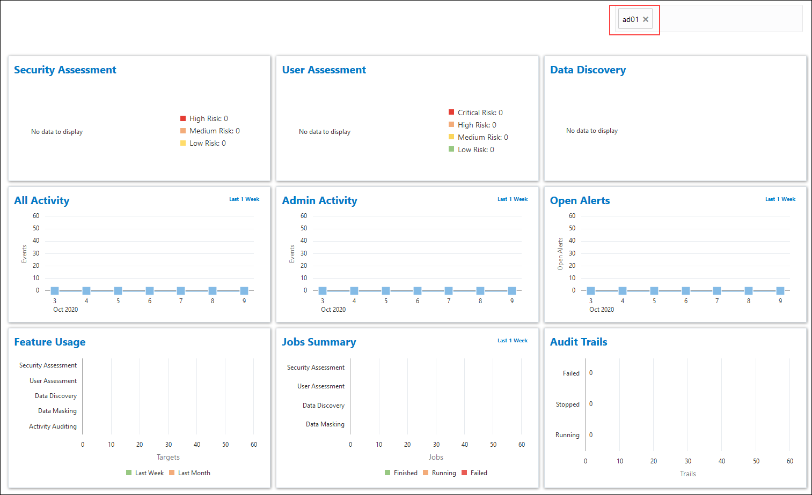
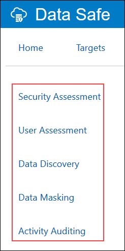
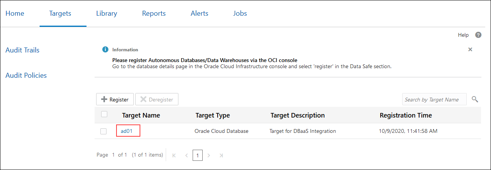
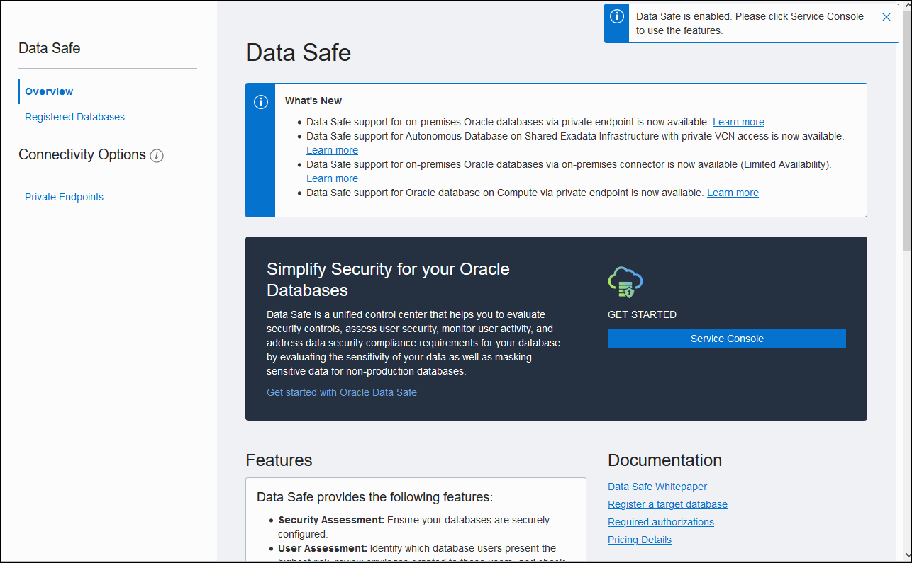

# Provision and Register an Autonomous Database

## Introduction
This lab shows you how to create an Autonomous Database in Oracle Cloud Infrastructure, register it with Oracle Data Safe, and load sample data into it. You also view the list of registered target databases from the Oracle Data Safe Console and from the Oracle Data Safe service page in the Oracle Cloud Infrastructure Console.

Estimated Lab Time: 30 minutes

### Objectives

In this lab, you'll:

- Provision an Autonomous Transaction Processing (ATP) database
- Register your database with Oracle Data Safe
- Run a SQL script using SQL Developer Web to load sample data into your database
- Sign in to the Oracle Data Safe Console and view the list of registered target databases
- View the list of registered target databases from the Oracle Data Safe service page in the Oracle Cloud Infrastructure Console

### Prerequisites
To complete this lab, you need to have the following:

- An Oracle Cloud account
- Access to a compartment in Oracle Cloud Infrastructure where you can create your Autonomous Database

### Assumptions

- You are signed in to the Oracle Cloud Infrastructure Console. If not, please refer to the [Prerequisites](?lab=prerequisites) for this workshop.

## **STEP 1**: Provision an Autonomous Transaction Processing database

1. From the navigation menu in the Oracle Cloud Infrastructure Console, select **Autonomous Transaction Processing**.

2. In the **Filters** section on the left, make sure your workload type is **Transaction Processing** or **All** so that you can see your database listed after you create it.

3. From the **Compartment** drop-down list, select your compartment.

4. Click **Create Autonomous Database**.

5. On the **Create Autonomous Database** page, provide basic information for your database:

      - **Compartment** - If needed, select your compartment.

      - **Display name** - Enter a memorable name for the database for display purposes, for example, **ad01** (short for Autonomous Database 1).

      - **Database Name** - Enter **ad01**. It's important to use letters and numbers only, starting with a letter. The maximum length is 14 characters. Underscores are not supported.

      - **Workload Type** - Leave **Transaction Processing** selected.

      - **Deployment Type** - Leave **Shared Infrastructure** selected.

      - **Always Free** - Leave this option deselected (the slider should be to the left).

      - **Database version** - Leave **19c** selected.

      - **OCPU Count** - Select **1**.

      - **Storage** - Leave **1** selected.

      - **Auto scaling** - Leave this checkbox selected.

      - **Password** and **Confirm Password** - Specify a password for the `ADMIN` database user and make note of it. The password must be between 12 and 30 characters long and must include at least one uppercase letter, one lowercase letter, and one numeric character. It cannot contain your username or the double quote (") character.

      - **Network Access** - Leave **Allow secure access from everywhere** selected.

      - **License Type** - Select **License Included**.

    

6. Click **Create Autonomous Database**. The **Autonomous Database Details** page is displayed.

7. Wait a few minutes for your instance to provision. When it is ready, **AVAILABLE** is displayed below the large ATP icon.

  

## **STEP 2**: Register your Autonomous Database with Oracle Data Safe

1. On the **Autonomous Database Information** tab, under **Data Safe**, click **Register**. If there is no **Register** option, it is because you are working in a region that does not have the Oracle Data Safe service enabled in it. Please contact your tenancy administrator to gain access to an appropriate region.

     

2. In the **Register Database with Data Safe** dialog box, click **Confirm**.

3. Wait for the registration process to finish. When registration is completed, the status reads **Registered**. By default, when you register an Autonomous Database, you are authorized to use the User Assessment, Security Assessment, Activity Auditing, and Data Discovery features in Oracle Data Safe with your database.

    

## **STEP 3**: Run a SQL script using SQL Developer Web to load sample data into your database

The `load-data-safe-sample-data_admin.sql` script creates several tables with sample data that you can use to practice with the Oracle Data Safe features. It also enables the Data Masking feature on your database.

1. On the **Autonomous Database Details** page, click the **Tools** subtab.

2. In the **SQL Developer Web** section, click **Open SQL Developer Web**. A new browser tab is opened displaying the **Oracle Database Actions | Sign in** page.

3. In the **Username** field, enter `ADMIN`. In the **Password** field, enter the password that you created for the `ADMIN` user when you provisioned the database. Click **Sign In**.

4. If a help note is displayed, click the **X** button to close it.

5. Open the [load-data-safe-sample-data_admin.sql](  https://objectstorage.us-ashburn-1.oraclecloud.com/p/W0JmKtImWp4e_FXSg4gj0wlwnAEf3OJ75cCpCdicH38ly55qrPaaZbO1el3ayfyR/n/c4u03/b/security-library/o/load-data-safe-sample-data_admin.zip) script in a text editor, such as NotePad.

6. Copy the entire script to the clipboard and then paste it into a worksheet in SQL Developer Web.

7. To view the script activities, in the bottom pane, click the **Script Output** tab.

8. On the toolbar, click the **Run Script** button.

    

      - The script takes approximately 1 minute to run.

      - In the bottom-left corner, a cog wheel turns as the script is processed.

      - Don't worry if you see some error messages on the **Script Output** tab. These are expected the first time you run the script.

      - The script ends with the message **END OF SCRIPT**.

9. When the script is finished running, on the **Navigator** tab on the left, select the **HCM1** schema from the first drop-down list. In the second drop-down list, leave **Tables** selected.

10. If you don't see **HCM1** listed, sign out and sign in again. Click **SQL Worksheet**, and then on the **Navigator** tab, select the **HCM1** schema from the first drop-down list.

11. On the toolbar, click the **Clear** button (trash can icon) to clear the worksheet.

12. On the **Script Output** tab, click the **Clear output** button (trash can icon) to clear the output.

13. For each table listed below, drag the table to the worksheet and run the script. Choose **Select** as your insertion type when prompted. Make sure that you have the same number of rows in each table as stated below.

      - `COUNTRIES` - 25 rows
      - `DEPARTMENTS` - 27 rows
      - `EMPLOYEES` - 107 rows
      - `EMPT_EXTENDED` - 107 rows
      - `JOBS` - 19 rows
      - `JOB_HISTORY` - 10 rows
      - `LOCATIONS` - 23 rows
      - `REGIONS` - 4 rows
      - `SUPPLEMENTAL_DATA` - 149 rows

14. If your data is different than what is specified above, rerun the  [load-data-safe-sample-data_admin.sql](   https://objectstorage.us-ashburn-1.oraclecloud.com/p/W0JmKtImWp4e_FXSg4gj0wlwnAEf3OJ75cCpCdicH38ly55qrPaaZbO1el3ayfyR/n/c4u03/b/security-library/o/load-data-safe-sample-data_admin.zip) script.

15. Sign out of SQL Developer Web and close the tab.

## **STEP 4**: Sign in to the Oracle Data Safe Console and view the list of registered target databases

1. Return to the **Oracle Cloud Infrastructure** tab. The **Tools** subtab on the **Autonomous Database Details** page is where you last left off.

2. Click the **Autonomous Database Information** tab.

3. To access the Oracle Data Safe Console from here, under **Data Safe**, click **View**.

  

    A new **Oracle Data Safe | Home** tab is opened. You are automatically signed in to the Oracle Data Safe Console and presented with a dashboard.

4. Review the dashboard.

      - The dashboard lets you monitor several activities at once.
      -  There is a filter set on your database name so that the dashboard displays data for your database only.
      - When you first sign in to the Oracle Data Safe Console, the charts in your dashboard do not contain data because you have not yet used any of the features.

    

5. Click each top tab and review the content on the page.

    - The top tabs provide quick access to the dashboard (**Home** tab), registered target databases (**Targets** tab), the Oracle Data Safe Library (**Library** tab), reports for all Oracle Data Safe features (**Reports** tab), all of the alerts (**Alerts** tab), and all of the current and scheduled jobs (**Jobs** tab).

    

6. Click each side tab and review the content on the page.

    - The side tabs provide quick access to the wizards for Oracle Data Safe's main features, including **Security Assessment**, **User Assessment**, **Data Discovery**, **Data Masking**, and **Activity Auditing**.

    

7. Click the **Targets** tab. Notice that your database is listed as a target database.

  

8. Click the name of your target database to view its details.

9. In the **Target Details** dialog box, review the read-only connection information for your database.
      - You cannot edit the registration details for an Autonomous Database.
      - You can view the compartment to which the database belongs. The compartment for an Autonomous Database is the same compartment in Oracle Cloud Infrastructure in which the database resides.
      - Oracle Data Safe connects to the database via a TLS connection.

10. Click **Cancel** to close the **Target Details** dialog box.

## **STEP 5**: View the list of registered target databases from the Oracle Data Safe service page in the Oracle Cloud Infrastructure Console

The **Registered Databases** page for the Oracle Data Safe service in the Oracle Cloud Infrastructure Console also lists registered target databases to which you have access.

1. Return to the **Oracle Cloud Infrastructure** browser tab.

2. If you are signed out, sign in again using your Oracle Cloud account credentials. You should be in the Oracle Cloud Infrastructure Console.

3. From the navigation menu, select **Data Safe**.

      - The **Overview** page for the Oracle Data Safe service is displayed. From here you can access the Oracle Data Safe Console and find links to useful information.
      - Also notice that there is a message in the upper-right corner stating that **Data Safe is enabled**.

    

4. On the left, click **Registered Databases**. Your registered database is listed.

5. Click the three dots on the right. From here you can access the Oracle Data Safe Console.

    

You may now proceed to the next lab.

## Learn More

  - [Provision Autonomous Data Warehouse](https://docs.oracle.com/en/cloud/paas/autonomous-data-warehouse-cloud/user/autonomous-provision.html#GUID-0B230036-0A05-4CA3-AF9D-97A255AE0C08)
  - [Loading Data with Autonomous Data Warehouse](https://docs.oracle.com/en/cloud/paas/autonomous-data-warehouse-cloud/user/load-data.html#GUID-1351807C-E3F7-4C6D-AF83-2AEEADE2F83E)
  - [Target Database Registration](https://docs.cloud.oracle.com/en-us/iaas/data-safe/doc/target-database-registration.html)

## Acknowledgements
  * **Author** - Jody Glover, Principal User Assistance Developer, Database Development
  * **Last Updated By/Date** - Jody Glover, December 9, 2020

## Need Help?
  Please submit feedback or ask for help using our [Data Safe Community Support Forum]( https://community.oracle.com/tech/developers/categories/data-safe). Please click the **Log In** button and login using your Oracle Account. Click the **Ask A Question** button to the left to start a *New Discussion* or *Ask a Question*.  Please include your workshop name and lab name.  You can also include screenshots and attach files.  Engage directly with the author of the workshop.

  If you do not have an Oracle Account, click [here](https://profile.oracle.com/myprofile/account/create-account.jspx) to create one.
