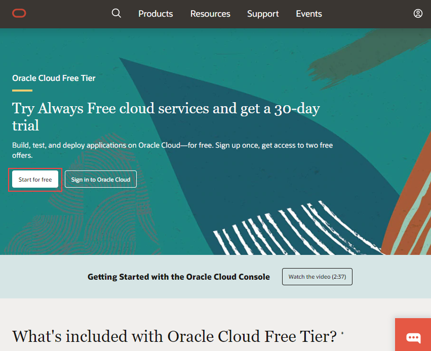
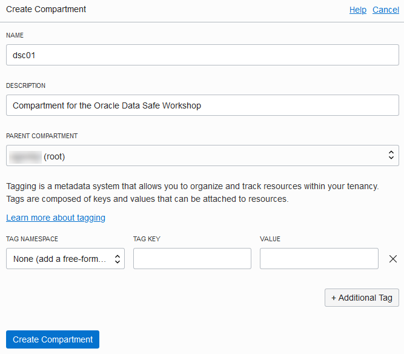

# Prerequisites

## Introduction

This lab describes the steps that you need to take prior to starting the Oracle Data Safe Fundamentals workshop when using a Free Trial with Oracle Cloud.

Estimated Lab Time: 15 minutes

### Objectives

In this lab, you'll:

- Create a free Oracle Cloud account
- Sign in to your free tenancy in Oracle Cloud Infrastructure
- Enable Oracle Data Safe
- Create a compartment

### Prerequisites

Be sure you have the following before starting:

- A valid email address
- Ability to receive SMS text verification (only if your email is not recognized)

## **STEP 1**: Create a free Oracle Cloud account

When you create an Oracle cloud account, you are provided a free tenancy in Oracle Cloud. Your user account is automatically created as a tenancy administrator. If you already have a free tenancy and a tenancy administrator account, you can skip this step.

1. In a browser, enter the following URL: `https://oracle.com/cloud/free`.

2. Click **Start for free**.

  

3. On the **Oracle Cloud Free Tier** page, do the following:

    a) Select a **country** or **territory**.

    b) Enter your **email address**.

    c) Enter your **first name** and **last name**.

    d) Click **Verify my email**. A verification email titled **OCI Email Verification** is sent to the email address you specified.

  

4. To continue with setting up your Oracle Cloud account, confirm your email address by clicking the link in your email. You are returned to the **Oracle Cloud Free Tier** page.

5. Continue to fill out the form:

    a) Enter a **password**. The password must contain a minimum of 8 characters, 1 lowercase, 1 uppercase, 1 numeric, and 1 special character. Your password cannot exceed 40 characters; contain the user's first name, last name, email address; contain spaces; or contain ` ~ < > \ characters. Remember the cloud account name you enter because you need this name later on to sign in to Oracle Cloud Infrastructure.

    b) Re-enter your password to confirm it.

    c) (Optional) Enter a **company name**.

    d) Specify a **cloud account name**.

    e) Select a **home region**.

    f) Review the **Terms of Use** section, and then click **Continue**.

6. If prompted, in the browser dialog box, click **Save** to save your password or click **Never**.

7. In the **Address information** section, enter your address details, and then click **Continue**.

8. In the **Mobile verification** section, enter your phone number, and then click **Text me a code**. In a few seconds, you should receive a verification code through SMS-text.

9. In the **Verification code** field, enter the code that was sent to your mobile phone, and then click **Verify my code**.

10. In the **Payment verification** section, click **Add payment verification method**. A **Pay** dialog box is displayed. You are not charged unless you elect to upgrade the account later on.

11. Click **Credit Card**. The **Add Verification Method** dialog box is displayed.

12. Scroll to the bottom of the dialog box, enter your credit card information, and then click **Finish**. Your credit card information is processed.

13. Click **Close** to close the **Pay** dialog box.

14. In the **Agreement** section, click the check box to agree to the terms and conditions, and then click **Start my free trial**. Your Oracle Cloud account is provisioned and should be available in a few seconds. When it is ready, you are automatically signed in to the Oracle Cloud Infrastructure Console. You also receive a confirmation email that has the sign-in information.

15. To sign out, in the upper-right corner of the Console, click the **Profile** icon (icon of a person's head), and then select **Sign Out**.

  

## **STEP 2**: Sign in to your free tenancy in Oracle Cloud Infrastructure
Throughout the workshop, it is assumed that you are signed in to the Oracle Cloud Infrastructure Console. You may need to refer back to this step from time to time.

1. Open a new browser tab.

2. Enter the URL [cloud.oracle.com](https://cloud.oracle.com).

3. On the toolbar, click **View Accounts**, and then in the **Cloud Account** section, select **Sign in to Cloud**.

   

4. Enter your **Cloud Account Name**, and then click **Next**. This is the name you chose while creating your account. It is not your email address. If you forget the name, please refer to the confirmation email.

  

5. In the **Oracle Cloud Infrastructure** section, enter your **username** and **password** for your Oracle Cloud account, and then click **Sign In**. Your username is your email address. The password is what you chose when you signed up for an account.

  

6. You are now signed in to the Oracle Cloud Infrastructure Console as a tenancy administrator. The landing page shows you a dashboard. In the upper-left corner, notice that there is a navigation menu (hamburger menu).

  

## **STEP 3**: Enable Oracle Data Safe

1. (Optional) At the top of the page on the right, select a region in your tenancy. Usually, you leave your home region selected, for example, **US East (Ashburn)**.

   

2. From the navigation menu, select **Data Safe**.

   

  The **Overview** page is displayed.

3.Click **Enable Data Safe** and wait a couple of minutes for the service to enable.

   

4. When it's enabled, a confirmation message is displayed in the upper-right corner.

## **STEP 4**: Create a compartment

You need to create a compartment in your tenancy to store an Autonomous Database and Oracle Data Safe resources, both of which you create during the workshop. In the labs, this compartment is referred to as "your compartment."

1. From the navigation menu, select **Identity**, and then **Compartments**. The **Compartments** page in Oracle Cloud Infrastructure Identity and Access Management (IAM) is displayed.

2. Click **Create Compartment**. The **Create Compartment** dialog box is displayed.

3. Enter a name for the compartment, for example, `dsc01` (short for Data Safe compartment 1).

4. Enter a description for the compartment, for example, **Compartment for the Oracle Data Safe Workshop**.

  

5. Click **Create Compartment**.

You may now proceed to the next lab.

## Learn More

- <a  href="https://www.google.com/url?sa=t&amp;rct=j&amp;q=&amp;esrc=s&amp;source=web&amp;cd=&amp;cad=rja&amp;uact=8&amp;ved=2ahUKEwiV9crfq4LsAhV1lnIEHbzbABwQFjAAegQIARAC&amp;url=https%3A%2F%2Fdocs.cloud.oracle.com%2Fiaas%2F&amp;usg=AOvVaw0AhysJe8ZnjMdve29qGMtZ" >Oracle Cloud Infrastructure documentation</a>
- <a  href="https://www.googleadservices.com/pagead/aclk?sa=L&amp;ai=DChcSEwjpqdLfq4LsAhVMwMgKHXwlCVUYABAAGgJxdQ&amp;ohost=www.google.com&amp;cid=CAASEuRoiOXrrdCP5n-DJ1ywMcKyYQ&amp;sig=AOD64_22iprJaffo5nOe9sztGr9oHNidFQ&amp;q&amp;adurl&amp;ved=2ahUKEwiV9crfq4LsAhV1lnIEHbzbABwQ0Qx6BAgNEAE" >Try Oracle Cloud</a>

## Acknowledgements

* **Author** - Jody Glover, Principal User Assistance Developer, Database Development
* **Last Updated By/Date** - Jody Glover, December 9, 2020

## Need Help?
Please submit feedback or ask for help using our [Data Safe Community Support Forum]( https://community.oracle.com/tech/developers/categories/data-safe). Please click the **Log In** button and login using your Oracle Account. Click the **Ask A Question** button to the left to start a *New Discussion* or *Ask a Question*.  Please include your workshop name and lab name.  You can also include screenshots and attach files.  Engage directly with the author of the workshop.

If you do not have an Oracle Account, click [here](https://profile.oracle.com/myprofile/account/create-account.jspx) to create one.
