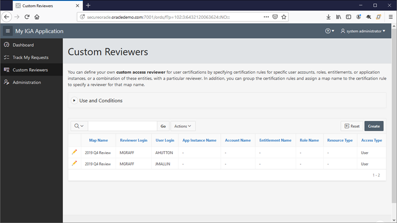
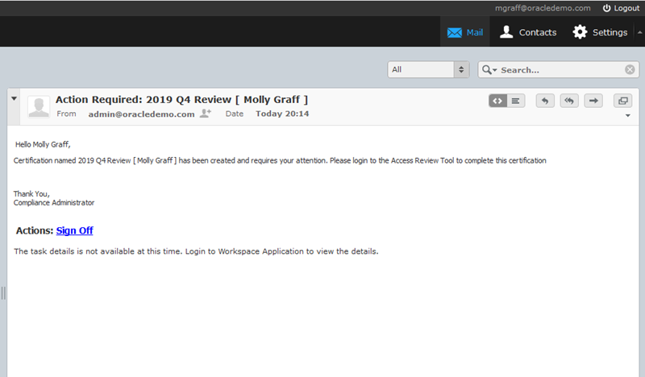
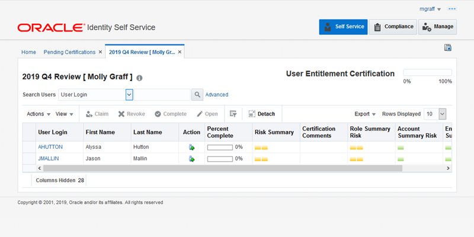

# Identity Certification

## Introduction

Identity certification is the process of reviewing user entitlements and access-privileges within an enterprise to ensure that users have not acquired entitlements that they are not authorized to have. It also involves either approving (certifying) or rejecting (revoking) each access-privilege. In this lab we will review user certification with custom reviewers.

The following use cases are available:

* User certification with custom reviewers

*Estimated Lab Time*:  60 minutes

### Objectives
- Become familiar with identity certifications

### Prerequisites
This lab assumes you have:
- A Free Tier, Paid or LiveLabs Oracle Cloud account
- SSH Private Key to access the host via SSH
- You have completed:
    - Lab: Generate SSH Keys
    - Lab: Prepare Setup
    - Lab: Environment Setup
- You have added the public IP of the Oracle Cloud compute instance to your computer host file. E.g. if using Microsoft Windows edit file **C:\Windows\System32\drivers\etc\hosts** and add the following line:

```
<copy><public_ip> secureoracle.oracledemo.com</copy>
```

## **STEP 0:** Running your Lab
### Login to Host using SSH Key based authentication
Refer to *Lab Environment Setup* for detailed instructions relevant to your SSH client type (e.g. Putty on Windows or Native such as terminal on Mac OS):
  - Authentication OS User - “*opc*”
  - Authentication method - *SSH RSA Key*
  - OS User – “*oracle*”.

1. First login as “*opc*” using your SSH Private Key

2. Then sudo to “*oracle*” user. E.g.

    ```
    <copy>sudo su - oracle</copy>
    ```

Follow the steps below to continue with the lab exercises.

## **STEP 1**: Start SecureOracle Components
1.  Login as “*oracle*” user and start the different components. E.g. start **Oracle Identity Manager, SOA Server and BI Publisher** by running the following command

    ```
    <copy>sc start oim_bip</copy>
    ```

    **Note:** the time to start the OIG components varies between 15-20 minutes.

2. Make sure you can access the OIM Admin and Self Service consoles, Roundcube email client and My HR Application.

    Oracle Identity Manager Admin Console:

    ```
    URL         http://secureoracle.oracledemo.com:14000/sysadmin
    User        xelsysadm
    Password    Oracle123
    ```

    Oracle Identity Manager Self Service:

    ```
    URL         http://secureoracle.oracledemo.com:14000/identity
    User        xelsysadm
    Password    Oracle123
    ```

    Email Web Client (Roundcube):

    ```
    URL         http://secureoracle.oracledemo.com/roundcubemail-1.4.1/
    User        admin
    Password    Oracle123
    Server      secureoracle.oracledemo.com
    ```

    My IGA Application

    ```
	URL         http://secureoracle.oracledemo.com:7001/ords/f?p=102
	User        xelsysadm
	Password    Oracle123
    ```

## **STEP 2**: User Certification with Custom Reviewers
1. User certification allows managers to certify employee access to roles, accounts, and entitlements. Typically, each manager in an organization reviews the access-privileges of the people who report directly to that manager. Alternatively, custom reviewers for user certifications can be specified by defining certification rules in the **CERT_CUSTOM_ACCESS_REVIEWERS** table in the Oracle Identity Manager database.

2. In the SecureOracle environment, My IGA Application contains a custom UI to maintain the **CERT_CUSTOM_ACCESS_REVIEWERS** table, so administrators can easily define custom reviewers.

3. Login to My IGA Application to define customer reviewers.

    E.g. Use the following link and credentials:

    ```
	URL         http://secureoracle.oracledemo.com:7001/ords/f?p=102
	User        xelsysadm
	Password    Oracle123
    ```

4. In the sidebar menu click on the **Custom Reviewers** option to open the Custom Reviewers page. Proceed to define custom reviewers and users as needed.

    E.g. For convenience a custom reviewer has been defined already along with two users who will be certified.

    ```
	MAP NAME         REVIEWER LOGIN   USER LOGIN   ACCESS TYPE
	2019 Q4 Review   MGRAFF           AHUTTON      User
	2019 Q4 Review   MGRAFF           AHUTTON      User
    ```

    **Note**: you are welcome to add additional reviewers and users. OIM will generate a certification task for each **Map Name**. For more details in rules and definitions please consult the official documentation under [Custom Reviewer for User Certifications](https://docs.oracle.com/en/middleware/idm/identity-governance/12.2.1.4/omusg/managing-identity-certification.html#GUID-941F44D2-1B30-4B0A-AF25-3BE0430C7F8A).

    <a name="image-01"></a>
    
    Figure 1. Custom Reviewers

5. Proceed to sign out from My IGA Application.

6. Configure the certification options by login to OIM Self Service as administrator.

    E.g. Use the following link and credentials:

    ```
	URL         http://secureoracle.oracledemo.com:14000/identity
	User        xelsysadm
	Password    Oracle123
    ```

7. Go to **Compliance -> Identity Certification -> Certification Configuration** and validate the configuration as follow.

    E.g. Use the following configuration as reference:

    ```
    Password required on sign-off                : [checked]
    Allow comments on certify operations         : [unchecked]
    Allow comments on all non-certify operations : [checked]	
    Verify employee access                       : [checked]
    Prevent self certification                   : [checked]
	                                               Alternate Reviewer : User Manager

    User and Account Selections         : Include any user with active accounts
    Allow advanced delegation           : [unchecked]
    Allow multi-phased review           : [unchecked]	
    Allow reassignment                  : [unchecked]
    Allow auto-claim                    : [checked]
    Perform closed loop remediation     : [checked]
				
    Enable Interactive Excel            : [unchecked]	
    Enable Certification Reports        : [checked]	
    ```

    Proceed to click the **Test Connection** button to test the communication with the BI Publisher component, if you make changes, save the changes otherwise click **Cancel** to close the page.

8. Proceed to create a certification definition. For your convenience we have already created a certification definition, as a reference the following table contains the parameters used in the definition.

    E.g. Parameters in certification definition:

    ```
    Name              : 2019 Q4 Review
    Type              : User
    Description       : Custom Reviewers Certification

    In Base Selection
    Only Users from Select Organization : Oracle Users
	                                      Finance
	                                      Sales
    Constrains                          : Users with Any Level of Risk

    In Content Selection
    Include users with no accounts      : [checked]

    Limit the role-assignments to certify for each user : All Roles
    Include accounts with no certifiable attributes     : [checked]

    Limit the application-instance-assignments to certify for each user : All Application Instances
    Limit the entitlement-assignments to certify for each user          : All Entitlements

    In Configuration
    Accept the defaults settings

    In Reviewers
    Reviewer                        : Custom Access Reviewer
    Custom Access Reviewer Map Name : 2019 Q4 Review

    In Incremental
    Accept the defaults settings

    In Summary, review results
    Name              : 2019 Q4 Review
    Description       : Custom Reviewers Certification
    Type              : User
    Reviewer          : Custom Access Reviewer
    Incremental       : No
    Base Selection    : 3 Organizations Selected

	Users with Any Level of Risk
    Content Selection : All Roles
	                    All Application Instances
	                    All Entitlements
    ```

    **Note**: notice the section **Reviewers** where we have specified the map name **2019 Q4 Review** defined in the **CERT_CUSTOM_ACCESS_REVIEWERS** table. After a certification definition is created, OIM offers the option to automatically create a job for the new certification. In the above example OIM created job **Cert_2019 Q4 Review**.

9. Proceed to run the certification, do so by login into OIM Self Service as user **XELSYSADM**. Go to **Compliance -> Identity Certification -> Definitions**.

10. Select certification **2019 Q4 Review** and click the **Run Now** button.

11. OIM will start the certification task and notify the reviewer in this case user **MGRAFF**. You can login to the Email Web Client (Roundcube) to review the email notification.

    E.g. Use the following link and credentials

    ```
	URL         http://secureoracle.oracledemo.com/roundcubemail-1.4.1/
	User        mgraff
	Password    Oracle123
	Server      secureoracle.oracledemo.com
    ```

    <a name="image-02"></a>
    
    Figure 2. Certification Email

12. Proceed to Login to OIM Self Service as user **MGRAFF**. Go to **Self Service -> Certifications**. In the **Pending Certifications** page the new certification will be listed, proceed to click in the link name **2019 Q4 Review [Molly Graff]** to review and certify the users.

    <a name="image-03"></a>
    
    Figure 3. User Certification

13. Once all the users are certified by default OIM will prompt the reviewer **MGRAFF** to enter her credentials to sign off the certification task.

14. Proceed to sign out from OIM Self Service.

## **STEP 3**: About Custom Reviewers
1. You can define your own custom access reviewer for user certifications by specifying certification rules for specific user accounts, roles, entitlements, or application instances, or a combination of these entities, with a particular reviewer. In addition, you can group the certification rules and assign a map name to the certification rule to specify a reviewer for that map name.

2. These rules can be defined in the **CERT_CUSTOM_ACCESS_REVIEWERS** table in Oracle Identity Manager database.

3. The following conditions must be met for using the custom access reviewer for user certification feature:
	* Reviewer table does not support any wildcards for any of the fields/columns.
	* Reviewer table has mappings defined for each and every user to be included in certification.
	* Application instance information is required for all account and entitlement mappings.
	* Only one instance of default reviewer and alternate reviewer mapping is allowed per map name.

4. In the SecureOracle environment, My IGA Application contains a custom UI to maintain the **CERT_CUSTOM_ACCESS_REVIEWERS** table, so administrators can easily define custom reviewers, this option is available under **Custom Reviewers** option in My IGA Application menu.

5. Additional details can be found in the official documentation under [Custom Reviewer for User Certifications](https://docs.oracle.com/en/middleware/idm/identity-governance/12.2.1.4/omusg/managing-identity-certification.html#GUID-941F44D2-1B30-4B0A-AF25-3BE0430C7F8A). 

## Learn More About Identity and Access Management
Use these links to get more information about Oracle Identity and Access Management:
- <a href="https://docs.oracle.com/en/middleware/idm/suite/12.2.1.4/index.html" target="\_blank">Oracle Identity Management Website</a>
- <a href="https://docs.oracle.com/en/middleware/idm/identity-governance/12.2.1.4/index.html" target="\_blank">Oracle Identity Governance Documentation</a>
- <a href="https://docs.oracle.com/en/middleware/idm/access-manager/12.2.1.4/books.html" target="\_blank">Oracle Access Management Documentation</a>

## Acknowledgements
- **Author** - Ricardo Gutierrez, Solution Engineering - Security and Management
- **Last Updated By/Date** - Ricardo Gutierrez, June 2020

## Need Help?
Please submit feedback using this [form](https://apexapps.oracle.com/pls/apex/f?p=133:1:::::P1_FEEDBACK:1). Please include the *workshop name*, *lab* and *step* in your request.  If you don't see the workshop name listed, please enter it manually. If you would like for us to follow up with you, enter your email in the *Feedback Comments* section.
