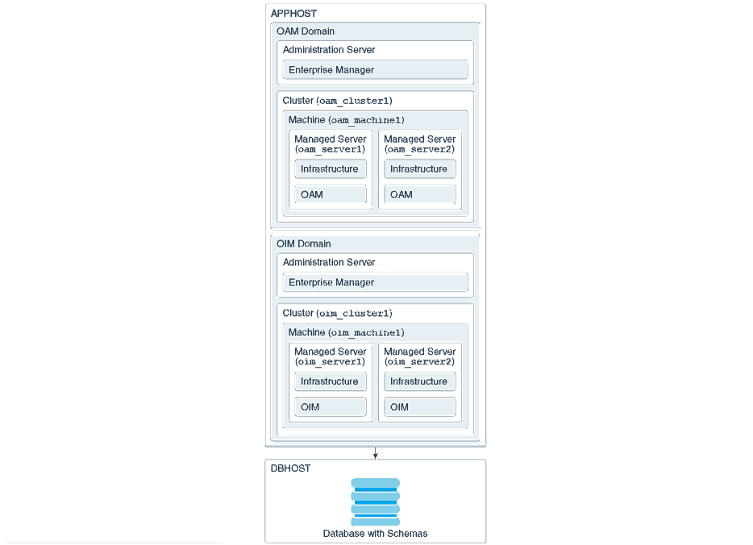
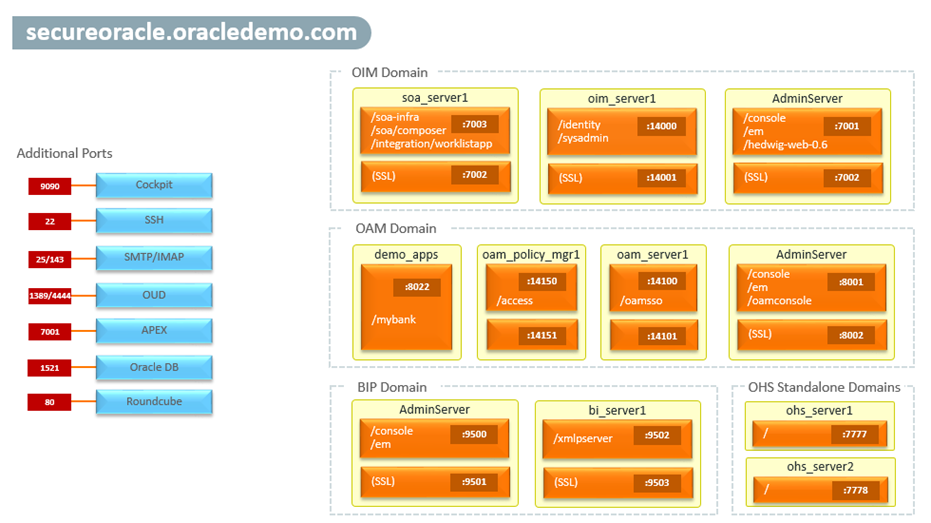

# Introduction

The lab exercises in the **SecureOracle 8.0** workshop walk you through some of the functionality to get started using the **Oracle IAM Suite 12c R2 PS4 (12.2.1.4.0)**. You will practice employee lifecycle management, identity certifications, RESTful APIs for identity governance, OAuth client and token management.

The Oracle IAM Suite provides a unified, integrated security platform designed to manage user lifecycle and provide secure access across enterprise resources, both within and beyond the firewall and into the cloud.

## Objectives
At the end of this workshop, you will have a good understanding of:
- SecureOracle Demonstration Environment
- Employee Lifecycle Management
- Identity Certifications
- RESTful APIs for Identity Governance, OAuth Client and Token Management

## Prerequisites
The following is required to participate in this workshop:
* An Oracle Free Tier, Always Free, Paid or LiveLabs Cloud Account

## About SecureOracle 8.0?
SecureOracle 8.0 is a demonstration environment for the Oracle IAM Suite 12c R2 PS4 (12.2.1.4.0) which includes the following Oracle components:

* Identity Governance:
	* OIG 12c, SOA Suite 12c, BI Publisher 12c, OUD 12c, DB 19c and 12c Connectors
* Access Management:
	* OAM 12c, OHS/WebGate 12c, OUD 12c and DB 19c
* Development Tools and Assets:
	* [JDeveloper 12c with SOA Extensions](http://www.oracle.com/technetwork/middleware/soasuite/downloads/index.html), [SQL Developer 19.2.1](https://www.oracle.com/database/technologies/appdev/sql-developer.html), [Apache Studio 2](https://directory.apache.org/studio/) and [Oracle APEX 19.2](https://apex.oracle.com/en/)
	* Sample My HR and My IGA Applications and Demo Scenarios

**Note:** OIM and OIG are interchangeable terms and refer to the same product Oracle Identity Manager or Oracle Identity Governance.

SecureOracle can be use with Oracle Identity Cloud Service (IDCS) to showcase a hybrid identity management environment. When integrated with IDCS, the OIG component offers provisioning and governance services while IDCS provides access management services to cloud and on-prem applications.

The Oracle IAM Suite 12c R2 PS4 can be deployed using the Oracle IAM standard installation topology which is flexible and can be use as a starting point in production environments. The [Figure 1](#image-01) depicts a standard WebLogic Server domain that contains an Administration Server and one or more clusters containing one or more Managed Servers.

Figure 1. Standard Topology for Oracle Identity and Access Management

The [Figure 2](#image-02) depicts the domains that make up the SecureOracle environment. The OIG and OAM components can be started individually or all together, and with further configuration these can be integrated following the official documentation [integrating OIG and OAM](https://docs.oracle.com/en/middleware/idm/suite/12.2.1.4/integrate.html) available online.

Figure 2. SecureOracle - Demonstration Platform for IAM Suite 12c R2 PS4

By default all non-SSL ports are used to execute the different lab exercises, however you can enable SSL ports as needed to meet specific demo requirements. Please refer to the official product documentation for details in how to enable SSL.

## Lab Breakdown

- **Lab Getting Started with SecureOracle 8.0** -
    In this lab we will review what is new in SecureOracle 8.0 demonstration platform and learn how to start the different components, run the development tools and access the different administration consoles and demo applications.

- **Lab Employee Lifecycle Management** -
    In this lab we will exercise several use cases associated with employee on-boarding, user lifecycle, transfers, manager approvals and employee terminations using My HR Application as authoritative source in Oracle Identity Manager.

- **Lab Identity Certification** -
    Identity certification is the process of reviewing user entitlements and access-privileges within an enterprise to ensure that users have not acquired entitlements that they are not authorized to have. It also involves either approving (certifying) or rejecting (revoking) each access-privilege. In this lab we will review user certification with custom reviewers.

- **Lab RESTful OIM and OAM APIs** -
    In this lab we will review several use cases associated with invoking REST APIs for OIM Self Service, User Profile Updates, Request, Approvals and OAM OAuth Service.

Estimated Lab Time: 4 hours

## Learn More About Identity and Access Management
Use these links to get more information about Oracle Identity and Access Management:
- <a href="https://docs.oracle.com/en/middleware/idm/suite/12.2.1.4/index.html" target="\_blank">Oracle Identity Management Website</a>
- <a href="https://docs.oracle.com/en/middleware/idm/identity-governance/12.2.1.4/index.html" target="\_blank">Oracle Identity Governance Documentation</a>
- <a href="https://docs.oracle.com/en/middleware/idm/access-manager/12.2.1.4/books.html" target="\_blank">Oracle Access Management Documentation</a>

## Acknowledgements
- **Author** - Ricardo Gutierrez, Solution Engineering - Security and Management
- **Last Updated By/Date** - Ricardo Gutierrez, June 2020

## Need Help?
Please submit feedback or ask for help using our [LiveLabs Support Forum](https://community.oracle.com/tech/developers/categories/goldengate-on-premises). Please click the **Log In** button and login using your Oracle Account. Click the **Ask A Question** button to the left to start a *New Discussion* or *Ask a Question*.  Please include your workshop name and lab name.  You can also include screenshots and attach files.  Engage directly with the author of the workshop.

If you do not have an Oracle Account, click [here](https://profile.oracle.com/myprofile/account/create-account.jspx) to create one.

