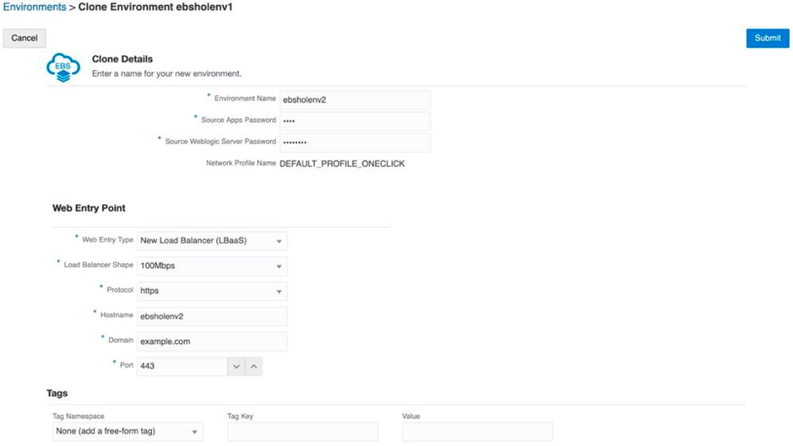
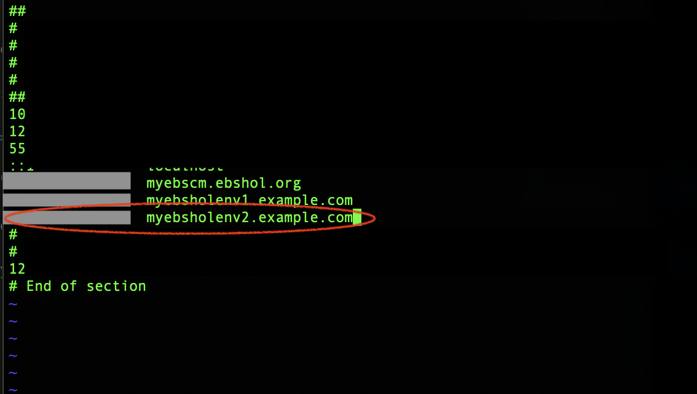

# Clone Your Oracle E-Business Suite Environment

## Introduction
In this lab, we will use the Cloning feature of Oracle E-Business Suite Cloud Manager to clone your Oracle E-Business Suite environment.

Estimated Lab Time: 15 minutes

### Objectives
* Cloning your EBS environment
* Configure Local Host Files for the Cloned Environment and Log in to Cloned Oracle E-Business Suite

### Prerequisites
* Tenancy Admin User
* Tenancy Admin Password


## **Step 1:** Access the Clone Environment Page

1. Navigate to the Cloud Manager Environments page.

2. For ebsholenv1, click Action and select Clone. Enter Details (see screenshot and points below)
  

3. Enter the following values for the clone details (Note these variables in your key-data.txt):

    a. Environment Name: ebsholenv2

    b. Source Apps Password: apps

    c. Source WebLogic Server password: welcome1

4. Choose Load Balancer as a Service (LBaaS) by selecting the Deploy New Load Balancer check box.

5. Then, you must also select a shape in the Load Balancer Shape field. Select 100 mbps

6. Enter these values for the following Web Entry properties.

    a. Protocol: https

    b. Domain: example.com

    c. Port: 443

    d. Web Access IP/CIDR: 0.0.0.0/0

7. Click Submit.

8. You can check the status of the activity to clone the environment in the Activities page. The new environment is listed on the Environments page.

## **Step 2:** Configure Local Host Files for the Cloned Environment and Log in to Oracle E-Business Suite

1. In the Oracle Cloud Infrastructure console, find the IP address for the Oracle E-Business Suite web entry point by navigating to Networking > Load Balancers.

2. On the Load Balancers page, you will find a load balancer named ebsholenv2-lbaas. Obtain the public IP address of this load balancer and record in your ```key-data.txt``` file.

3. Edit the local hosts file on your laptop and add an entry.

  **For Windows users**

      1. Navigate to Notepad in your start menu.

      2. Hover over Notepad, right-click, and select the option “Run as Administrator.”

      3. In Notepad, navigate to File > Open.

      4. And browse to C:\\Windows\System32\drivers\etc.

      5. Find the file hosts.

      

      6. In the hosts file, scroll down to the end of the content.

      7. Add the following entry to the very end of the file: <ip_address> ebsholenv2.example.com

      8. Save the file.

  **For Mac users**

      1. Open a Terminal Window.

      2. Enter the following command: sudo vi /etc/hosts

      3. Go to the last line and add the following entry: <ip_address> ebsholenv2.example.com

      4. Save the file

4. Log in to Oracle E-Business Suite:

  a. In your browser, navigate to the following URL: https://ebsholenv2.example.com/OA_HTML/AppsLocalLogin.jsp

  b. When prompted, accept the warning concerning the certificate coming from an unauthorized certificate authority as we are using a self-signed certificate. (You will change the certificate with your own when executing this procedure outside of this hands-on lab.)

  c. On this page, you will log in to Oracle E-Business Suite with the credentials you generated in Lab 4, part 3.

  

## Acknowledgements

- **Last Updated By/Date** 
- Quintin Hill, Cloud Engineering/Sept2020
- Santiago Bastidas, Product Management Director/July 2020

## See an issue?
Please submit feedback using this [form](https://apexapps.oracle.com/pls/apex/f?p=133:1:::::P1_FEEDBACK:1). Please include the *workshop name*, *lab* and *step* in your request.  If you don't see the workshop name listed, please enter it manually. If you would like for us to follow up with you, enter your email in the *Feedback Comments* section. 
