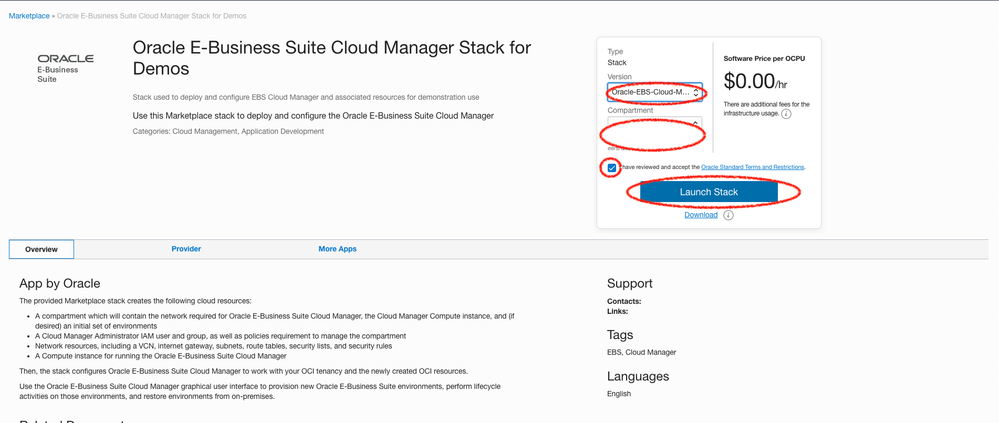
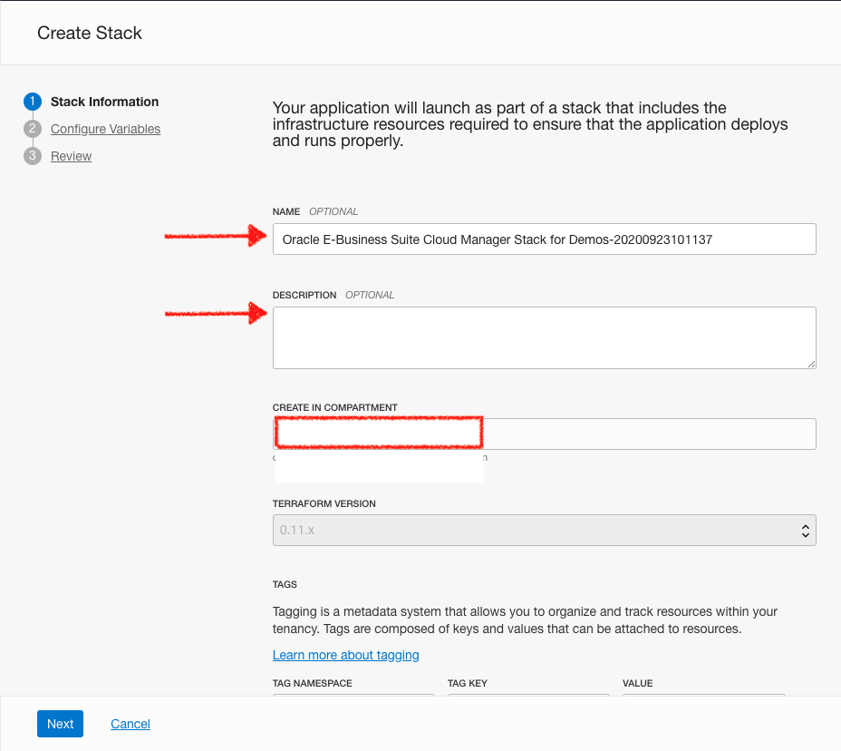
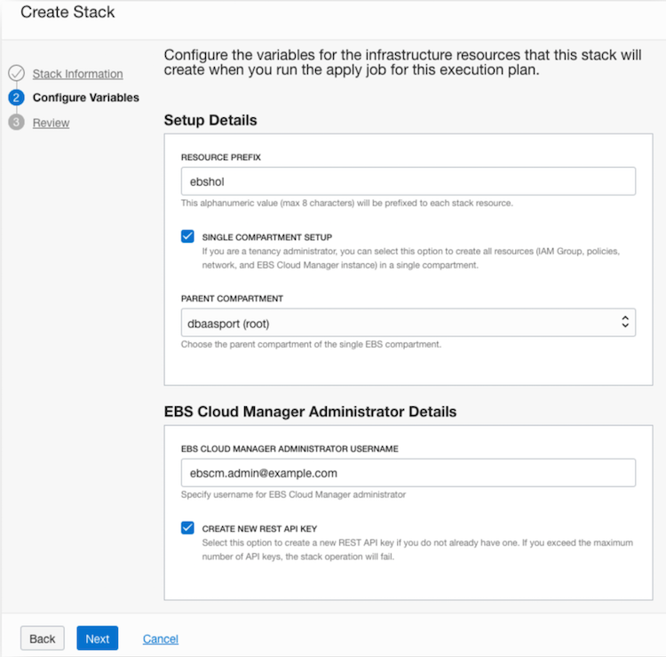
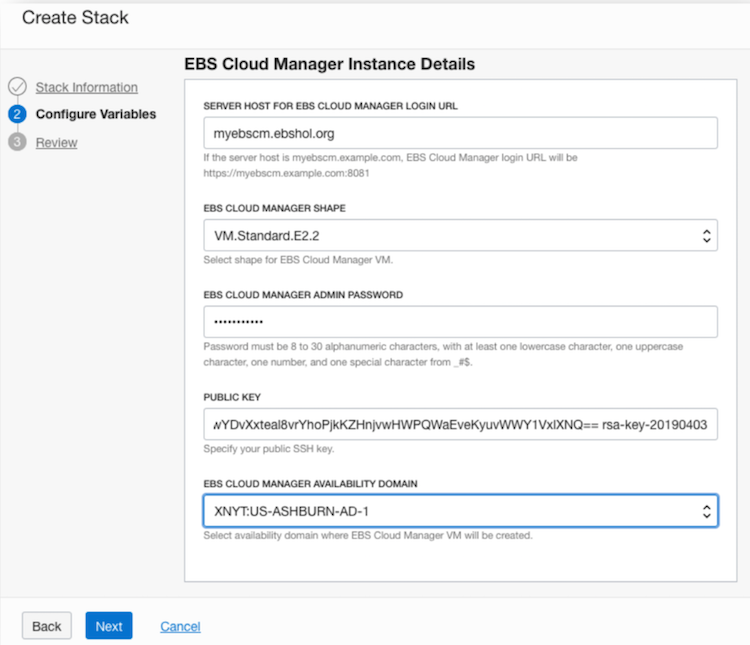
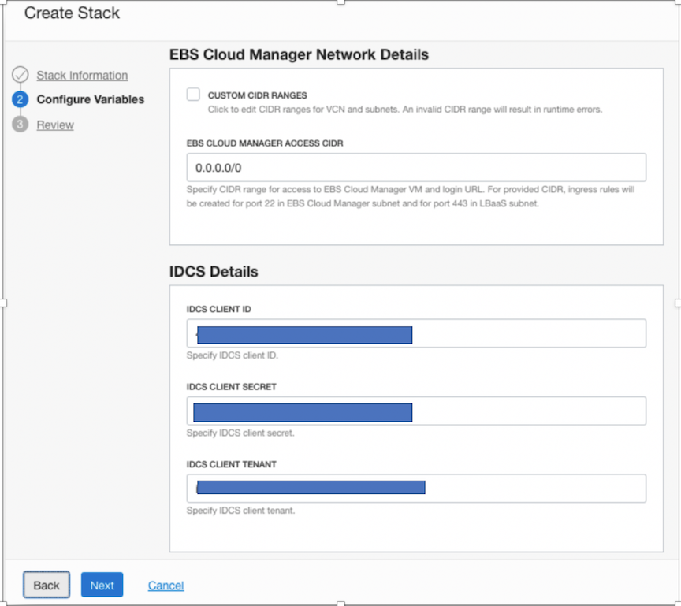
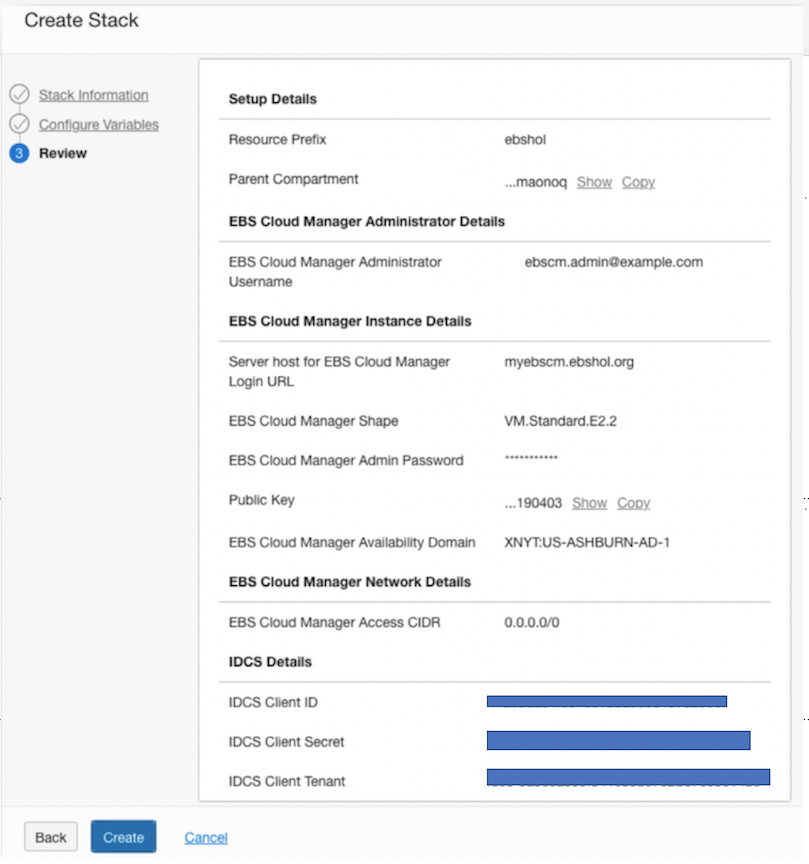
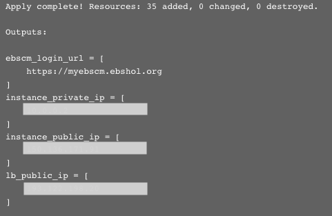
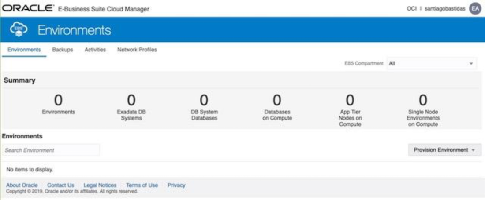

# Oracle E-Business Suite Cloud Manager Deployment and Configuration

## Introduction
In this lab, we will deploy the Oracle E-Business Suite Cloud Manager using the Marketplace Application: 
Oracle E-Business Suite Cloud Manager Stack for Demos.

Estimated Lab Time: 30 minutes

### Objectives

* Deploy and Configure Oracle E-Business Suite Cloud Manager
* Verifying login into Oracle E-Business Suite Cloud Manager

### Prerequisites

* Tenancy Admin User
* Tenancy Admin Password
* Lab 1 for preparing your tenancy completed with your IDCS information documented in your key-data.txt file. 

  - Cloud Manager_Admin_Username
  - Cloud_Manager_Admin_Password 
  - Client_Tenant
  - Client_ID 
  - Client_Secret


## **Step 1:** Sign in to the Oracle Cloud Infrastructure Console

Use the tenancy administrator credentials to sign in to Oracle Cloud Infrastructure console.

1. Reference your ``key-data.txt`` file and locate the tenancy administrator credentials.

2. Sign in to the Oracle Cloud Infrastructure console using the following:

    * **User name**: ``Tenancy Admin User``

    * **Password**: ``Tenancy Admin Password``

## **Step 2:** Deploy and Configure Oracle E-Business Suite Cloud Manager

You will now deploy an E-Business Suite Cloud Manager using a Marketplace stack. The stack creates the following cloud resources:

  - A compartment to contain resources required by Oracle E-Business Suite Cloud Manager.

  - An EBS Cloud Manager Administrators IAM user and group, as well as the policies required to manage the compartment.

  - Network resources – including a VCN, an internet gateway, subnets, route tables, security lists, and security rules.

  - A Compute instance for running the Oracle E-Business Suite Cloud Manager.

Then, the stack will configure Oracle E-Business Suite Cloud Manager to work with your OCI tenancy and the newly created OCI resources.

1. In the Oracle Cloud Infrastructure console navigation menu, under **Solutions and Platform** select **Marketplace** and then click **Applications**.

  

2. From the Marketplace applications page: 
  
    a. Select **Stack** under Filter > Type
    
    b. In the search bar type "E-Business Suite" 
    
    c. Click the application **Oracle E-Business Suite Cloud Manager Stack for Demos**

  

3. In the version drop-down list, ensure that the default of ```Oracle-EBS-Cloud-Manager-Stack-RM-20.1.1-<date>``` is selected.

4. In the Compartment drop-down list, select the parent compartment of the compartment where the Oracle E-Business Suite Cloud Manager Compute instance will be deployed. For example, mycompanytenancy(root).

5. Review and accept the Terms of Use.

6. Click **Launch Stack**.

  

7. On the Stack Information screen, enter the following values:
    
    a. **Name**: (default: Oracle E-Business Suite Cloud Manager Stack for Demos-<date&time>)

    b. **Description**: Add a description for the stack

    c. The last two variables should be greyed out.

      - **Compartment**: (the one chosen previously)
      - **Terraform Version**: 0.11.x
    
    d. Click Next

  

8. On the Configure Variables screen, enter the following values:

    a. **Resource Prefix**: ``ebshol`` 

      - Note: This value must be a unique identifier to your tenancy.

    b. **Single Compartment Setup**: Make sure is checked

    c. **Parent Compartment**: Select your compartment as the parent compartment for your resources

    d. **EBS Cloud Manager Administrator Username**: ``ebscm.admin@example.com``

    e. **Create New REST API key**: Make sure is checked

    

    f. **Server Host for EBS Cloud Manager Login URL**: ``myebscm.ebshol.org`` 

    g. **EBS Cloud Manager Shape**: ``VM.Standard.E2.2``

    h. **EBS Cloud Manager Admin Password**:
      - Note: This password should be saved as: Cloud_Manager_Admin_Password in your key-data.txt

    i. **Public Key**:

      1. Use an existing or generate a new ssh key. Paste the public key pair.

        For more information on ssh keys, visit: [Generating an SSH Key Pair](https://www.oracle.com/webfolder/technetwork/tutorials/obe/cloud/compute-iaas/generating_ssh_key/generate_ssh_key.html)

    j. **EBS Cloud Manager Availability Domain**: Choose the availability domain that ends in **-1** from the list

      

    k. **Custom CIDR Ranges**: leave unchecked

    l. **EBS Cloud Manager Access CIDR**: ``0.0.0.0/0``

    m. Enter the values from ``key-data.txt`` file as shown below.
      - **IDCS Client ID**: Client_ID
      - **IDCS Client Secret**: Client_Secret
      - **IDCS Client Tenant**: Client_Tenant
    
    n. Click **Next**

    

9. On the Review screen, verify the information and click **Create**.

  

10. This takes you to the Stack Details page for your newly created stack. You will notice that the job status will cycle through **Accepted, In Progress**, and **Succeeded**. 

  - This will take some time to complete.

  

  After the job succeeds, you will have all the network resources (VCN, load balancer, subnets, and so on) required to deploy the Oracle E-Business Suite Cloud Manager Compute instance.

11. On the **Application Information** tab you will find the details related to the EBS Cloud Manager instance and Load balancer.

  

12. This information can also be found at the bottom of your log outputs as shown below:

  Copy and paste **Private IP, Public IP, Login URL** and **LB Public IP** to your ``key-data.txt``. These variables are needed for the remainder of the procedures in this lab.
  


## **Step 3:** Log in to Oracle E-Business Suite Cloud Manager

Before login in to the Oracle E-Business Suite Cloud Manager web application, you need to add the **hostname** in the Login URL to your local computer hosts file.

Follow the instructions below to perform this configuration:

Edit the local ``hosts`` file on your laptop and add an entry.

**For Windows users**

  1. Navigate to Notepad in your start menu.

  2. Hover over Notepad, right-click, and select the option **Run as Administrator**.

  3. In Notepad, navigate to ``File > Open``.

  4. Browse to ``C:\\Windows\System32\drivers\etc``

  5. Find the **file hosts**

      

  6. In the hosts file, scroll down to the end of the content.

  7. Add the following entry to the very end of the file: ``<lb_public_ip> myebscm.ebshol.org``

  8. Save the file.

**For Mac users**

  1. Open a Terminal Window.

  2. Enter the following command: ``$ sudo vi /etc/hosts``

  3. Click 'i' to edit the file. 
  
  4. Go to the last line and add the following entry: ``<lb_public_ip> myebscm.ebshol.org``

  5. Once you have finished editing the file hit 'esc' and type ':wq' to save and exit.

  

Use the Login URL generated and documented to your key-data.txt previously. 

Log into the Oracle E-Business Suite Cloud Manager using your IDCS credentials for the EBS Cloud Manager account as documented in your ``key-data.txt`` file.

Once logged in, you are on the **Environments page**.

  

You may now proceed to the next lab.

## Acknowledgements

- **Last Updated By/Date**

- Quintin Hill, Cloud Engineering/Sept 2020
- Santiago Bastidas, Product Management Director/July 2020

## See an issue?
Please submit feedback using this [form](https://apexapps.oracle.com/pls/apex/f?p=133:1:::::P1_FEEDBACK:1). Please include the *workshop name*, *lab* and *step* in your request.  If you don't see the workshop name listed, please enter it manually. If you would like us to follow up with you, enter your email in the *Feedback Comments* section. 
