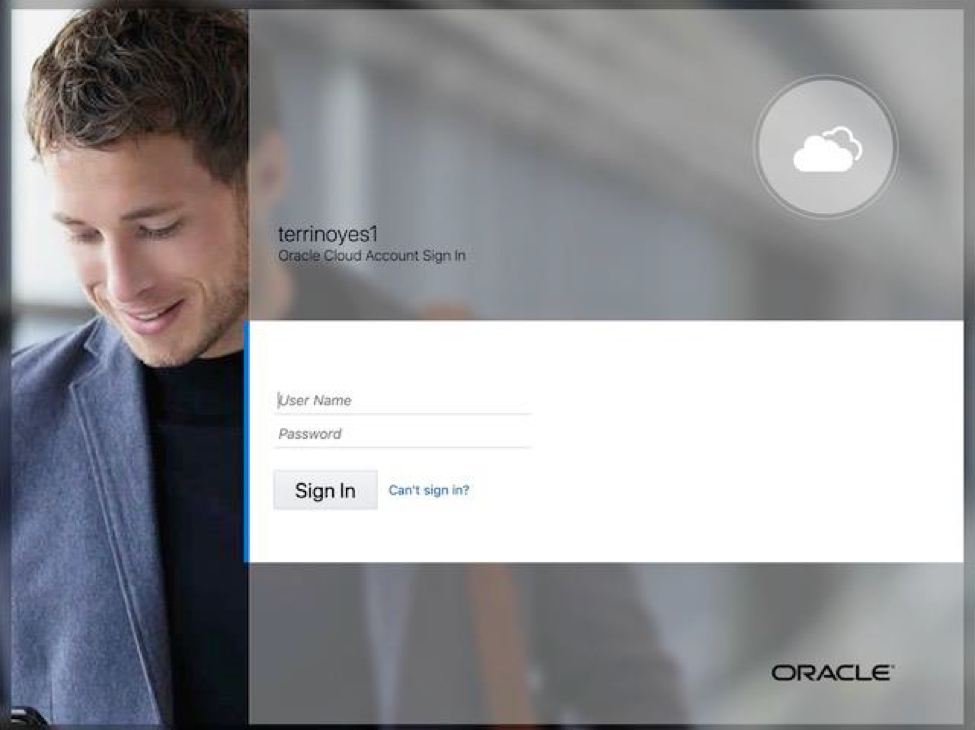

# Provision Your Oracle E-Business Suite Environment

## Introduction
In this lab, we will use the One-Click Provisioning feature of Oracle E-Business Suite Cloud Manager to provision an Oracle E-Business Suite environment.

Estimated Lab Time: 45 minutes

### Objectives
* Enable and Set Oracle E-Business Suite Account Passwords
* Configure Local Hosts File and Log in to Oracle E-Business Suite

### Prerequisites
* Oracle E-Business Suite Cloud Manager application using the Login URL from key data.txt file
* Oracle IDCS login credentials


## **Step 1:** Log in to EBS Cloud Manager
1. Navigate to your Oracle E-Business Suite Cloud Manager application using the Login URL recorded in your key-data.txt file.

2. Log in with your Oracle Identity Cloud Service credentials.

  

## **Step 2:** Provision an Environment Using One-Click Provisioning
1. On the Oracle E-Business Suite Cloud Manager Environments page, click Provision Environment and select One-Click.

2. Enter and select the following details for your new environment.

    a. Environment Name: ebsholenv1

    b. Purpose: Vision Demo Install

    c. EBS Version: 12.2.9

    d. DB Version: 19.0.0.0

3. Click Submit.

You can check the status of the activity to provision the environment in the Activities page. The provisioning process will take approximately 30-35 minutes.

## **Step 3:** Enable and Set Oracle E-Business Suite Account Passwords

1. SSH to the newly created environment by following the instructions under “Administrator Access” in section “Access Your Oracle E-Business Suite Environment” in the Oracle by Example tutorial: [Performing Post-Provisioning and Post-Cloning Tasks for Oracle E-Business Suite on Oracle Cloud Infrastructure](https://www.oracle.com/webfolder/technetwork/tutorials/obe/cloud/compute-iaas/post_provisioning_tasks_for_ebs_on_oci/110_post_prov_cm_oci.html)

## **Step 4:** Configure Local Hosts File and Log in to Oracle E-Business Suite

1. In the Oracle Cloud Infrastructure console, find the IP address for the Oracle E-Business Suite web entry point by navigating to Networking > Load Balancers.

2. On the Load Balancers page, you will find a load balancer named ebsholenv1-lbaas. Obtain the public IP address of this load balancer and record this in your key-data.txt file.

3. Edit the local hosts file on your laptop and add an entry.

    **For Windows Users**

      1. Navigate to Notepad in your start menu.

      2. Hover over Notepad, right-click, and select the option “Run as Administrator.”

      3. In Notepad, navigate to File > Open.

      4. Browse to C:\\Windows\System32\drivers\etc

      5. Find the file hosts

          

      6. In the hosts file, scroll down to the end of the content.

      7. Add the following entry to the very end of the file: <ip_address> ebsholenv1.example.com

      8. Save the file.

    **For Mac Users**

      1. Open a Terminal Window.

      2. Enter the following command: sudo vi /etc/hosts

      3. Go to the last line and add the following entry: <ip_address> ebsholenv1.example.com

      4. Save the file.

4. Log in to Oracle E-Business Suite:

  a. In your browser, navigate to the following URL: ```https://ebsholenv1.example.com/OA_HTML/AppsLocalLogin.jsp```

  b. When prompted, accept the warning concerning the certificate coming from an unauthorized certificate authority as we are using a self-signed certificate. (You will change the certificate with your own when executing this procedure outside of this hands-on lab.)

  c. On this page, you will log in to Oracle E-Business Suite.

  

You may now proceed to the next lab.

## Acknowledgements

- **Last Updated By/Date**
- Quintin Hill, Cloud Engineering/Sept 2020
- Santiago Bastidas, Product Management Director/July 2020

## See an issue?
Please submit feedback using this [form](https://apexapps.oracle.com/pls/apex/f?p=133:1:::::P1_FEEDBACK:1). Please include the *workshop name*, *lab* and *step* in your request.  If you don't see the workshop name listed, please enter it manually. If you would like for us to follow up with you, enter your email in the *Feedback Comments* section. 
