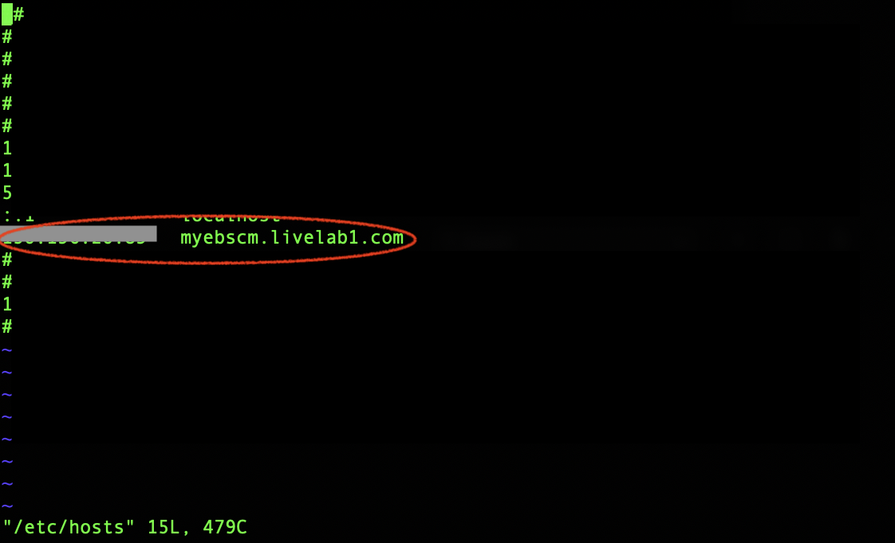
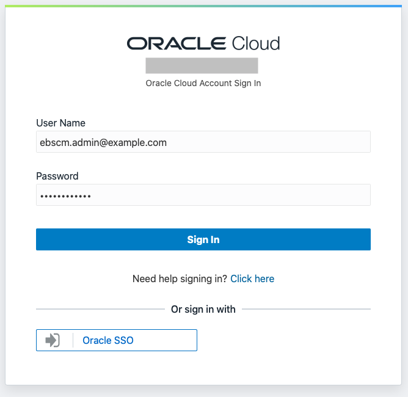
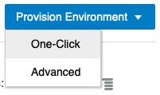
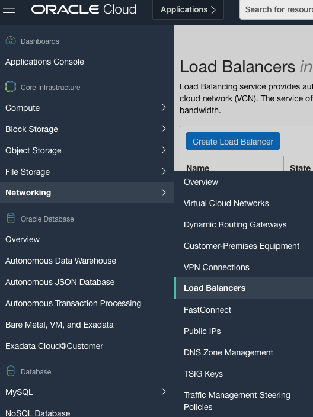
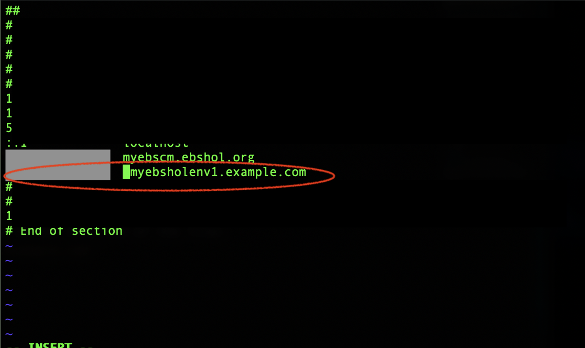

# Provision Your Oracle E-Business Suite Environment

## Introduction
In this lab, we will use the One-Click Provisioning feature of Oracle E-Business Suite Cloud Manager to provision an Oracle E-Business Suite environment.

Estimated Lab Time: 45 minutes

### **Objectives**
* Log into EBS Cloud Manager and Provision E-0Business Suite enviornment
* Enable and Set Oracle E-Business Suite Account Passwords
* Configure Local Hosts File and Log in to Oracle E-Business Suite

### **Prerequisites**
* Cloud Manager Instance provisioned
* Cloud Manager Admin credentials
* Cloud Manager Application variables in ``key-data.txt`` file. This is found in the .zip file you were provided to begin the lab.

## **Step 1:** Log in to Oracle E-Business Suite Cloud Manager

Before logging into the Oracle E-Business Suite Cloud Manager web application, you need to add the **hostname** in the Login URL to your local computer hosts file.

Follow the instructions below to perform this configuration:

Edit the local ``hosts`` file on your laptop and add an entry.

**For Windows users**

  1. Navigate to Notepad in your start menu.

  2. Hover over Notepad, right-click, and select the option **Run as Administrator**.

  3. In Notepad, navigate to ``File > Open``.

  4. Browse to ``C:\\Windows\System32\drivers\etc``

  5. Find the **file hosts**

      

  6. In the hosts file, scroll down to the end of the content.

  7. Add the following entry to the very end of the file: ``<lb_public_ip> myebscm.ebshol.org``

  8. Save the file.

**For Mac users**

  1. Open a Terminal Window.

  2. Enter the following command:

    ```
    <copy>
    $ sudo vi /etc/hosts
    </copy>
    ```

  This will then require your local computer password to edit the file. Enter and you should see a screen similar to the one shown below.

  3. Type 'i' to edit the file.

  4. Go to the last line and add the following entry as show below: ``<lb_public_ip> myebscm.ebshol.org``

  5. Once you have finished editing the file hit 'esc' and type ':wq' to save and exit.

  

1. Navigate to your Oracle E-Business Suite Cloud Manager application using the Login URL recorded in your ``key-data.txt`` file. 

  (The same one that you just recorded in your hosts file example: https://myebscm.livelabs1.com)

2. Log in with your Cloud Manager Admin credentials.

  

## **Step 2:** Provision an Environment Using One-Click Provisioning
1. On the Oracle E-Business Suite Cloud Manager Environments page, click **Provision Environment** and select **One-Click**.

  

2. Enter and select the following details for your new environment.

    a. **Environment Name**: ebsholenv1

    b. **Purpose**: Vision Demo Install

    c. **EBS Version**: 12.2.9

    d. **DB Version**: 19.0.0.0

    

3. Click **Submit**.

You can check the status of the activity to provision the environment in the Activities page. The provisioning process will take approximately 30-35 minutes.

## **STEP 3:** Enable and Set Oracle E-Business Suite Account Passwords

1. SSH to the newly created environment by following the instructions under “Administrator Access” in section “Access Your Oracle E-Business Suite Environment” in the Oracle by Example tutorial: [Performing Post-Provisioning and Post-Cloning Tasks for Oracle E-Business Suite on Oracle Cloud Infrastructure](https://www.oracle.com/webfolder/technetwork/tutorials/obe/cloud/compute-iaas/post_provisioning_tasks_for_ebs_on_oci/110_post_prov_cm_oci.html)

    a. SSH into the Cloud Manager instance from your local machine by using the IP address in the ``key-data.txt`` file and the private key you created during the deployment of the Cloud Manager in OCI. 

        ssh -i <filepath_to_private_ssh_key> opc@<cloud_manager_public_ip>

    b. Switch to the Oracle user in the Cloud Manager instance

        <copy>
        sudo su - oracle
        </copy>
    
    c. Connect to the ``ebsholenv1`` by executing the following

        <copy>
        ssh <ebsholenv1_private_ip>
        </copy>
2. Once logged into your EBS instance as an Oracle user, source your variables for the release you are using via the following commands:
        
      a. Source variables for **release 12.2** 
    
        <copy>
        . /u01/install/APPS/EBSapps.env run 
        </copy>  

      Note: If you are using a different version than 12.2, refer to the documentation in Step 12: [Enable and Set Oracle E-Business Account Passwords (Conditionally Required)](https://www.oracle.com/webfolder/technetwork/tutorials/obe/cloud/compute-iaas/post_provisioning_tasks_for_ebs_on_oci/110_post_prov_cm_oci.html).

3. To log in through the web interface, you must initially set a password of your choice for the SYSADMIN user. After the SYSADMIN user is active with the new password, you can create new users or activate existing locked users. To enable the SYSADMIN user, run the following commands:

    ```
    <copy>
    mkdir -p ~/logs

    cd  ~/logs

    sh /u01/install/APPS/scripts/enableSYSADMIN.sh
    </copy>
    ```

When prompted, enter a new password for the SYSADMIN user. Record this password in your ``key-data.txt`` file.
The SYSADMIN user can now connect to Oracle E-Business Suite through the web interface and create new users or activate existing locked users.

  

You can refer [Enable and Set Oracle E-Business Account Passwords](https://www.oracle.com/webfolder/technetwork/tutorials/obe/cloud/compute-iaas/post_provisioning_tasks_for_ebs_on_oci/110_post_prov_cm_oci.html#EnableandSetOracleE-BusinessAccountPasswords(ConditionallyRequired)) for more details.

## **STEP 4:** Configure Local Hosts File and Log in to Oracle E-Business Suite

1. In the Oracle Cloud Infrastructure console, find the IP address for the Oracle E-Business Suite web entry point by navigating to **Networking** > **Load Balancers**.

  

2. On the Load Balancers page, you will find a load balancer named **ebsholenv1-lbaas**. Obtain the public IP address of this load balancer and record this in your ``key-data.txt`` file.

  

3. Edit the local hosts file on your laptop and add an entry.

  **For Windows users**

    1. Navigate to Notepad in your start menu.

    2. Hover over Notepad, right-click, and select the option **Run as Administrator**.

    3. In Notepad, navigate to ``File > Open``.

    4. Browse to ``C:\\Windows\System32\drivers\etc``

    5. Find the **file hosts**

        

    6. In the hosts file, scroll down to the end of the content.

    7. Add the following entry to the very end of the file:
    ``<ip_address> ebsholenv1.example.com``

    8. Save the file.

  **For Mac users**

    1. Open a Terminal Window.

    2. Enter the following command:

        ```
        <copy>
        sudo vi /etc/hosts
        </copy>
        ```

      This will then require your local computer password to edit the file. Enter and you should see a screen similar to the one shown below.

    3. Type 'i' (insert) to edit the file using vi.

    4. Go to the last line and add the following entry as show below:
    ``<ip_address> ebsholenv1.example.com``

    5. Once you have finished editing the file hit 'esc' and type ':wq' to save and exit.

      

4. Log in to Oracle E-Business Suite:

  a. Click [here] (https://ebsholenv1.example.com/OA_HTML/AppsLocalLogin.jsp) to navigate to the URL in your browser.

  b. When prompted, accept the warning concerning the certificate coming from an unauthorized certificate authority as we are using a self-signed certificate. (You will change the certificate with your own when executing this procedure outside of this hands-on lab.)

  c. On this page, you will log in to Oracle E-Business Suite.

  

You may now proceed to the next lab.

## Acknowledgements

* **Author:** Quintin Hill, Cloud Engineering
* **Contributors:** 
  - Santiago Bastidas, Product Management Director
  - William Masdon, Cloud Engineering
  - Mitsu Mehta, Cloud Engineering
* **Last Updated By/Date:** Quintin Hill, Cloud Engineering, Sept 2020

## Need Help?
Please submit feedback or ask for help using our [LiveLabs Support Forum](https://community.oracle.com/tech/developers/categories/ebs-on-oci-automation). Please click the **Log In** button and login using your Oracle Account. Click the **Ask A Question** button to the left to start a *New Discussion* or *Ask a Question*.  Please include your workshop name and lab name.  You can also include screenshots and attach files.  Engage directly with the author of the workshop.

If you do not have an Oracle Account, click [here](https://profile.oracle.com/myprofile/account/create-account.jspx) to create one. 
