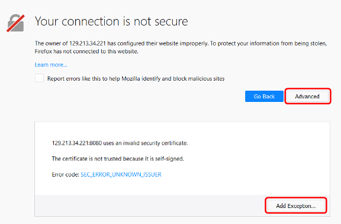
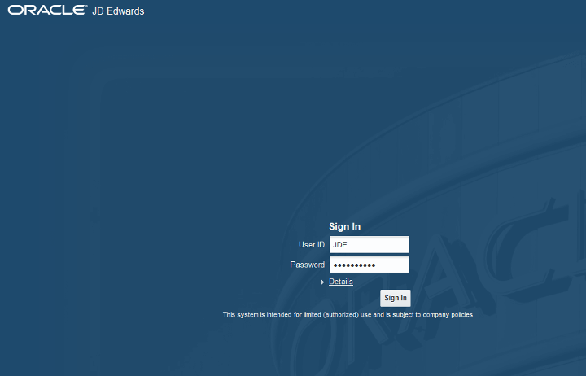
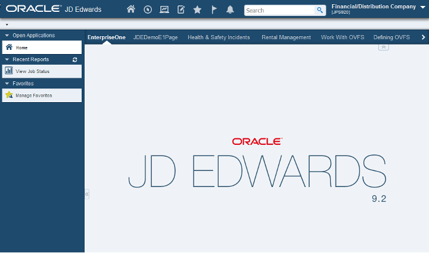
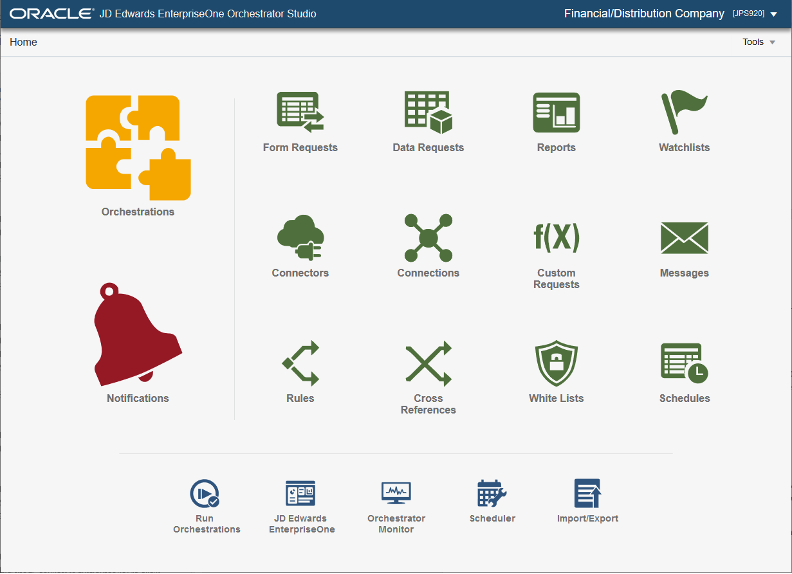
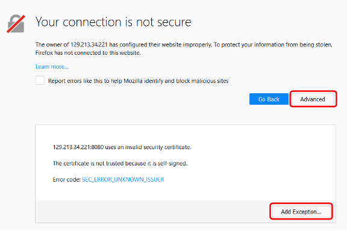
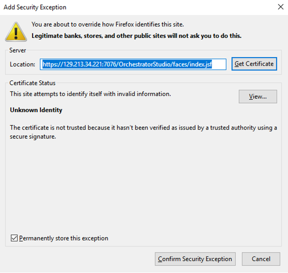
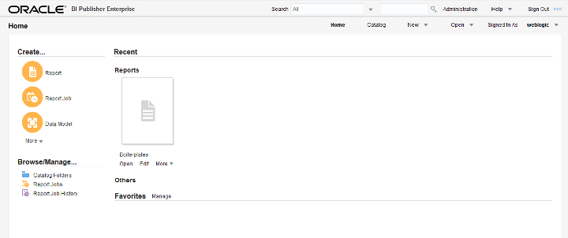

# Lab 4: Connecting to JDE Trial Edition 

## Introduction

Trial Edition is now running and ready for use. In this lab, you will learn how to utilize it.

Estimated Lab Time: 10 minutes

### Objectives

In this lab, you will:
*   Connect to EnterpriseOne HTML Server 
*	Connect to EnterpriseOne AIS Client  
*	Connect to EnterpriseOne Orchestrator Studio
*	Connect to Oracle BI Publisher
*	Learn Where Additional Resources are Located

## Prerequisites

*   JDE Trial Edition Provisioned
*   JDE Trial Edition Configured

## **STEP 1**: Connect to EnterpriseOne HTML Server

HTML Server is the primary interface to the EnterpriseOne system.  

To access the EnterpriseOne HTML server:

1)	Open a supported browser from any workstation connected to the internet.

2)	Using the Public IP Address for the instance and port number (Lab 2, Exercise 3, Step 1a) assigned to the HTML server as part of the final configuration and security list, enter the following URL into the browser:

    https://"ip address:port"/jde

For example:

    https://132.145.187.16:8080/jde

3)	If this is the first connection to this URL from the workstation or browser type, it will prompt you to confirm secure connection. This is due to JDE Trial Edition using a temporary SSL Certificate for security. Click ***Advanced*** and then ***Add Exception*** to confirm that the connection is trusted.

**Note:** Message and Security differ from browser to browser. This example is from a Mozilla Firefox browser.

**Note:** If this Trial Edition is for long-term usage, it is recommended that you replace the temporary SSL Certificate with a real SSL Certificate.
    

4)	Click the ***Confirm Security Exception*** button to add the URL to the trusted location list for the browser.
    

5)	In the JD Edwards EnterpriseOne HTML Server sign-on page, sign in using these credentials:

*   User ID: ***JDE***
*	Password: ***JDE_Rules1*** (this is the password defined in the final configuration in Lab 2, Exercise 3, Step 1)
    

    At this point, the JD Edwards EnterpriseOne HTML Client is ready for use.
    

## **STEP 2**:  Connect to EnterpriseOne Orchestrator Studio

The EnterpriseOne Orchestrator Studio is an interface to help create orchestrations.

To access the Orchestrator Studio:

1)	Open a supported browser from any workstation connected to the internet.

2)	Using the Public IP Address for the instance and port number 7077, which is automatically assigned to the Orchestrator Studio and is part of the security list, enter the following URL into the browser:

    https://<ip_address>:7077/studio/studio.html

For example:

    https://129.213.43.190:7077/studio/studio.html

3)	If this is the first connection to this URL from the workstation or browser type, it will prompt you to confirm secure connection. This is due to JDE Trial Edition using a temporary SSL Certificate for security. Click ***Advanced*** and then ***Add Exception*** to confirm that the connection is trusted.

**Note:** Message and Security differ from browser to browser. his example is from a Mozilla Firefox browser.

**Note:** If this Trial Edition is for long-term usage, it is recommended that you replace the temporary SSL Certificate with a real SSL Certificate.
    

4)	Click the ***Confirm Security Exception button*** to add the URL to the trusted location list for the browser.
    

5)	In the JD Edwards EnterpriseOne Orchestrator Studio sign-on page, sign in using these credentials:

*	User name: ***JDE***
*	Password: ***JDE_Rules1*** (this is the password defined in the final configuration in Lab 2, Exercise 3, Step 1c).
    

    At this point, the JD Edwards EnterpriseOne Orchestrator Studio is ready for use.
    

## **STEP 3**: Explore JDE Service Commands 
After you have successfully deployed your Trial Edition instance in the Oracle Cloud Infrastructure, all services are automatically started for each JD Edwards EnterpriseOne server type, which includes the Database Server, Enterprise Server, HTML Web Servers, BI Publisher Server, and ADF/AIS server.

After initial startup, all these services can be manually started and stopped by the root user.  The JDE Trial Edition is equipped with command line features for easy status checking and start/stop capabilities.  This Exercise will walk through running these commands to find status and start/stop services.

To utilize the jde service commands:

1)	Utilizing the SSH key, open a command line session to the JDE trial edition instance.

2)	Change to root user.
        
    [opc]#  sudo –i

 
3)	First run the jde-status command.  That will probe all the essential pieces running on the JDE Trial Edition (Database, Enterprise Server, Web Servers, ADF Server, BI Publisher Server) and report on the status of the piece.  Any service reporting anything but “Running” might have a problem.
      
    [root]#  jde-status

4)	Next, there are services broken down by piece.  Issue the following commands to review the specific services:

* Database:    **jde-db status**
    

* Enterprise Server:  **jde-ent status**
    

* Web Server:  **jde-html status**
    

* ADF Server:  **jde-adf status**
    

* BIP Server:  **jde-bip status**
    

5)	To stop a particular service, issue the following commands:

* Database:    **jde-db stop**

* Enterprise Server:  **jde-ent stop**

* Web Server:  **jde-html stop**

* ADF Server:  **jde-adf stop**

* BIP Server:  **jde-bip stop**

6)	To start a particular service, issue the following commands:

* Database:    **jde-db start**
    
* Enterprise Server:  **jde-ent start**

* Web Server: **jde-html start**
    
* ADF Server:  **jde-adf start**
    
* BIP Server:  **jde-bip start**

## **STEP 4**: Connect to EnterpriseOne ADF Container

The EnterpriseOne ADF Container is utilized by EnterpriseOne for select UX One applications. For those applications to function correctly, the self-signed certificate needs to be approved separately by the client browser.  

To access the ADF container:

1)	Open a supported browser from any workstation connected to the internet.

2)	Using the Public IP Address for the instance and port number 7072, which is automatically assigned to the ADF Container and is part of the security list, enter the following URL into the browser:

    https://<ip address>:7072/JDEADFContainer/faces/index

For example:

	https://132.145.187.16:7072/JDEADFContainer/faces/index

3)	If this is the first connection to this URL from the workstation or browser type, it will prompt you to confirm secure connection. This is due to JDE Trial Edition using a temporary SSL Certificate for security. Click ***Advanced*** and then ***Add Exception*** to confirm that the connection is trusted.

**Note:** Message and Security differ from browser to browser. This example is from a Mozilla Firefox browser.

**Note:** If this Trial Edition is for long-term usage, it is recommended that you replace the temporary SSL Certificate with a real SSL Certificate.
    

4)	Click the ***Confirm Security Exception*** button to add the URL to the trusted location list for the browser.
    

5)	The ADF Container page will appear. It is a blank page with a ? and X in the upper right-hand corner.
    

At this point, ADF applications should function normally when run through the JD Edwards EnterpriseOne HTML Client.

## **STEP 5**:  Connect to Oracle BI Publisher Server for OVR

The Oracle BI Publisher Server for OVR is a reporting tool.

To access the Oracle BI Publisher Server:

1)	Open a supported browser from any workstation connected to the internet.

2)	Using the Public IP Address for the instance and port number 9705, which is automatically assigned to the BI Publisher and is part of the security list, enter the following URL into the browser:

    https://<ip address>:9705/xmlpserver

For example:

    https://132.145.187.16:9705/xmlpserver

3)	If this is the first connection to this URL from the workstation or browser type, it will prompt you to confirm secure connection. This is due to JDE Trial Edition using a temporary SSL Certificate for security. Click ***Advanced*** and then ***Add Exception*** to confirm that the connection is trusted.

**Note:** Message and Security differ from browser to browser. This example is from a Mozilla Firefox browser.
    
**Note:** If this Trial Edition is for long-term usage, it is recommended that you replace the temporary SSL Certificate with a real SSL Certificate.
    

4)	Click the ***Confirm Security Exception*** button to add the URL to the trusted location list for the browser.
    

5)	In the Oracle BI Publisher sign-on page, sign in using these credentials:
*	Username: weblogic
*	Password: JDE_Rules1 (this is the password defined in the final configuration in Lab 2, Step 3)
    

    At this point, the Oracle BI Publisher Server for OVR is ready for use.
    

## **STEP 6:**  Learn Where Additional Resources are Located

For additional information, refer to these resources:

*	Learning Path
https://apexapps.oracle.com/pls/apex/f?p=44785:50:0:::50:P50_EVENT_ID,P50_COURSE_ID:6152,395

*	Marketplace Listing
https://console.us-ashburn-1.oraclecloud.com/marketplace/application/51184836/overview

# **Summary**
Enjoy JDE!   Enjoy OCI!  

## Acknowledgements
* **Author:** 
* AJ Kurzman, Cloud Engineering
* **Contributors:**
* Jeff Kalowes, Principal JDE Specialist
* Mani Julakanti, Principal JDE Specialist
* Marc-Eddy Paul, Cloud Engineering
* William Masdon, Cloud Engineering
* Chris Wegenek, Cloud Engineering 
* **Last Updated By/Date** - AJ Kurzman, Cloud Engineering, 11/17/2020

## Need Help?
Please submit feedback or ask for help using our [LiveLabs Support Forum](https://community.oracle.com/tech/developers/categories/livelabsdiscussions). Please click the **Log In** button and login using your Oracle Account. Click the **Ask A Question** button to the left to start a *New Discussion* or *Ask a Question*.  Please include your workshop name and lab name.  You can also include screenshots and attach files.  Engage directly with the author of the workshop.

If you do not have an Oracle Account, click [here](https://profile.oracle.com/myprofile/account/create-account.jspx) to create one.