# Lab1: Preparation for JDE Trial Edition Provisioning 
# Introduction

## About this Workshop

This lab describes how to prepare for provisioning a JD Edwards EnterpriseOne Trial instance in OCI

Estimated Lab Time: 30 minutes

### About Product/Technology	
Enter background information here....

*You may add an option video, using this format: *

  

### Objectives

In this lab, you will:
* Request and Obtain a Trial OCI Subscription
* Generate SSH Key for OCI Connection

### Prerequisites

* Oracle Cloud Infrastructure supports the latest versions of Google Chrome and Firefox. Firefox is preferred
* 

## **STEP 1**: Request an OCI Subscription 

**If you already have an OCI Subscription with your ssh keys set up you may skip to the next lab**

We will begin by requesting an account on Oracle Cloud Infrastructure (OCI)

1. Go to the Oracle website (https://www.oracle.com) and click the ***Try Free Tier*** button when hovered over the Oracle Cloud Infrustrature section on the left in the main page
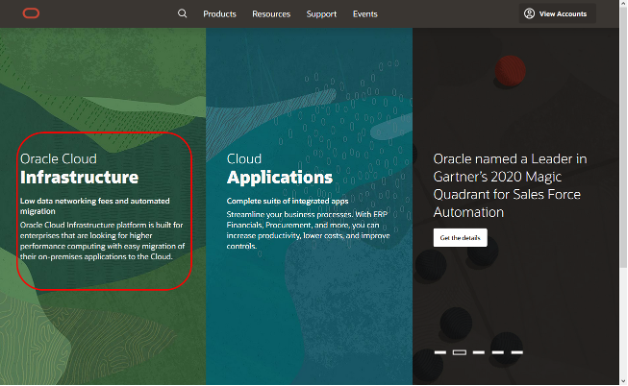
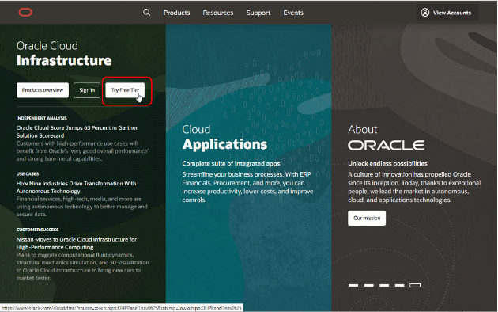

2. Next, click on the ***Start for Free*** button on the left lower side of the page.
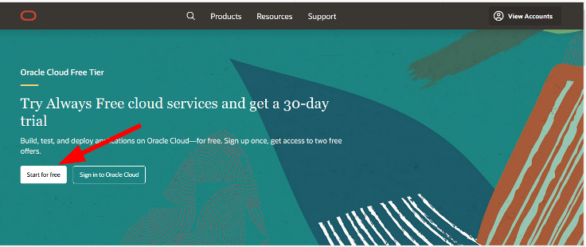

3. Enter your Account Information email address and click the Continue button.

   **NOTE:**  If you have ever previously signed up for a free trial of Oracle Cloud prior to our “Always Free Services”, please create a new account by selecting a different email address
    
   a.   
        **Country**:  Your country

    **Company Name**:  Your company
    
    **First Name**: Your first name
    
    **Last Name**: Your last name

    **Email/Username**: Use the email registered for this class
    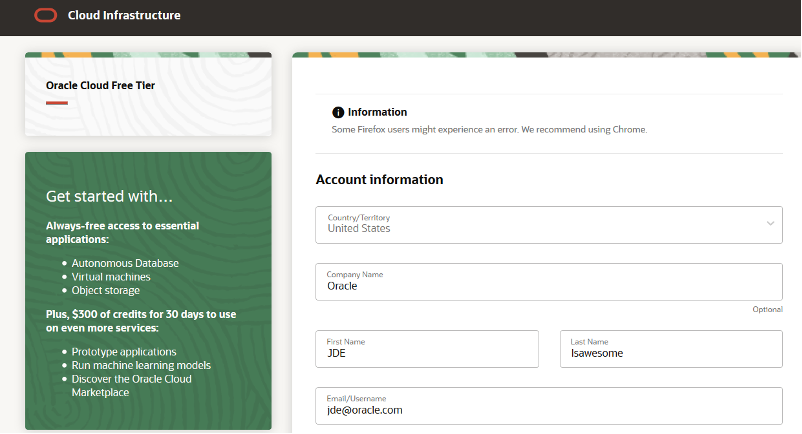

    b. **Special Oracle Offer:**  If registered prior to the class, you might be prompted for a Special Oracle Offer, which increases the free credits provided to the OCI trial instance

     Select the ***radio*** button and click the ***Select Offer button***.
    

    **NOTE:**  If you are not offered this promotion, it means there was an issue whitelisting your email, you used a different email than registered for the workshop, or your registration was not processed early enough.
    No worries, proceed with the standard credit and obtain an account anyway

    c. **Password:**  Enter and confirm a password to be used for your user on your new OCI account

    Make note of this password so that you may use it to access your account later

    **NOTE:** There are many password requirements.  Make sure you meet all of them and confirm your password successfully  

    * Cannot exceed 40 characters
    * Minimum of 8 characters
    * At least 1 lower case
    * At least 1 upper case
    * At least 1 numeric
    * At least 1 special character

    **NOTE:**  Use the eye icon  to show your password if mismatch occurs on the confirmation
    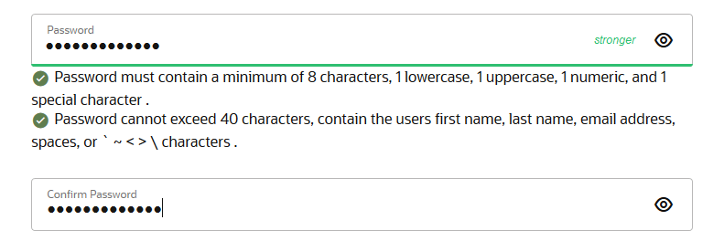

    d.  **Cloud Account Name:** Unique name for your cloud account. This can be whatever you like
    
    It is recommended to use your name or company name. For example:  **oraclejdetrial**    
    

    e. **Home Region:**  From the drop-down list, you would typically select one of the available regions where Oracle maintains a cloud data center
    
     For the purposes of this lab, the exercise will use US East (Ashburn), but pick the closest available region to your home location
        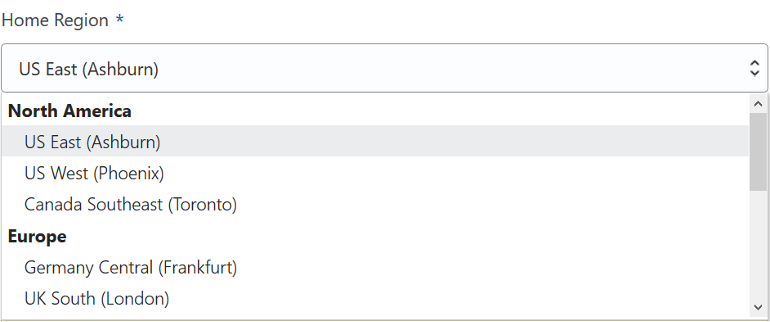

    **NOTE:**  These are the regions available to date.  This list is subject to change as more regions become available. 

    f. Terms of Use: Review the terms of use agreement and click the ***Continue*** button.

    

4. Enter your Address Information email address and click the ***Continue*** button.

    a.  **Address:**  Your address.

    b.  **City:**  Your city.

    c.  **State and Zip/Postal Code:**  Your state and Zip/postal code.
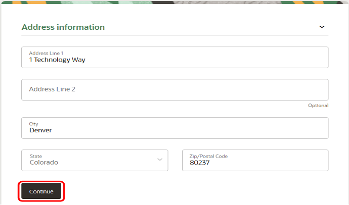

5. Final steps - enter a mobile phone, credit card (if not received the Special Oracle Offer), and  accept the final agreement and click the ***Start Free Trial*** button

    

    a) **Contact Phone Number:**  Enter a mobile telephone number with a country code.
    

    **NOTE:** If there is a Text me a code button and you did not receive the Special Oracle Offer, it is very important that you enter a valid mobile number, as this will be used to verify your cloud account.  Click the button 

    
    

    Enter the code as sent to your mobile device and click the ***Verify my code*** button.

    

    b. **Credit Card Information:** Again this is optional if you did not get prompted for the Special Oracle Offer.   Click the ***Add payment verification method*** button.

    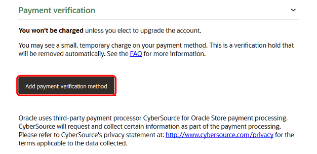

    Enter your credit card information, if asked
    
     ***Nothing will be charged*** unless the account is upgraded to a paid account

    **Note:**  You may see a nominal charge on your credit card statement. This is a verification hold and it is reversed after the credit card and billing address are validated.

    * Ater this, pay will be launched. Click on the ***Credit Card*** button

         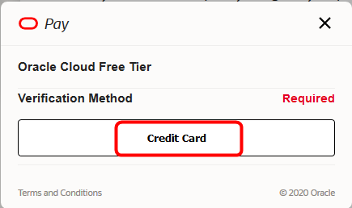

    * Enter your billing information. Your Billing Information will be pre-loaded based on information you previously supplied.  If your billing information is different, then please edit as necessary.  Then scroll down to enter your Credit Card Details.  Once complete, click ***Finish***
        
        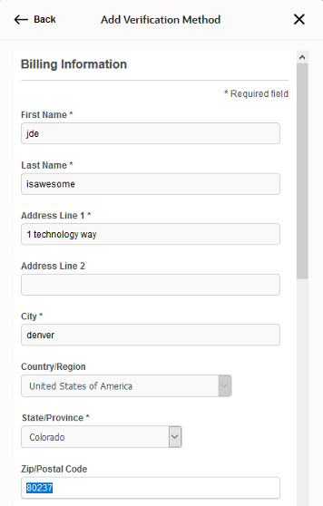 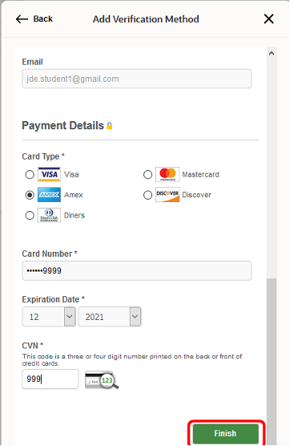

    * Once successfully verified, click the ***Close*** button.

    

    c.  **Agreement:** select the check box to approve the agreement

    

6. It may take a few minutes to create the account. Your browser will be immediately redirected (and automatically signed into) the Oracle Cloud Infrastructure main console.

   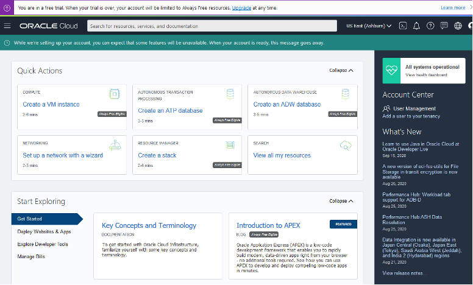

## **STEP 2:** Generate a Secure Shell (SSH) Key Pair

### FOR MAC/LINUX

**NOTE:**  If you have a previously generated key available, you can use that key and skip this exercise

Generate ssh-keys for your machine if you don’t have one. If an id_rsa and id_rsa.pub key pair is present, they can be reused. By default, these are stored in ~/.ssh folder. 

Enter the following command if you are using MAC or Linux Desktop:  

    
    # ssh-keygen

Make sure permissions are restricted, sometimes ssh will fail if private keys have permissive permissions. Enter the following to ensure this.

    # chmod 0700 ~/.ssh  
    # chmod 0600 ~/.ssh/id_rsa  
    # chmod 0644 ~/.ssh/id_rsa.pub

## FOR WINDOWS

There are many tools available for Windows users to create SSH key pairs and connect to a Linux server.  In this guide, we provide instructions for both Git Bash and Putty, but you only need to follow the steps below for either Git Bash ***OR*** Putty, but not both

### Git Bash:

1)  Install Git for windows if not already Installed. Download the latest release of [Git](https://github.com/git-for-windows/git/releases/) for Windows and install accepting all the default settings.

2)  Open Git Bash by either checking the ***Launch Git Bash*** option in the installer ***OR*** by navigating to it from the Windows Start Menu:

   
   

3)  Generate ssh-keys by the command ssh-keygen in Git Bash and then simply hit “Enter” for all steps:

    ssh-keygen  
    Generating public/private rsa key pair. Enter file in which to save the key

    (/c/Users/username/.ssh/id_rsa): (Press enter for this step)
    Created directory '/c/Users/username/.ssh'.

    Enter passphrase (empty for no passphrase): (Press enter for this step)

    Enter same passphrase again: (Press enter for this step)
    Your identification has been saved in /c/Users/username/.ssh/id_rsa.  
    Your public key has been saved in /c/Users/username/.ssh/id_rsa.pub

    **Note:**

    •   In Git Bash, C:\Users\username\ is shown as /c/Users/username/

    •   These instructions will create a minimally secure ssh key for you (and one well suited for this tutorial). For production environments we recommend an SSH-2 RSA key with 4096 bits and a passphrase. For example: ssh-keygen -t rsa -b 4096 -N "<myPassphrase>" -f ~/keys/id_rsa -C "This is my comment"

### Puttygen

1)  Install Puttygen (PUTTY) for Windows if not already installed. Download the latest release of [PuTTY](https://www.chiark.greenend.org.uk/~sgtatham/putty/latest.html), 64-bit MSI Installer and install accepting all the default settings

2)  Open PuTTY Gen: 

3)  In the PuTTY Key Generator, ensure that the ***Type of key to generate*** is set to ***RSA*** and the Number of bits in a generated key is set to ***2048***, and then click the ***Generate*** button
 
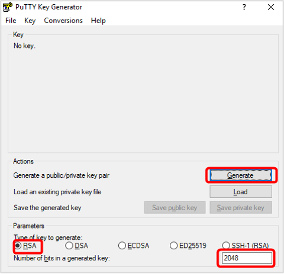

4)  After clicking the ***Generate button***, move the mouse around the blank area to generate randomness for the SSH key to be generated
 

5)  In the PuTTY Key Generator dialog, select all the characters in the ***Public key for pasting into OpenSSH authorized_keys file*** field, and then right-click and select ***Copy***

**Note:** Ensure that you select all the characters and not just the ones shown in the narrow window. Scroll down as necessary
 
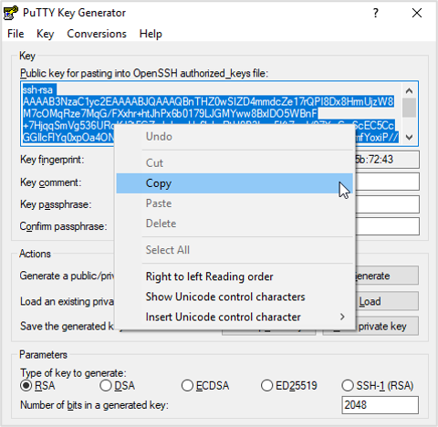

6)  Paste the copied string into a plain text editor (such as Notepad) and save the plain text file. Save it to a known location with any file name but ensure that it has the extension .pub (example: OCISSHKey.pub) to indicate that it is a public key.  Make note of this file name as you will need it later

7)  Next, save the OpenSSH private key. In the same PuTTY Key Generator window, from the ***Conversions*** menu, select the ***Export OpenSSH key*** option.

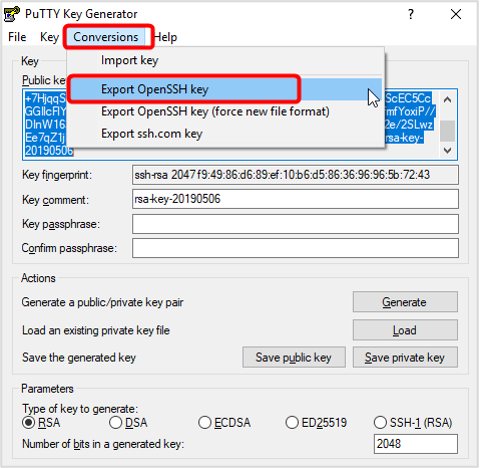

8)  PuTTYgen will ask you to verify that the key will be saved without a passphrase. Click the ***Yes*** button.
 

9)  Again, save the file to the same known location with any file name but ensure that the file has ***NO extension*** on it (example: OCISSHKey).  Make note of this file name as you will need it later.

10) Save the Windows private key. In the same PuTTY Key Generator window, click the ***Save private key*** button. 
 

11) Again, click the ***Yes*** button to verify saving the key without a passphrase.

12) Save this file to the same known location with any file name and a .ppk extension (example: OCISSHKey.ppk).

## Summary
At this point, everything is allocated and generated to start creating instances in Oracle Cloud Infrastructure.  

#
## Acknowledgements
* **Author** - <Name, Title, Group>
* **Contributors** -  <Name, Group> -- optional
* **Last Updated By/Date** - <Name, Group, Month Year>
* **Workshop (or Lab) Expiry Date** - <Month Year> -- optional, use this when you are using a Pre-Authorized Request (PAR) URL to an object in Oracle Object Store.

## See an issue?
Please submit feedback using this [form](https://apexapps.oracle.com/pls/apex/f?p=133:1:::::P1_FEEDBACK:1). Please include the *workshop name*, *lab* and *step* in your request.  If you don't see the workshop name listed, please enter it manually. If you would like us to follow up with you, enter your email in the *Feedback Comments* section.

