# Lab 2: Creating a Trial Edition Instance in OCI

## Introduction

In this lab, a JDE Trial Edition will be created in OCI. The JDE Trial Edition will be provisioned and connected to. 

Estimated Lab Time: 40 minutes

### About Product/Technology
The process includes creating the JDE Trial Edition environment, setting up a bridge to connect to the JDE Trial Edition, ensuring the configurations are correct for the JDE Trial Edition, and finally getting the IP addresses of the JDE consoles in order to access them in your web browser. 

### Objectives

To deploy JDE Trial Edition, in this lab, you will:

*   Provision Trial Edition from OCI Marketplace
*   Set up PuTTY to Access OCI Instance
*   Perform First-Time Configuration of Trial Edition
*   Connect to JDE Resources

## Prerequisites

*   Virtual Cloud Network (VCN) Created
*   Established Security List Rules for JDE
*   SSH Key Pair Generated
*   Familiarity with OCI Console

## **STEP 1**: Provision Trial Edition from OCI Marketplace

Create an instance in OCI that is based off the JDE Trial Edition image

1)	If not already done, sign in to OCI tenancy.
On the Oracle Cloud Infrastructure Console Home page, click the ***Navigation*** Menu Button in the upper-left corner and select ***Marketplace***.
    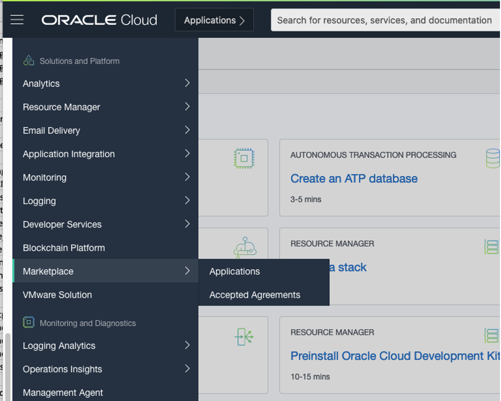

2)  Locate the Oracle JD Edwards image tile for ***JD Edwards EnterpriseOne Trial Edition*** (you might have to search for it; there could be several images out there) and click the tile
    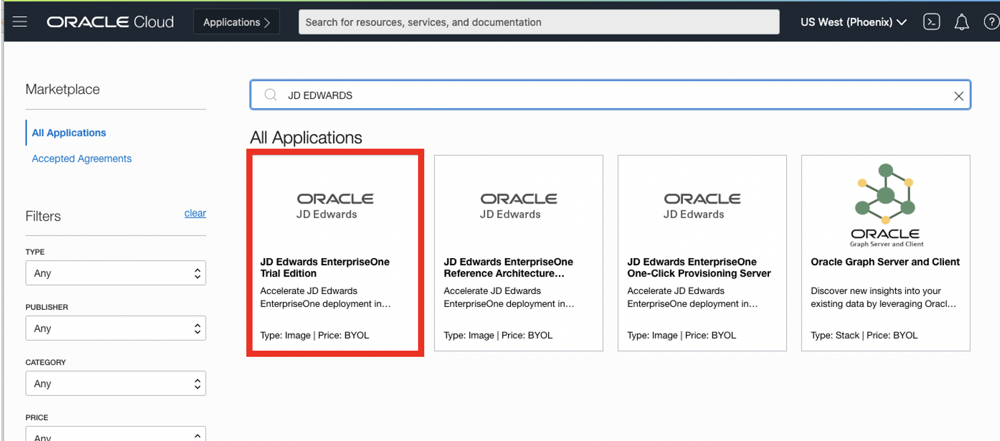

3)  On the information page for the JD Edwards EnterpriseOne Trial Edition image, select the version ***(9.2.4.3 – default)*** to deploy and the compartment (you created a compartment in Lab 2, Exercise 1, Step d) to deploy to. Select the check box to accept the Oracle Standard Terms and Restrictions and then click the ***Launch Instance*** button on the right
    

4)  Next, define the instance with the following options: 

* Instance Name: jdetrial
    

* Operating System or Image Source: leave ***JD Edwards EnterpriseOne Trial Edition*** selected
    

* If the following is not visible on your screen, click on ***Show Shape***, ***Network and Storage Options***.  Depending on the region selected, there might be one or more availability domains.   Select Availability Domain: ***AD1*** (if since AD available) or ***AD3*** (if multiple ADs available)
    

* Instance Shape: click on ***Change Shape***
    

* Select ***Virtual Machine***, then select a shape.  For the purposes of this lab, select either an ***Intel Skylake VM.Standard2.2*** shape, or under the Specialty and Legacy series, select the ***VM.Standard.E2.2*** shape
    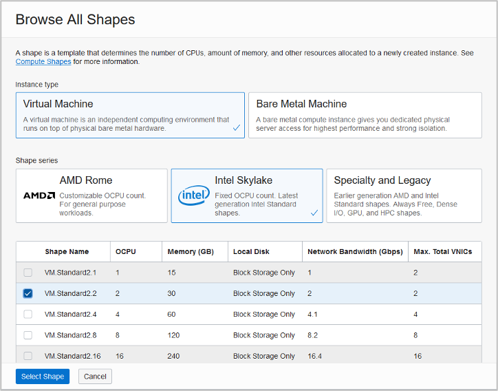

* Configure Networking: This will be populated by default, but review and confirm the VCN, compartment, and subnet.  Ensure that the ***Assign a public IP address*** radio button is selected
    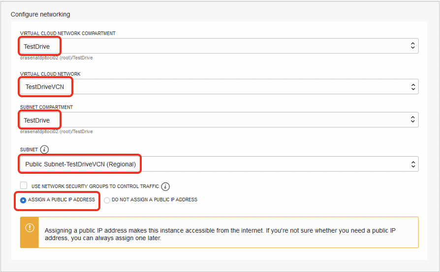

* Configure Boot Volume: The default boot size of 100GB will be sufficient for this lab
    

* Add SSH key: Select the ***Choose SSH Key file*** radio button.  Browse to select the public SSH key file you created earlier (LAB 1, Step 2: Generate a Secure Shell (SSH) Key Pair) by navigating to the location where the SSH files are stored.  Alternatively, drag and drop the .pub file to the window
    

* Click the ***Create*** button.
    

5)  After a few minutes, the instance will be running and ready.  Copy and take note of the **Public IP address** under the ***Instance Access*** section, which is required to connect to the instance – in this example, it is 129.213.43.190.
    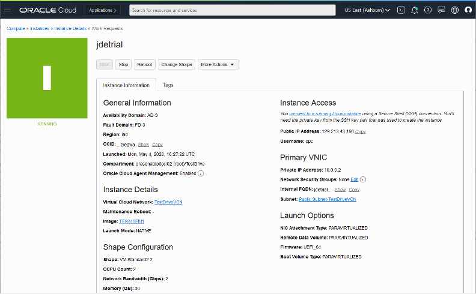

##  **STEP 2:**  Accessing the OCI Instance

To complete the setup of the JD Edwards EnterpriseOne Trial Edition, it is necessary to connect to the VM Instance.  The username on the instance is **opc**.  There isn’t a password, the account can only be accessed using the SSH private key.

### Connecting to an OCI Compute instance using a Mac/Linux/Unix based machine using Command Line SSH

Mac OS X includes a command-line SSH client as part of the operating system. To use it, go to Finder, and select Go -> Utilities from the top menu. Then look for Terminal. To connect over SSH you can use the following command on a Linux/UNIX style system:

    $ ssh –l opc –i </path/to/privateKey> <PublicIP_Address>

    Example: $ ssh –l opc –i ./keys/id_rsa 132.145.187.16

Once connected, you can continue to **Step 3** below

### Connecting to an OCI Compute instance using a Windows based machine

**Method 1:** Using SSH with Git Bash

1)  Launch Git Bash
    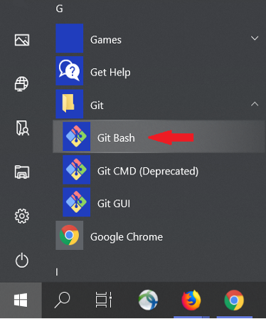

2)  To connect over SSH you can use the following command on a Linux/UNIX style system.

    $ ssh –l opc –i </path/to/privateKey> <PublicIP_Address>

    Example: $ ssh –l opc –i ./keys/id_rsa 132.145.187.16

**Hint:** Do not copy and paste the line above into Git Bash.  Unpredictable results may occur.

3)  If, after entering the ssh command, you receive a message like in the screen shot below, reply with YES
    

4) Once connected, you can continue to **STEP 3** below.

**Method 2:** Using SSH with Putty for Windows

For Windows, you can also use a tool like PUTTY to set up PuTTY to connect to an OCI instance.

1)	Launch ***PuTTY***.
    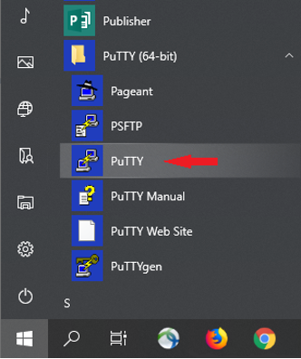

2) Within the PuTTY session, under Session category, enter the Public IP Address (example: 132.145.187.16) from the instance information into the ***Host Name*** field, and then select category ***Connection → Data***.
    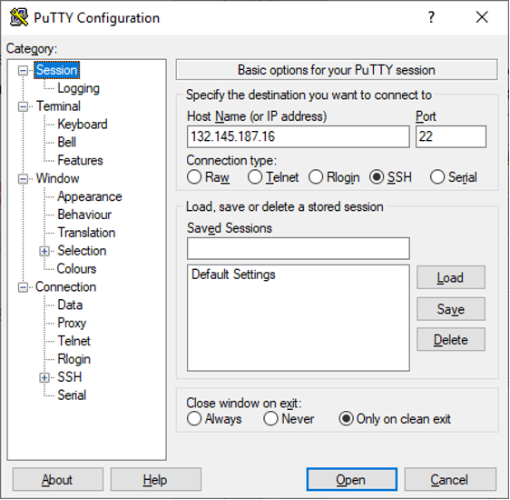

3)  Enter ***opc*** in the ***Auto-login username*** field and then select the category ***Connection → SSH → Auth***
    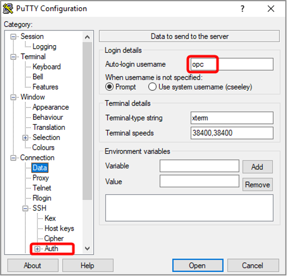

4)  In the Auth category, use the ***Browse*** button to locate the ppk (OCISSHKey.ppk) SSH file in the location where you saved it (Lab 1, Exercise 2, Step L). Return to the ***Session*** category.
    

5)  In the Session category, enter a unique label (example: JDE Trial Edition) for the connection in the ***Saved Sessions*** field, and click the ***Save*** button. This will retain all settings for future connections.
    

6)  Finally, connect to the instance by clicking the ***Open*** button.
    

7)  PuTTY will open a command window. On first connection, a Security Alert window will appear. Click ***Yes*** to accept that you trust the connection to this host.
    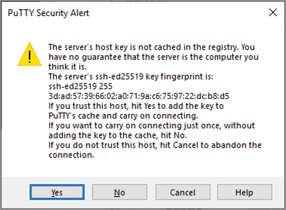

## **STEP 3:** Perform First-Time Configuration of Trial Edition

During the first connection to a Trial Edition instance (after completing Lab3 Step 2), a process will run to verify if any critical updates are required to the OS and the installed software packages on the instance.  If so, the following screen will display noting that the yum update packages are installing.  This process can take anywhere from 5 to 10 minutes to run. 

 Once complete, you will need to establish a new SSH session with the server. If your subsequent connections are refused or if the connection displays this same ***screen (shown below)*** then the updates are still running.   
    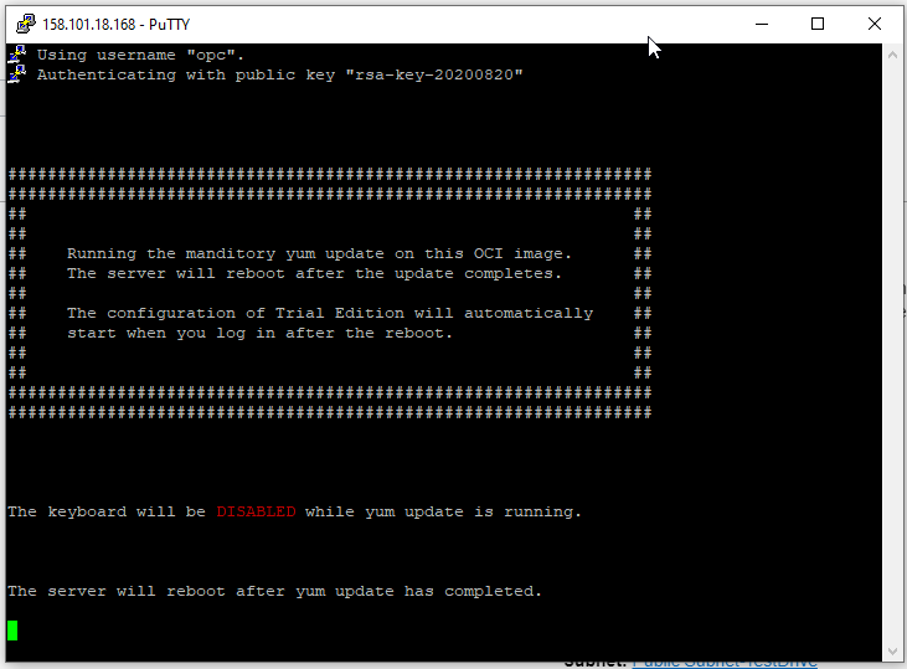

 On the first connection to the instance after the yum update has completed, the initial configuration script will be triggered and needs to be run prior to anything working.

 In the first connection to the Trial Edition Instance, follow along and answer the following prompts to complete the configuration:

1)	HTML Port [8080]: – set this as **8080**.

**Note:** This must match the port number added to the Ingress Rules for the Security List

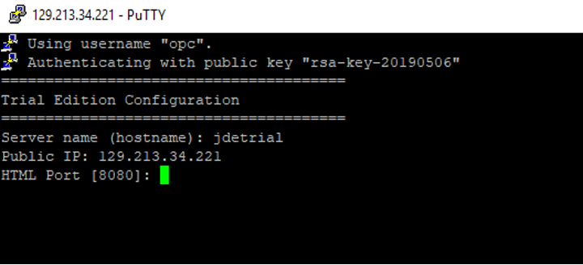

2)	Database System Password (& confirmation): ***JDE_Rules1*** – Any password that meets the following rules:
*	Must be between 8 and 10 characters
*	Must contain at least 1 letter and 1 number
*	May not contain any shell metadata characters such as $, |, @, and so on
    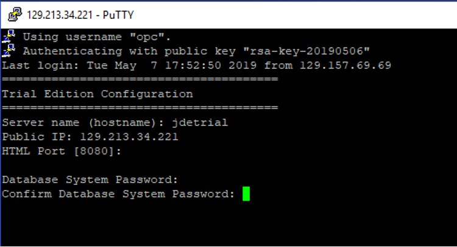

3)  JDE User Password (& confirmation): ***JDE_Rules1*** – same password rules
    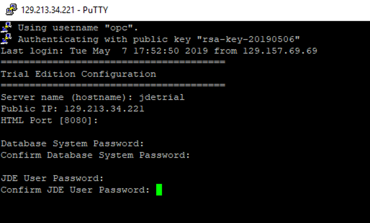

4)	Weblogic Admin Password (& confirmation): ***JDE_Rules1*** – same password rules.
    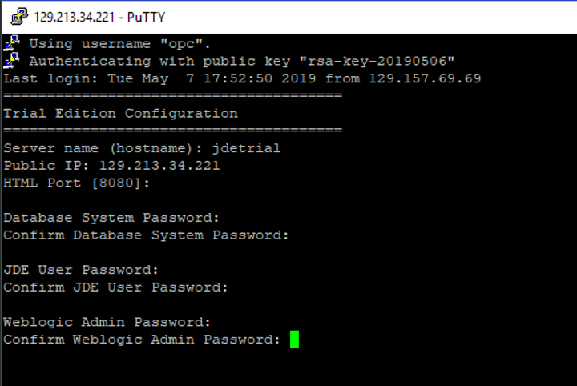

5)	Final Confirmation: Y – Yes to commit the configuration settings and run the script to set up.

Configuration will take between 25-30 minutes. The configuration will go through and change all necessary database records and files on the system for the system information and options entered, as well as start all necessary services. Once complete, the JD Edwards EnterpriseOne Trial Edition is ready for use. Watch for the status ***“Successfully completed u01/vmScripts/EOne_Sync.sh”***.
    

## Summary
At this point, the JD Edwards EnterpriseOne Trial Edition is ready for use.

You may now proceed to the next lab.

## Acknowledgements
* **Author:** AJ Kurzman, Cloud Engineering
* **Contributors:**
    * Jeff Kalowes, Principal JDE Specialist
    * Mani Julakanti, Principal JDE Specialist
    * Marc-Eddy Paul, Cloud Engineering
    * William Masdon, Cloud Engineering
    * Chris Wegenek, Cloud Engineering 
* **Last Updated By/Date** - AJ Kurzman, Cloud Engineering, 11/18/2020

## Need Help?
Please submit feedback or ask for help using our [LiveLabs Support Forum](https://community.oracle.com/tech/developers/categories/migrate-saas-to-oci). Please click the **Log In** button and login using your Oracle Account. Click the **Ask A Question** button to the left to start a *New Discussion* or *Ask a Question*.  Please include your workshop name and lab name.  You can also include screenshots and attach files.  Engage directly with the author of the workshop.

If you do not have an Oracle Account, click [here](https://profile.oracle.com/myprofile/account/create-account.jspx) to create one.