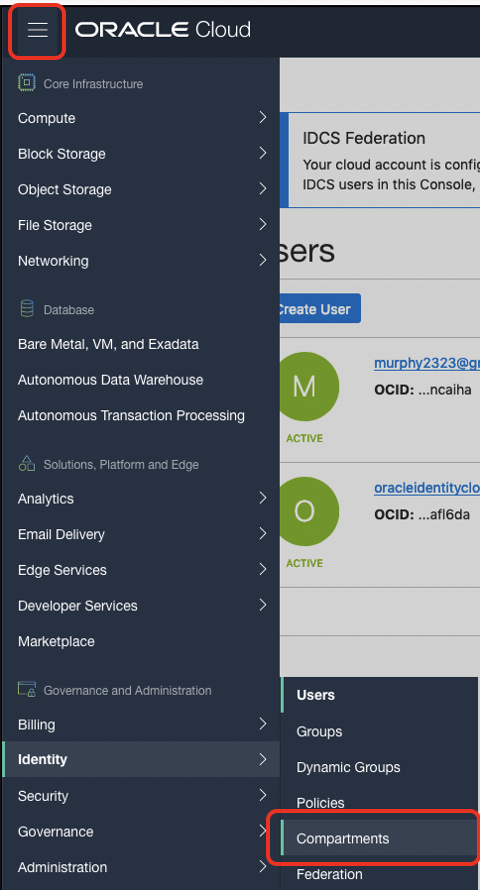
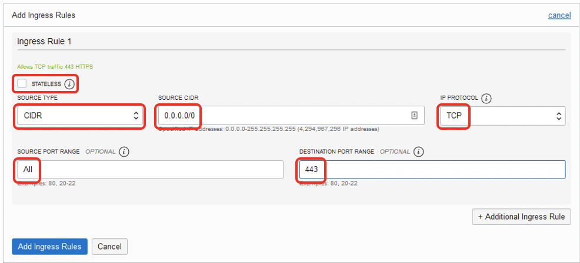

# Lab 1: Set Up OCI for JDE Trial Edition Deployment 

### About this Workshop

To establish proper access to a JDE Trial Edition, the OCI tenancy needs to be set up

In this lab, the recently provisioned OCI Trial tenancy will be set up for JDE Trial Edition deployment. A compartment will be created to organize your tenancy. A compartment is essentially a folder within the Oracle Cloud Infrastructure (OCI) console. A Virtual Cloud Network will then be created. The Oracle virtual cloud networks (VCNs) provide customizable and private cloud networks on Oracle Cloud Infrastructure (OCI). Lastly, security list rules for JDE, which are virtual firewall to control traffic at the packet level, will be created.

Estimated Lab Time: 10 minutes

### About Product/Technology
Enter background information here....

*You may add an option video, using this format: *

  

### Objectives

To set up the OCI tenancy, in this lab, you will:
*   Create a Compartment
*   Create a Virtual Cloud Network (VCN)
*   Establish Security List Rules for JDE

## **STEP 1**: Create a Compartment 

In this part of the lab, we create a compartment to organize the resources we will create

Compartments are the primary building blocks you use to organize your cloud resources. You use compartments to organize and isolate your resources to make it easier to manage and secure access to them

When your tenancy is provisioned, a root compartment is created for you. Your root compartment holds ***all*** your cloud resources

1)  Please log into to your OCI tenancy, if you are not already signed in. Example for Ashburn location - https://console.us-ashburn-1.oraclecloud.com/ 

2)  On the Oracle Cloud Infrastructure Console Home page, click the Navigation Menu   in the upper-left corner, select Identity, and then select the Compartments option.

    

3)	Click the Create Compartment button

    

4)	Choose a Name (e.g. “**TestDrive**”), fill out the form and click the   button. Note: that the parent compartment should be the root compartment

##  **Step 2:**  Create a Virtual Cloud Network (VCN)

To create a VCN on Oracle Cloud Infrastructure:

1)	On the Oracle Cloud Infrastructure Console Home page, under the Quick Actions header, click on Set up a network with a wizard
 
    

2)	Select VCN with Internet Connectivity, and then click Start VCN Wizard

      

3) In this window, fill in the following fields with the information shown below:

**VCN NAME:**
            
    TestDriveVCN     (or any other unique name for the VCN)
**COMPARTMENT:**
            
    TestDrive        (or any other compartment previously created)
**VCN CIDR BLOCK:** 

    10.0.0.0/16

**PUBLIC SUBNET CIDR BLOCK:** 

    10.0.2.0/24

**PRIVATE SUBNET CIDR BLOCK:** 
            
    10.0.1.0/24 

**USE DNS HOSTNAMES IN THIS VCN:**

    Make sure this is checked

Then, scroll down to the bottom and click the ***Next*** button.

4)	On the “Review and Create” page, click on the create button.

5) On the “Created Virtual Cloud Network” page wait until you see the following graphic.

Then click on the View Virtual CLoud Network Button shown

 
## **Step 3:**  Establish Security List Rules for JDE 

With the VCN in place, define the open inbound and outbound ports that will be available to instances created within the VCN.

1)	From the details page of the TestDriveVCN, under the ***Resources*** section in the left pane, select ***Security Lists*** 

2)	In the Security Lists section, click the Default ***Security List*** for ***TestDriveVCN*** link  

3)	On Default Security List, under Resources, click the Add Ingress Rules button.

4) 
    | Stateless | Source Type |	Source CIDR | IP Protocol | Source Port Range |	Destination Port |
    | --- | --- | --- | --- | --- | --- |
    | Unchecked | CIDR|	0.0.0.0/0 |	TCP | All |	443 |
    | Unchecked | CIDR|	0.0.0.0/0 |	TCP | All |	7000-7006 |
    | Unchecked | CIDR|	0.0.0.0/0 |	TCP | All |	7072-7077 |
    | Unchecked | CIDR|	0.0.0.0/0 |	TCP | All |	8080 |
    | Unchecked | CIDR|	0.0.0.0/0 |	TCP | All |	9703-9705 |

    Within the interface, click the + ***Additional Ingress Rules*** button to add new rows. Click the ***Add Ingress Rules***  button when complete. 
    
    

    These Ingress Rules will be sufficient to allow the network traffic required for JDE Trial Edition.

## **Summary**

<<<<<<< HEAD
In this lab, OCI has been set up for the networking required to be able to access a JDE Trial Edition that will be created in the next lab.
=======
## Need Help?
Please submit feedback or ask for help using our [LiveLabs Support Forum](https://community.oracle.com/tech/developers/categories/livelabsdiscussions). Please click the **Log In** button and login using your Oracle Account. Click the **Ask A Question** button to the left to start a *New Discussion* or *Ask a Question*.  Please include your workshop name and lab name.  You can also include screenshots and attach files.  Engage directly with the author of the workshop.

If you do not have an Oracle Account, click [here](https://profile.oracle.com/myprofile/account/create-account.jspx) to create one.
>>>>>>> upstream/master
