# Lab 1: Creating Identity and Access Management (IAM) Resources

## Introduction

This lab walks you through the steps to prepare your Orace Cloud Infrastructure Tenancy

Estimated Lab Time: 20 minutes

### About Identity and Access Management (IAM)
The Oracle Cloud Infrastructure (OCI) Identity and Access Management (IAM) Service allows you to control who has access to your cloud resources. You control the types of access a group of users has and to which specific resources. 

### Objectives

The purpose of this lab is to give you an overview of the IAM Service components and an example scenario to help you understand how they work together.

In this lab, you will:
* Sign-in to your OCI Tenancy to access the Console
* Verify the Service Limit
* Manage access by creating a 
    - Demo Compartment
    - OCI Group
    - Policies
    - New User


### Prerequisites

1.	Oracle Cloud Infrastructure account credentials (User, Password, and Tenant)

2. 	To sign in to the Console, you need the following: 

    1. Tenant, User name and Password
    2. URL for the Console: [https://oracle.com] (https://oracle.com)
    3. Oracle Cloud Infrastructure supports the latest versions of Google Chrome, Firefox, and Internet Explorer 11

## **STEP 1**: Signing in to the Console
**Console Overview**  
In this section, sign in to the Oracle Cloud Infrastructure console using your credentials.

1.	Open a supported browser and go to the Console URL: [https://oracle.com] (https://oracle.com).

2.	Click on the portrait icon in the top-right section of the browser window, then click on the Sign in to Cloud link.

    

3.	Enter the name of your tenancy (aka your account name, NOT your user name), then click on the **Next** button.

    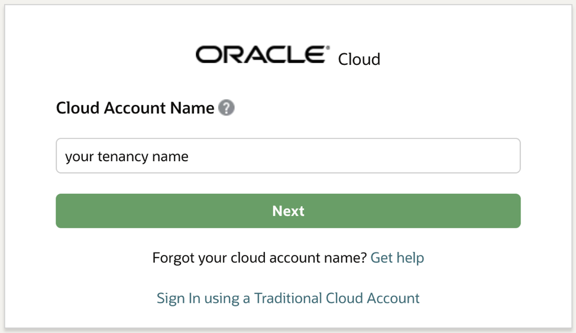

4.	Oracle Cloud Infrastructure is integrated with Identity Cloud Services. You will see a screen validating your Identity Provider. Click **Continue**. Enter your username and password and click **Sign In**. 

     

    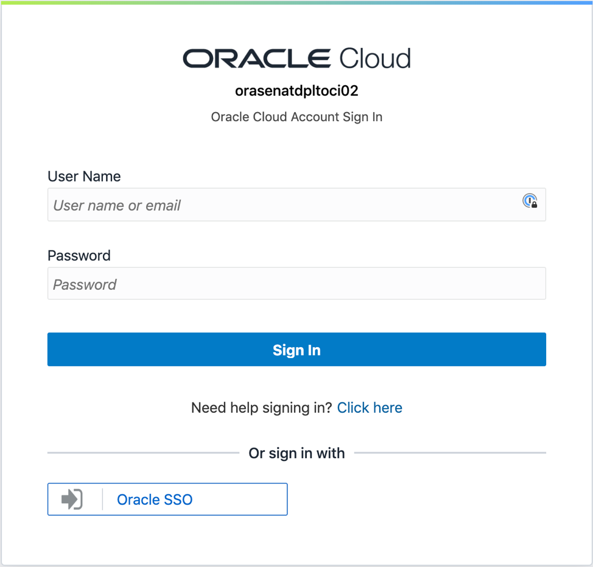

5.	When you sign in to the Console, the dashboard is displayed.

    

## **STEP 2:** Verifying Service Limits

During the workshop, you might face problems related to service limits. 

Please check if you have enough resource availability in your Availability Domain or change the Availability Domain to 1/2/3 as per the resource availability. 

1. To check the service limit, navigate to the three-line menu on the top left and click on **Governance -> Limits, Quotas, and Usage**.

    

2. Click on **Scope** and select AD-1 or AD-2 or AD-3 depending on which availability domain you want to see the service limit. 

    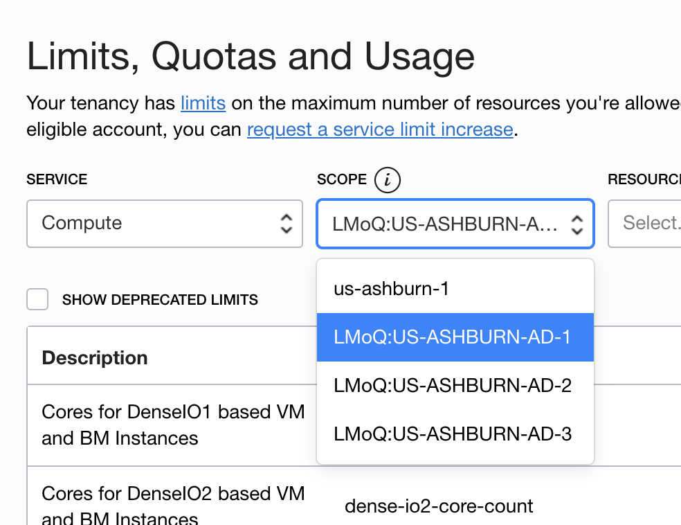

3. Scroll down the list, and you will see all the resources available and usage. For example, in the below case, all my available resources are used.

    

**NOTE**: You will need 2 instances. Make sure you have at least 1 of each of the below marked resource (it doesn't need to be in same availability domain):

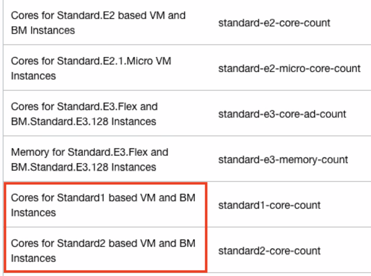

## **STEP 3:** Creating a Demo Compartment
**Compartments Overview:**
A compartment is a collection of cloud assets, like compute instances, load balancers, databases, etc. By default, a root compartment was created for you when you created your tenancy (ie, when you registered for the trial account). It is possible to create everything in the root compartment, but Oracle recommends that you create sub-compartments to help manage your resources more efficiently.

1.	Click on the three-line menu, which is on the top left of the console. Scroll down till the bottom of the menu, click on **Identity -> Compartments**. Click on the blue **Create Compartment** button to create a sub-compartment.

    

    

2.	Give the Compartment a Name and Description 
    Copy the fields below
    Name:
    ```
    <copy>Demo</copy>
    ``` 
    Description:
    ```
    <copy>This is our main compartment for test drive</copy>
    ``` 

    Be sure your root compartment is shown as the parent compartment. Press the blue **Create Compartment button** when ready.

    

3.	You have just created a compartment for all of your work in this Test Drive.

## **STEP 4:** Creating a Group
**Security Overview:** A user's permissions to access services come from the groups to which they belong. Policies define the permissions for a group Policies explain what actions members of a group can perform, and in which compartments. Users can access services and perform operations based on the policies set for the groups.

We'll create a user, a group, and a security policy to understand the concept.

1.	After signing in to the console, click on the three-line menu on the top left. Click on **Identity -> Groups**.

    

2.	Click **Create Group**.

3.	Give the Group a name and description
    Copy the fields below
    
    Name:
    ```
    <copy>oci-group</copy>
    ``` 
    Description:
    ```
    <copy>New group for OCI users</copy>
    ``` 

    Click **Create**

    

4.	Your new group is displayed.

    
   
## **STEP 5:** Creating Policies to Control Access

Now, let’s create a security policy that gives your group permissions in your assigned Compartment. In this case, we will create a policy that permits users belonging to group **'oci-group' to provision Peoplesoft Cloud Manager in Compartment 'Demo'**:

1. Click on the three-line Menu button on the top left. Click on **Identity -> Policies**.
    
        

2. On the left side, navigate to **COMPARTMENT** and select **root compartment**. 

    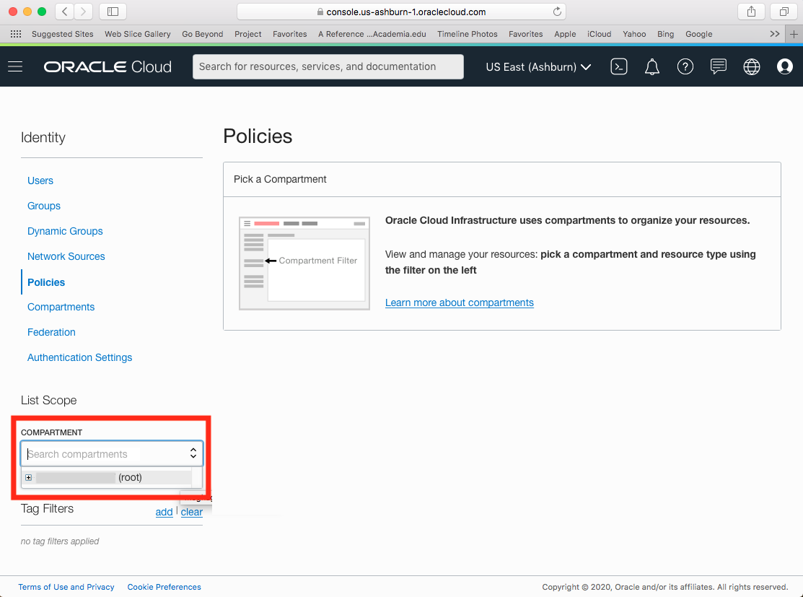

3. After you have selected the **root** compartment, click **Create Policy**.

    Copy the fields below. Give the group a
        
    a) Name:
    ```
    <copy>Policy-for-oci-group</copy>
    ``` 
    b) Description:
    ```
    <copy>Policy for OCI Group</copy>
    ``` 
    c) Verify it's in the **root** compaartment

    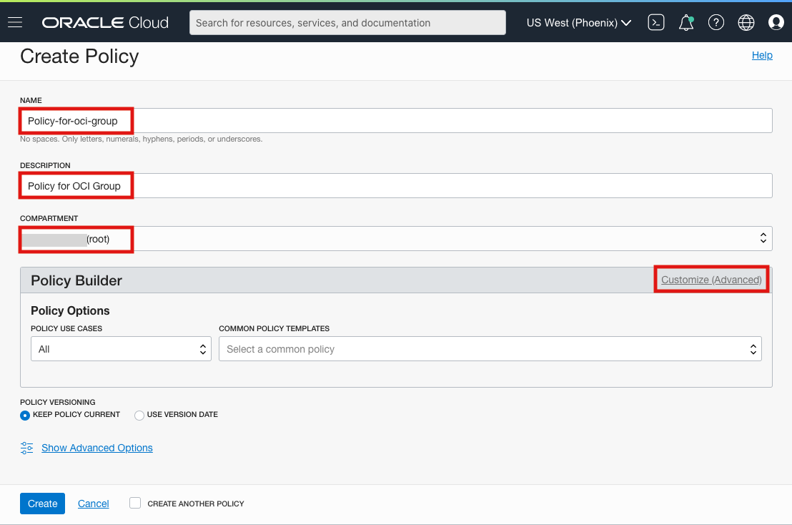
4. Click **Customize(Advanced)**
    
    a) Enter the following Statements:
    
    ```
    <copy>Allow group oci-group to manage all-resources in compartment Demo
    Allow group oci-group to read all-resources in tenancy
    Allow group oci-group to manage App-catalog-listing in tenancy</copy>
    ```  

    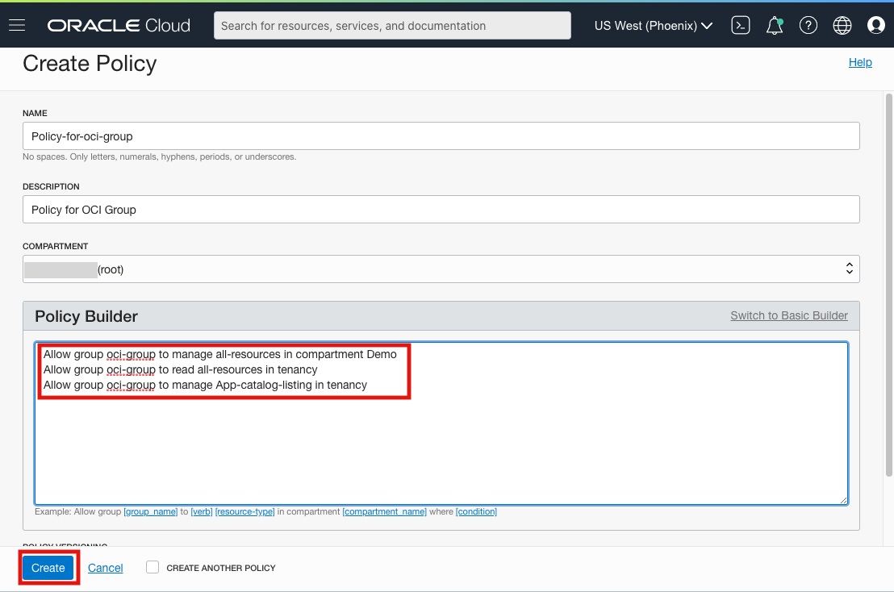    

    b) Click **Create**.

## **STEP 6:** Creating a User

Create a **New User**
   
1. Click on three-line menu on top left, and click on **Identity -> Users**.

2. Click **Create User**.

3. Select IAM user. 

    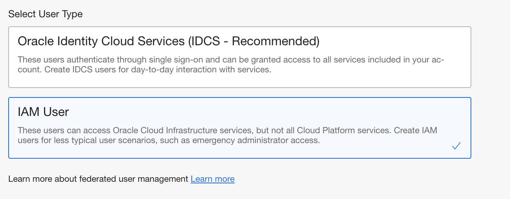    

4. In the New User dialog box, copy the fields below to give the user a 
        
    a) Name:
    ```
    <copy>User01</copy>
    ``` 
    b) Description:
    ```
    <copy>User 01</copy>
    ``` 

    *Optional* Email: Enter your email ID and confirm it. Please make sure not to use the same email ID. Email ID has to be unique in the tenancy. If you don't have another email ID, you can leave it blank.

    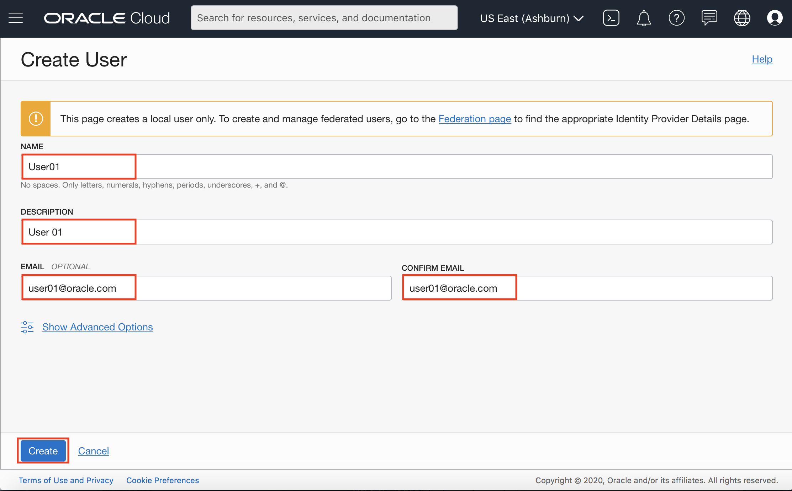

    b) Click **Create**.

## **STEP 7:** Managing User

Set a **Temporary Password** for the newly created User. After the user is created, you can see the user details.

1. Click **Create/Reset Password**.

    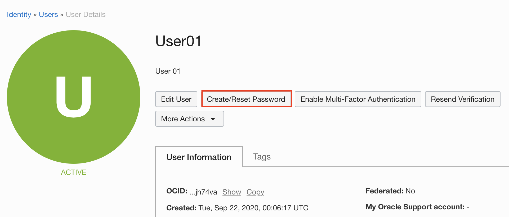

2. In the dialog, click **Create/Reset Password**.

    

3. The new one-time password is displayed. Click the **Copy** button, save this to your notepad for later, and then click **Close**.
    
    

4. Scroll down and click on **Add User to Group**.

    

5. Select the group you just created, and click on **Add**.

    

6. Click on **top-right icon button** and **Sign out** of the admin user account.

    

    This time, you will sign in using the local credentials box with the user you created. Note that the user you created is not part of the Identity Cloud Services.

7. Enter the username **User01** and password that you copied to your naotepad.

    

    ```
    Note: Since this is the first-time sign-in, the user will be prompted to change the temporary password, as shown in the screen capture.
    ```

8. Set the new password to **Psft@1234**. Click on **Save New Password**. 
    ```
    <copy>Psft@1234</copy>
    ```
    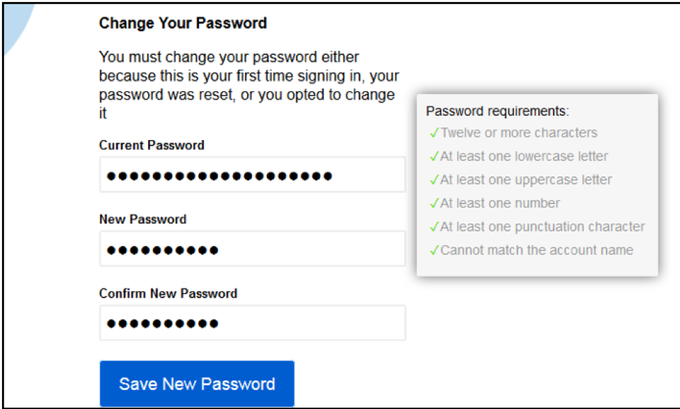


    You are now logged in as local user: **User01**

You may now proceed to the next lab.


## Acknowledgements
* **Authors** 
- Rich Konopka, PeopleSoft Specialist, October 2020
- Megha Gajbhiye, Cloud Solutions Engineer, October 2020

* **Last Updated By/Date** 
- Sara Lipowsky, Cloud Engineer, October 2020


## Need Help?
Please submit feedback or ask for help using our [LiveLabs Support Forum](https://community.oracle.com/tech/developers/categories/livelabsdiscussions). Please click the **Log In** button and login using your Oracle Account. Click the **Ask A Question** button to the left to start a *New Discussion* or *Ask a Question*.  Please include your workshop name and lab name.  You can also include screenshots and attach files.  Engage directly with the author of the workshop.

If you do not have an Oracle Account, click [here](https://profile.oracle.com/myprofile/account/create-account.jspx) to create one.