# Provision an Instance

## Introduction

It is often a requirement for organizations to on-board an employee or contractor or some identity manually into a central identity system like IDCS. In this use case, an IDCS user administrator will manually add a new user in IDCS service.  Typically, this would occur through automated provisioning, bulk flat-file import or synchronization with your on-premises Active Directory.

The IDCS features are built 100% using the IDCS REST API service.  Therefore, any task we perform interactively in the web interface could also be performed via custom app, using these same REST API calls.  It’s a clear advantage of Oracle’s API-first architecture with IDCS.

IDCS supports user (also groups) on-boarding from on-premises Active Directory, using file upload, REST API, on-premises Oracle Identity Management solution, or manually from IDCS admin console.  For the workshop we will be using file upload option and API calls user management.


Estimated Lab Time: 90 minutes

## **STEP 1**: Create User in UI

* *Personas*:
    - Administrator

1. Go to IDCS Admin console using your administrator account credentials.  Select the *Users* menu on the left and click *+Add* or select the *Add a user* icon from the dashboard.

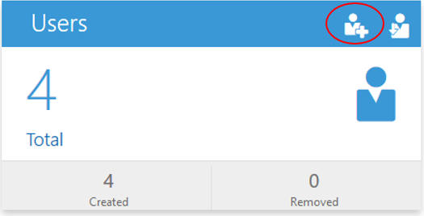

2.	Fill in all required fields and click Finish. As a good practice, use a consistent naming convention throughout the labs. For example:
* First Name: Firstname
* Last Name: Lastname-UI
* User Name/Email: firstname.lastname+ui@domain.tld

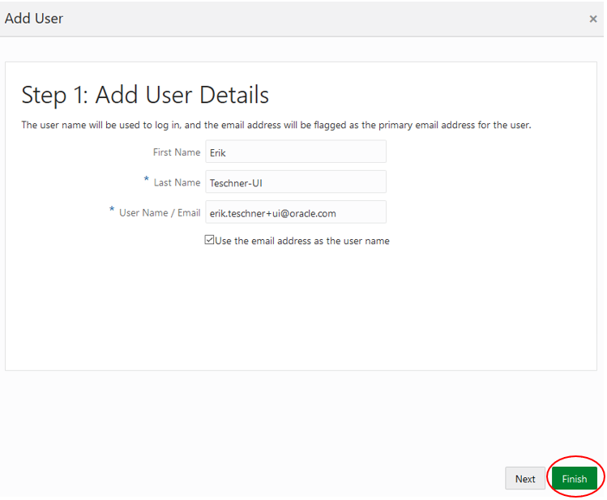


3.	Verify user creation. In order to do that, go to the *Users* tab in admin console. Verify that the new users are visible on the console.

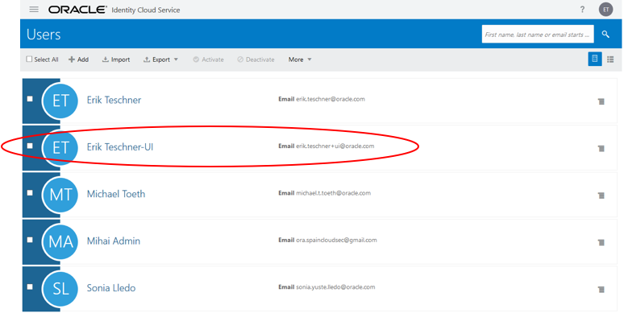

```
Once a new user is created in the IDCS service, the user receives an email invitation to finish first time login formalities such as setting a password to logging into IDCS.
```

## **STEP 2**: Import Users with CSV

* *Personas*:
    - Administrator

If you are an identity domain administrator or a user administrator, you can batch import user accounts using a comma-separated values (CSV) file.

1. Obtain upload CSV file. In order to do that, select the *Users* menu on the left and click *Import*. In the Help section on the right, click *Download sample file*.


**Alternatively**, you can export a list of existing users: filter the user created in the UI, then click on Export->Export All. Confirm the export then go to the Job and download the file


Extract the zip file and open *Users.csv* or open the *UserExport… .csv* file. Inspect the content of the file from your favorite editor. You can use the default examples that you find into the csv file or you can fill in some more if you want but keep it similar to the examples. For example, if you use the exported existing user, modify the suffix (UI) to another one (e.g CSV).

2. Go to IDCS Admin console using your administrator account credentials.  Select the *Users* menu on the left or select the *Users* icon from the dashboard.  

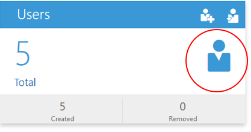

3.	Click on the *Import* button.  

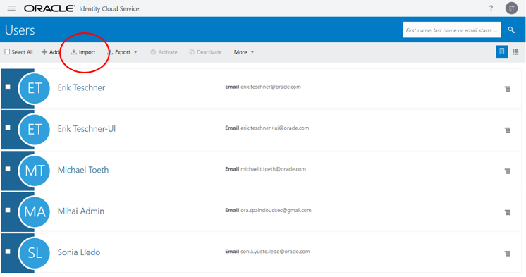

4.	The Import Users screen pops up. Click on *Browse*. Select the CSV file. Click on *Import*.

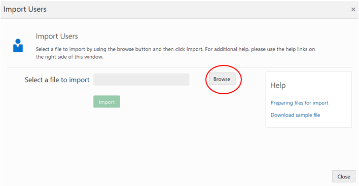

```
By uploading the sample file, sample users will be uploaded into IDCS. In order to upload different users, the csv sample file needs to be altered.
```


5.	Go to the *Jobs* menu item and verify that the import Job finished successfully.  Click on *View Details*. to check if all the users were imported. You’ll also be presented with the list of all the users from csv, together with all the attributes details and status of creation.


6.	Verify user creation by going to the *Users* tab in admin console. Verify that the new users are visible on the console.


7.	Click on your target end-user (e.g. Firstname Lastname-CSV) and verify user's detailed attribute information

8.	Just for fun, change the email for the user to one you control and select *Update User*. Then click the *Reset Password* button.


9.	Check your email for the reset message and change the password.  

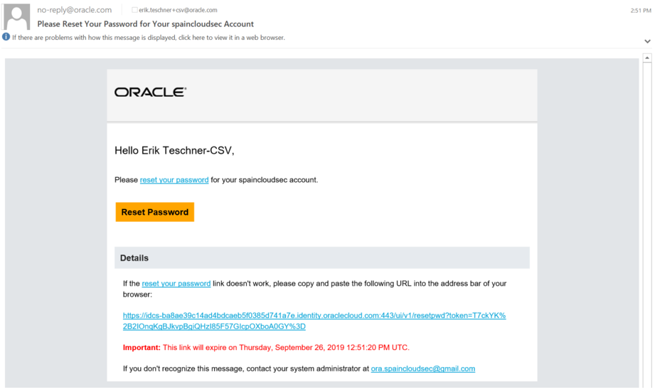

10.	Then, open another browser (if using Chrome, select Incognito Window) and login to your IDCS Admin Console as an administrator:

```
   https://<your tenant>/ui/v1/adminconsole
```

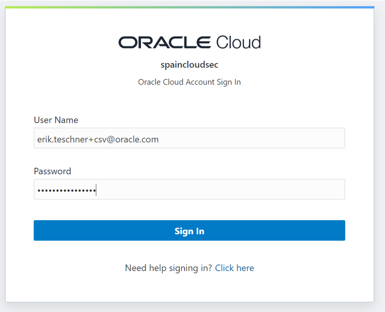

You will see that the user has no access to applications yet. In Lab 2, we will show you how a user can request applications.


## **STEP 3**: API User Creation with REST APIs

* *Personas*:
    - Administrator

This use case involves making API calls to IDCS using a REST client; in this case Postman.

The Postman collection of relevant REST API calls is provided to each participant.  

```
This use case will demonstrate using a common utility, Postman, for connecting to Identity Cloud Service via the out-of-the-box REST API.
```

###Register a client POSTMAN application in IDCS

1. Login to your IDCS Admin Console as an administrator:

```
   https://<your tenant>/ui/v1/adminconsole
```

2. Select the *Applications* tab from the IDCS dashboard presented after log in


3.	Click the *Add* button to create a new application for Postman use. In order for Postman to be able to call IDCS REST APIs, it first requires having a CLIENT_ID and CLIENT_SECRET that authorize Postman to do so. This can be achieved by creating a Confidential Application type into IDCS with specific authorization grant types as you will see into the following steps.

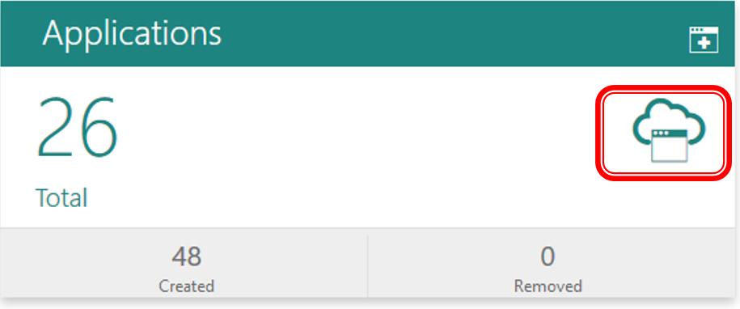

4.	Select *Confidential Application* from the pop-up menu of application types


5.	Set the *Name* to "Postman-<<student name>>"" then click *Next*


6.	Click *Configure this application as a client now* in order to provide the authorization grant types and the API role.

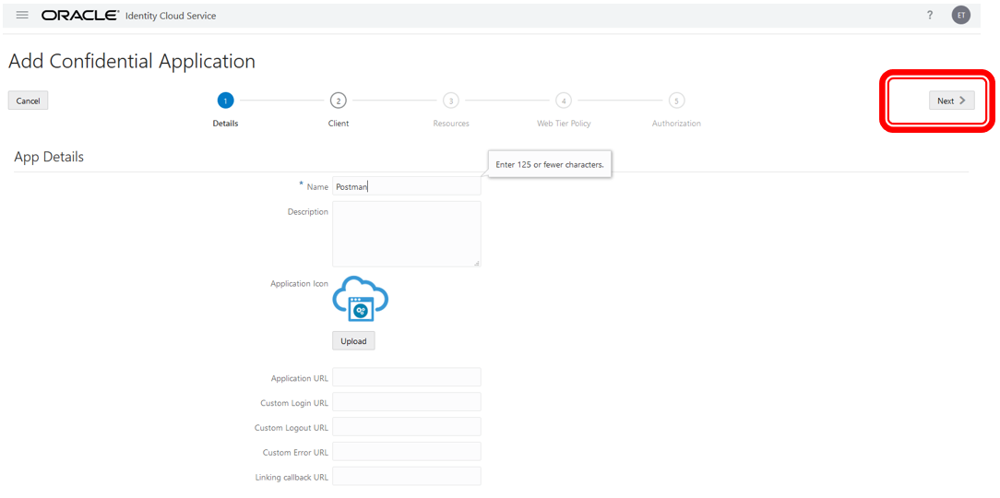

7.	Select all the *Allowed Grant Types* checkboxes and set *Redirect URL* to https://localhost. Go to *Grant the client access to Identity Cloud Service Admin APIs* section (bottom of the page) and add the following API role *Identity Domain Administrator*. This way you are basically granting access for this IDCS app to the full set of IDCS APIs. Then, click *Next*.


8.	Make no changes in *Resources* and click *Next*

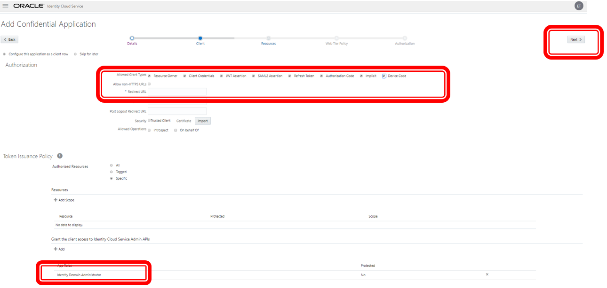

9.	Make no changes in *Web Tier Policy* and click *Next*.


10.	For finalizing the IDCS app that grants API roles to Postman via Auth2.0 standard click *Finish*.


11.	Once the application is created, note down the *Client ID* and the *Client Secret* then click *Close*. These will be used by Postman desktop application to call IDCS APIs using the Auth2.0 standard protocol.


12.	Click the *Activate* button.

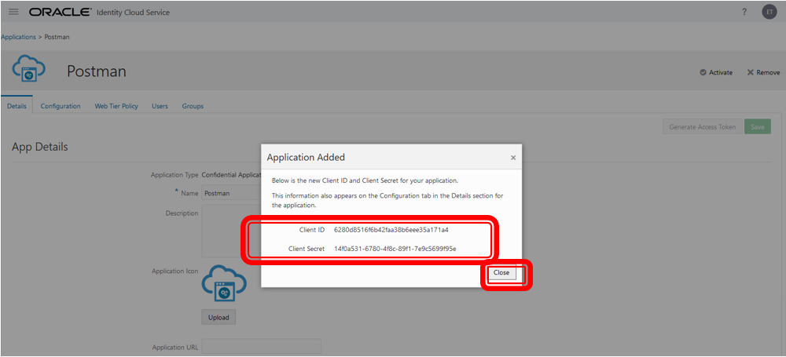

13.	Confirm the application activation


14.	The application is now active and ready to use.

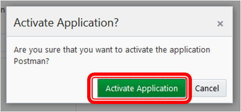

15.	Sign out from IDCS


###Configure Postman

1.	Open Postman. Ignore all startup messages if any.

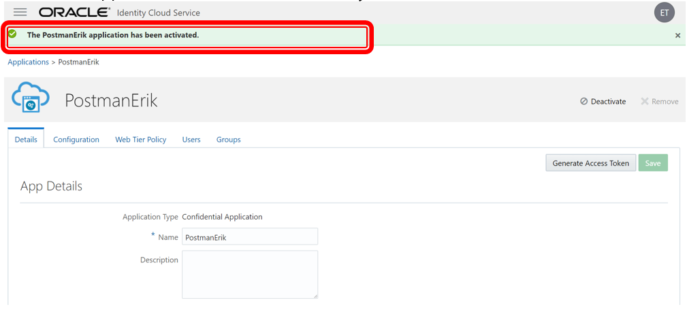

2.	First we need to import IDCS Postman environment variables, global variables and IDCS API collection. Click the *Import* button on the left upper corner.


3.	Select *Import from Link* and provide [Example Environment](https://github.com/oracle/idm-samples/raw/master/idcs-rest-clients/example_environment.json) URL into the box to import the environment variables and click *Import*


4.	To import the Oracle Identity Cloud Service REST API Postman collection, on the Postman main page, click *Import* again.

5.	In the Import dialog box, select *Import From Link*, provide the [IDCS Postman collection](https://github.com/oracle/idm-samples/raw/master/idcs-rest-clients/REST_API_for_Oracle_Identity_Cloud_Service.postman_collection.json) URL into the box, and then click *Import*.

```
The left pane of Postman has a sub-tab called Collections.
With Collections selected, you will see the various REST statements which have been pre-configured for today’s workshop.
```

6.	To import the global variables file, click *Import*.

7.	In the Import dialog box, select *Import From Link*,  provide the [IDCS global variables](https://github.com/oracle/idm-samples/raw/master/idcs-rest-clients/oracle_identity_cloud_service_postman_globals.json) URL into the box, and then click *Import*.

8.	Select the *Oracle Identity Cloud Service Example Environment with Variables* environment then click on the *Settings* button (cogwheel icon) to *Manage Environments*


9.	Click on the newly created environment which will be like *Oracle Identity Cloud Service Example Environment with Variables* - it will be the only one available in your cases on a fresh Postman installation.


10.	Set the following parameters initial and current values in order to be able to obtain an IDCS access token:

| Parameter | Value |
| --- | --- |
| HOST | Your IDCS tenant URL Ex: https://idcs-8b000000000000000000000000000000.identity.oraclecloud.com |
| CLIENT_ID | Postman IDCS Client application CLIENT_ID |
| CLIENT_SECRET |Postman IDCS Client application CLIENT_SECRET |


11. Click on *Update* once completed.


###Request an Access Token

```
The steps performed above are being done to obtain the Access Token, which is shown in the following screen shot.

There are several types of OAUTH requests supported by IDCS, including client credentials.  With a client credentials request, the client ID and client secret are used by the calling application to identify itself and to request an Access Token.  The Access Token is available for use by the application until the time that it expires.

This Access Token establishes trust between your application and IDCS.
```

1.	On the *Collections* tab, expand *OAuth*, and then *Tokens*.

2.	Select *Obtain access_token (client credentials)*, and then click *Send*. The access token is returned in the response from Oracle Identity Cloud Service.

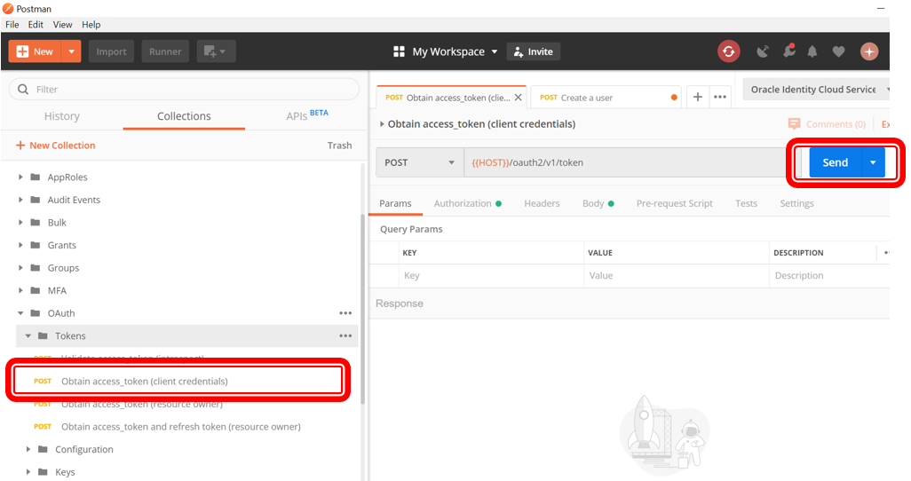

3.	Validate if you can see status *200 OK*.
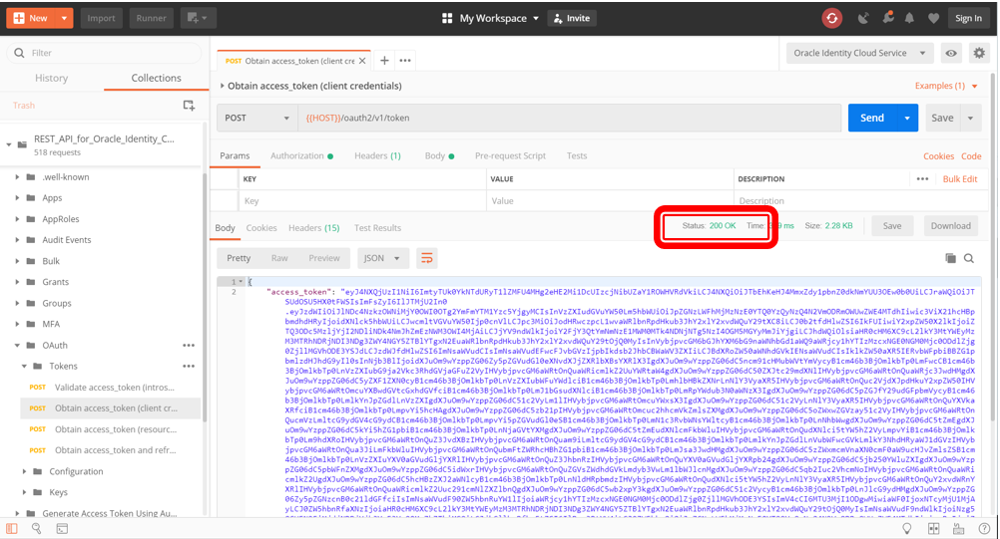

4.	Highlight the access token content between the quotation marks, and then *right-click(). In the shortcut menu, select *Set: Oracle Identity Cloud Service Example Environment with Variables* In the secondary menu, select *access_token*. The highlighted content is assigned as the access token value.

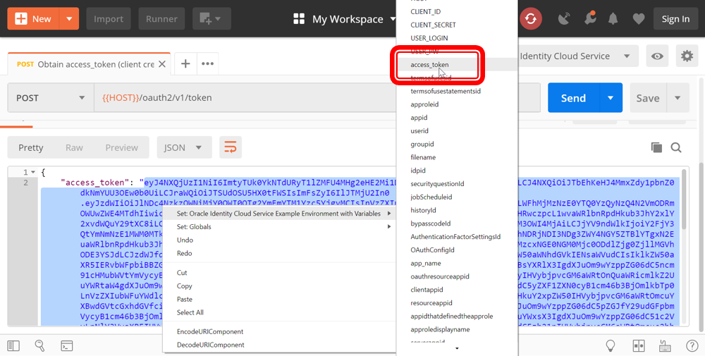

###Create an IDCS User via API

1.	On the *Collections* tab, expand *Users*, and then *Create*.

2.	Select *Create a user*. The request information appears with some default values as can be seen into below print screen. You can either change them as per your preference or you can simply use the default filled values. For example:
* givenName: Firstname
* familyName: Lastname-REST
* username/email->value (x2): firstname.lastname+REST@domain.tld

3.	Click *Body*, and then click *Send*.


4.	In the response, confirm that the status *201 Created* appears and that the response body displays details about the user that was successfully created in Oracle Identity Cloud Service.

5.	While in the IDCS UI you can see the user as being created.

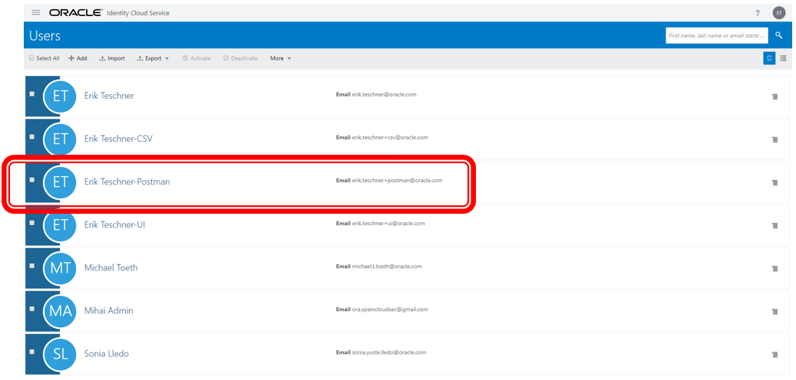

You can also *modify* and *delete* users and a lot more via REST API. For more information, please check the documentation below.


##More information##

Tutorial 1: [Oracle Identity Cloud Service: First REST API Call](http://www.oracle.com/webfolder/technetwork/tutorials/obe/cloud/idcs/idcs_rest_1stcall_obe/rest_1stcall.html)


Tutorial 2: [Oracle Identity Cloud Service: Managing Users Using REST API Calls](http://www.oracle.com/webfolder/technetwork/tutorials/obe/cloud/idcs/idcs_rest_users_obe/rest_users.html)


## See an issue?
Please submit feedback using this [form](https://apexapps.oracle.com/pls/apex/f?p=133:1:::::P1_FEEDBACK:1). Please include the *workshop name*, *lab* and *step* in your request.  If you don't see the workshop name listed, please enter it manually. If you would like for us to follow up with you, enter your email in the *Feedback Comments* section.
